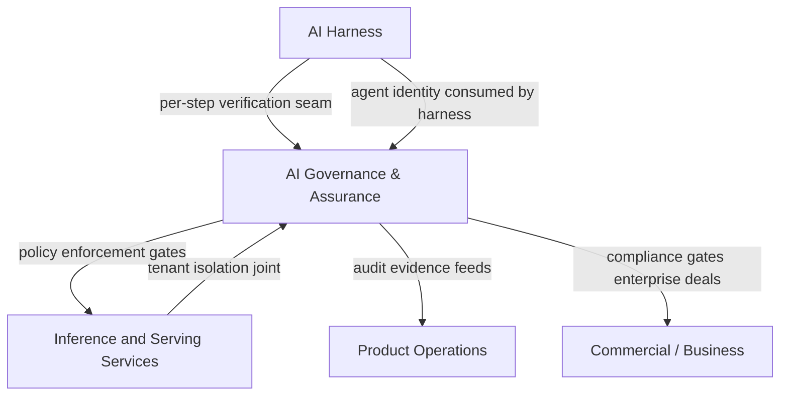

# AI Governance & Assurance

The **AI Governance & Assurance** pillar owns the trust layer that makes RackAI viable for regulated enterprises. Serving a model reliably is necessary but not sufficient: enterprises operating in regulated or sovereign environments need to know what ran, on whose authority, under what policy, and with a record that will satisfy an auditor. That layer is this pillar's product.

> **Note on scope.** This hub covers the **product** of governance and assurance — what the platform enforces and attests. For **corpus/wiki governance** (how this knowledge base is maintained, change-control standards, note types), see [[Wiki Hub]].

> **Confidence.** The baseline enforcement layer (auth, audit log query) is `measured` — shipped in RackAI 1.0.0. Everything beyond that — provenance/replay, per-step verification, compliance attestations, full agent identity — is `assumed` or `planned`. The compliance envelope has not been entered; no SOC 2 scope has been set.

---

## Scope

| Area | What it includes |
|---|---|
| **Runtime policy enforcement** | Encoding policy as the system runs: what a model or agent may do, what data it may access, what outputs it may produce. The first enforcement layer. |
| **Provenance and replay** | A per-run record — what ran, when, on whose authority, with what inputs and outputs — that later claims can be checked against. The audit record, not just the audit log. |
| **Tenant isolation** | Enforcement of the namespace-level isolation that keeps one tenant's data, models, and context away from another's. Joint with [[Inference and Serving Services]]. |
| **Agent identity and delegated authority** | Service identities, scoped tokens, and permissions that expire when a task ends rather than being inherited whole. The identity layer upstream of action controls. Joint with [[AI Harness]] (the seam between identity and harness execution). |
| **Compliance envelope** | SOC 2, ISO/IEC 27001, ISO/IEC 42001, NIST AI RMF — the certifications that gate whether a regulated buyer can adopt at all. Long lead times; these must start before they are needed. |
| **Multi-cluster residency governance** | The governance that lets a tenant's traffic and placement stay in approved regions as the fleet expands. Includes the Avi/Broadcom gateway evaluation ([[Multi-Cluster Governance Brief (Partner)]]). |
| **Verification and audit evidence** | Per-step checks that serve as both reliability signal and audit evidence — the seam with the [[AI Harness]] owner, since the same checks do double duty. |
| **Honest capability disclosure** | Holding the line between what is shipped (baseline enforcement), in flight (certification, provenance), and research (trustworthy per-step verification, governable self-modification) — so customers and leadership trust the sovereign claim. |

---

## What Is Shipped Today (RackAI 1.0.0)

- Identity and auth (IAC M1–M2 complete): PlatformRole/RoleBinding CRDs, Authorization Service, RBAC
- Audit Log query API, sensitive-access events, login events, APIKey-lifecycle events (IAC M3 complete)
- Namespace-per-org tenant isolation (in progress — Uniphore single-cluster tenancy)

## What Is In Progress or Planned

| Capability | Status | Source |
|---|---|---|
| Org-level RBAC + metering/billing/quota permissions (IAC M4) | **Won't Do** (dropped from delivery) → gap P-006 | Delivery roadmap |
| Compliance validation (Auditing M1) | Not Started | Delivery roadmap |
| Billing audit (Auditing sub-task) | Not Started | Delivery roadmap |
| Runtime policy enforcement (full) | Gap P-006 | [[RackAI Roadmap]] |
| Governed execution harness v1 | Gap P-006 | [[RackAI Roadmap]] |
| First compliance attestation (SOC 2) | Gap P-006 | [[RackAI Roadmap]] |
| Provenance and replay | Planned (dev-plan P8/P9) | Enterprise AI Dev Plan |
| Agent identity / scoped tokens | Planned (dev-plan 2.5) | Enterprise AI Dev Plan |
| Multi-cluster residency governance | Planned | [[Multi-Cluster Governance Brief (Partner)]] |
| ISO 42001 / NIST AI RMF | Future (after SOC 2) | Strategy-derived |

---

## The Seam with AI Harness

The governance and harness pillars share a boundary that must not become a gap:

> **Per-step verification checks serve as both reliability signal (harness) and audit evidence (governance).** The design of those checks is a joint responsibility.

Specifically:
- **[[AI Harness]]** owns the execution runtime and defines where in a run the checks execute.
- **AI Governance & Assurance** owns what the checks must prove and what evidence they produce.
- **Agent identity** (scoped tokens, delegated authority) is produced by this pillar; the harness runtime enforces them at execution time.

This seam is called out explicitly in the PDM JDs for both roles.

---

## Key Entities

- [[Agent Identity]] — the canonical entity for service identities and scoped tokens
- [[Organization]] — the tenant boundary governance enforces
- [[API Key]] — the credential surface governance monitors
- [[RackAI Control Plane]] — where policy enforcement is applied
- [[Environment]] — the dev/staging/production promotion boundary
- [[Governed Harness]] — the harness entity this pillar co-designs (with AI Harness pillar)

---

## Relationships to Other Pillars

- [[Inference and Serving Services]] — tenant isolation is a joint responsibility; policy enforcement runs at the serving boundary.
- [[AI Harness]] — the shared seam: per-step verification and agent identity. Neither pillar can own this unilaterally.
- [[Product Operations]] — compliance evidence assembly (SOC 2 audit package) is operationalized by Product Operations; this pillar produces the evidence.
- Commercial deals — the compliance envelope is a **gate** for regulated buyers; no SOC 2 means no deal in regulated verticals.

---

## Compliance Envelope Sequencing

The compliance envelope has the longest lead time of any strategic initiative. Priority order per [[Three Battlegrounds]] and [[RackAI Roadmap]]:

| Certification | Purpose | Lead Time | Status |
|---|---|---|---|
| SOC 2 Type II | Gate for regulated enterprise adoption | 12–18 months | **Not started — scoping not begun** |
| ISO/IEC 27001 | Information security management (pairs with SOC 2) | 12+ months | Not started |
| ISO/IEC 42001 | AI management system standard | 12–18 months | Not started |
| NIST AI RMF | US federal and regulated-sector signal | Ongoing | Not started |

> **The compliance envelope must start now.** Every month of delay is a month added to the first regulated enterprise deal timeline. This is flagged as a Priority Move in [[Three Battlegrounds]].

---

## Roadmap Proof Alignment

| Proof | AI Governance & Assurance contributions |
|---|---|
| **Proof 1 — Observe** | IAC M1–M3 complete (auth, audit log) — the measurement baseline; SOC 2 scoping kickoff |
| **Proof 2 — Decide** | Policy-as-code design; agent identity architecture |
| **Proof 3 — Control** | Runtime policy enforcement, first compliance attestation, tenant isolation enforcement, MOE control boundary |
| **Proof 4 — Operate** | Full governance perimeter across multi-cluster estates; residency enforcement; ISO 42001 / NIST AI RMF |

---

## Open Questions

| Question | Priority |
|---|---|
| Who is the named certification owner for SOC 2 — this pillar or a dedicated compliance function? | High |
| What is the minimum governance evidence package required for MOE-1 (first paid external estate)? | High |
| How does the multi-cluster residency boundary (Avi/Broadcom gateway) get prioritized relative to SOC 2 work? | High |
| What is the formal boundary between this pillar and AI Harness on the per-step verification design? | Medium |

---

## See Also

- [[EXTERNAL_PDM_Assurance_and_Governance_JD]] — PDM role definition for this pillar
- [[Agent Identity]] — the canonical identity entity
- [[Multi-Cluster Governance Brief (Partner)]] — multi-cluster and residency governance detail
- [[AI Harness]] — adjacent pillar; shared seam on verification and identity
- [[Inference and Serving Services]] — enforcement target
- [[RackAI Roadmap]] — gap P-006 (harness + policy + attestation)
- [[Three Battlegrounds]] — compliance envelope as a priority move
- [[RackAI Organizational Design]] — pillar structure and team boundaries
