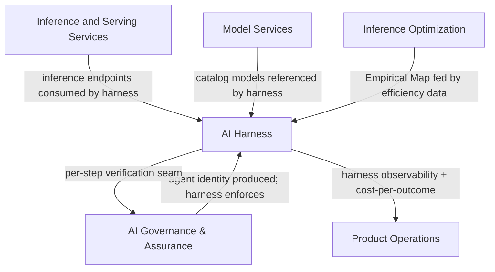

# AI Harness

The **AI Harness** pillar owns the execution layer that sits above raw inference and below business logic. A model served reliably is not the same as an agentic system an enterprise can put into production. The harness — context, tools, memory, and guardrails around a model — plus the orchestration above it, is what turns raw inference into dependable, accountable work.

> **This is the sharpest strategic line RackAI draws.** From [[Three Battlegrounds]]: *Rackspace owns the execution harness. Customers and partners own the business logic — the thing the agent is trying to accomplish.* Blurring this line creates a direct collision with application-layer partners (Palantir, Uniphore). Keeping it is what makes the harness defensible as horizontal infrastructure.

> **Confidence.** The harness is not shipped. The governed harness, orchestration and routing above single-model inference, the Empirical Map product surface, and the durable runtime are all `assumed` — strategy and dev-plan targets, not delivered capabilities. See gap P-005 and P-006 in [[RackAI Roadmap]].

---

## Scope

| Area | What it includes |
|---|---|
| **Governed harness** | The repeatable harness pattern a customer can trust: context assembly, tool-execution controls, memory infrastructure, guardrails, and observable execution. Proven first on one real customer workload before it scales across domains. |
| **Durable runtime** | Replay and recovery of an agent run; observable traces from start to finish; cost-per-outcome measured from the first run, not bolted on later. The runtime contract every harness consumer can depend on. |
| **Orchestration and routing** | Sending each task to the right harness, model, or human — choosing the cheapest executor that clears a reliability bar. Where simple rules end and learned optimization earns its place. |
| **Empirical Map as product surface** | The [[Empirical Map]] as a surface that routing reads and internal teams trust: where each model is reliable, on which workload, at what cost, from RackAI's own operating data rather than public benchmarks. This pillar turns the Map from a telemetry store into a decision surface. |
| **Agent identity and delegated authority** | How a harness run carries scoped, revocable permissions — service identities, delegated authority that expires when a task ends. Joint with [[AI Governance & Assurance]] (which produces the identity layer; the harness enforces it at runtime). |
| **Per-step verification** | Observable, checkable traces of harness execution that serve as both reliability signal and audit evidence. The seam shared with [[AI Governance & Assurance]]. |
| **Sequencing from one workload to a platform** | The trade-offs between what ships now vs. what waits on the research tail (long-horizon memory, learned planning). This pillar owns that judgment. |

---

## What Is Shipped Today

**None of the harness is shipped.** The platform today delivers raw inference (model endpoint + serving runtime) and fine-tuning. The execution layer above that — context, tools, guardrails, orchestration, the durable runtime — is entirely roadmap.

What exists as precursors:
- [[Agent Identity]] entity defined (architecture, not implementation)
- [[Governed Harness]] entity defined (target design, not shipped)
- [[Empirical Map]] entity defined (target data asset, not built)
- Inference routing (llm-d, RACKAI-311) — in progress, the *substrate* for harness routing, not the harness itself

## What Is In Progress or Planned

| Capability | Status | Source |
|---|---|---|
| Inference routing (llm-d, KV cache routing) | In Progress (RACKAI-311) | Delivery roadmap |
| Governed execution harness v1 | Gap P-006 | [[RackAI Roadmap]] |
| Empirical Map v1 + transferable/isolated telemetry model | Gap P-005 | [[RackAI Roadmap]] |
| Evidence-informed routing (routing reads the Map) | Gap P-005 | [[RackAI Roadmap]] |
| Agent identity / scoped tokens (design) | Planned (dev-plan 2.5) | Enterprise AI Dev Plan |
| Per-step verification (trustworthy) | Research tail | Enterprise AI Dev Plan |
| Durable runtime (replay/recovery) | Planned (dev-plan Program 1) | Enterprise AI Dev Plan |
| Full governed harness runtime | Proof 4 target | [[RackAI Roadmap]] |

---

## The Harness Boundary — What RackAI Owns vs. What Customers Own

This is the most important scope definition in the whole operator strategy. Blur it and the rationale for a separate operator collapses.

| RackAI owns (execution harness) | Customer / partner owns (business logic) |
|---|---|
| Model routing + placement | Ontologies |
| Context assembly controls | The agent's goal |
| Tool-execution controls | Applications |
| Policy enforcement at execution | Workflows |
| Evaluation and verification | Business outcomes |
| Memory infrastructure | Proprietary knowledge bases |
| Observability of the run | What the agent is trying to accomplish |
| The runtime itself | — |

The harness is **horizontal infrastructure** that is the same shape across customers; the business logic is what differs. Owning the harness is defensible precisely because it is *not* the customer's differentiated logic.

---

## The Empirical Map

The [[Empirical Map]] is the compounding knowledge store that feeds back into harness decisions:

- Where each model performs reliably, on which workloads, at what cost
- From RackAI's own operating data — not public benchmarks
- The surface that routing reads to make evidence-informed placement and orchestration decisions

The Map is the moat mechanism for the harness: every workload the harness executes adds to the Map; the Map makes the next workload cheaper and more reliable to route. Without it, the harness is a well-built runtime with no learning advantage. With it, the harness compounds.

See [[Three Battlegrounds]] §What Compounds for the full flywheel.

---

## Key Entities

- [[Governed Harness]] — the canonical entity for the harness product
- [[Empirical Map]] — the knowledge store the harness routing reads
- [[Agent Identity]] — the identity and delegated-authority layer
- [[Traffic Class]] — request classification used by orchestration routing
- [[Model Deployment]] — the inference endpoint the harness routes to
- [[LoRA Adapter]] — fine-tuned adapters attached within harness serving context

---

## Relationships to Other Pillars

- [[Inference and Serving Services]] — the harness consumes inference endpoints; serving must be stable and efficient before the harness can make guarantees.
- [[Model Services]] — harness runtimes reference catalog models; fine-tuned adapters (LoRA) are attached within harness context.
- [[Inference Optimization]] — the Empirical Map is fed by optimization benchmarking data; the harness reads it back for routing decisions.
- [[AI Governance & Assurance]] — shared seam on per-step verification and agent identity. Neither pillar owns this boundary unilaterally.
- [[Product Operations]] — harness observability data (cost-per-outcome, trace records) feeds the operational reporting and pricing inputs Product Operations depends on.

---

## Roadmap Proof Alignment

| Proof | AI Harness contributions |
|---|---|
| **Proof 1 — Observe** | Inference routing substrate (llm-d); harness architecture design begins |
| **Proof 2 — Decide** | Empirical Map v1; evidence-informed routing; one placement decision that beats a static baseline |
| **Proof 3 — Control** | Governed harness v1; agent identity and policy enforcement; durable runtime; per-step verification |
| **Proof 4 — Operate** | Full governed harness runtime; learned orchestration; long-horizon memory; closed-loop optimization |

---

## Open Questions

| Question | Priority |
|---|---|
| What is the "one real customer workload" that proves the governed harness v1? (MOE-0 candidate) | High |
| What is the formal boundary between this pillar and AI Governance & Assurance on per-step verification design? | High |
| When does the Empirical Map v1 move from a strategy gap to a funded delivery milestone? | High |
| Does the harness own the Empirical Map product as a whole, or does it only own routing decisions that read from it? | Medium |
| What is the research-vs-product line for long-horizon memory and learned planning? | Medium |

---

## See Also

- [[EXTERNAL_PDM_Orchestration_and_Harness_JD]] — PDM role definition for this pillar
- [[Governed Harness]] — the canonical harness entity
- [[Empirical Map]] — the knowledge store the harness reads and builds
- [[Agent Identity]] — the identity and delegated-authority entity
- [[AI Governance & Assurance]] — adjacent pillar; shared seam on verification and identity
- [[Three Battlegrounds]] — the harness boundary definition and operator stack
- [[RackAI Roadmap]] — gap P-005 (Empirical Map), P-006 (harness v1)
- [[RackAI Organizational Design]] — pillar structure and team boundaries
