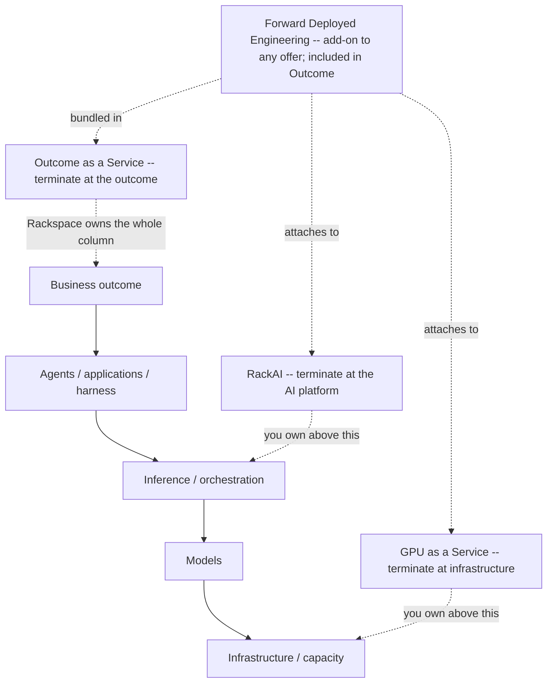

# Enterprise AI Cloud Product Model

The **canonical product model** for the [[Enterprise AI Portfolio|Enterprise AI Cloud]] portfolio and the products/offers within it. It answers three questions in one model: **what capabilities does the portfolio bring together** (six areas over the [[Eight-Layer Stack|canonical stack]]), **where does the RackAI product boundary sit** (the ownership convention below), and **how does a customer consume it** (the three ratified offers — [[#The Three Consumption Offers (ratified)|GPU as a Service, RackAI, Outcome as a Service]]).

> **This is the canonical home for the offer model.** Marketing, Sales, packaging, and the [[Commercial & Capacity Hub|commercial model]] all **derive from** it. The public marketing site is one such derivation — the screen-by-screen click-through lives in [[Enterprise AI Cloud Marketing Site Projection]] and is a *projection*, not a peer. This note owns the concepts; other notes link here.

> **It is a product/consumption model over the canonical stack, not a competing architecture.** The authority for *how the platform works* remains [[Three Battlegrounds|the Operator Stack]] and the [[Eight-Layer Stack]]; the authority for *what has shipped vs. planned* remains [[RackAI Platform]] and the [[Capability Gap Register]]. This model expresses the packaging and consumption of those capabilities. It does not redefine any capability.

> **Confidence.** `validated` — the **portfolio→product boundary** and the **three-offer consumption model** are ratified (leadership product-model ratification, 2026-09-29). Individual *capability* shipped/planned status is unchanged and still governed by the [[Capability Gap Register]]; ratifying the offer tiers does not upgrade any capability's build status, and no performance/pricing number is asserted here.

---

## The RackAI Boundary (ownership convention)

The whole point of leading with **Enterprise AI Cloud** is that RackAI must **not** become the accidental name for everything. The model uses one strict convention throughout:

> **RackAI is the private AI operating platform.** It provides the model, inference, orchestration, and governance-integrated runtime (**the core**) *and* the SDK, marketplace, packaging/certification standard, tenant isolation, and metering/instantiation machinery (**the rails**) on which Rackspace FDEs, partners, and customers build and distribute AI solutions. **RackAI owns the platform and distribution machinery; solution authors own the business logic and the outcome-specific implementation.**

> **Boundary evolution (2026-10-06).** This widens the earlier convention ("RackAI is the inference and fine-tuning platform") to reflect the [[Solution Marketplace]] decision. The sharper frame: **RackAI owns the factory and the marketplace, not everything produced by the factory.** The anti-leak discipline is unchanged — "RackAI" still must not become the name for the solutions, outcomes, or business logic built on it. What changed is that the **rails** (SDK, marketplace, certification, governance-integrated runtime, metering) are now explicitly *inside* the RackAI boundary, not outside it.

> **Two senses of "RackAI," reconciled.** The **shipped-product** definition ([[RackAI Platform]], Glossary) remains *"Kubernetes-native inference and fine-tuning platform"* — accurate for **what exists today** (`measured`/shipped). The **strategic** definition here — *private AI operating platform (core + rails)* — is the **target product boundary** the marketplace implies, and the rails are `assumed`/proposed, not shipped ([[Capability Gap Register]]). Both are true at different time horizons; this note sets the *boundary*, the platform hub states *what is built*. Widening the boundary does **not** upgrade any capability to shipped.

RackAI is now named as RackAI in **three** places — **Inference & Orchestration** (the core), **Fine-Tuning & Distillation**, and the **Platform Rails** (SDK / marketplace / packaging & certification / governance-integrated runtime / metering & instantiation). Everywhere else, name the **relationship to RackAI**, not RackAI itself.

### Layered ownership (who owns which layer)

| Layer | Who owns it | Role |
|---|---|---|
| GPU / infrastructure | **Infrastructure** (below K8s) | Supplies execution capacity |
| **RackAI core** | **RackAI** | Models, inference, routing, optimization, lifecycle, fine-tuning |
| **RackAI platform rails** | **RackAI** | Harness/runtime interfaces, governance integration, [[Solution Marketplace\|marketplace]], SDK, packaging/certification, tenant isolation, metering/instantiation |
| **Solutions** | **FDE → partners → customers** | Author domain/business logic ([[Packaged Solution\|Packaged Solutions]]) *on* the RackAI rails |
| **Managed Operations** | **Rackspace Managed Operations** | Operates the resulting estate/service through the platform |
| **Customer outcome** | **FDE / partner / customer** | What the solution actually accomplishes |

The four relationship verbs — use these instead of letting "RackAI" leak upward or outward:

| Area | Relationship to RackAI | Say this, not "RackAI" |
|---|---|---|
| **Experiences & Agents** (incl. Agent Harness) | **Built on** RackAI rails; the *harness runtime interface* is RackAI, the *agent/business logic* is not | "authored on RackAI rails; consumes RackAI core" |
| **Models & AI Services** | **Fine-Tuning & Distillation is RackAI**; Catalog / Router / Evaluation are portfolio capabilities that use it | name RackAI only on Fine-Tuning & Distillation |
| **Inference & Orchestration** | **Is RackAI** (the core) | "RackAI core" |
| **Platform rails** (SDK / marketplace / packaging / certification / metering) | **Is RackAI** (the rails) | "RackAI rails" |
| **AI Infrastructure** | **Supplies** RackAI (physical/compute substrate below K8s) | "provides the substrate RackAI consumes" |
| **Governance & Assurance** | **Enterprise AI Cloud-wide plane**; RackAI **implements** the controls/evidence within its boundary and **integrates** them into the rails | "portfolio-wide plane; RackAI implements + integrates its share" |
| **Solutions / outcomes** (what's built on the rails) | **Not RackAI** — FDE/partner/customer business logic | "authored on RackAI; not RackAI" |
| **Managed Operations & FDE** | **Operates / delivers** the whole portfolio *through* the platform (not RackAI itself) | "Rackspace operating + delivery model across the portfolio" |

> **The one-sentence ownership picture:** *Enterprise AI Cloud is what we take to market. RackAI is the private AI operating platform — the core (models, inference, orchestration, runtime) plus the rails (SDK, marketplace, certification, metering) — that makes production AI buildable and distributable. Infrastructure supplies it; solution authors (FDE → partners → customers) build on it; governance controls it (portfolio-wide, RackAI integrates its share); Managed Operations runs the resulting estates through it; the outcome is the author's.*

> **FDE creates leverage for RackAI; FDE does not become RackAI.** The marketplace makes this cleaner, not blurrier: RackAI provides the operating platform, SDK, marketplace, certification/isolation/governance, and deployment/instantiation/metering, and operates the resulting workloads; **FDE/partners/customers create the solution, own the domain logic, package to the RackAI standard, and publish.** An FDE solution authored once and distributed across estates is a *mechanism RackAI provides to raise workloads/FTE* ([[AI Operations Product]]) — not a reason to fold FDE into the platform. See [[Solution Marketplace]] for the full two-sided boundary.

> **Note on "Rackspace owns the execution harness."** [[Three Battlegrounds]] states Rackspace owns the execution harness as part of the *operator identity*. Under the evolved boundary this is cleaner: the **harness *runtime interface* is part of the RackAI rails**, while the **agent's goal / business logic authored on it is not** RackAI. Company-level "Rackspace owns the harness" and product-level "RackAI is the operating platform (core + rails)" are both true; the solution logic built on the harness stays the author's.

---

## The Discovery & Resolution Model

The model maps **capabilities** (what the portfolio can do) to **offers** (how a customer buys), **architecture** (how it works), and **operations** (who runs it) — without any one of those redefining another. A **capability is a branch point, not a stop on a funnel.** Someone engaging with a capability **resolves it in one of three directions**, at whatever depth suits them:

**Same truth, different depth.** A CIO may branch straight to CONSUME — *"Inference → that's RackAI, let's talk"* — and never touch architecture. An architect branches to UNDERSTAND — *"Inference → Model Hosting → canonical mapping → serving-runtime docs."* Both are legitimate; neither is forced through the other's path. Each branch terminates cleanly: UNDERSTAND at authoritative technical docs, CONSUME at an offer, ENGAGE at the operating model. The model is the **connective tissue** between capability, product, architecture, and operations — it is none of them and does not replace any of them.

> **The governing principle** (resolves the original tension between the two competing stack diagrams):
> **The canonical stack defines how the platform works. This product model defines how the portfolio is packaged and consumed. They are not competing architectures.** Every capability must trace cleanly to one or more canonical layers ([[Eight-Layer Stack]]), and to exactly one product boundary (is it RackAI — core or rails — or does it build-on / consume / supply / operate RackAI).

> **Each representation has one job — and none redefines another.** *Product does not redefine Architecture. Architecture does not redefine the capability taxonomy. And capabilities do not become SKUs.* This model owns the **capability → offer → boundary** mapping; UNDERSTAND points at the [[Eight-Layer Stack|architecture]] and technical docs; ENGAGE points at the [[AI Operations Product|operating/delivery model]]. The public marketing site is a **projection** of this model — see [[Enterprise AI Cloud Marketing Site Projection]].

### The four-question requirement (what a capability must resolve)

Every capability in the model must be resolvable in all three directions, so each must answer four questions:

1. **What does it do?** — the capability and its sub-capabilities.
2. **Where does it live in the canonical architecture?** *(UNDERSTAND)* — its mapping to the [[Eight-Layer Stack]]. If a capability maps to *no* canonical layer, it is taxonomy invention and must be cut or re-homed.
3. **Which offer does a customer buy it under?** *(CONSUME)* — the offer it **rolls up into** (GPU as a Service, RackAI, or Outcome as a Service). A capability is **not** its own product; it resolves into an offer.
4. **Who operates it?** *(ENGAGE)* — whether Managed Operations / FDE applies.

> **The distinction this creates:** *Capability tells you what Rackspace can do. The offer tells you how much of the stack Rackspace takes responsibility for (and therefore how you buy). Architecture tells you how it works. Documentation tells you exactly how to implement it.* No one is forced through architecture to reach the buy conversation, and none through the buy conversation to reach the docs.

> **Consumption confidence discipline.** The three **offer tiers** are ratified (`validated`). The **commercial mechanics** (SKUs, pricing, billing) are **not built**: [[Billing & Payment]] does not exist and pricing/billing is an explicit non-goal of current metering work ([[RackAI Platform]], [[Capability Gap Register]]). The consumption **routes** that exist today are **direct tenant** (own-deployment endpoints — the baseline product), the **[[OpenRouter Initiative|OpenRouter channel]]**, and **customer-owned / dedicated infrastructure**. Name the offer; never attach a price.

---

## The Three Consumption Offers (ratified)

The capabilities in the six areas are **not each a product.** They resolve into **three ratified ways to consume Enterprise AI Cloud**, defined by one question: **how much of the stack does the customer want Rackspace to take responsibility for?** The journey runs *infrastructure → platform → outcome*, and a customer can **terminate at any of three points**. Each is a legitimate place to stop; the model's job is to make clear *what the customer takes responsibility for* at each termination point.

> **Confidence — `validated` (the offer tiers are ratified).** GPU as a Service, RackAI, and Outcome as a Service are the ratified consumption offers for the portfolio (leadership product-model ratification, 2026-09-29). **What is ratified is the offer structure and the responsibility boundaries — not the commercial mechanics.** Pricing, billing, and SKU packaging remain **not built** ([[Billing & Payment]] does not exist; [[RackAI Platform]], [[Capability Gap Register]]), and whether inference-as-a-service is a *direct* product vs. an OpenRouter-only surface is still an open PM decision ([[RackAI Roadmap]], [[OpenRouter Initiative]]). Name the offers and what it means to buy each; **do not attach a price or imply billing exists.**

| Offer | Customer starts with | Where the stack terminates | What it means to buy |
|---|---|---|---|
| **GPU as a Service** *(Infrastructure)* | "I need AI infrastructure / capacity" | Infrastructure ↑ — customer owns what runs above | Rackspace provides compute, networking, storage, capacity and footprint; **the customer owns the models, serving and everything above.** Consumption forms: **GPU on Demand** (elastic accelerated instances), **Bare Metal** (dedicated, unvirtualized GPU servers), **Kubernetes for AI** (a managed GPU-ready cluster). |
| **RackAI** *(AI Platform as a Service)* | "I need to run and adapt my models in production" | Infrastructure → Models → Inference/Orchestration ↑ | Rackspace provides a private production AI runtime — hosting, serving, optimization, orchestration, fine-tuning — across Rackspace, partner or customer infrastructure. **The customer owns the business logic above the platform.** |
| **Outcome as a Service** *(Managed AI Solution)* | "I need a business outcome" | Infrastructure → Models → Inference → Harness → Agents/Apps → Outcome ↑ | Rackspace assembles and operates the whole stack — solution platforms (Palantir, Uniphore), the harness, RackAI and/or GPUaaS underneath, [[Load-Bearing Bets|partners]], and FDE. **The customer buys the outcome; Rackspace owns assembly and operation.** |

Governance & Assurance and Managed Operations & FDE cut **across all three** — more of each transfers to Rackspace as you move down the table.

> **Where Forward Deployed Engineering (FDE) fits.** FDE is **not a fourth termination point** — it is a **cross-cutting engagement that attaches to any offer as an add-on**, and it is **included by default in Outcome as a Service** (where Rackspace owns delivery end to end). A GPUaaS or RackAI customer can add FDE to accelerate discovery, integration, and productionization without moving their termination point; an Outcome customer gets it as part of the deal. This is the same shape as Governance and Managed Operations: it spans the offers rather than being one of them. Treat FDE as **"add engineers to any offer,"** with Outcome as a Service the offer where that help is assumed, not optional.

### Two axes: capability and responsibility

The model has two axes. **Vertical** is capability ("tell me about inference optimization"); **horizontal** is the consumption offer / responsibility transfer ("how much do I want Rackspace to own"). The three offers are the entry points on the horizontal axis:

- **I need AI infrastructure → GPU as a Service** — the capacity to run AI workloads; the customer owns what runs on it. Consumed as **GPU on Demand**, **Bare Metal**, or **Kubernetes for AI**.
- **I need to run my models → RackAI** — a private AI operating platform to adapt, serve, optimize and operate production AI, **and to build and distribute solutions on** (including instantiating [[Packaged Solution|Packaged Solutions]] from the [[Solution Marketplace]]).
- **I need a business outcome → Outcome as a Service** — Rackspace assembles the technology, engineering and operations to solve the problem.

The embedded progression: **give me the infrastructure → give me the AI platform → give me the outcome.** Each is a legitimate termination point. Capabilities resolve **up or down** into one or more offers; they are not products in their own right.

---

## Capability → Offer Map

The six capability domains and how each resolves onto the offers. This is the model's core mapping — the [[Enterprise AI Cloud Marketing Site Projection]] renders each row as a set of screens, but the ownership lives here.

| Capability domain | RackAI relationship | Rolls up to (offer) | Shipped anchor ([[Capability Gap Register]]) |
|---|---|---|---|
| **Experiences & Agents** (Enterprise Agents, Agent Harness, AI Experiences, Agent Ecosystem) | **Built on** RackAI rails; the harness *runtime interface* is RackAI, the agent/business logic is **not** | **Outcome as a Service**; **RackAI** underneath for build-your-own | Harness runtime planned; partner-delivered ([[Load-Bearing Bets]]) |
| **Platform Rails** (SDK, [[Solution Marketplace\|Marketplace]], packaging/certification, metering/instantiation) | **IS RackAI** (the rails) — the distribution machinery solutions are authored on | **RackAI** (drives consumption into **Outcome**) | `assumed`/proposed — SDK, marketplace, certification not built ([[Capability Gap Register]]) |
| **Models & AI Services** (Catalog, Smart Router, Fine-Tuning & Distillation, Evaluation) | **Fine-Tuning & Distillation IS RackAI**; Catalog/Router/Eval consumed through it | **RackAI** (also inside Outcome) | Catalog + SFT + LoRA shipped; router/eval planned |
| **Inference & Orchestration** (Hosting & Serving, Batch, Optimization, Workload Orchestration) | **Is RackAI** — primary product domain | **RackAI** (also underneath Outcome) | Serving + endpoints + autoscaling shipped |
| **AI Infrastructure** (Accelerated Compute, Networking, Storage, Deployment Footprint) | **Supplies** RackAI (substrate below K8s) | **GPU as a Service** — consumed as **GPU on Demand**, **Bare Metal**, or **Kubernetes for AI**; also the substrate beneath RackAI & Outcome | Fleet + NVIDIA/AMD shipped; multi-region planned/partner |
| **Governance & Assurance** (Governance, Assurance) | **Portfolio-wide plane**; RackAI implements its share | **All three** (cross-cutting; not a separate purchase) | Identity/RBAC/audit/isolation shipped; certs + verification planned |
| **Managed Operations & FDE** (Managed Operations, FDE) | **Operates/delivers** the whole portfolio | The operating/delivery model behind every offer; fullest in **Outcome** | Platform monitoring shipped; metering in progress; cost model missing |

> **Sub-capabilities and the customer-facing detail** (what sits under each domain, the "how it works" flow, the technical-doc handoff) are enumerated in the [[Enterprise AI Cloud Marketing Site Projection]]. Keeping them there preserves layer purity: this hub owns the *model* (boundaries, offers, mappings); the projection owns the *rendering*.

---

## Traceability: Capability → Canonical Layer

The One-Concept discipline requires every capability trace to a canonical home. This table is the audit surface — if a row cannot be filled, the capability is taxonomy invention.

| Capability domain | Canonical layers ([[Eight-Layer Stack]]) | Owning pillar ([[Pillar Working Model]]) | RackAI's role |
|---|---|---|---|
| **Enterprise AI Cloud** (portfolio) | The whole stack | Portfolio — [[Enterprise AI Portfolio]] | RackAI is the platform at its core, not the whole |
| Experiences & Agents | Consumption, Harness, Orchestration | [[AI Harness]] | **Built on** RackAI rails; harness runtime interface is RackAI, agent logic is not |
| Platform Rails (SDK, Marketplace, packaging/certification, metering) | Consumption | [[Solution Marketplace]] · [[AI Operations Product]] | **IS RackAI** (the rails) |
| Models & AI Services | Model, Data, Orchestration | [[Model Services]], [[Inference Optimization]] | **Fine-Tuning & Distillation IS RackAI**; rest use it |
| Inference & Orchestration | Orchestration, Inference, Compute | [[Inference and Serving Services]], [[Inference Optimization]] | **IS RackAI** (primary product domain) |
| AI Infrastructure | Compute, Infrastructure, Data | Infra (below K8s) | **Supplies** RackAI |
| Governance & Assurance | Governance + Assurance planes | [[AI Governance and Assurance]] | **Portfolio-wide plane**; RackAI implements its share |
| Managed Operations & FDE | Operations plane + delivery spine | [[AI Operations Product]] | **Operates/delivers** the whole portfolio |

---

## See Also

- [[Enterprise AI Portfolio]] — the portfolio ("Enterprise AI Cloud"); canonical portfolio-vs-product distinction
- [[Enterprise AI Cloud Marketing Site Projection]] — the marketing-site rendering derived from this model
- [[Enterprise AI Solution Stack (Marketing)]] — hero framing, ICP, copy-safety rules for public copy
- [[RackAI Platform]] — the platform at the portfolio's core; authoritative shipped-vs-planned source
- [[Eight-Layer Stack]] — the canonical decomposition every capability maps to
- [[Three Battlegrounds]] — the identity, operator stack, and own/abstract/partner/refuse stance
- [[Commercial & Capacity Hub]] — the commercial mechanics (unit economics, metering, pricing) that price the offers
- [[Capability Gap Register]] — per-capability shipped/planned status
- [[Pillar Working Model]] — which pillar owns each capability
- [[Billing & Payment]] — the commercial-mechanics gap: offer tiers ratified, pricing/billing not built
- [[Solution Marketplace]] — the Consumption-layer surface distributing FDE-authored [[Packaged Solution|Packaged Solutions]]; resolves into the **Outcome as a Service** offer (RackAI builds the rails + SDK + governance; FDE/partners/customers author the solutions)
