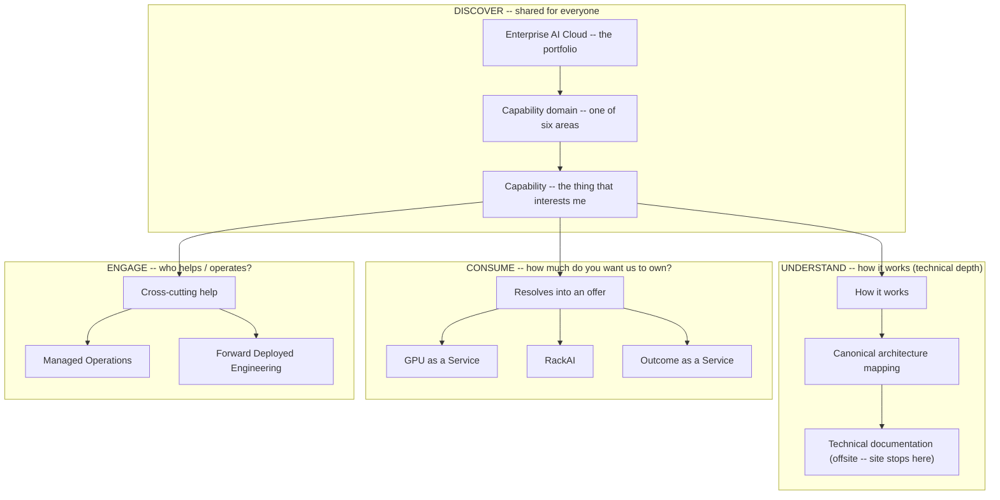
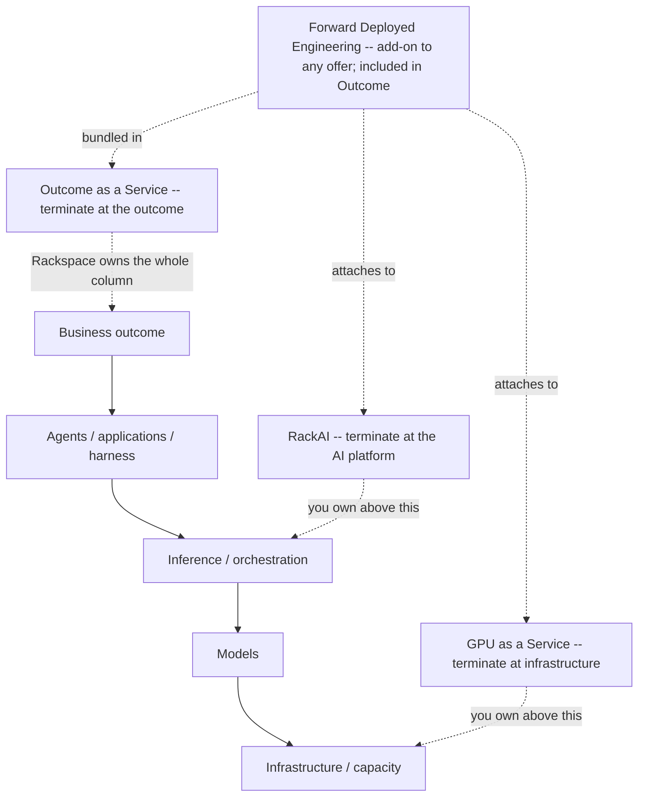
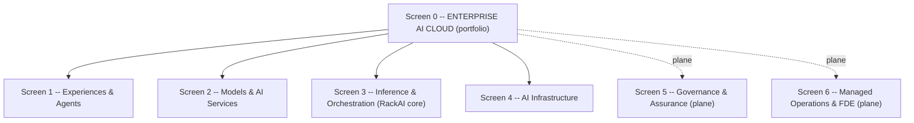
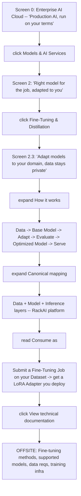
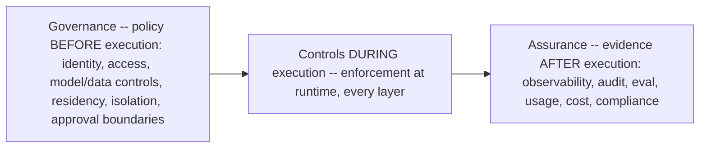
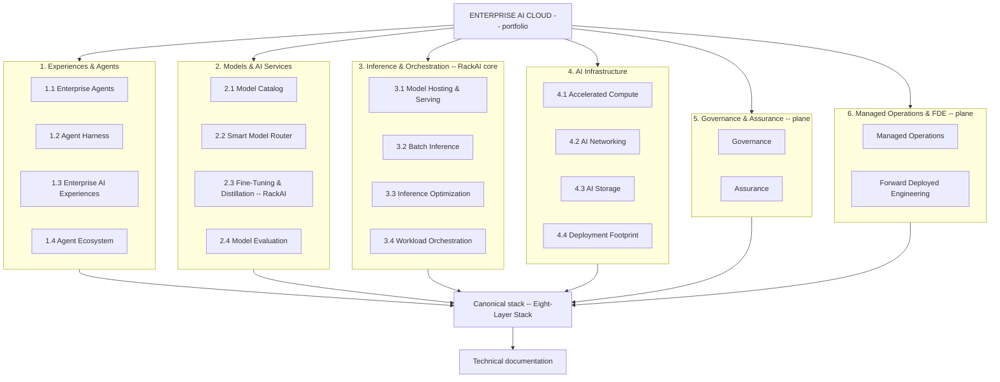

# Enterprise AI Cloud Product Model

The **canonical product model** for the [[Enterprise AI Portfolio|Enterprise AI Cloud]] portfolio and the products/offers within it. It answers three questions in one model: **what capabilities does the portfolio bring together** (six areas over the [[Eight-Layer Stack|canonical stack]]), **where does the RackAI product boundary sit** (the ownership convention below), and **how does a customer consume it** (the three ratified offers — [[#The Three Consumption Offers (ratified)|GPU as a Service, RackAI, Outcome as a Service]]).

> **This is the canonical home for the offer model — not a marketing artifact.** Marketing is one **consumer** of this model: the public site (the screen-by-screen click-through later in this note, and the hero framing in [[Enterprise AI Solution Stack (Marketing)]]) is *derived from* it. So are Sales plays, packaging, and the [[Commercial & Capacity Hub|commercial model]]. This note owns the concepts; other notes link here.

> **It is a navigation/consumption model over the canonical stack, not a competing architecture.** The authority for *how the platform works* remains [[Three Battlegrounds|the Operator Stack]] and the [[Eight-Layer Stack]]; the authority for *what has shipped vs. planned* remains [[RackAI Platform]] and the [[Capability Gap Register]]. This model re-expresses those as a discovery + consumption surface. It does not redefine any capability, and public copy derived from it must still honor shipped-vs-planned ([[Enterprise AI Solution Stack (Marketing)]] copy-safety).

> **Confidence.** `validated` — the **portfolio→product boundary** and the **three-offer consumption model** are ratified (leadership product-model ratification, 2026-09-29). Individual *capability* shipped/planned status is unchanged and still governed by the [[Capability Gap Register]]; ratifying the offer tiers does not upgrade any capability's build status, and no performance/pricing number is asserted here.

---

## The RackAI Boundary (ownership convention — read before the screens)

The whole point of leading with **Enterprise AI Cloud** is that RackAI must **not** become the accidental name for everything. To keep that honest, this document uses one strict convention, and every screen obeys it:

> **RackAI is the inference and fine-tuning platform.** It is named as RackAI in exactly two places: **Inference & Orchestration** (its primary product domain) and **Fine-Tuning & Distillation** (within Models & AI Services). Everywhere else, name the **relationship to RackAI**, not RackAI itself.

The four relationship verbs — use these instead of letting "RackAI" leak upward or outward:

| Area | Relationship to RackAI | Say this, not "RackAI" |
|---|---|---|
| **Experiences & Agents** (incl. Agent Harness) | **Consumes** RackAI | "the harness/agent capability consumes RackAI inference + model services" |
| **Models & AI Services** | **Fine-Tuning & Distillation is RackAI**; Catalog / Router / Evaluation are portfolio capabilities that use it | name RackAI only on Fine-Tuning & Distillation |
| **Inference & Orchestration** | **Is RackAI** (primary product domain) | "RackAI core" |
| **AI Infrastructure** | **Supplies** RackAI (physical/compute substrate below K8s) | "provides the substrate RackAI consumes" |
| **Governance & Assurance** | **Enterprise AI Cloud-wide plane**; RackAI **implements** the controls/evidence required *within its own boundary* | "portfolio-wide plane; RackAI implements its share" |
| **Managed Operations & FDE** | **Operates / delivers** the whole portfolio (not just RackAI) | "Rackspace operating + delivery model across the portfolio" |

> **The one-sentence ownership picture:** *Enterprise AI Cloud is what we take to market. RackAI is the platform that makes private model adaptation and production inference possible. Infrastructure supplies it; experiences consume it; governance controls it (portfolio-wide, RackAI implements its share); Managed Operations runs the whole; FDE turns it into outcomes.*

> **Note on "Rackspace owns the execution harness."** [[Three Battlegrounds]] states Rackspace owns the execution harness as part of the *operator identity* — that is a **company/portfolio** claim and remains true. It does **not** make the harness *RackAI-the-platform*. In this IA the Agent Harness is an Enterprise AI Cloud capability that **consumes** RackAI inference + model services. Company-level "Rackspace owns the harness" and product-level "RackAI is inference + fine-tuning" are both true; this convention keeps them from being conflated.

---

## The Navigation Model (the load-bearing idea)

The site is a navigable projection of the canonical stack. Earlier drafts drew this as a single linear funnel (portfolio → domain → capability → how-it-works → mapping → consume → docs). That undersells it. A **capability is a branch point, not a stop on a funnel.** The customer first **discovers** a capability, then **resolves it in one of three directions**, at whatever depth suits them:

**Same truth, different depth.** A CIO may branch straight to CONSUME — *"Enterprise AI Cloud → Inference → oh, that's RackAI, talk to me"* — and never touch architecture. An architect branches to UNDERSTAND — *"Enterprise AI Cloud → Inference → Model Hosting → canonical mapping → serving-runtime docs."* Both are legitimate; neither is forced through the other's path.

The discipline still holds at the ends of the branches: **the marketing site stops at the handoff.** UNDERSTAND terminates at offsite technical docs; CONSUME terminates at "talk to us about this offer"; it does not become the technical documentation system, the product catalog, or the architecture spec. It is the **connective tissue** between all three.

> **The governing principle** (resolves most internal disagreement about "is this a new architecture?"):
> **The canonical stack defines how the platform works. The marketing IA defines how customers discover it. They are not competing architectures.** Every marketing box must trace cleanly to one or more canonical layers, and every path must eventually refer to authoritative technical documentation.

> **Each representation has one job — and none redefines another.** *Marketing does not redefine Product. Product does not redefine Architecture. Architecture does not become the website. And capabilities do not accidentally become SKUs.* The DISCOVER tree is the marketing job; CONSUME points at the product boundary; UNDERSTAND points at the architecture and docs; ENGAGE points at the operating/delivery model. All four are traceable to the same underlying model — which is the defensible answer to the original tension between the two competing stack diagrams.

### The four-question requirement (litmus test for any deepest-level screen)

Every **deepest marketing screen** (a capability screen) must let the customer resolve in all three directions — so it must answer four questions across UNDERSTAND, CONSUME, and ENGAGE. The customer picks which direction to follow; the screen must support any of them.

1. **What does it do?** *(DISCOVER)* — the marketing promise + sub-items.
2. **Where does it live in the canonical architecture?** *(UNDERSTAND)* — the canonical mapping ([[Eight-Layer Stack]]), leading to the offsite docs. If a box maps to *no* canonical layer, it is marketing invention and must be cut or re-homed.
3. **How can a customer consume it?** *(CONSUME)* — the **Consume as** line, which **rolls the capability up into one of the three offers** (GPU as a Service, RackAI, or Outcome as a Service) and names the real route. A capability is **not** its own product; it resolves into an offer. Where relevant, the **ENGAGE** direction (Managed Operations / FDE add-on) is named too.
4. **Where can a technical buyer learn exactly how it works?** *(UNDERSTAND, terminal)* — the offsite `↗` technical-docs link where the site stops.

Combining canonical layers into one customer concept (e.g. "Inference + Orchestration") is allowed — that is navigation, not redefinition.

> **The distinction this creates:** *Capability tells me what Rackspace can do. The offer tells me how much of the stack Rackspace takes responsibility for (and therefore how I buy). Architecture tells me how it works. Documentation tells me exactly how to implement it.* From a capability the customer branches by intent, at their own depth: **UNDERSTAND** ("how does it work?" → architecture → docs), **CONSUME** ("which offer do I buy it under?"), or **ENGAGE** ("who operates it / who helps?"). No customer is forced through architecture to reach the buy conversation, and none is forced through the buy conversation to reach the docs.

> **Consumption confidence discipline.** Commercial packaging (SKUs, product names, pricing, billing) is largely **planned**, not shipped: [[Billing & Payment]] does not exist today and pricing/billing is an explicit non-goal of the current metering work ([[RackAI Platform]], [[Capability Gap Register]]). So the consumption framing below names **what it means to buy** each offer — where responsibility transfers — **without** the commercial mechanics. The consumption **routes** that exist now are: **direct tenant** (call your own deployment endpoints — the baseline product), the **[[OpenRouter Initiative|OpenRouter channel]]**, and **customer-owned / dedicated infrastructure**. The three **offer tiers** into which capabilities resolve are ratified (`validated`); the **commercial mechanics** (pricing, billing, SKUs) are not built — so name the offer, never print a price.

---

## How customers consume Enterprise AI Cloud (the three termination points)

The capabilities in the six areas are **not each a product.** They resolve into **three ratified ways to consume Enterprise AI Cloud**, defined by one question: **how much of the stack does the customer want Rackspace to take responsibility for?** The journey runs *infrastructure → platform → outcome*, and a customer can **terminate at any of three points**. Each is a legitimate place to stop; the model's job is to make the customer understand *what they are taking responsibility for* at each termination point.

> **Confidence — `validated` (the offer tiers are ratified).** GPU as a Service, RackAI, and Outcome as a Service are the ratified consumption offers for the portfolio (leadership product-model ratification, 2026-09-29). **What is ratified is the offer structure and the responsibility boundaries — not the commercial mechanics.** Pricing, billing, and SKU packaging remain **not built** ([[Billing & Payment]] does not exist; [[RackAI Platform]], [[Capability Gap Register]]), and whether inference-as-a-service is a *direct* product vs. an OpenRouter-only surface is still an open PM decision ([[RackAI Roadmap]], [[OpenRouter Initiative]]). So: name the offers and what it means to buy each; **do not attach a price or imply billing exists.**

| Offer | Customer starts with | Where the stack terminates | What it means to buy |
|---|---|---|---|
| **GPU as a Service** *(Infrastructure)* | "I need AI infrastructure / capacity" | Infrastructure ↑ — customer owns what runs above | Rackspace provides compute, networking, storage, capacity and footprint; **the customer owns the models, serving and everything above.** |
| **RackAI** *(AI Platform as a Service)* | "I need to run and adapt my models in production" | Infrastructure → Models → Inference/Orchestration ↑ | Rackspace provides a private production AI runtime — hosting, serving, optimization, orchestration, fine-tuning — across Rackspace, partner or customer infrastructure. **The customer owns the business logic above the platform.** |
| **Outcome as a Service** *(Managed AI Solution)* | "I need a business outcome" | Infrastructure → Models → Inference → Harness → Agents/Apps → Outcome ↑ | Rackspace assembles and operates the whole stack — solution platforms (Palantir, Uniphore), the harness, RackAI and/or GPUaaS underneath, [[Load-Bearing Bets|partners]], and FDE. **The customer buys the outcome; Rackspace owns assembly and operation.** |

Governance & Assurance and Managed Operations & FDE cut **across all three** as appropriate — more of each transfers to Rackspace as you move down the table.

> **Where Forward Deployed Engineering (FDE) fits.** FDE is **not a fourth termination point** — it is a **cross-cutting engagement that attaches to any offer as an add-on**, and it is **included by default in Outcome as a Service** (where Rackspace owns delivery end to end). A GPUaaS or RackAI customer can add FDE to accelerate discovery, integration, and productionization without moving their termination point; an Outcome customer gets it as part of the deal. This is the same shape as Governance and Managed Operations: it spans the offers rather than being one of them. Treat FDE as **"add engineers to any offer,"** and let Outcome as a Service be the offer where that help is assumed, not optional.

### The horizontal navigation dimension

This gives the website a **second axis**. A visitor can explore **vertically by capability** ("tell me about inference optimization") or **horizontally by consumption model** ("I want Rackspace to own the whole outcome — what does that look like?"). The three offers are the entry points for the horizontal axis:

- **I need AI infrastructure → GPU as a Service** — give me the capacity to run my AI workloads; I'll own what runs on it.
- **I need to run my models → RackAI** — give me a private platform to adapt, serve, optimize and operate production AI.
- **I need a business outcome → Outcome as a Service** — take responsibility for assembling the technology, engineering and operations to solve the problem.

The embedded progression: **give me the infrastructure → give me the AI platform → give me the outcome.** Each is a legitimate place to stop; the site's job is to make the customer understand *what they're taking responsibility for* at each termination point — not to close the commercial conversation.

> **How the two dimensions relate.** The marketing stack answers *"what capabilities does Enterprise AI Cloud bring together?"* The three offers answer *"how much of that stack do you want Rackspace to take responsibility for?"* Capabilities resolve **up or down** into one or more offers; they are not products in their own right.

---

## How to read this document

This is written as the **click-through itself**, screen by screen. Each screen has the same three parts, so a reader (or a UX/eng team) can follow exactly what a visitor sees and where each click goes:

- **What you see** — the description shown at this depth.
- **What's under it** — the clickable children. Each child names the screen it opens (`▸ Child → Screen X.Y`).
- **Consume as** *(deepest screens only)* — the real consumption route, and which of the three offers the capability **rolls up into** (GPU as a Service, RackAI, or Outcome as a Service). Capabilities are not products; they resolve into an offer.
- **Back / deeper** — where "up" goes and, at the deepest screen, the single **offsite** link to technical docs where the marketing site stops.

Screen numbering matches the level: **Screen 0** (portfolio) → **Screen N** (a domain) → **Screen N.M** (a capability, the deepest marketing screen). A capability screen carries everything needed to branch in any of the three directions — *What you see · What's under it · How it works + Canonical mapping (UNDERSTAND → ↗ docs) · Consume as (CONSUME → an offer) · Rolls up to / add-ons (ENGAGE)*. The customer chooses the branch; they are not marched down a single funnel.

---

## Screen 0 — Enterprise AI Cloud (the landing screen)

**What you see**

> **Enterprise AI Cloud: Production AI, run on your terms.** *From silicon to outcomes. Secured, governed and operated by Rackspace.*

Level 0 leads with the **portfolio**, not the platform — a deliberate choice. "Enterprise AI Cloud" is intuitive to a visitor: the page opens on *why it matters* instead of first explaining what a "RackAI" is before the value is sticky.

> **Enterprise AI Cloud is the portfolio; RackAI is the platform at its core.** Canonical portfolio-vs-product distinction in [[Enterprise AI Portfolio]] (Enterprise AI ⊃ RackAI + partner components + the customer's data foundation). Leading with the portfolio keeps it extensible — Palantir, agent solutions, and NVIDIA/AMD infrastructure can all belong **without becoming RackAI**. RackAI has the sharper job: **make private production AI actually run.**

**What's under it — click any area to drill in**

| ▸ Click | What it is (one line) | Opens |
|---|---|---|
| ▸ **Experiences & Agents** | Build and run enterprise AI experiences and agents | **Screen 1** |
| ▸ **Models & AI Services** | Choose, adapt and optimize models for the workload | **Screen 2** |
| ▸ **Inference & Orchestration** *(RackAI core)* | Run AI reliably, efficiently and at scale | **Screen 3** |
| ▸ **AI Infrastructure** | Private, high-performance infrastructure for production AI | **Screen 4** |
| ▸ **Governance & Assurance** *(plane)* | Control what AI can do and prove what happened | **Screen 5** |
| ▸ **Managed Operations & FDE** *(plane)* | Rackspace operates it and turns it into outcomes | **Screen 6** |

> **Positioning line under the hero:** *Enterprise AI Cloud is the portfolio. RackAI is the inference and model-adaptation platform at its core* — foundational to Rackspace's identity as an AI operator, giving regulated enterprises a way to run production AI on their own data, models and infrastructure without surrendering control. The broader portfolio is how Rackspace assembles that with infrastructure, software, agents, governance and people into an outcome.

> **Why two areas are planes, not boxes.** Governance & Assurance and Managed Operations & FDE cut across every layer — the canonical **three control planes** ([[Eight-Layer Stack]]). Clicking a plane re-renders to show how it touches each layer, rather than opening a sibling box.

**Deeper:** click any row above. The walked example below follows **Models & AI Services → Fine-Tuning & Distillation** all the way down.

---

## Worked example — one path through the tree (start here to see it in action)

One concrete walk: **DISCOVER** down to a capability, then the **UNDERSTAND** branch to docs with a stop at the **CONSUME** branch on the way. This is *one* path of several a visitor could take from the same capability; every capability screen supports all three directions.

In prose: a visitor lands on **Enterprise AI Cloud** (Screen 0), clicks **Models & AI Services** (Screen 2), reads what's under it, clicks **Fine-Tuning & Distillation** (Screen 2.3), reads the promise, expands **How it works** (the flow line) and **Canonical mapping** (which stack layers, where RackAI sits), reads **Consume as** (what they can actually submit and deploy), and finally clicks **View technical documentation** — the one offsite arrow where the marketing site stops. Each step adds depth; the story never changes. A different visitor could stop at **Consume as** and branch straight to "talk to us about RackAI" without ever opening the docs, or branch to **ENGAGE** to add FDE — same capability screen, different direction. That is the point of the three-branch model: the screen carries what it does, where it lives, how to consume it, and who operates it, and the customer chooses how far to go in each direction.

---

## Screen 1 — Experiences & Agents

**What you see:** Build AI experiences around the way your business actually works.

**Canonical anchor:** Consumption + [[AI Harness]]. **This area consumes RackAI — it is not RackAI** (see the RackAI Boundary above). The harness and agent capabilities call RackAI inference + model services underneath. Per the [[Three Battlegrounds|harness boundary]], *Rackspace* (company) owns the execution harness while customers and partners own the **business logic**; that is distinct from RackAI-the-platform, which sits below the harness as the inference + fine-tuning layer it consumes.

**What's under it — click a capability to open its screen**

| ▸ Click | What it is | Opens |
|---|---|---|
| ▸ **Enterprise Agents** | Put AI to work against real business processes | **Screen 1.1** |
| ▸ **Agent Harness** | A governed environment to build and operate agents | **Screen 1.2** |
| ▸ **Enterprise AI Experiences** | Governed AI inside the apps employees already use | **Screen 1.3** |
| ▸ **Agent Ecosystem** | Use the platform with AI tools you already have | **Screen 1.4** |

**Back:** ▸ Enterprise AI Cloud (Screen 0)

**Rolls up to:** **Outcome as a Service** (agents/experiences delivered as a managed solution) — and, for teams building their own, **RackAI** underneath. Not its own product.

> **Copy-safety.** The [[Governed Harness]] runtime and [[Empirical Map]] are **planned** ([[Capability Gap Register]]). Frame this whole area as **the operated layer / roadmap**, not a live product.

### Screen 1.1 — Enterprise Agents *(deepest marketing screen)*
- **What you see:** Put AI to work against real business processes.
- **What's under it (click to expand each):** ▸ Task & workflow agents · ▸ Domain-specific agents · ▸ Multi-agent workflows · ▸ Human-in-the-loop actions · ▸ Enterprise system/tool integration.
- **How it works:** Enterprise context → Agent → Tools/Actions → Business workflow.
- **Canonical mapping:** Consumption → Orchestration → Harness.
- **Consume as:** Enterprise AI Cloud engagement (agent capability consuming RackAI) · partner-delivered ([[Load-Bearing Bets]]). *Packaging planned — no standalone agent SKU today.*
- **Deeper:** ↗ **Agent architecture · supported frameworks · tool/action integration · runtime security** (offsite technical docs). **Back:** ▸ Screen 1.

### Screen 1.2 — Agent Harness *(deepest marketing screen)*
- **What you see:** A governed environment for building and operating agents.
- **What's under it:** ▸ Agent SDK/runtime · ▸ Context & tool integration · ▸ Evaluation · ▸ Guardrails · ▸ Hosting · ▸ Agent lifecycle.
- **How it works:** Build → govern → run across the agent lifecycle — the harness **consumes RackAI inference/model services** underneath (Enterprise AI Cloud → Agent Harness → RackAI inference/model services). The harness is not RackAI.
- **Canonical mapping:** Harness → Orchestration → Inference (the harness sits above RackAI and calls into it).
- **Consume as:** Enterprise AI Cloud harness capability (consumes RackAI inference/model services). *Governed-harness runtime is planned — not a live SKU today.*
- **Deeper:** ↗ **Harness APIs/SDKs · runtime architecture · evaluation framework · deployment**. **Back:** ▸ Screen 1.

### Screen 1.3 — Enterprise AI Experiences *(deepest marketing screen)*
- **What you see:** Bring governed AI into the applications and workflows employees already use.
- **What's under it:** ▸ Chat · ▸ Code · ▸ Search/RAG · ▸ Business applications · ▸ APIs · ▸ Custom experiences.
- **How it works:** Employee surface → governed AI call → serving chain.
- **Canonical mapping:** Consumption → Harness.
- **Consume as:** Prebuilt experiences / APIs (Uniphore consumption apps, [[Load-Bearing Bets]]) or custom-built on RackAI endpoints. *Partner-delivered + planned packaging.*
- **Deeper:** ↗ **Application integration patterns · APIs · reference architectures**. **Back:** ▸ Screen 1.

### Screen 1.4 — Agent Ecosystem *(deepest marketing screen)*
- **What you see:** Use the platform with the AI platforms and applications you already have.
- **What's under it:** ▸ Palantir · ▸ Customer-built agents · ▸ Third-party frameworks · ▸ Partner solutions.
- **How it works:** Partner/third-party agent → Enterprise AI Cloud harness → **RackAI inference/model services** → serving chain. (The harness consumes RackAI; it is not RackAI.)
- **Canonical mapping:** Consumption → Harness → integration interfaces. Leans on [[Load-Bearing Bets]] (Palantir, Uniphore), partner-delivered.
- **Consume as:** Bring-your-own agent platform integrating with RackAI (Palantir, third-party frameworks). *Integration interfaces; partner-delivered.*
- **Deeper:** ↗ **Palantir integration · partner integrations · API specifications**. **Back:** ▸ Screen 1.

---

## Screen 2 — Models & AI Services

**What you see:** Use the right model for the job, adapt it to your business and continuously optimize it.

**Canonical anchor:** [[Model]] layer, routing in Orchestration, the [[Dataset|Data]] layer surfaced under fine-tuning. Owned by [[Model Services]] and [[Inference Optimization]] ([[Pillar Working Model]]).

**What's under it — click a capability to open its screen**

| ▸ Click | What it is | Opens |
|---|---|---|
| ▸ **Model Catalog** | Discover and deploy models validated for enterprise workloads | **Screen 2.1** |
| ▸ **Smart Model Router** | Route on quality, performance, cost and policy | **Screen 2.2** |
| ▸ **Fine-Tuning & Distillation** *(RackAI)* | Adapt models to your domain, data stays private | **Screen 2.3** |
| ▸ **Model Evaluation** | Understand quality, safety, performance and economics | **Screen 2.4** |

**Back:** ▸ Enterprise AI Cloud (Screen 0)

**Rolls up to:** **RackAI** (Fine-Tuning & Distillation is the RackAI platform; Catalog/Router/Evaluation are consumed through it). Available inside an **Outcome as a Service** engagement too.

> **Copy-safety.** **Shipped:** [[Model]] catalog, versioning, SFT [[Fine-Tuning Job]] → [[LoRA Adapter]]. **Planned:** Smart Model Router (2.2) — smart-routing gateway is only *partial* ([[Capability Gap Register]]); frame as roadmap. Model Evaluation (2.4) depends on the planned [[Benchmark Run]] harness — publish no latency/cost/throughput figures.

### Screen 2.1 — Model Catalog *(deepest marketing screen)*
- **What you see:** Discover and deploy models validated for enterprise workloads.
- **What's under it:** ▸ Open-weight models · ▸ Commercial models · ▸ Model profiles · ▸ Benchmarking · ▸ Playground · ▸ Model compatibility.
- **How it works:** Browse catalog → profile → benchmark → deploy.
- **Canonical mapping:** Model.
- **Consume as:** Deploy a catalog model to your tenant → direct tenant endpoints, or expose via the [[OpenRouter Initiative|OpenRouter channel]]. *Catalog + deployment shipped.*
- **Deeper:** ↗ **Supported catalog · compatibility matrix · benchmark methodology · deployment requirements**. **Back:** ▸ Screen 2.

### Screen 2.2 — Smart Model Router *(deepest marketing screen)*
- **What you see:** Dynamically route workloads based on quality, performance, cost and policy.
- **What's under it:** ▸ Model selection · ▸ Policy-based routing · ▸ Cost optimization · ▸ Performance routing · ▸ Availability/failover · ▸ Hardware-aware placement.
- **How it works:** Request → Policy → Model selection → Infrastructure selection → Inference.
- **Canonical mapping:** Orchestration → Model → Inference ([[Request Routing]]).
- **Consume as:** Routing policy over your deployed models (planned). *Smart-routing gateway is partial today — frame as roadmap, not a live SKU.*
- **Deeper:** ↗ **Routing architecture · routing policies · APIs · supported providers/endpoints**. **Back:** ▸ Screen 2.

### Screen 2.3 — Fine-Tuning & Distillation *(RackAI · deepest marketing screen)*
- **What you see:** Adapt models to your domain while keeping enterprise data private.
- **What's under it:** ▸ Fine-tuning · ▸ LoRA/adapters · ▸ Distillation · ▸ Domain adaptation · ▸ Evaluation · ▸ Model artifact management.
- **How it works:** Enterprise Data → Base Model → Adaptation → Evaluation → Optimized Model → Inference. *(This is where the [[Dataset|Data]] layer surfaces visually.)*
- **Canonical mapping:** Data → Model → Inference — a **RackAI core** capability.
- **Consume as:** Submit a [[Fine-Tuning Job]] against your [[Dataset]] → get a [[LoRA Adapter]] you deploy to your tenant. *SFT + LoRA shipped; DPO in progress, RL planned.*
- **Deeper:** ↗ **Fine-tuning methods · supported models · data requirements · training infrastructure · model lifecycle**. **Back:** ▸ Screen 2.

### Screen 2.4 — Model Evaluation *(deepest marketing screen)*
- **What you see:** Understand quality, safety, performance and economics before production.
- **What's under it:** ▸ Quality evaluation · ▸ Safety evaluation · ▸ Performance benchmarks · ▸ Cost/token economics · ▸ Model comparison · ▸ Workload-specific evaluation.
- **How it works:** Model → eval suite → comparison → decision.
- **Canonical mapping:** Model + Assurance.
- **Consume as:** Evaluation run over candidate models before you deploy (planned). *Depends on the planned [[Benchmark Run]] harness — no live eval product or published numbers yet.*
- **Deeper:** ↗ **Evaluation methodology · benchmark results · evaluation APIs · observability**. **Back:** ▸ Screen 2.

---

## Screen 3 — Inference & Orchestration *(RackAI core)*

**What you see:** Turn models into reliable production services with the performance and economics enterprises need.

**Canonical anchor:** Orchestration + Inference + Compute — the **center of gravity of the RackAI differentiation story** ("the ugly middle between GPUs and AI outcomes," [[Three Battlegrounds]]). Owned by [[Inference and Serving Services]] and [[Inference Optimization]].

**What's under it — click a capability to open its screen**

| ▸ Click | What it is | Opens |
|---|---|---|
| ▸ **Model Hosting & Serving** | Deploy models as secure, production-ready endpoints | **Screen 3.1** |
| ▸ **Batch Inference** | Process high-volume workloads asynchronously | **Screen 3.2** |
| ▸ **Inference Optimization** | Get more useful AI from every GPU | **Screen 3.3** |
| ▸ **Workload Orchestration** | Place, scale and isolate workloads automatically | **Screen 3.4** |

**Back:** ▸ Enterprise AI Cloud (Screen 0)

**Rolls up to:** **RackAI** — this is the RackAI platform's primary product domain. Also sits underneath an **Outcome as a Service** engagement.

> **Copy-safety.** **Shipped:** [[Model Deployment]], OpenAI-compatible endpoints, [[Serving Runtime]] (vLLM/NIM), [[Autoscaling]] — so Screen 3.1 is real and sellable today. **Planned/partial:** inference routing (llm-d), full policy-driven orchestration, the optimization benchmark harness — no published performance numbers.

### Screen 3.1 — Model Hosting & Serving *(shipped · deepest marketing screen)*
- **What you see:** Deploy models as secure, production-ready endpoints.
- **What's under it:** ▸ Serverless inference · ▸ Dedicated inference · ▸ API endpoints · ▸ AI containers · ▸ Streaming · ▸ Multimodal inference.
- **How it works:** Model → runtime → endpoint → traffic.
- **Canonical mapping:** Inference → Compute ([[Model Deployment]], [[Serving Runtime]]).
- **Consume as:** Direct tenant OpenAI-compatible endpoints (dedicated deployment) · [[OpenRouter Initiative|OpenRouter channel]] · customer environment. *Shipped and sellable today.*
- **Deeper:** ↗ **Serving architecture · supported runtimes · API docs · deployment options · SLAs**. **Back:** ▸ Screen 3.

### Screen 3.2 — Batch Inference *(deepest marketing screen)*
- **What you see:** Process high-volume AI workloads asynchronously and economically.
- **What's under it:** ▸ Batch APIs · ▸ Job queues · ▸ Scheduling · ▸ High-throughput processing · ▸ Cost optimization.
- **How it works:** Job → queue → schedule → high-throughput process.
- **Canonical mapping:** Orchestration → Inference → Compute.
- **Consume as:** Asynchronous batch job submission against your deployments (planned packaging). *Serving is shipped; a distinct batch product/quota model is roadmap.*
- **Deeper:** ↗ **Batch API · job architecture · limits/quotas · scheduling**. **Back:** ▸ Screen 3.

### Screen 3.3 — Inference Optimization *(deepest marketing screen)*
- **What you see:** Get more useful AI from every GPU.
- **What's under it:** ▸ Quantization · ▸ KV/cache management · ▸ Memory optimization · ▸ Kernels · ▸ Batching · ▸ Parallelism · ▸ Hardware-specific optimization.
- **How it works:** Quantization + KV cache + batching + kernels + parallelism.
- **Canonical mapping:** Inference → Compute.
- **Consume as:** Included in RackAI serving (applied to your deployments), not a standalone purchase. *Competency shipped; benchmark/regression harness planned — no published numbers.*
- **Deeper:** ↗ **Optimization techniques · hardware/model compatibility · benchmarks · NVIDIA/AMD implementation docs**. **Back:** ▸ Screen 3.

### Screen 3.4 — Workload Orchestration *(deepest marketing screen)*
- **What you see:** Automatically place, scale and isolate AI workloads across infrastructure.
- **What's under it:** ▸ Kubernetes · ▸ Scheduling · ▸ Autoscaling · ▸ Placement · ▸ Isolation · ▸ Capacity management · ▸ Failure recovery.
- **How it works:** Workload → Policy → Model → Hardware → Runtime → Scale.
- **Canonical mapping:** Orchestration → Inference → Compute → Infrastructure.
- **Consume as:** Managed placement/autoscaling within RackAI (part of a deployment), operated for you. *Autoscaling shipped; full policy-driven placement/isolation partial.*
- **Deeper:** ↗ **Kubernetes architecture · scheduler · isolation model · scaling architecture**. **Back:** ▸ Screen 3.

---

## Screen 4 — AI Infrastructure

**What you see:** Production AI infrastructure without customers having to become GPU infrastructure operators.

**Canonical anchor:** Compute + Infrastructure (+ Data for storage). Everything here is **below the Kubernetes line** ([[Pillar Working Model]]) — this area **supplies** RackAI (the substrate it consumes), not RackAI itself. Supply is **abstracted** ([[Three Battlegrounds]]), framed as "run it where it makes sense," never *commodity*.

**What's under it — click a capability to open its screen**

| ▸ Click | What it is | Opens |
|---|---|---|
| ▸ **Accelerated Compute** | Run AI across NVIDIA and AMD infrastructure | **Screen 4.1** |
| ▸ **AI Networking** | Networking designed around distributed AI | **Screen 4.2** |
| ▸ **AI Storage** | Feed workloads with the performance they need | **Screen 4.3** |
| ▸ **Deployment Footprint** | Put AI where requirements dictate | **Screen 4.4** |

**Back:** ▸ Enterprise AI Cloud (Screen 0)

**Rolls up to:** **GPU as a Service** (buy the infrastructure/capacity directly; own what runs above). Also the substrate beneath **RackAI** and **Outcome as a Service**.

> **Copy-safety.** **Shipped:** [[Accelerator Class]] over [[NVIDIA H100]]/[[NVIDIA L40S]]/[[NVIDIA A30]]/[[AMD Instinct]]; [[GPU Fleet]], single-cluster/single-region. **Planned/partner:** Intel Gaudi + CPU; multi-cluster/region governance and production [[Environment]] ([[Multi-Cluster Governance Brief (Partner)]]). Fleet is topology-constrained ([[Fleet Competitiveness]]).

### Screen 4.1 — Accelerated Compute *(deepest marketing screen)*
- **What you see:** Run AI across high-performance NVIDIA and AMD infrastructure.
- **What's under it:** ▸ NVIDIA GPUs · ▸ AMD GPUs · ▸ CPU · ▸ GPU clusters · ▸ Dedicated capacity · ▸ Shared capacity.
- **How it works:** Workload → accelerator class → GPU node/cluster.
- **Canonical mapping:** Compute ([[Accelerator Class]], [[GPU Node]]).
- **Consume as:** Dedicated GPU capacity · shared capacity · customer-owned infrastructure. *NVIDIA + AMD shipped; Intel Gaudi/CPU planned.*
- **Deeper:** ↗ **GPU SKUs · hardware specifications · supported accelerators · capacity/topology**. **Back:** ▸ Screen 4.

### Screen 4.2 — AI Networking *(deepest marketing screen)*
- **What you see:** High-performance networking designed around distributed AI workloads.
- **What's under it:** ▸ GPU fabrics · ▸ East/west networking · ▸ North/south connectivity · ▸ Low-latency networking · ▸ Isolation.
- **How it works:** GPU fabric → east/west + north/south → low-latency isolation.
- **Canonical mapping:** Infrastructure → Compute.
- **Consume as:** Part of the infrastructure substrate under a capacity engagement, not sold standalone.
- **Deeper:** ↗ **Network architecture · topologies · connectivity options**. **Back:** ▸ Screen 4.

### Screen 4.3 — AI Storage *(deepest marketing screen)*
- **What you see:** Feed AI workloads with the performance and capacity they require.
- **What's under it:** ▸ Object storage · ▸ High-performance storage · ▸ Model storage · ▸ Dataset storage · ▸ Checkpoints/artifacts.
- **How it works:** Object + high-perf storage → model/dataset/checkpoint artifacts.
- **Canonical mapping:** Infrastructure → Data.
- **Consume as:** Storage provisioned with a capacity/deployment engagement; customer-owned data foundation integrated, not resold.
- **Deeper:** ↗ **Storage architecture · performance characteristics · data interfaces**. **Back:** ▸ Screen 4.

### Screen 4.4 — Deployment Footprint *(deepest marketing screen)*
- **What you see:** Put AI where enterprise requirements dictate it needs to run.
- **What's under it:** ▸ Rackspace data centers · ▸ Colocation · ▸ Customer environments · ▸ Dedicated/private · ▸ Sovereign/regional · ▸ Multi-tenant.
- **How it works:** Requirement → placement (RXT / colo / customer / sovereign).
- **Canonical mapping:** Infrastructure.
- **Consume as:** Rackspace data centers · colocation · your environment · dedicated/private. *Single-region shipped; multi-region/sovereign is planned/partner ([[Multi-Cluster Governance Brief (Partner)]]).*
- **Deeper:** ↗ **Deployment reference architectures · regions · facility requirements · sovereignty/residency**. **Back:** ▸ Screen 4.

---

## Screen 5 — Governance & Assurance *(persistent plane)*

**What you see:** Control what AI can do, and prove what happened. This is **not a box** — clicking it re-renders the page to show how the plane intersects every layer (canonical governance + assurance control planes, [[Eight-Layer Stack]]; [[AI Governance and Assurance]] pillar).

> **Boundary note.** This is an **Enterprise AI Cloud-wide plane**, broader than RackAI. Palantir, agent platforms, data systems, infrastructure and FDE each bring their own governance/assurance concerns. **RackAI implements the controls and evidence required within its own boundary** (its share of the plane) — it does not own portfolio governance. Do not frame governance as "RackAI governance"; frame it as portfolio-wide, with RackAI implementing its part.

**What's under it — click a half to open its screen**

| ▸ Click | Answers | Opens |
|---|---|---|
| ▸ **Governance** | What is allowed? | **Screen 5.1** |
| ▸ **Assurance** | What actually happened? | **Screen 5.2** |

**Back:** ▸ Enterprise AI Cloud (Screen 0)

**Rolls up to:** **all three offers** — it is a cross-cutting plane, not a separate purchase. More governance responsibility transfers to Rackspace as you move from GPUaaS → RackAI → Outcome as a Service.

> **Copy-safety — most sensitive area.** **Shipped:** identity + auth, platform RBAC, audit-log query API, per-tenant isolation. **Planned:** the [[Verification|assurance]] harness, per-step verification, and certifications (SOC 2 / ISO 42001). **Never name a certification as held.** Say "built for regulated environments." Org-level RBAC was dropped.

### Screen 5.1 — Governance *(deepest marketing screen)*
- **What you see:** What is allowed — policy before execution.
- **What's under it:** ▸ Identity & access · ▸ Policy · ▸ Model controls · ▸ Data controls · ▸ Residency · ▸ Workload isolation · ▸ Approval boundaries · ▸ Security.
- **Canonical mapping:** Governance plane ([[Identity & Access Control]], [[Audit]]).
- **Consume as:** Built into every RackAI engagement (identity, RBAC, tenant isolation shipped); portfolio-wide controls span partners too. *Not a standalone SKU; certifications planned.*
- **Deeper:** ↗ **Security architecture · IAM · tenant isolation · compliance documentation**. **Back:** ▸ Screen 5.

### Screen 5.2 — Assurance *(deepest marketing screen)*
- **What you see:** What actually happened — evidence after execution.
- **What's under it:** ▸ Observability · ▸ Audit · ▸ Runtime evidence · ▸ Model evaluation · ▸ Performance · ▸ Usage · ▸ Cost · ▸ Compliance evidence.
- **Canonical mapping:** Assurance plane ([[Verification]], [[Performance Regression Gate]]).
- **Consume as:** Platform observability + audit-log query shipped today; per-step verification and the assurance harness are planned. *No live eval/verification product yet.*
- **Deeper:** ↗ **Audit architecture · observability architecture · compliance documentation**. **Back:** ▸ Screen 5.

---

## Screen 6 — Managed Operations & FDE *(persistent plane)*

**What you see:** Who makes all of this actually work. Not another architectural layer — the **delivery and operating spine** across the whole stack (canonical operations plane + the human delivery function). This is the core of the [[Three Battlegrounds|Private Enterprise AI Operator]] identity: Rackspace assumes operational responsibility.

**What's under it — click a half to open its screen**

| ▸ Click | Promise | Opens |
|---|---|---|
| ▸ **Managed Operations** | Run the AI estate for me | **Screen 6.1** |
| ▸ **Forward Deployed Engineering** | Help me turn the platform into outcomes | **Screen 6.2** |

**Back:** ▸ Enterprise AI Cloud (Screen 0)

**Rolls up to:** the **operating/delivery model behind every offer** — most fully expressed in **Outcome as a Service** (Rackspace owns operation end-to-end), available as managed operations over **RackAI** and **GPUaaS** too.

> **Copy-safety.** **Shipped:** platform-level [[Monitoring & Observability]]. **In progress/missing:** [[Metering]] and tenant observability; the cost model ([[Cost per GPU-Hour]]) is missing ([[Capability Gap Register]]). Don't promise billing/showback UI as live. The **operator promise** ("Rackspace operates it for you") is `derived` positioning to sell — not the planned metering machinery.

### Screen 6.1 — Managed Operations *(deepest marketing screen)*
- **What you see:** Run the AI estate for me.
- **What's under it:** ▸ Platform operations · ▸ Monitoring · ▸ Incident management · ▸ Lifecycle management · ▸ Capacity management · ▸ Performance optimization · ▸ Support.
- **Canonical mapping:** Operations plane ([[Metering]], [[Monitoring & Observability]]).
- **Consume as:** Managed service engagement — Rackspace operates the estate for you. *Platform monitoring shipped; metering in progress, billing/showback UI not live.*
- **Deeper:** ↗ **Operating model · support model · service descriptions**. **Back:** ▸ Screen 6.

### Screen 6.2 — Forward Deployed Engineering *(deepest marketing screen)*
- **What you see:** Help me turn the platform into business outcomes.
- **What's under it:** ▸ Use-case discovery · ▸ Architecture · ▸ Integration · ▸ Data/model implementation · ▸ Agent/application implementation · ▸ Optimization · ▸ Productionization.
- **Canonical mapping:** Delivery spine (not a stack layer).
- **Consume as:** An **add-on to any offer** (GPUaaS, RackAI) — add engineers to accelerate discovery → productionization — **and included by default in Outcome as a Service**. *Delivery motion, not a self-serve product; not a termination point of its own.*
- **Deeper:** ↗ **Implementation methodology · service descriptions**. **Back:** ▸ Screen 6.

---

## Full Information Architecture

RackAI is named where it does its work — the **Inference & Orchestration** area and the **Fine-Tuning & Distillation** capability are the platform core; the rest of the portfolio is assembled and partnered around it.

---

## Traceability: Marketing Box → Canonical Layer

The One-Concept discipline requires every marketing box trace to a canonical home. This table is the audit surface — if a row cannot be filled, the box is marketing invention.

Each row answers the four-question requirement: architecture (canonical layers), product-boundary (RackAI's role), consumption (Consume as), and — via each screen's `↗` link — documentation.

| Marketing area | Canonical layers ([[Eight-Layer Stack]]) | Owning pillar ([[Pillar Working Model]]) | Shipped anchor | RackAI's role | Consume as (✓ shipped / else planned) |
|---|---|---|---|---|---|
| **Enterprise AI Cloud** (Level 0) | The whole stack | Portfolio — [[Enterprise AI Portfolio]] | Portfolio→product boundary ratified (`validated`) | RackAI is the platform at its core, not the whole | One of three ratified offers (routes below) |
| Experiences & Agents | Consumption, Harness, Orchestration | [[AI Harness]] | Planned (harness runtime) | **Consumes** RackAI (harness/agents call RackAI; not RackAI) | Partner-delivered + planned packaging |
| Models & AI Services | Model, Data, Orchestration | [[Model Services]], [[Inference Optimization]] | Catalog + SFT + LoRA shipped; routing/eval planned | **Fine-Tuning & Distillation IS RackAI**; Catalog/Router/Eval use it | ✓ Fine-tuning job → LoRA; ✓ deploy catalog model; router/eval planned |
| Inference & Orchestration | Orchestration, Inference, Compute | [[Inference and Serving Services]], [[Inference Optimization]] | Serving + endpoints + autoscaling shipped | **IS RackAI** (primary product domain) | ✓ Direct tenant endpoints · [[OpenRouter Initiative\|OpenRouter channel]] · customer env |
| AI Infrastructure | Compute, Infrastructure, Data | Infra (below K8s) | Fleet + accelerators shipped; multi-region planned | **Supplies** RackAI (substrate below K8s) | ✓ Dedicated / shared capacity · customer-owned infra |
| Governance & Assurance | Governance + Assurance planes | [[AI Governance and Assurance]] | Identity/RBAC/audit/isolation shipped; certs + verification planned | **Portfolio-wide plane**; RackAI implements its share within its boundary | Built into every engagement (not a SKU); certs planned |
| Managed Operations & FDE | Operations plane + delivery spine | [[AI Operations Product]] | Platform monitoring shipped; metering/cost planned | **Operates/delivers** the whole portfolio (not just RackAI) | Managed service + FDE engagement |

---

## Copy-Safety Summary (inherit from the marketing note)

All copy on this site is bound by the copy-safety rules in [[Enterprise AI Solution Stack (Marketing)]] §4 and the shipped-vs-planned status in the [[Capability Gap Register]]. The one-line rule:

> **Sell the operated whole and the control promise (both `derived` positioning we can stand behind). Do not assert individual capabilities that are still planned, and never publish performance/cost numbers — no [[Benchmark Run]] or production telemetry exists yet.**

The shipped-vs-planned seam is not a marketing inconvenience to hide; per the truth hierarchy (**shipped beats planned**), it defines which boxes can be sold as real today (serving, model catalog, fine-tuning, identity/isolation, platform monitoring) and which must be framed as roadmap (harness, smart routing, verification, certifications, metering/billing).

---

## See Also

- [[Enterprise AI Portfolio]] — the Level-0 portfolio ("Enterprise AI Cloud") this IA leads with; canonical portfolio-vs-product distinction
- [[RackAI Platform]] — the platform at the portfolio's core; authoritative source for what is shipped vs planned
- [[Enterprise AI Solution Stack (Marketing)]] — the hero framing, ICP, and copy-safety rules this IA sits beneath
- [[Eight-Layer Stack]] — the canonical decomposition every marketing box maps to
- [[Three Battlegrounds]] — the identity, operator stack, and own/abstract/partner/refuse stance
- [[Capability Gap Register]] — per-capability shipped/planned status
- [[Pillar Working Model]] — which pillar owns each capability
- [[Billing & Payment]] — the commercial-mechanics gap: offer tiers are ratified, but pricing/billing are not built
- [[OpenRouter Initiative]] — a live consumption channel referenced in the "Consume as" lines
