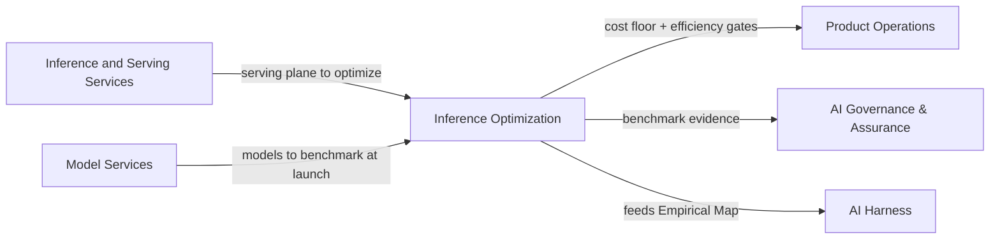

# Inference Optimization

The **Inference Optimization** pillar owns *how well* RackAI serves its model portfolio — the economic and performance layer on top of the serving plane. The question this pillar answers is: given the hardware we have, are we serving each model as efficiently as it can be served, at a cost we can defend?

This is not the same as *running the serving infrastructure* (that is [[Inference and Serving Services]]) or *managing what models exist* (that is [[Model Services]]). Inference Optimization is the **measurement, improvement, and cost-floor** discipline that makes owned capacity worth having.

> **Today the cost floor is unestablished.** The cost-per-GPU-hour is not modeled; usage is metered but cost-per-1M-tokens is not yet a number RackAI can quote with confidence. Making it real is the first job of this pillar. See gap P-003 in the [[RackAI Roadmap]].

---

## Scope

| Area | What it includes |
|---|---|
| **Serving efficiency** | Tokens-per-GPU-second (throughput), TTFT (time-to-first-token), and cost-per-outcome across every model in the portfolio — on owned NVIDIA and maturing AMD hardware. |
| **Benchmark and measurement product** | The harness that establishes, per model and per hardware config, what the system can produce and what 1M tokens cost. The ground truth every pricing and placement decision reads from. |
| **Optimization levers** | Quantization (FP8, INT4/AWQ), KV and prefix caching, continuous batching, tensor and expert parallelism, speculative decoding — prioritized by measured impact on real arriving workloads, not by novelty. |
| **Cost-floor story** | Turning the fleet's measured cost-per-GPU-hour into a defensible cost-per-1M-tokens that underwrites pricing across every route to market (direct tenants, the app, OpenRouter, contracted capacity). |
| **AMD / ROCm efficiency bet** | Defining where serving economics must land for AMD hardware to broaden the model portfolio, and tracking progress against that bar. |
| **Performance-regression gate** | The bar a runtime, quantization, or config change must clear on latency, throughput, and quality before it reaches production. Owned by this pillar; enforced across [[Inference and Serving Services]] changes. |
| **Accelerator benchmarking** | Per-GPU-class performance baselines; [[Benchmark Run]] execution and evidence for every accelerator class in the fleet. |

---

## Key Metrics and Formulas

| Metric / Formula | What it measures | Note |
|---|---|---|
| [[TTFT]] | Time to first token (latency experience) | Primary user-facing latency metric |
| [[Output Throughput]] | Tokens/second generated | System throughput |
| [[Tokens per GPU-Second Formula]] | Productive throughput per GPU | The efficiency numerator |
| [[Cost per 1M Tokens]] | Total cost / tokens served | The cost-floor anchor |
| [[GPU-Hours per 1M Tokens]] | GPU-time consumed per M tokens | Inputs to cost modeling |
| [[Productive GPU Utilization]] | Fraction of GPU time doing useful work | Utilization signal |
| [[FP8 Throughput Factor]] | Throughput multiplier from FP8 quantization | Key optimization coefficient |
| [[KV Cache Hit Rate]] | Prefix cache reuse rate | Caching optimization signal |
| [[Speculative Decoding Acceptance Rate]] | Fraction of speculative tokens accepted | Speculative decoding efficiency |

---

## Current State vs. Target

| Metric | Baseline (today) | Target | Status |
|---|---|---|---|
| Cost-per-GPU-hour (internal) | Unknown | Modeled and defensible | **Gap → P-003** |
| Cost-per-1M-tokens per model | Unknown | Per-model floor established | **Gap → P-003** |
| Benchmark harness | None | Per-model/hardware baseline | Not Started (M2 AI Perf Benchmarks) |
| TTFT (H100, GLM 5.3 Flash) | Assumed competitive | Measured | Not Started |
| Speculative decoding (Refrag) | In progress (RACKAI-374) | Shipped | In Progress |
| DPO / optimization-aware fine-tuning | — | — | Separate (Model Services) |
| AMD AIM engine serving | In progress (RACKAI-347) | AMD models served at target econ | In Progress |

---

## Key Entities and Notes

- [[Benchmark Run]] — the canonical record of a measurement event
- [[Accelerator Class]] — the hardware classes benchmarks target
- [[NVIDIA H100]], [[NVIDIA L40S]], [[NVIDIA A30]], [[AMD Instinct]] — the GPU classes in scope
- [[GPU Fleet]] — the fleet being optimized
- [[FP8 Throughput Factor]], [[KV Cache Hit Rate]], [[Speculative Decoding Acceptance Rate]] — the key optimization coefficients
- [[Model Weight Footprint]] — memory constraint input to placement and quantization decisions
- [[GPU Type Compatibility Matrix]] — the compatibility matrix this pillar maintains

---

## Relationships to Other Pillars

- [[Inference and Serving Services]] — the plane being optimized; serving config changes must pass the performance-regression gate this pillar owns.
- [[Model Services]] — every model entering the catalog must pass through the benchmark harness before launch; optimization clears the gate.
- [[Product Operations]] — the cost-floor number feeds pricing inputs and launch-readiness decisions.
- [[AI Harness]] — the [[Empirical Map]] (harness-adjacent) is fed by the cross-workload performance evidence this pillar produces.

---

## Roadmap Proof Alignment

| Proof | Inference Optimization contributions |
|---|---|
| **Proof 1 — Observe** | Establish benchmark harness; produce the first cost-per-GPU-hour number; close gap P-003 |
| **Proof 2 — Decide** | Evidence-informed placement (model/hardware match); AMD economics decision; performance engineering system |
| **Proof 3 — Control** | Performance-regression gate enforced at every deployment change; per-model cost evidence for MOE pricing |
| **Proof 4 — Operate** | Closed-loop optimization (automate what the efficiency data teaches); heterogeneous-supply economics |

---

## Open Questions

| Question | Priority |
|---|---|
| Who owns the benchmark harness execution — Inference Optimization or SRE/Reliability? | High |
| What is the first cost-per-GPU-hour number and who ratifies it as the pricing input? | High |
| What is the AMD/ROCm serving economics target before AMD is considered viable for production workloads? | Medium |
| Does the performance-regression gate block deployments automatically or require manual sign-off from this pillar? | Medium |

---

## See Also

- [[EXTERNAL_PDM_Optimization_and_Efficiency_JD]] — the PDM role definition for this pillar
- [[Inference and Serving Services]] — the serving plane this pillar measures and improves
- [[Model Services]] — the model launch gate this pillar co-owns
- [[Commercial & Capacity Hub]] — pricing and unit economics that depend on the cost floor
- [[RackAI Roadmap]] — gap P-003 (cost model), M2 AI Performance Benchmarks
- [[RackAI Organizational Design]] — pillar structure and team boundaries
