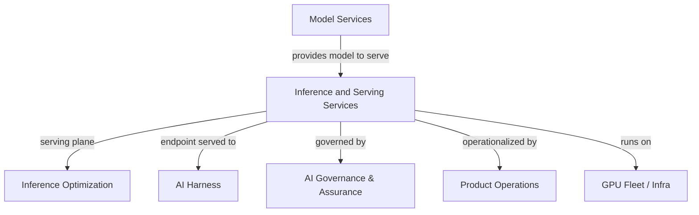

# Inference and Serving Services

The **Inference and Serving Services** pillar owns the infrastructure layer that takes a model and makes it callable — reliably, at scale, across hardware. Every tenant endpoint, every token returned to OpenRouter or a direct caller, flows through this pillar's work.

This is not the same as *how efficiently* we serve (that is [[Inference Optimization]]), *what models* we serve (that is [[Model Services]]), or *the harness* around a model (that is [[AI Harness]]). This pillar owns the **serving plane itself**: deployment lifecycle, runtime configuration, autoscaling, multi-region topology, and the control plane that orchestrates it all.

> **Confidence.** Core serving infrastructure is `measured` — it is in production (RackAI 1.0.0). Multi-region and advanced scheduling capabilities are `planned` or `assumed`. See the [[RackAI Roadmap]] gap register for specifics.

---

## Scope

| Area | What it includes |
|---|---|
| **Model Deployments** | Lifecycle of a deployment: create, update, canary, rollback, retire. The unit that exposes a model as a callable endpoint per tenant. |
| **Serving Runtimes** | Runtime engine selection and configuration per deployment (vLLM, NIM, optimized-NIM-vLLM, TensorRT-LLM planned, SGLang planned). |
| **Control Plane** | The RackAI Kubernetes aggregated API that orchestrates deployments, fine-tuning jobs, and resources across environments. |
| **Autoscaling** | KEDA-based autoscaling including scale-to-zero; scaling policy per deployment class. |
| **Accelerator / Capacity** | Accelerator Classes abstracting GPU pools (NVIDIA H100, L40S, A30; AMD Instinct); Capacity Pool allocation per deployment. |
| **Multi-Region Topology** | Regional endpoints, cross-region routing, datacenter topology constraints — planned (currently backlogged at Pri 6). |
| **Environments** | dev → staging → production promotion path under `*.rackai.rax.io`. |
| **Serving API surface** | OpenAI-compatible `/v1/chat/completions`, `/v1/models`, streaming; AI Studio. |
| **Admission Control** | Pre-execution admission (quota enforcement, 429/402 gates — Metering M4). |

---

## What Is Shipped Today (RackAI 1.0.0)

- Model Deployments with per-org namespace isolation
- OpenAI-compatible inference endpoints + streaming + AI Studio
- vLLM and NIM/optimized-NIM-vLLM serving runtimes
- Accelerator Class abstraction (NVIDIA + AMD)
- KServe-based serving; KEDA autoscaling (including scale-to-zero)
- Environments: dev and staging active; production planned
- Identity/auth (IAC M1–M2 complete), audit log query (IAC M3 complete)

## What Is In Progress or Planned

| Capability | Status | Source |
|---|---|---|
| Tenant-facing observability / GPU telemetry | In Progress (Platform M1–M2) | Delivery roadmap |
| Metering pipeline (usage_records, MeteringEvent) | In Progress (Metering M1) | Delivery roadmap |
| Quota enforcement / admission control | Not Started (Metering M4) | Delivery roadmap |
| AMD AIM engine / AMD+NVIDIA heterogeneous nodes | In Progress / Not Started | RACKAI-347/263 |
| Multi-region serving | Backlogged (Pri 6) | Delivery roadmap |
| GPU node access support | Backlogged (Pri 6) | Delivery roadmap |
| TensorRT-LLM, SGLang runtimes | Planned | RackAI Platform PRD |
| Production environment | Planned | RackAI Platform PRD |
| Smart-routing gateway | Gap (P-005) | [[RackAI Roadmap]] |
| Supply-abstraction interface | Gap (P-004) | [[RackAI Roadmap]] |

---

## Key Entities

- [[Model Deployment]] — the unit of serving
- [[Model Deployment Specification]] — the declared target state for a deployment
- [[Serving Runtime]] — the engine executing inference (vLLM, NIM, etc.)
- [[Accelerator Class]] — the hardware abstraction over GPU pools
- [[Capacity Pool]] — the allocated GPU capacity backing a deployment
- [[GPU Fleet]] / [[GPU Cluster]] / [[GPU Node]] — the physical layer
- [[RackAI Control Plane]] — the orchestration layer
- [[Topology]] / [[Region]] — geographic and infrastructure topology
- [[Traffic Class]] — request classification for routing and SLO enforcement

---

## Relationships to Other Pillars

- [[Model Services]] — provides validated, launch-ready models into the serving catalog. Serving consumes what Model Services produces.
- [[Inference Optimization]] — measures and improves how efficiently the serving plane runs those models. Optimization is a lens on serving, not a replacement for it.
- [[AI Harness]] — consumes serving endpoints as the execution layer beneath harness runtimes.
- [[AI Governance & Assurance]] — enforces policy at the serving boundary; tenant isolation and audit are a joint responsibility.
- [[Product Operations]] — operationalizes new model and runtime launches; owns the capacity provisioning coordination.

---

## Roadmap Proof Alignment

| Proof | Serving contributions |
|---|---|
| **Proof 1 — Observe** | Telemetry, metering, and observability substrate; auth/audit shipped |
| **Proof 2 — Decide** | Inference routing (llm-d), accelerator selection, heterogeneous hardware serving |
| **Proof 3 — Control** | Admission control, tenant isolation, multi-cluster serving boundary |
| **Proof 4 — Operate** | Multi-region support, dynamic fleet/capacity management, supply-abstraction v2 |

See [[RackAI Roadmap]] for full milestone list and status.

---

## Open Questions

| Question | Priority |
|---|---|
| Who owns the supply-abstraction interface design — this pillar or Infra? (gap P-004) | High |
| What is the serving pillar's scope boundary relative to smart-routing gateway (P-005)? | High |
| When does multi-region move off Pri 6 backlog? | Medium |

---

## See Also

- [[RackAI Platform]] — top-line platform view
- [[Inference Optimization]] — efficiency and cost floor for the serving plane
- [[Model Services]] — model lifecycle and catalog
- [[AI Harness]] — execution harness above the serving layer
- [[RackAI Roadmap]] — milestones and gap register
- [[RackAI Organizational Design]] — pillar structure and team boundaries
