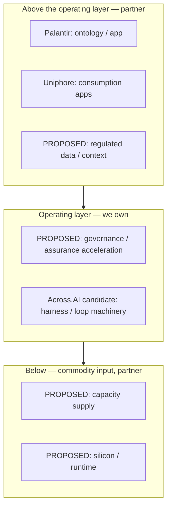

# Load-Bearing Bets

The partner portfolio behind the [[Three Battlegrounds|Private Enterprise AI Operator]] identity. The operator thesis wins by **owning the middle and partnering thinly and deliberately above and below it.** This note is the canonical home for the bets — where each sits on the operator stack, the gap it fills, its confidence, and the exit criterion that keeps it a testable bet rather than doctrine.

> **Confidence.** Current bets that exist in the corpus are labeled from their source notes; proposed new bets are `assumed` — spaces to create, not signed. Company facts about candidate partners are labeled per the [[Sovereign & Governed AI Competitors]] teardown. This note is `assumed` overall pending ratification.

## Principle — Thin and Deliberate

Palantir and Uniphore are two different *kinds* of bet, which is why the portfolio is thin exactly where the operator identity lives:

- **Palantir** — a bet *above* the operating layer (the "what customers build" tier: ontology, data integration, application).
- **Uniphore** — a bet on the *consumption surface* (end-user apps/assistants that create demand flowing down into inference).

Neither sits in the operating layer itself, and neither is below it. **Do not multiply application/consumption partners** to look full — more bets in the "what customers build" tier dilute the identity and make us look like a marketplace rather than an operator. Create new bets **where the operator identity and its flywheel live**: context/data, governance/assurance, capacity supply, and silicon/runtime.

## Current Bets

| Bet | Stack position | What it is | Gap it fills | Confidence | Exit / falsification criterion |
|-----|----------------|-----------|--------------|:----------:|-------------------------------|
| **Palantir (Foundry / AIP)** | Above — application/ontology | Ontology, authorization, provenance, context assembly ([[Enterprise AI Portfolio]]) | Lets customers turn operated AI into governed workflows without us building an app platform | assumed | See Palantir boundary below — falsifies if Palantir captures the operating layer itself |
| **Uniphore** | Above — consumption | End-user assistants, prebuilt apps, no-code builder | A demand/consumption surface feeding inference | assumed | Falsifies if the consumption surface does not drive material operated-workload volume |
| **Across.AI** | Operating layer — candidate | Harness / orchestration / loop machinery accelerant ([[Across.AI]]) | Could accelerate the [[Empirical Map]] / [[Verification]] / [[Self-Improvement Loop]] moat work | assumed (pending diligence) | Falsifies if perimeter/data-rights terms cannot keep the moat in-house |

## The Palantir Boundary (highest-risk bet)

"Palantir is also our partner" is not enough. The operator identity swings on this boundary: **if we cannot defensibly hold the operating layer against the application platform above it, "operator" is not a durable identity.** Draw it explicitly before it becomes a collision.

| Layer | Owner |
|-------|-------|
| Infrastructure, private inference, model operations, lifecycle, security boundary, observability, capacity, cost optimization | **Rackspace** |
| Ontology, data integration, AIP, application development, workflow / action layer | **Palantir** |
| Business-outcome implementation | **Joint / FDE** |

This is a load-bearing bet *and* condition #3 of the [[Three Battlegrounds|identity falsification test]]. If Palantir moves down into model operations / lifecycle / cost optimization, the boundary — and the partnership — is in question.

## Proposed New Bets (spaces to create)

Ranked by how load-bearing they are to the operator identity.

| # | Space | Stack position | Gap it fills | Why load-bearing | Confidence | Exit criterion |
|---|-------|----------------|--------------|------------------|:----------:|----------------|
| 1 | **Regulated data / context** | Above operating layer | A context/retrieval/lineage path that works with the customer's *existing* data estate, not only Foundry | De-risks the dependency on Palantir being the only route to proprietary context — arguably more load-bearing than a second app partner | assumed | Falsifies if Palantir/Foundry is in practice the only context path our ICP will accept |
| 2 | **Governance / assurance acceleration** | Operating layer | Compliance-attestation, AI-governance/eval, policy/guardrail tooling | Buys **time** on the certification envelope that gates every regulated deal (moves the gate faster than in-house build) | assumed | Falsifies if in-house certification is faster/cheaper than partnering |
| 3 | **Capacity supply** | Below (commodity input) | Overflow / frontier-class capacity our [[Fleet Competitiveness\|27B-capped fleet]] cannot host | Lets us say "we operate your estate" even for workloads our fabric can't serve — the clean expression of abstracting GPU supply while keeping placement + economics ours | assumed | Falsifies if partnered capacity economics undercut our owned-fleet cost floor to the point owning the fleet is unjustified |
| 4 | **Silicon / runtime** | Below (commodity input) | Differentiated cost-per-token supply (esp. AMD/ROCm alongside NVIDIA) | Inference economics is the competency we must own; silicon diversity is a lever on it | assumed | Falsifies if a second silicon line does not improve blended cost-per-token vs. single-vendor |

## What This Is Not

Deliberately **not** proposed: more application-layer or consumption-layer partners beyond Palantir/Uniphore. Adding them would dilute the operator identity. The bets above are concentrated in the operating layer and its immediate inputs.

## Open Questions

| Question | Affected Docs | Priority |
|----------|---------------|----------|
| Ratify the Palantir architecture + commercial boundary | [[Three Battlegrounds]], [[Enterprise AI Portfolio]] | High |
| Which regulated-context partner works with the customer's existing estate (not only Foundry)? | this note, [[Sovereign & Governed AI Competitors]] | High |
| Build vs. partner for the compliance envelope — which is faster to the first regulated buyer? | [[Governance Hub]] | High |
| Which neocloud is the right capacity-supply partner, and on what commercial terms vs. our cost floor? | [[GPU Neocloud Competitors]], [[Commercial & Capacity Hub]] | Medium |
| Across.AI diligence: perimeter/data-rights terms, and which `L+A` items (if any) leave in-house | [[Across.AI]] | Medium |

## See Also

- [[Three Battlegrounds]]
- [[Enterprise AI Portfolio]]
- [[Across.AI]]
- [[Sovereign & Governed AI Competitors]]
- [[GPU Neocloud Competitors]]
- [[Governance Hub]]
