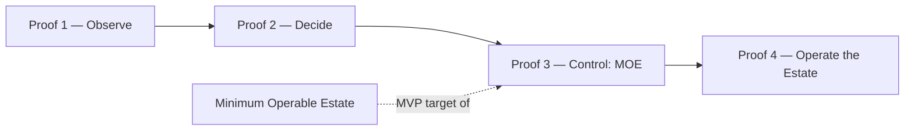

# Minimum Operable Estate

The **MVP of the Private Enterprise AI Operator.** The [[RackAI Roadmap]] does not roadmap the *full* governed harness first; it roadmaps the smallest environment for which Rackspace can legitimately say **"we operate your AI."** That environment is the Minimum Operable Estate (MOE), and it is the exit target of **Proof 3 — Control**.

> **Confidence.** `assumed` — a strategy-derived MVP definition, not a shipped configuration. Its components trace to the [[Capability Gap Register]] (mostly `missing`/`planned`). This note defines the target; adoption of its exact scope is a roadmap change to be accepted through the [[RackAI Roadmap]] Proposed-Changes workflow.

## Why an MVP, Not the Full Platform

You do not need closed-loop optimization, global multi-cluster orchestration, and a sophisticated [[Empirical Map]] before learning how to be an operator. You need **one operated estate.** Then ten. Then automate what hurts.

This is the operating expression of the roadmap's governing principle — **human-operated → instrumented → assisted → automated.** The MOE is deliberately allowed to be *human-operated* where automation would otherwise be speculative platform engineering. Operating it is what generates the transferable knowledge that later justifies automation.

## Candidate Definition

The smallest environment that still earns the word "operator." Each element is necessary; nothing beyond them is required for v1.

| Element | v1 scope | Maturity (per the ladder) |
|---------|----------|---------------------------|
| Customers | 1 | — |
| Private environment | 1 (customer-controlled data/execution boundary) | — |
| Models | 2 | — |
| Harness / application | 1 (governed execution harness **v1**, [[Governed Harness]]) | human-operated |
| GPU supply source | 1 (owned; behind the supply-abstraction interface) | human-operated |
| Routing | basic | static |
| Metering | yes | instrumented |
| Observability | yes | instrumented |
| Identity / policy | yes | human-approved policy |
| Audit trail | yes | instrumented |
| Model lifecycle | yes | human-operated |
| Placement | human-operated | human-operated |

## Two Milestones: MOE-0 and MOE-1

The MOE is delivered as **two distinct milestones** that must not be conflated (see [[RackAI Roadmap]] Proof 3):

| Milestone | What it is | What it proves | Caveat |
|-----------|-----------|----------------|--------|
| **MOE-0 — Operator rehearsal** | Friendly / internal estate (e.g. an internal or existing-tenant environment) | The operating model, runbooks, SLOs, incident process, telemetry, and operational-acceptance criteria work | **Does not validate the market thesis.** Must never be cited as "we've proven the operator model." |
| **MOE-1 — Identity proof** | External enterprise with a genuine private/control requirement | The control boundary, customer delegation, *and* willingness to pay — the real identity claim | This is what actually satisfies **Proof 3**. |

## Exit Condition (Proof 3 = MOE-1)

> Rackspace can take a real enterprise workload and operate it across an approved execution boundary while maintaining customer control, governance, and auditability — **and the customer delegates that responsibility and pays for it.**

Meeting this on **MOE-1** is **the first actual proof of the company identity** — the point at which "operator" stops being a claim and becomes a demonstrated fact. MOE-0 is a rehearsal that builds the capability; it does not, by itself, prove the identity.

## What the MOE Deliberately Excludes

To stay minimum, v1 excludes (deferred to Proof 4 — Operate the Estate):

- Multi-cluster orchestration / global front door
- Heterogeneous multi-supply scheduling (the *interface* exists from Proof 1; multiple live sources do not)
- Closed-loop / automated optimization
- Day-zero model factory
- Full harness runtime

## Relationship to the Roadmap

The MOE consumes the measurement primitives from Proof 1 (cost, telemetry, metering) and the first operating intelligence from Proof 2 (Empirical Map v1), then adds the control-boundary elements (harness v1, identity, policy, audit, isolation, first compliance attestation) that make it operable *inside an enterprise*.

## Open Questions

| Question | Affected Docs | Priority |
|----------|---------------|----------|
| Ratify the exact v1 scope (models count, supply source, which controls are mandatory for a first attestation) | [[RackAI Roadmap]], [[Governance Hub]] | High |
| Who is the first MOE customer, and is it an internal (e.g. Uniphore-tenant) or external estate? | [[Load-Bearing Bets]] | High |
| Minimum compliance attestation required for a real MOE (SOC 2 Type I? a control subset?) | [[Governance Hub]] | High |

## See Also

- [[RackAI Roadmap]] — Proof 3 anchors on the MOE
- [[Three Battlegrounds]] — the operator identity the MOE first proves
- [[Governed Harness]] · [[Empirical Map]]
- [[Capability Gap Register]] — component readiness
