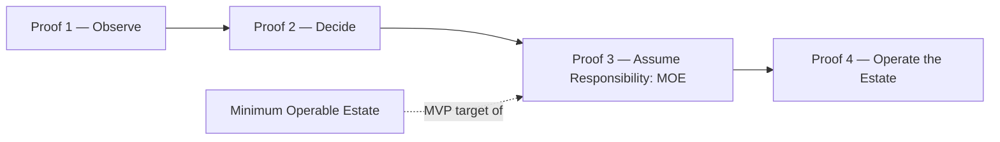

# Minimum Operable Estate

The **MVP of the Private Enterprise AI Operator.** The [[RackAI Roadmap]] does not roadmap the *full* governed harness first; it roadmaps the smallest environment for which Rackspace can legitimately say **"we operate your AI."** That environment is the Minimum Operable Estate (MOE), and it is the exit target of **Proof 3 — Assume Responsibility**.

> **Confidence.** `assumed` — a strategy-derived MVP definition, not a shipped configuration. Its components trace to the [[Capability Gap Register]] (mostly `missing`/`planned`). This note defines the target; adoption of its exact scope is a roadmap change to be accepted through the [[RackAI Roadmap]] Proposed-Changes workflow.

## Why an MVP, Not the Full Platform

You do not need closed-loop optimization, global multi-cluster orchestration, and a sophisticated [[Empirical Map]] before learning how to be an operator. You need **one operated estate.** Then ten. Then automate what hurts.

This is the operating expression of the roadmap's governing principle — **human-operated → instrumented → assisted → automated.** The MOE is deliberately allowed to be *human-operated* where automation would otherwise be speculative platform engineering. Operating it is what generates the transferable knowledge that later justifies automation.

## Candidate Definition

The smallest environment that still earns the word "operator." Each element is necessary; nothing beyond them is required for v1.

| Element | v1 scope | Maturity (per the ladder) |
|---------|----------|---------------------------|
| Customers | 1 | — |
| Private environment | 1 (customer-controlled data/execution boundary) | — |
| Models | 2 | — |
| Harness / application | 1 (governed execution harness **v1**, [[Governed Harness]]) | human-operated |
| GPU supply source | 1 (owned; behind the supply-abstraction interface) | human-operated |
| Routing | basic | static |
| Metering | yes | instrumented |
| Observability | yes | instrumented |
| Identity / policy | yes | human-approved policy |
| Audit trail | yes | instrumented |
| Model lifecycle | yes | human-operated |
| Placement | human-operated | human-operated |

## Two Milestones: MOE-0 and MOE-1

The MOE is delivered as **two distinct milestones** that must not be conflated (see [[RackAI Roadmap]] Proof 3):

| Milestone | What it is | What it proves | Caveat |
|-----------|-----------|----------------|--------|
| **MOE-0 — Operator rehearsal** | Friendly / internal estate (e.g. an internal or existing-tenant environment) | The operating model, runbooks, SLOs, incident process, telemetry, and operational-acceptance criteria work | **Does not validate the market thesis.** Must never be cited as "we've proven the operator model." |
| **MOE-1 — Identity proof** | External enterprise with a genuine private/control requirement | The control boundary, customer delegation, *and* willingness to pay — the real identity claim | This is what actually satisfies **Proof 3**. |

## Exit Condition (Proof 3 = MOE-1)

> Rackspace can take a real enterprise workload and operate it across an approved execution boundary while maintaining customer control, governance, and auditability — **and the customer delegates that responsibility and pays for it.**

Meeting this on **MOE-1** is **the first actual proof of the company identity** — the point at which "operator" stops being a claim and becomes a demonstrated fact. MOE-0 is a rehearsal that builds the capability; it does not, by itself, prove the identity.

**Acceptance logic (2026-10-09).** So the gate can't be read as circular:

1. **Before acceptance:** the MOE-1 capabilities are operational, and the evidence contract and reporting mechanism (artifact 4) are validated, for example by a dry run on MOE-0 data.
2. **During acceptance:** the first completed evidence report is an *output* of the acceptance exercise, not a prerequisite for starting it.
3. **Proof 3 passes** only when all three hold: a paying customer, delegated responsibility, and the agreed evidence requirements satisfied.

**What MOE-1 does and doesn't claim.** It shows that a *defined initial customer profile* will buy and delegate responsibility for a *bounded* operated estate: the agreed execution boundary is enforced and evidenced. It does not claim the whole ICP is addressable, that the offer is repeatable, or that residency in specific jurisdictions is met. Those belong to the proposed later gates ([[Roadmap Narratives#MOE gates: the market each one unlocks (proposed)|Roadmap Narratives]]):

- **MOE-1:** we can operate it responsibly for a paying customer.
- **MOE-2:** we can sell and operate it repeatedly without bespoke engineering for every customer.
- **MOE-3:** we can honour jurisdictional boundaries across regions.
- **MOE-4:** we can operate across customer-selected supply: the end-state objective, once the platform is proven on RXT-owned hardware (sovereignty Level 3, [[Sovereignty Levels]]).

## What MOE-1 Changes, and How It Materializes (proposed)

MOE-1 changes **who is accountable for the outcome, and who controls where it runs**: the move from supplier to sovereign operator (see the two centres of gravity in [[Three Battlegrounds]]).

| | Supplier (today) | Operator (MOE-1) |
|---|---|---|
| The customer buys | GPUs, endpoints and tokens | An operated outcome inside their boundary |
| When it breaks | The customer runs the incident | We do, against agreed SLOs |
| We're measured on | Our platform's uptime | Their SLOs, cost and audit trail |
| What we learn | How our own platform behaves | What works across every estate we run ([[Empirical Map]]) |
| Who controls it | Shared with the provider | The customer, and they can verify it |

**Proposed acceptance evidence for MOE-1**, the five things you could point at. If we can't show all five, MOE-1 hasn't happened:

1. A signed scope of delegated responsibility (serving, reliability, model lifecycle, incident response, capacity and cost), written as the customer's **declared intent and constraints**: what they want, the hard limits, and what we may decide without asking.
2. Agreed SLOs and an incident path the customer can see.
3. Running inside the customer's boundary, with an audit trail they can inspect.
4. A recurring evidence report on cost, performance and incidents, showing both that the outcome was met **and that the declared envelope held**, including any escalations or infeasibility reports.
5. An invoice for operating, not just for capacity.

These are `assumed`: a proposed acceptance definition pending ratification (see Open Questions). Artifacts 1 and 4 are the intent-and-constraints contract ([[Three Battlegrounds]]) made concrete: MOE-1 is where the contract is first proven, not just stated.

**Minimum evidence contract for artifact 4 (2026-10-08).** Audit events alone show what happened, not that the outcome was met. The report must join four kinds of evidence for the same period:

| Evidence | Shows | Source |
|---|---|---|
| **Performance** | Attainment against the agreed SLOs, and cost | Telemetry, [[Benchmark Evidence Chain]], [[SLO Attainment]] |
| **Policy decisions** | What was admitted, rejected, escalated or reported infeasible, and why | Admission control, [[Action Controls]] |
| **Actions** | What was changed, by whom or by which agent on whose behalf | [[Audit]], [[Agent Identity]] |
| **Outcomes** | Whether the declared realization outcome was met, and where it was not | The declaration (artifact 1) compared with the three rows above |

The report is a deliverable in its own right (roadmap row *MOE-1 evidence report*) and needs a named accountable owner, which is not yet assigned. It proves the *realization* outcome (SLOs, cost, boundaries held), not the business result of the customer's application (see the outcome boundary in [[Three Battlegrounds]]).

## What the MOE Deliberately Excludes

To stay minimum, v1 excludes (deferred to Proof 4 — Operate the Estate):

- Multi-cluster orchestration / global front door
- Heterogeneous multi-supply scheduling (the *interface* exists from Proof 1; multiple live sources do not)
- Closed-loop / automated optimization
- Day-zero model factory
- Full harness runtime

## Relationship to the Roadmap

```mermaid
flowchart LR
    P1[Proof 1 — Observe] --> P2[Proof 2 — Decide]
    P2 --> P3[Proof 3 — Assume Responsibility: MOE]
    P3 --> P4[Proof 4 — Operate the Estate]
    MOE[Minimum Operable Estate] -.MVP target of.-> P3
```

The MOE consumes the measurement primitives from Proof 1 (cost, telemetry, metering) and the first operating intelligence from Proof 2 (Empirical Map v1), then adds the control-boundary elements (harness v1, identity, policy, audit, isolation, first compliance attestation) that make it operable *inside an enterprise*.

## Open Questions

| Question | Affected Docs | Priority |
|----------|---------------|----------|
| Ratify the exact v1 scope (models count, supply source, which controls are mandatory for a first attestation) | [[RackAI Roadmap]], [[Governance Hub]] | High |
| Who is the first MOE customer, and is it an internal (e.g. Uniphore-tenant) or external estate? | [[Load-Bearing Bets]] | High |
| Minimum compliance attestation required for a real MOE (SOC 2 Type I? a control subset?) | [[Governance Hub]] | High |
| Ratify the five proposed acceptance artifacts (delegated-responsibility scope, visible SLOs and incident path, inspectable audit trail, recurring evidence report, operating invoice) as the MOE-1 gate. | [[RackAI Roadmap]], [[AI Operations Product]] | High |
| Adopt MOE-2 (repeat in the same segment), MOE-3 (residency and multi-region) and MOE-4 (operate on customer supply) as market-expansion gates after MOE-1? Proposed 2026-10-09 in [[Roadmap Narratives#MOE gates: the market each one unlocks (proposed)|Roadmap Narratives]]; each adds back one MOE-1 exclusion. If ratified, they are defined here. | [[RackAI Roadmap]], [[Roadmap Narratives]] | Medium |

## See Also

- [[RackAI Roadmap]] — Proof 3 anchors on the MOE
- [[Three Battlegrounds]] — the operator identity the MOE first proves
- [[Governed Harness]] · [[Empirical Map]]
- [[Capability Gap Register]] — component readiness
- [[Evidence Report]] / [[Customer Observability & Evidence Report PRD]] — delivers artifact 4 (draft)

