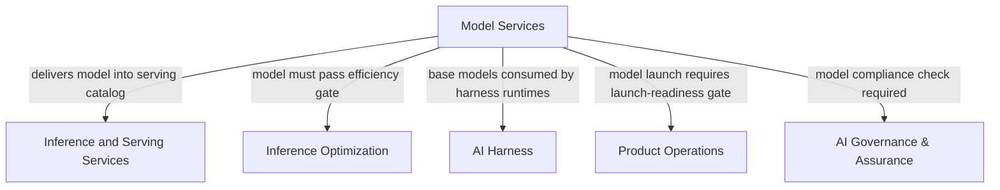

# Model Services

The **Model Services** pillar owns everything from the moment a model is a candidate to the moment it is retired: intake, compatibility testing, catalog management, launch pipeline, versioning, and fine-tuning operations. Every model that RackAI serves — whether accessed by OpenRouter traffic, a direct tenant, or an AI Harness runtime — passes through this pillar first.

This is not the same as *how efficiently we serve* a model (that is [[Inference Optimization]]) or *the infrastructure that runs it* (that is [[Inference and Serving Services]]). Model Services owns the **what-gets-served and how-it-gets-there** question.

> **Confidence.** Core catalog and fine-tuning capabilities are `measured` (shipped in RackAI 1.0.0). The day-zero model factory, DPO fine-tuning, and model radar/intake workflow are `planned` or `assumed`.

---

## Scope

| Area | What it includes |
|---|---|
| **Model Catalog** | The registry of available models: curated open-weight models, fine-tuned variants, and customer-registered models. The canonical list of what RackAI can serve. |
| **Model Intake & Compatibility** | The process of evaluating a model candidate: hardware compatibility testing, runtime support check, serving viability, safety review. The gate before a model enters the catalog. |
| **Model Launch Pipeline** | The operational path from "model passes intake" to "model is live in the serving plane." Includes per-model benchmark baseline, runtime config, and capacity provisioning. |
| **Model Versioning** | Version management within the catalog: tracking base model versions, derivative fine-tuned adapters, and runtime-optimized variants. |
| **Model Retirement** | Lifecycle retirement: deprecation notice, traffic migration, clean removal from the catalog and serving plane. |
| **Day-Zero Model Factory** | The automated, repeatable launch process for new models at scale — the industrialization of model intake → launch (Proof 4 capability, currently a roadmap gap). |
| **Fine-Tuning Operations** | Dataset → Fine-Tuning Job → LoRA Adapter lifecycle: job submission, execution, adapter registration, adapter deployment and lifecycle management. |
| **Registry Credentials** | Credentials enabling model pulls from external registries (HuggingFace, image pull secrets). |
| **Model Radar** | Continuous monitoring of model releases (open-weight and commercial) to identify candidates for intake. The feed into model strategy. |

---

## What Is Shipped Today (RackAI 1.0.0)

- Model catalog and registry
- Registry Credentials (HuggingFace token, license, image pull)
- Fine-tuning: Dataset → Fine-Tuning Job (SFT / QLoRA) → LoRA Adapter
- Adapter deployment and apply-in-AI-Studio
- On-demand model onboarding (RACKAI-354, in progress)

## What Is In Progress or Planned

| Capability | Status | Source |
|---|---|---|
| On-demand model onboarding (request new model support) | In Progress (RACKAI-354) | Delivery roadmap |
| DPO fine-tuning (preference-tuning beyond SFT) | In Progress (RACKAI-252) | Delivery roadmap |
| Model sunsetting / lifecycle retirement | Not Started (RACKAI-372) | Delivery roadmap |
| RL fine-tuning methods | Planned ("Coming Soon" in 1.0.0 docs) | RackAI Platform docs |
| Day-zero model factory | Gap — Engineering Phase 4 | [[RackAI Roadmap]] gap P-007 |
| Model radar / intake workflow | Not formalized | Strategy-derived |

---

## Current Model Portfolio

The active model bets are managed in [[Product Hub]] and [[RackAI Roadmap]]:

| Stance | Model |
|---|---|
| Win now | [[DeepSeek V4 Flash]] |
| Win now | [[GLM 5.3 Flash]] |
| Bet ahead | [[Nemotron 3 Ultra]] |

The third slot is intentionally rotatable. Fleet topology (NVL-PCIe, ~27B-class ceiling) constrains which models can be served on owned hardware — see [[Inference Optimization]] and [[RackAI Roadmap]] §Fleet Competitiveness.

---

## Key Entities

- [[Model]] — the canonical representation of a model in the catalog
- [[Model Class]] — the classification that determines runtime compatibility
- [[Model Deployment]] — the serving instantiation of a catalog model
- [[Model Deployment Specification]] — the declared configuration for a deployment
- [[Model Catalog Endpoint]] — the `/models` API surface exposing the catalog
- [[Registry Credential]] — external registry access credentials
- [[Fine-Tuning Job]] — the compute job that produces a LoRA adapter
- [[LoRA Adapter]] — the fine-tuned output: targets exactly one base model
- [[Dataset]] — the training data consumed by a fine-tuning job

---

## Relationships to Other Pillars

- [[Inference and Serving Services]] — consumes the validated catalog; serving deploys what Model Services certifies as ready.
- [[Inference Optimization]] — Model Services feeds models into the benchmark harness; optimization determines whether a model can be served at target cost/performance before launch.
- [[AI Harness]] — harness runtimes reference base models from the catalog; fine-tuned adapters (LoRA) are attached within the harness serving context.
- [[Product Operations]] — owns the launch-readiness gate; coordinates capacity provisioning, conformance, and metering wiring when a new model goes live.
- [[AI Governance & Assurance]] — model provenance and compliance checks are a joint dependency at launch time.

---

## Roadmap Proof Alignment

| Proof | Model Services contributions |
|---|---|
| **Proof 1 — Observe** | Establish model benchmark baseline at launch; metering per model |
| **Proof 2 — Decide** | Fine-tuning operations + domain-model experiment (central-bet test); model selection evidence from the Empirical Map |
| **Proof 3 — Control** | Model provenance, compliance attestation per model, customer model isolation |
| **Proof 4 — Operate** | Day-zero model factory; multi-estate model lifecycle management |

See [[RackAI Roadmap]] for full milestone list.

---

## Open Questions

| Question | Priority |
|---|---|
| Who owns model radar — does Model Services define the intake process or does that sit with Product Hub/strategy? | High |
| What is the compliance gate required before a model enters the catalog (e.g., safety review, license check)? | High |
| How does fine-tuning operations scope split between Model Services and AI Harness for customer-directed fine-tuning? | Medium |
| When does the day-zero model factory move from a roadmap gap to a funded delivery milestone? | Medium |

---

## See Also

- [[RackAI Platform]] — top-line platform view
- [[Inference and Serving Services]] — the infrastructure that runs catalog models
- [[Inference Optimization]] — efficiency gates models must pass at launch
- [[Product Hub]] — model bets and OpenRouter inference program strategy
- [[RackAI Roadmap]] — milestones and gap register
- [[RackAI Organizational Design]] — pillar structure and team boundaries
