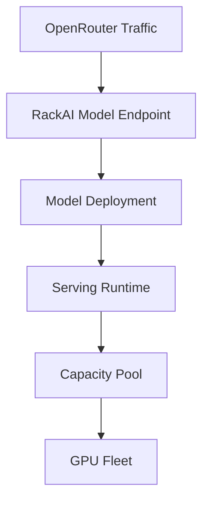

# OpenRouter Initiative

The **OpenRouter inference program** is the first initiative built on the [[RackAI Platform]]. Its goal is to expose Rackspace inference capacity to external demand through OpenRouter — a marketplace/abstraction layer in front of many model providers. It is one go-to-market surface on top of the platform, not the platform itself.

## Two Integration Paths

OpenRouter offers two distinct ways in, and they are very different products:

| Path | What it is | Platform dependency | Maturity |
|------|-----------|---------------------|:--------:|
| **A — Private Models** | Register a RackAI tenant deployment into OpenRouter as a restricted, non-public model | RackAI per-deployment endpoint (exists) + **API keys** (identity workstream) | Near-term; primary dependency is API-key support + docs |
| **B — Public Provider** | Rackspace operates public, multi-tenant inference-as-a-service that OpenRouter routes arbitrary traffic to | **Inference-as-a-service**, **billing/payment**, **`/models` catalog**, streaming/usage confirmation | Multi-quarter; blocked on platform gaps |

Path B is what the [[Rack AI OpenRouter Strategic Vision]] and [[Rack AI OpenRouter Engineering Roadmap]] are written around. Path A is the fast, low-lift entry the roadmap does not currently model.

## Provider-Readiness Gaps (Path B)

The reference doc (`reference/openrouter/`) enumerates P0/P1 requirements against current RackAI reality. Headline P0 gaps:

- **Billing/payment** — no mechanism today; metering ≠ billing (billing is a platform non-goal per PRD). Blocks the provider application.
- **Inference-as-a-service** — RackAI is deploy-your-own per tenant, not a shared public endpoint.
- **`/models` catalog endpoint** — OpenRouter-schema catalog (pricing, context, capacity, datacenter) does not exist.
- **Streaming + token-usage** — compatibility unconfirmed (validation task).

These are tracked as open questions and validations in the [[Evidence Hub]].

## Serving-Chain Attachment

The initiative attaches at the demand layer and routes into the platform serving chain. It never bypasses Model Deployment or references GPUs directly.

## Related

- [[RackAI Platform]] — the platform this initiative runs on
- [[Product Hub]] — strategy, model bets, roadmap
- [[OpenRouter Provider Integration]] — canonical entity for the provider path
- [[Rack AI Knowledge Base]]
