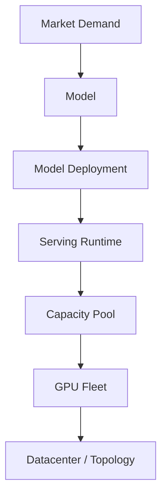

# Rack AI Knowledge Base

The living knowledge system for the Rack AI inference program on OpenRouter. This is not a folder of documents — it is a structured projection of an underlying knowledge graph modeling the models, serving platform, GPU fleet, economics, and evidence behind Rack AI as a high-performance inference provider.

## Canonical Abstraction Chain

OpenRouter consumers see Model endpoints. They never reference GPU hardware directly.

## Navigation

| Hub | Layer | Covers |
|-----|-------|--------|
| [[Entity Ontology Hub]] | L1 | Models, deployments, runtimes, GPU fleet, capacity pools |
| [[Operations Hub]] | L2 | Serving lifecycle, workflows, events, metrics, formulas, coefficients, policies |
| [[Commercial & Capacity Hub]] | L3 | Unit economics, pricing, allocation, forecasting |
| [[Evidence Hub]] | L4 | Benchmarks, assumptions, validations, open questions |
| [[Wiki Hub]] | L5 | Indexes, MOCs, scorecards, changelogs, glossary |
| [[Governance Hub]] | — | Operating standards, change control, fitness gates |
| [[Product Hub]] | — | Strategy, model bets, roadmap |

## Operating Discipline

This wiki follows the same discipline as the sister AIOS Wiki so it renders correctly in the shared rendering app and meets the same standards.

- **Operating standard:** `init/init.md`
- **Agent guide:** `init/agent_guide.md`
- **Fitness gates:** [[FITNESS_CHECKLIST]]
- **Regression suite:** [[REGRESSION_SUITE]]
- **Change packet (required before edits):** [[CHANGE_PACKET]]
- **Frontmatter lint:** `scripts/lint-frontmatter.sh`

## Key Documents

- [[Rack AI Knowledge Base Architecture]] — full architecture and design principles
- [[Source Inventory]] — corpus source catalog
- [[Source-to-Concept Crosswalk]] — source-to-concept mapping
