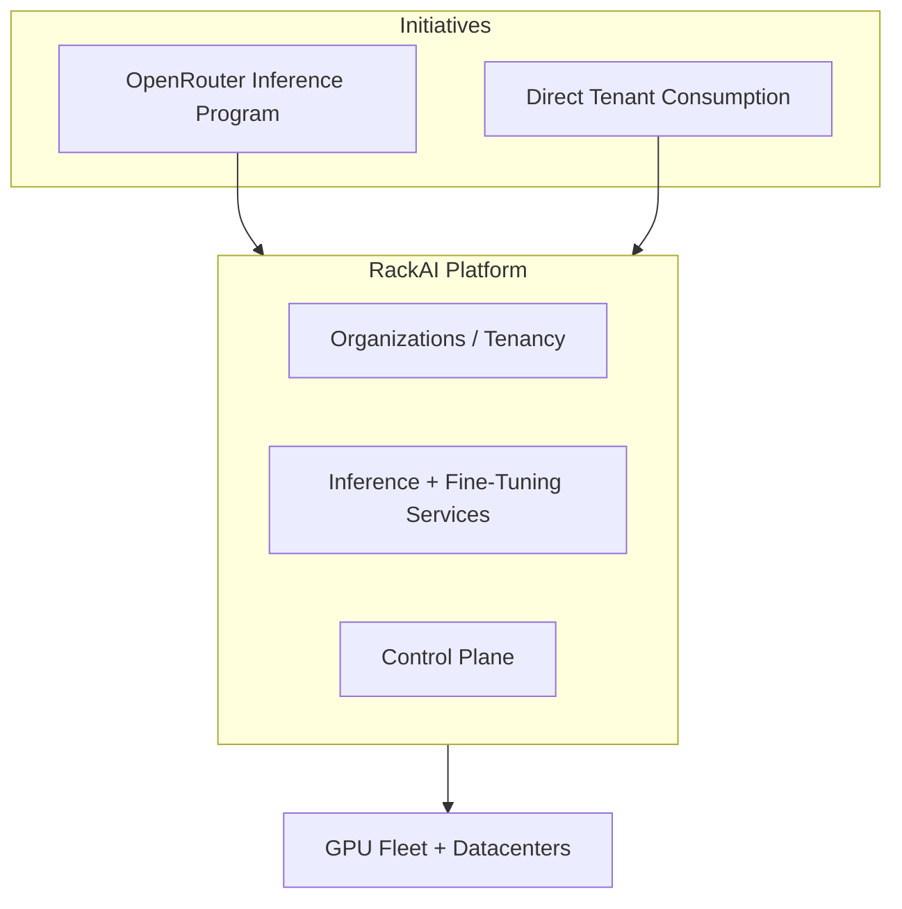
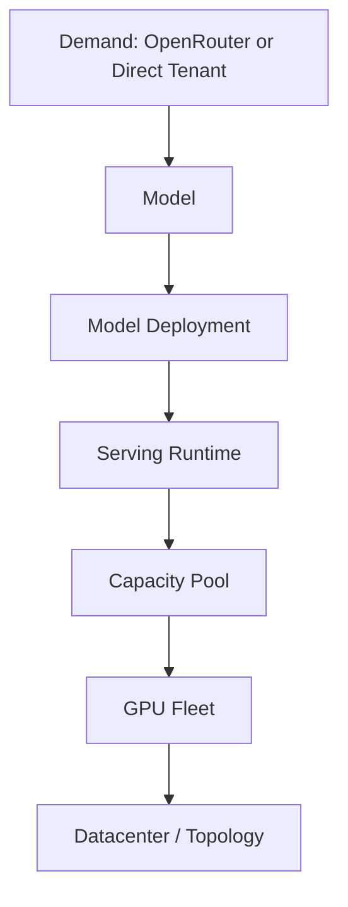

# RackAI Platform Knowledge Base

The living knowledge system for the **RackAI platform** — Rackspace's Kubernetes-native AI inference and fine-tuning platform — and the **initiatives** built on top of it. This is not a folder of documents; it is a structured projection of an underlying knowledge graph modeling the platform (tenancy, models, deployments, serving runtimes, fine-tuning, GPU fleet, economics) and the programs that expose it to demand.

**Canonical product name:** RackAI. `RMPAI` and `RackAI Aurora` are aliases of the same product.

## Platform and Initiatives

The OpenRouter inference program is the **first initiative** on the platform: a distribution and go-to-market surface. It is one aspect of RackAI, not the whole.

## Canonical Serving Chain

Consumers see Model endpoints. They never reference GPU hardware directly. Initiatives attach above Demand and route into this chain.

## Navigation

| Hub | Scope | Covers |
|-----|-------|--------|
| [[Enterprise AI Portfolio]] | Portfolio | Broadly-scoped offering (portfolio view) under which RackAI is the product; partners, data integration, consumption surfaces |
| [[RackAI Platform]] | Platform / product | What RackAI is: tenancy, inference, fine-tuning, control plane, environments, capabilities |
| [[OpenRouter Initiative]] | Initiative | Provider path, private-model path, provider-readiness gaps |
| [[Entity Ontology Hub]] | L1 | Models, deployments, runtimes, fine-tuning entities, GPU fleet, capacity pools, tenancy |
| [[Operations Hub]] | L2 | Serving + fine-tuning lifecycle, workflows, events, metrics, formulas, coefficients, policies |
| [[Commercial & Capacity Hub]] | L3 | Unit economics, metering, billing, pricing, allocation, forecasting |
| [[Evidence Hub]] | L4 | Benchmarks, assumptions, validations, open questions |
| [[Wiki Hub]] | L5 | Indexes, MOCs, scorecards, changelogs, glossary |
| [[Governance Hub]] | — | Operating standards, change control, fitness gates |
| [[Product Hub]] | — | Strategy, model bets, roadmap |
| [[Three Battlegrounds]] | — | Company identity + theory of advantage: the Private Enterprise AI Operator; competitor map by customer alternative |
| [[Load-Bearing Bets]] | — | Partner portfolio: current bets (Palantir, Uniphore, Across.AI) + proposed new bets mapped to the operator stack |
| [[RackAI Roadmap]] | — | The canonical, living roadmap: four proofs (Observe → Decide → Control → Operate) realizing the operator identity |
| [[Minimum Operable Estate]] | — | The MVP operator target: the smallest estate for which "we operate your AI" is true; anchors Proof 3 |

## Operating Discipline

This wiki follows the same discipline as the sister AIOS Wiki so it renders correctly in the shared rendering app and meets the same standards.

- **Operating standard:** `init/init.md`
- **Agent guide:** `init/agent_guide.md`
- **Fitness gates:** [[FITNESS_CHECKLIST]]
- **Regression suite:** [[REGRESSION_SUITE]]
- **Change packet (required before edits):** [[CHANGE_PACKET]]
- **Frontmatter lint:** `scripts/lint-frontmatter.sh`

## Key Documents

- [[Rack AI Knowledge Base Architecture]] — full architecture and design principles
- [[Source Inventory]] — corpus source catalog
- [[Source-to-Concept Crosswalk]] — source-to-concept mapping
