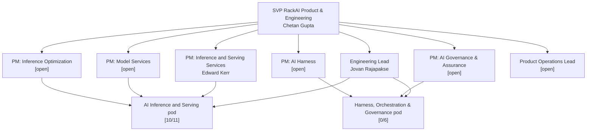

# RackAI Organizational Design

The canonical reference for how RackAI is organized above the Kubernetes line. Six pillars, each with a product manager and engineering lead. This note covers structure, boundaries, and coordination — not the product roadmap (that is [[RackAI Roadmap]]) or the detailed working model for how pillars interact (that is [[Pillar Working Model]]).

> **Confidence:** `assumed` — drawn from the BU org-design deck (`reference/Enterprise AI Cloud - RackAI.pptx`, added 2026-09-17) and the four external PDM JDs. The deck is a proposed operating model / internal strategy draft, not a ratified org. Names, headcounts, and REQs are point-in-time. The six-pillar structure reflects the reorg intent as of 2026-09-24.

> **Layer boundary.** All six pillars live above Kubernetes. The **Infra team** owns Kubernetes and below — cluster, nodes, GPU fleet, networking, storage, and cluster observability. See [[RackAI Roadmap#Two Teams, One Roadmap]] for the handoff rules.

---

## Leadership

| Role | Person |
|---|---|
| SVP, RackAI Product & Engineering | Chetan Gupta |
| Engineering Lead | Jovan Rajapakse |
| PM Inference/Serving | Edward Kerr |
| PM AI Harness & Orchestration | `[0/1 — open]` |
| PM AI Assurance & Governance | `[0/1 — open]` |
| PM Product Operations | `[0/1 — open]` |
| PM Product Partnership | `[0/1 — open]` |
| PM RackAI Internal | `[0/1 — open]` |

---

## The Six Pillars

Each pillar has a PM (owns what we build and why) and an engineering lead (owns how it is built). The PM/engineering lead pair is the decision unit for that pillar's scope.

### 1. [[Inference and Serving Services]]
The infrastructure that runs models: deployments, runtimes, autoscaling, accelerator allocation, and the API surface tenants call. Does not decide which models to serve, how efficiently they run, or what happens above the raw inference endpoint.

- **Engineering pod:** AI Inference and Serving — `[10/11 filled]`; Director open `[0/1]`
- **Key REQs:** Director AI Inference and Serving; Senior Manager Model Inferencing and Fine-Tuning
- **Hub:** [[Inference and Serving Services]]

### 2. [[Model Services]]
The model lifecycle from candidate to retired: intake, compatibility testing, catalog, launch pipeline, versioning, fine-tuning operations, and LoRA adapter management. Does not own the serving infrastructure or optimization work.

- **Engineering pod:** Part of AI Inference and Serving pod (Fine-Tuning sub-track; Model Enablement)
- **Hub:** [[Model Services]]

### 3. [[Inference Optimization]]
How efficiently the serving plane runs: throughput, latency, cost-per-token, the benchmark harness, optimization techniques, and the performance-regression gate every runtime change must clear. Does not own the serving infrastructure or the model catalog.

- **Engineering pod:** AI Inference and Serving (Inference sub-track) — `[2/8 filled]`
- **Key REQs:** Inference Optimization Engineer V, IV (×2), III (×2)
- **Hub:** [[Inference Optimization]]

### 4. [[AI Governance and Assurance]]
The trust and compliance layer: runtime policy enforcement, tenant isolation, provenance and audit records, agent identity and delegated authority, and the certification envelope (SOC 2, ISO 42001, NIST AI RMF). Does not own the execution harness that enforces those policies at runtime.

- **Engineering pod:** AI Harness, Orchestration and Governance — Governance and Assurance sub-pod `[0/4]`
- **Key REQs:** AI Governance Engineer V; AI Assurance Engineer V; Quality Engineer V (×2); Lead AI Governance Engineer; Lead AI Assurance Engineer
- **Hub:** [[AI Governance and Assurance]]

### 5. [[AI Harness]]
The execution layer above inference: context assembly, tool controls, memory, guardrails, orchestration routing, and the Empirical Map as a decision surface. Does not own business logic, raw serving infrastructure, or the policy rules it enforces.

- **Engineering pod:** AI Harness, Orchestration and Governance — Harness and Orchestration sub-pod `[0/2]`
- **Key REQs:** Chief Architect AI Orchestration; Principal Engineer AI Harness; Director AI Harness, Orchestration and Governance
- **Hub:** [[AI Harness]]

### 6. [[AI Operations Product]] (Product Operations)
The connective tissue that turns built capabilities into launched, operable offers: launch-readiness gates, metering and showback wiring, capacity provisioning coordination, compliance evidence assembly, and the runbooks that make every launch faster than the last. Internal-facing, cross-pillar. Does not own any single product layer.

- **Role type:** Product Operations Lead (not a PM role — internal-facing, not external-facing)
- **Hub:** [[AI Operations Product]]

---

## Org Structure

---

## The Infra Boundary

The org chart above covers RackAI's six pillars — everything above Kubernetes. The Infra team (outside this org) owns:
- Kubernetes cluster infrastructure
- GPU nodes, networking, storage
- Cluster-level observability (Prometheus/DCGM/Grafana GPU dashboards)

**Two handoff rules that govern the boundary:**
1. **Observability:** Infra builds cluster observability; RackAI pillars consume it and turn it into operating intelligence
2. **Accelerator selection:** Infra owns the hardware choice; Inference and Serving Services is a constraining stakeholder — if a model requires specific GPUs, Infra selects within those constraints

---

## Resourcing Priority (from org-design deck)

| Priority | Role | Pillar |
|---|---|---|
| 1 | Director, AI Inference and Serving | Inference and Serving Services |
| 2 | Senior Manager, Model Inferencing and Fine-Tuning | Model Services |
| 3 | Inference Optimization Engineer V | Inference Optimization |
| 4 | Quality Engineer V | AI Governance & Assurance |
| 5 | Director, AI Harness, Orchestration and Governance | AI Harness |
| 6 | Principal Engineer, AI Harness | AI Harness |
| 7 | Chief Architect, AI Orchestration | AI Harness |
| 8 | AI Governance Engineer V | AI Governance & Assurance |
| 9 | AI Assurance Engineer V | AI Governance & Assurance |

PM resourcing (Chetan Gupta as hiring manager): PM Harness & Orchestration, PM AI Governance & Assurance, PM Product Operations, PM AI Partnerships, PM RackAI Internal, PM UK Sovereign AI.

---

## Open Questions

| Question | Priority |
|---|---|
| Model Services: does this become a standalone PM seat or remain under Inference/Serving PM (Edward Kerr) initially? | High |
| Product Operations Lead: is this a distinct seat or split across dev-plan P5/P6 + existing PMs? | High |
| Fine-Tuning engineering ownership: currently under Inference pod with Uniphore partnership — does Model Services PM own the product direction for this? | Medium |
| UK Sovereign AI PM: is this a seventh pillar or a go-to-market role on top of AI Governance & Assurance? | Medium |

---

## See Also

- [[Pillar Working Model]] — how the six pillars divide responsibility, make joint decisions, and interact day-to-day
- [[RackAI Roadmap]] — workstream table mapping engineering workstreams to pillars
- [[Three Battlegrounds]] — why these six pillars exist (the operator stack they collectively own)
- [[RackAI Organizational Design (Source)]] — the underlying org-design deck companion note (`06-sources/RackAI Organizational Design.md`)
