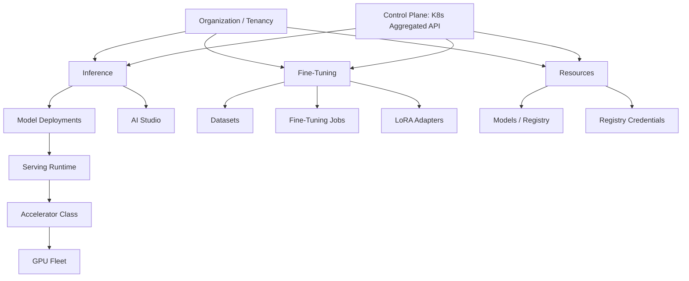

# RackAI Platform

**RackAI** is Rackspace's Kubernetes-native AI **inference and fine-tuning platform**. Tenants (organizations) deploy models to get OpenAI-compatible endpoints, fine-tune them with their own data, and manage the model lifecycle — all on Rackspace GPU infrastructure. This hub is the top-line product view; the OpenRouter inference program is one initiative that sits on top of it.

> **Naming:** RackAI is canonical. `RMPAI` (main PRD) and `RackAI Aurora` (a technical spec) are aliases of the same product.

## What RackAI Is Today (shipped)

Based on the RackAI 1.0.0 docs, console/CLI guides, and API reference:

- **Tenancy:** everything is scoped to an **Organization**; resources are namespace-isolated per org. No self-service signup — Rackspace provisions accounts via Auth0.
- **Inference:** deploy a model from the catalog → per-deployment **OpenAI-compatible** endpoint (`/v1/chat/completions`, `/v1/models`), streaming supported. **AI Studio** for interactive testing.
- **Fine-tuning:** Dataset → Fine-Tuning Job (Supervised / QLoRA) → LoRA Adapter → apply in AI Studio or attach to a deployment. RL and DPO methods are **"Coming Soon."**
- **Resources:** a **Model** catalog/registry and **Registry Credentials** (HuggingFace token, license, image pull).
- **Hardware:** **Accelerator Class** abstracts GPU pools (NVIDIA and AMD); deployments select accelerators. KServe-based serving, KEDA autoscaling (incl. scale-to-zero).
- **Runtimes:** vLLM and NIM / optimized-NIM-vLLM engines per Model Class.
- **Environments:** mainline **dev → staging → production** under `*.rackai.rax.io` (production **planned**).

## Planned / Draft (not yet shipped)

Per the PRDs and technical specs (Draft status): **metering**, **quotas**, **Projects**, **billing/payment**, full **RBAC roles**, tenant-facing **observability** and **audit**, additional runtimes (TensorRT-LLM, SGLang), additional accelerators (Intel Gaudi, CPU), and a smart-routing gateway. These carry `assumed`/`derived` confidence until shipped.

> **Metering ≠ billing.** The Multi-Tenancy & Metering PRD lists "defining pricing rates or billing logic" as an explicit non-goal. Billing/payment is a genuine gap, tracked as an open question.

## Capability Map

## Initiatives On the Platform

| Initiative | Hub | Relationship to platform |
|-----------|-----|--------------------------|
| OpenRouter inference program | [[OpenRouter Initiative]] | Exposes RackAI model endpoints to external OpenRouter demand (provider path) or registers tenant deployments as OpenRouter private models |
| Direct tenant consumption | — (baseline product) | Tenants call their own deployment endpoints directly |

## Layer Entry Points

- **Entities:** [[Entity Ontology Hub]]
- **Operations:** [[Operations Hub]]
- **Commercial & capacity:** [[Commercial & Capacity Hub]]
- **Evidence:** [[Evidence Hub]]

## Related Hubs

- [[Rack AI Knowledge Base]]
- [[OpenRouter Initiative]]
- [[Product Hub]]
