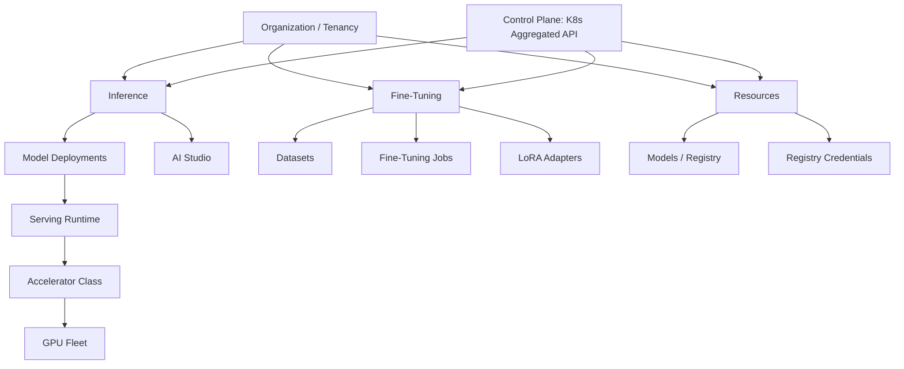

# RackAI Platform

**RackAI** is Rackspace's Kubernetes-native AI **inference and fine-tuning platform**. Tenants (organizations) deploy models to get OpenAI-compatible endpoints, fine-tune them with their own data, and manage the model lifecycle — all on Rackspace GPU infrastructure. This hub is the top-line product view; the OpenRouter inference program is one initiative that sits on top of it.

> **Two senses of "RackAI" (reconciled 2026-10-06).** This hub describes **what is shipped today** — the inference + fine-tuning platform (`measured`). The [[Enterprise AI Cloud Product Model]] sets the **strategic product boundary**, which evolved to *private AI operating platform = core + rails* (adding the SDK, [[Solution Marketplace|marketplace]], packaging/certification, and metering/instantiation as the "rails"). Those rails are `assumed`/proposed, not built — see the [[Capability Gap Register]]. Both are correct: this hub states *what exists*, the product model states *the target boundary*. Widening the boundary did not upgrade any capability to shipped.

> **Naming:** RackAI is canonical. `RMPAI` (main PRD) and `RackAI Aurora` (a technical spec) are aliases of the same product.

## What RackAI Is Today (shipped)

Based on the RackAI 1.0.0 docs, console/CLI guides, and API reference:

- **Tenancy:** everything is scoped to an **Organization**; resources are namespace-isolated per org. No self-service signup — Rackspace provisions accounts. Identity is per-realm Keycloak (Auth0 is the legacy provider being cut over); Organizations sit under a **CustomerOrg** parent tier ([[Identity and Access Control Spec]]).
- **Inference:** deploy a model from the catalog → per-deployment **OpenAI-compatible** endpoint (`/v1/chat/completions`, `/v1/models`), streaming supported. **AI Studio** for interactive testing.
- **Fine-tuning:** Dataset → Fine-Tuning Job (Supervised / QLoRA) → LoRA Adapter → apply in AI Studio or attach to a deployment. RL and DPO methods are **"Coming Soon."**
- **Resources:** a **Model** catalog/registry and **Registry Credentials** (HuggingFace token, license, image pull).
- **Hardware:** **Accelerator Class** abstracts GPU pools (NVIDIA and AMD); deployments select accelerators. KServe-based serving, KEDA autoscaling (incl. scale-to-zero).
- **Runtimes:** vLLM and NIM / optimized-NIM-vLLM engines per Model Class.
- **Environments:** mainline **dev → staging → production** under `*.rackai.rax.io` (production **planned**).

## Partly Built / Planned (not yet shipped)

**Partly built per spec as-built annotations (`derived`, through 2026-10-08):**
- **RBAC** — `PlatformRole`/`RoleBinding` CRDs, ext_authz + Kubernetes RBAC layers, API keys built; multi-CustomerOrg gated off ([[Identity and Access Control Spec]]).
- **Metering** — PostgreSQL outbox/drainer and fine-tuning sidecar metering built; no live mid-job FT quota ([[Multi-Tenancy and Metering Spec]]).
- **Projects** — `FineTuningJob.spec.project` built; `Model.spec.project` not yet ([[Multi-Tenancy and Metering Spec]]).
- **Audit** — PostgreSQL store, outbox and read API built; actor attribution (Audit Webhook) and workload/billing categories not built ([[Monitoring and Auditability Spec]]).
- **Tenant observability** — service built, but `/metrics/inference` returns empty series because no recording rules ship ([[Monitoring and Auditability Spec]]).

**Planned (Draft PRDs/specs):** **quota enforcement**, **billing/payment**, additional runtimes (TensorRT-LLM, SGLang), additional accelerators (Intel Gaudi, CPU), and a smart-routing gateway. These carry `assumed`/`derived` confidence until shipped.

> **Metering ≠ billing.** The Multi-Tenancy & Metering PRD lists "defining pricing rates or billing logic" as an explicit non-goal. Billing/payment is a genuine gap, tracked as an open question.

## Capability Map

```mermaid
flowchart TD
    ORG[Organization / Tenancy] --> INF[Inference]
    ORG --> FT[Fine-Tuning]
    ORG --> RES[Resources]
    INF --> DEP[Model Deployments]
    INF --> STUDIO[AI Studio]
    FT --> DS[Datasets]
    FT --> JOB[Fine-Tuning Jobs]
    FT --> LORA[LoRA Adapters]
    RES --> MODEL[Models / Registry]
    RES --> CRED[Registry Credentials]
    DEP --> RT[Serving Runtime]
    RT --> ACC[Accelerator Class]
    ACC --> FLEET[GPU Fleet]
    CP[Control Plane: K8s Aggregated API] --> INF
    CP --> FT
    CP --> RES
```

## Initiatives On the Platform

| Initiative | Hub | Relationship to platform |
|-----------|-----|--------------------------|
| OpenRouter inference program | [[OpenRouter Initiative]] | Exposes RackAI model endpoints to external OpenRouter demand (provider path) or registers tenant deployments as OpenRouter private models |
| Direct tenant consumption | — (baseline product) | Tenants call their own deployment endpoints directly |

## Layer Entry Points

- **Entities:** [[Entity Ontology Hub]]
- **Operations:** [[Operations Hub]]
- **Commercial & capacity:** [[Commercial & Capacity Hub]]
- **Evidence:** [[Evidence Hub]]

## Related Hubs

- [[Rack AI Knowledge Base]]
- [[OpenRouter Initiative]]
- [[Product Hub]]
