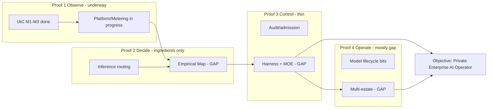

# RackAI Roadmap

The **single canonical, living roadmap** for RackAI. It is built primarily on the **actual delivery roadmap** — the [[RackAI Roadmap (Delivery Plan)]] (`measured`; the staffed, Jira-tracked `reference/RackAI - Roadmap.xlsx`) — which this note **reorders and extends under the operator strategy**: it lifts the real delivery milestones out of their native CSP/M2 grouping and re-places them under the four operator proofs (the reordering), then adds the strategy-driven gaps and proposals the delivery plan does not yet contain (the extension). It further draws on two strategy narratives — the [[Rack AI OpenRouter Engineering Roadmap]] (`validated`, read-only) and the [[RackAI Enterprise AI Development Plan]] (`assumed`, raw projection). **This note is editable and is where planning actually lives;** all three sources remain intact — when a proposed change is accepted, it lands here first, and the sources are left unedited per the truth hierarchy. The delivery roadmap keeps its native numbering, Jira IDs, owners, and status so the corpus stays traceable to Jira.

> **Confidence.** `derived` — this roadmap synthesizes two existing planning spines under the [[Three Battlegrounds|Private Enterprise AI Operator]] identity. Individual items carry the confidence of their source (phase/program/gap). Nothing here upgrades a capability to shipped; the live shipped-vs-planned state is the [[Capability Gap Register]].

---

# Executive Summary

*Read this page in five minutes; the rest of the document is the evidence beneath it. Two lines below are drafted for ratification and marked **[proposed]** — they are not yet settled.*

**Where we're going.** RackAI becomes the **Private Enterprise AI Operator** — Rackspace operates production AI for enterprises that cannot hand their data, inference, and operational responsibility to a public AI service ([[Three Battlegrounds]]).

**What customers buy. [proposed — needs ratification]** Rackspace assumes responsibility for **operating a customer's enterprise AI estate** across models, accelerators, and execution environments — providing the infrastructure and control plane *plus* the managed operational layer to run those workloads reliably, securely, and economically. The customer keeps control of their data, models, and governance boundary; Rackspace assumes an increasing share of the operational burden. *(Drafted from the MOE, [[AI Operations Product]], and the commercial gates below; the exact packaging/SKU is a live commercial decision — see Decisions Required.)*

**Why Rackspace (right to win the first estates). [`derived`]**
1. **Operator heritage** — taking operational responsibility for infrastructure someone else built is Rackspace's core identity; this is its AI-era expression.
2. **Owned + heterogeneous fleet** — an operated GPU fleet (NVIDIA + AMD) behind a supply-abstraction interface, so we own the economics rather than reselling capacity.
3. **Private / sovereign posture** — built for the controlled, regulated environments where public inference is a non-starter for a material set of workloads.
4. **We absorb what customers don't want to build** — the operating layer (harness, governance, lifecycle, economics) between raw GPUs and enterprise outcomes.
*(Right to win the **first ten** estates; the flywheel below is why estate #100 is cheaper than #1. See [[Three Battlegrounds]] and [[Load-Bearing Bets]].)*

**How we get there.** Four progressive proofs, not a feature backlog: **Observe → Decide → Control → Operate.**

**Where we are today (one line):** the measurement/identity substrate is underway (auth/audit shipped, telemetry + metering in progress); the learning advantage (Empirical Map) and the identity proof (a real operated estate) are **not yet built**.

| Proof | Status | What it means | What happens next |
|-------|:------:|---------------|-------------------|
| **Observe** | 🟡 foundations underway | Understand what's happening and what it costs | Finish telemetry + benchmarks + metering; add the missing **cost model** |
| **Decide** | 🟡 components exist | Accumulated evidence improves decisions | Build the **Empirical Map**; prove one decision beats a static baseline |
| **Control** | 🔴 not proven | Safely assume responsibility inside an enterprise boundary | **MOE-0** (rehearsal) → **MOE-1** (paid, external) |
| **Operate** | ⚪ future | Repeat it profitably across heterogeneous estates | Learn from the MOEs *before* industrializing |

**Current focus:** complete **Observe** while beginning **MOE-0** preparation and the minimum Decide/Control dependencies.

**Our moat hypothesis.** The **Empirical Map** — RackAI's accumulated evidence about how models and workloads actually behave across hardware, configurations, and operating conditions. It turns experience from prior estates into better placement, routing, capacity, and operational decisions for future estates. The flywheel: *more estates → more evidence → better decisions → better utilization / cost / reliability → better economics → more estates.*

**Next major proof:** **MOE-0** (friendly operating rehearsal). **First commercial proof:** **MOE-1** (external customer delegates responsibility **and pays**).

**Decisions required from leadership** (the four executive decisions — full detail in the *Proposed Changes → Four Executive Decisions* section below):
- **D1 — Reorient around MOE-0 → MOE-1** (manage toward a dated operating proof, not a feature backlog). *Open: name MOE-0 + date; name the MOE-1 customer profile + window.*
- **D2 — Fund the substrate that improves us with scale** (economics + supply optionality + Empirical Map).
- **D3 — Establish the minimum enterprise control envelope for MOE-1.**
- **D4 — Narrow where we differentiate** (partner fine-tuning delivery; don't prematurely build Proof 4).
- **Also unresolved (this document does not yet answer):** what we **stop/deprioritize** to fund this, and the **resource/cost** shifts D1–D4 imply.

**What would change our minds** (kill criteria): **K1** — if customers won't *delegate operational control* (only buy private inference), we may be an infrastructure platform, not an operator. **K2** — if cross-estate evidence doesn't *transfer* to beat workload-local optimization, the Empirical Map isn't a moat. **K3** — if domain-aligned models don't beat frontier for our buyers, the wedge is wrong.

---

## How to Read This Roadmap

- **North star** is the operator identity, not leaderboard rank. We are building *the best operator of heterogeneous enterprise AI estates*; OpenRouter competitiveness is a **learning vehicle inside** the operator roadmap, not its critical path ([[Three Battlegrounds]]).
- **The roadmap is organized around four progressive proofs**, not around inherited technical phases: **Observe → Decide → Control → Operate.** Each proof has an exit condition phrased as a claim about *operating an estate*. The **delivery roadmap** ([[RackAI Roadmap (Delivery Plan)]]) supplies the real milestones that are **reordered under these proofs**; the two strategy spines — the [[Rack AI OpenRouter Engineering Roadmap]] (Phases 0–6) and the [[RackAI Enterprise AI Development Plan]] (Programs 1–5, P1–P9) — supply the strategy items that **extend** it. The proofs are the organizing logic.
- **Every item passes one test:** *does this make us materially better at operating a customer's AI estate?* ([[Three Battlegrounds]] strategic choice.)
- **The MVP is the [[Minimum Operable Estate]]**, not the full platform. We earn the word "Operator" by operating one estate, then ten, then automating what hurts.
- **Maturity principle:** every capability walks the ladder **human-operated → instrumented → assisted → automated** (see below). We do not automate before we operate.
- **Proofs are gates, not waterfall phases** (see the callout below the metrics). Later-proof work starts early where lead times or architecture require; we simply cannot *claim* a proof until its exit condition is met.
- **Change workflow:** propose in the "Proposed Changes" section → review → on acceptance, edit the proof/workstream tables and log a change packet in `08-change-control`.

## The Acid Test

> **Strategy:** Become the Private Enterprise AI Operator.
> **Roadmap:** Observe → Decide → Control → Operate.
> **Flywheel:** Every estate operated makes the next estate cheaper and better to operate.
> **Proof:** Start with one [[Minimum Operable Estate]] and progressively automate what we learn.

## North Star & Governing Metrics

The north star is **paired** to avoid Goodhart's law: workload count alone could be maximized by onboarding many trivial workloads into one friendly environment while proving nothing about enterprises delegating real responsibility. The strategy is to *operate estates*, not accumulate endpoints — so the count is anchored by estates and by economics.

| Role | Metric | Why |
|------|--------|-----|
| **Leading** | Production workloads under management | The count that turns identity into a number |
| **Strategic** | Production customer **estates** under management | Guards against "200 trivial workloads in one internal env" — estates prove delegation |
| **Scale** | **Workloads operated per operations FTE** | The signal this is software economics, not a labor business |
| **Economic** | Contribution margin per estate | Proves the operator business is attractive, not just functional |

Supporting families:

| Metric family | Metrics | Note |
|---------------|---------|------|
| **Economics** | Contribution margin / workload + / estate, cost / 1M tokens, GPU utilization, revenue / GPU-hour | Owned economics over abstracted supply |
| **Operational quality** | Availability, incident rate, MTTR, deployment time, model-launch time | The Engineering Roadmap efficiency KPIs live here |
| **Operator leverage** | Workloads per ops FTE, % of decisions automated/assisted | Bends the labor curve |
| **Flywheel** | % of workloads contributing transferable telemetry; **% of operating decisions informed by cross-workload empirical evidence** | The killer metric — this *is* the strategy; measures whether the moat is compounding across customers, not within one |
| **Control** | % of workload execution covered by policy / audit / governance controls | Measures whether we can operate inside an enterprise boundary |

**The dashboard we're building toward.** When the identity is real, it reads as numbers, not marketing — e.g. *42 customer estates · 317 production workloads · 8.4 workloads/Ops FTE · 71% of placement decisions Empirical-Map-informed · 43% lower inference cost vs. initial baseline · 99.95% availability · 47% contribution margin.* (Illustrative target, not current state.)

> **Confidence note.** These metrics are the *target* instrumentation; almost none are measurable today (no [[Benchmark Run]] or telemetry yet — [[Capability Gap Register]]). They are `assumed`/aspirational until Proof 1 lands the measurement primitives. The dashboard figures above are illustrative, not measured.

## Governing Principle — Human-Operated → Automated

Operating knowledge is *created by operating*, so every capability walks this ladder rather than starting automated. This both builds the [[Empirical Map]] and reduces speculative platform engineering.

| Capability | Human-operated | Instrumented | Assisted | Automated |
|-----------|----------------|--------------|----------|-----------|
| Placement | Human chooses model/hardware | Capture decision + result | Empirical Map recommends | Automated placement |
| Routing | Static routes | Instrument traffic | Rules + recommendation | Dynamic routing |
| Capacity | Manual assignment | Utilization visibility | Forecasting | Automated capacity mgmt |
| Governance | Manual policy approval | Encoded policy | Assisted review | Automated enforcement |

## The Four Proofs

Each proof is a horizon *and* a claim we can stand behind. Items trace to their source phase/program; the proof is what makes the item strategy-derived rather than inherited.

> **Proofs define progressive evidence, not sequential development phases.** Work on later proofs begins early where lead times or architectural dependencies require it — compliance, MOE design, identity/tenancy/isolation architecture, the operational-acceptance model, harness v1 design, and first design-partner selection all start during Proof 1. **We simply cannot *claim* a later proof until its exit condition is met.** Reading this as "finish Proof 1, then start Proof 2" would recreate the exact "operator-in-LATER" problem this structure was built to fix.

Each proof carries a **commercial gate** alongside its technical exit — because the strategy contains an economic claim (customers will pay Rackspace to assume operational responsibility) that no technical proof establishes on its own. Technical delegation and willingness to pay must be proven **together**.

| Proof | Commercial question it must also answer |
|-------|-----------------------------------------|
| 1 Observe | Can we quantify the economics? (cost model + pricing hypothesis) |
| 2 Decide | Can we quantify the customer improvement? ("this decision saved X / improved Y") |
| 3 Control | Will a customer delegate responsibility **and pay us**? (first paid MOE / design partner) |
| 4 Operate | Can we repeat it **profitably**? (multiple estates, repeatable SKU/boundary, positive contribution margin, workloads/FTE improving) |

### Proof 1 — Observe: *We understand what is happening and what it costs*

> **Technical exit:** For a production model, Rackspace can **accurately measure** its cost, performance, utilization, reliability, and operational history **on the infrastructure we operate.** Two boundaries: "operate" is *earned* by Proof 4 (Proof 1 is understanding, not yet operating on a customer's behalf), and *where/how a workload runs best* is comparative intelligence — that is Proof 2, not Proof 1.
> **Commercial gate:** we have a defensible cost model and a pricing hypothesis for operated workloads.

| Item | Traces to | Confidence |
|------|-----------|:----------:|
| Cost model (internal cost/GPU-hour) | Eng. 0.3; dev-plan Prog 5 | missing |
| Fleet telemetry instrumentation | Eng. 0.2 | missing |
| Initial benchmark harness | Eng. 0.4 | missing |
| Metering | Gap Register; dev-plan Prog 5.2 | planned |
| Basic reliability / observability | Eng. 2.2 / E | planned |
| GLM 5.3 Flash deployment + OpenRouter Path A (real workloads to exercise the system) | [[Phase 1 Execution Plan — GLM 5.3 Flash Proof Point]]; [[OpenRouter Integration Plan]] Phase 1 | derived / planned |
| **Supply abstraction — the *interface*, not multi-provider scheduling** (`SupplyTarget / AcceleratorPool / ExecutionLocation`; owned H100 = impl #1) | Strategy-derived architectural requirement ([[Load-Bearing Bets]]) | assumed |
| Compliance envelope kickoff (SOC 2 scoping) | dev-plan **P1** ("start first") | missing |

*Why supply abstraction is here, not later: the abstraction is cheap now and expensive later. Building the control plane against `SupplyTarget` from day one prevents baking owned-fleet assumptions into everything. We do not need multi-provider scheduling yet — only the interface.*

### Proof 2 — Decide: *Our accumulated knowledge improves decisions*

> **Technical exit (must beat a baseline):** Rackspace can demonstrate at least one placement, routing, model-selection, or configuration decision **informed by accumulated operating evidence** that materially improves an agreed workload KPI **versus a static/default baseline.** This prevents "we built an Empirical Map" from being mistaken for "the flywheel works."
> **Commercial gate:** we can quantify the customer improvement from that decision ("this saved X / improved Y").

| Item | Traces to | Confidence |
|------|-----------|:----------:|
| Empirical Map v1 + **transferable-vs-isolated telemetry model** | dev-plan 1.5; Eng. 3.11 + 6.6 | assumed |
| Placement intelligence (instrumented → assisted) | Eng. 1.5 → 5; ladder | planned |
| Smart-routing gateway (static → rules → recommendation) | Gap Register §4; Eng. 6.4 | planned |
| Performance engineering system | Eng. 3 | planned |
| Multi-model operation | Eng. 2.5 | planned |
| Fine-tuning **operations** (placement, cost-per-job, adapter lifecycle) | dev-plan 4.2; [[LoRA Adapter]] | measured (SFT) |
| Fine-tuning **experiment** — one instrumented domain-model proof point (central-bet test) | [[Three Battlegrounds]] central bet | measured (SFT) |

### Proof 3 — Control: *We can safely assume responsibility inside an enterprise boundary*

> **Technical exit:** Rackspace can take a real enterprise workload and operate it across an approved execution boundary while maintaining customer control, governance, and auditability. **This is the first actual proof of the company identity.**
> **Commercial gate:** a customer will delegate operational responsibility **and pay for it** — the first paid MOE / design partner.

**Two distinct milestones — do not conflate them:**

- **MOE-0 — Operator rehearsal (friendly/internal).** Build the operating model, runbooks, SLOs, incident process, telemetry, and operational-acceptance criteria on a friendly/internal estate. **Does not validate the market thesis** and must never be cited as "we've proven the operator model."
- **MOE-1 — Identity proof (external, regulated).** An external enterprise with a genuine private/control requirement that exercises the control boundary, customer delegation, *and* the commercial proposition. **MOE-1 is what actually satisfies Proof 3.** We have not proven the identity until a customer delegates responsibility and pays.

| Item | Traces to | Milestone | Confidence |
|------|-----------|-----------|:----------:|
| **[[Minimum Operable Estate]]** — the MVP operator target | Strategy-derived (this roadmap) | MOE-0 → MOE-1 | assumed |
| Governed execution harness **v1** (not the full runtime) | dev-plan Program 1 | MOE-0 | assumed |
| Identity / access | dev-plan 2.5; [[Agent Identity]] | MOE-0 | planned |
| Policy enforcement | dev-plan Program 2 | MOE-0 | assumed |
| Auditability | dev-plan P8/P9 | MOE-0 | planned |
| Customer isolation + private inference | [[Multi-Cluster Governance Brief (Partner)]] | MOE-1 | planned |
| Compliance controls (first attestation) | dev-plan P1 | MOE-1 | missing |
| Supply abstraction v1 (second impl: AMD or partner) | [[Load-Bearing Bets]] | MOE-1 | assumed |
| First **paid** private enterprise workload (delegation + willingness to pay) | Strategy-derived; [[AI Operations Product]] | MOE-1 | assumed |

### Proof 4 — Operate: *We can do it repeatably and profitably across heterogeneous estates*

> **Technical exit:** A customer can give Rackspace operational responsibility for a heterogeneous production AI estate.
> **Commercial gate:** we can repeat it **profitably** — multiple estates, a repeatable SKU / service boundary, positive contribution margin per estate, and workloads/FTE improving.

| Item | Traces to | Confidence |
|------|-----------|:----------:|
| Multi-cluster governance / global front door | [[Multi-Cluster Governance Brief (Partner)]] | assumed |
| Heterogeneous supply (owned/partner/customer/hyperscaler) | [[Load-Bearing Bets]] capacity bet | assumed |
| Day-zero model factory | Eng. 4 | planned |
| Dynamic fleet & capacity mgmt | Eng. 5 | planned |
| Closed-loop optimization (automate what hurts) | Eng. 6 | planned |
| Governed harness (full runtime) | dev-plan Program 1 | assumed |
| Govern & assure inside the perimeter | dev-plan Program 2 | assumed |
| Managed operations + FDE motion | AI Operations Product workstream | not modeled |
| Operational leverage (workloads/FTE up and to the right) | North-star metric family | assumed |

## Milestones — the execution spine

The proofs say *what we must be able to claim*; the milestones say *what the teams are actually building to get there.* **These are the real delivery milestones** from the [[RackAI Roadmap (Delivery Plan)|delivery roadmap]] (`reference/RackAI - Roadmap.xlsx`) — native numbering (IAC M1–M4, Platform M1–M4, etc.), Jira IDs, owners, status, and dates preserved so the corpus stays traceable to Jira. Each is placed under the **operator proof it serves**; that placement is the strategic lens applied *to* the delivery plan. Where a proof needs work the delivery plan does not yet contain, it appears as a **⚠ gap** and is carried to Proposed Changes — not invented as a milestone here.

> **Status/dates are the delivery roadmap's own** (`measured` — real Jira/schedule). Confidence in the last column reflects delivery status, not strategy aspiration. The strategy-side items with no delivery milestone yet are marked ⚠ and sink to the Proposed Changes queue.

### Proof 1 — Observe: *understand what is happening and what it costs*

The CSP Platform Layer is almost entirely Proof 1 — it is the measurement/identity substrate.

| Milestone | Deliverable | Jira | Owner | Status | Serves |
|-----------|-------------|------|-------|--------|--------|
| **IAC M1** | JWT + API-key validation, identity context, APIKey CRD, Gateway auth | RACKAI-204 | Ljungstrom | **Complete** | Identity substrate (all proofs) |
| **IAC M2** | PlatformRole/RoleBinding CRDs, Authorization Service, RBAC | RACKAI-333 | Ljungstrom | **Complete** | Tenancy/control |
| **IAC M3** | Audit Log query API, sensitive-access + login + APIKey-lifecycle events | RACKAI-351 | Ljungstrom | **Complete** | Auditability (→ Proof 3) |
| **Platform M1–M2** | Prometheus/DCGM/Grafana GPU dashboards; tenant-attributed service metrics | RACKAI-353/350 | Sharma | In Progress | Telemetry (flywheel input) |
| **Platform M3–M4** | Loki logs; VictoriaMetrics 13-mo retention; FineTuningJob metrics | RACKAI-431/432 | Sharma | In Progress | Telemetry retention |
| **Metering M1** | Project CRD + usage_records + MeteringEvent pipeline w/ inference + FT metering | RACKAI-352 | Rajak | In Progress | Cost/usage capture |
| **Observability M1** ⭐ | Metrics API (latency/rate/errors, quota util), Workload Status API | — | Audit/Obs | Not Started (crit-path) | The operator dashboard |
| **M2: AI Performance Benchmarks** | Internal benchmarking process | — | — | Not Started (Pri 5) | Ends "KPIs assumed" |
| ⚠ **Cost model** (internal cost/GPU-hour) | *not a delivery milestone yet* — Metering captures usage, but cost/GPU-hour modeling is absent | — | — | **gap → P-003** | Cost floor |
| ⚠ **Supply-abstraction interface** | *not in delivery plan* — control plane assumes owned fleet | — | — | **gap → P-004** | Prevents fleet lock-in |

**Proof 1 read:** measurement substrate is genuinely underway (auth/audit shipped; telemetry + metering in progress). The two strategy gaps are the **cost model** (usage is metered but cost/GPU-hour isn't modeled) and the **supply-abstraction interface**.

### Proof 2 — Decide: *accumulated knowledge improves decisions*

| Milestone | Deliverable | Jira | Owner | Status | Serves |
|-----------|-------------|------|-------|--------|--------|
| **M2: Inference routing** | llm-d, ingress→llm-d→model, shared KV cache | RACKAI-311 | Chatterjee | In Progress | Routing (→ smart routing) |
| **M2: Accelerator selection ph3** | node inventory + GPU consumption metrics | RACKAI-336 | Nguy | **Complete** | Placement inputs |
| **M2: AMD AIM engine / AMD+NVIDIA nodes** | multi-accelerator serving | RACKAI-347/263 | Chatterjee/Gosavi | In Progress / Not Started | Heterogeneous supply |
| **M2: Speculative decoding, Refrag** | inference perf optimizations | RACKAI-67/374 | Ferrer / — | In Progress | tok/s/GPU, TTFT |
| **M2: DPO fine tuning** | preference-tuning beyond SFT | RACKAI-252 | Shah | In Progress | Fine-tuning ops |
| **Uniphore: SFT/LoRA** | dataset mgmt, PEFT/LoRA adapters, deploy/undeploy | — | Rajendra/Neelava | In Progress | Fine-tuning ops (shipped-ish) |
| ⚠ **Empirical Map v1** + transferable/isolated split | *not in delivery plan* — telemetry exists, but no cross-workload knowledge store | — | — | **gap → P-005** | **The moat** |
| ⚠ **Evidence-informed routing** (routing reads the map) | delivery routing is llm-d/KV-cache, not empirically-driven | — | — | **gap → P-005** | Flywheel |

**Proof 2 read:** the *ingredients* of good operating decisions are being built (routing, accelerator selection, perf optimizations, fine-tuning), but the **Empirical Map** — the thing that makes decisions *evidence-informed across workloads*, i.e. the moat — is not on the delivery plan. This is the single most important strategy gap.

### Proof 3 — Control: *safely assume responsibility inside an enterprise boundary*

| Milestone | Deliverable | Jira | Owner | Status | Serves |
|-----------|-------------|------|-------|--------|--------|
| **IAC M3** (audit) + **Auditing M1–M3** | Audit Service, admission webhook, compliance validation, billing audit | — | Audit/Obs | M3 done; Auditing Not Started | Auditability |
| **Metering M4** | Quota Enforcement, pre-execution admission control (429/402) | — | — | Not Started | Guardrails |
| **Uniphore: single-cluster tenancy** | namespace-per-org isolation (shipped foundation) | — | — | In Progress | Isolation |
| ⚠ **IAC M4** (org-level RBAC + metering/billing/quota perms) | **Won't Do** — dropped from delivery | — | — | **gap → P-006** | Org-level access control |
| ⚠ **Governed execution harness v1** | *not in delivery plan* | — | — | **gap → P-006** | The operating layer |
| ⚠ **First compliance attestation** (SOC 2) | *not a delivery milestone* — "compliance validation" is an Auditing sub-task, no attestation milestone | — | — | **gap → P-006** | The gate for regulated buyers |
| ⚠ **MOE-0 / MOE-1** (operator rehearsal → paid identity proof) | *not modeled in delivery* | — | — | **gap → P-002** | First proof of the identity |

**Proof 3 read:** the delivery plan builds real control-plane pieces (audit, admission control, isolation) but **stops short of the identity proof** — there is no harness, no compliance attestation milestone, no MOE, and org-level RBAC was explicitly dropped (IAC M4 "Won't Do"). This is where the strategy is furthest ahead of delivery.

### Proof 4 — Operate: *do it repeatably and profitably across heterogeneous estates*

| Milestone | Deliverable | Jira | Owner | Status | Serves |
|-----------|-------------|------|-------|--------|--------|
| **M2: Request new model support** | on-demand model onboarding | RACKAI-354 | Bedre | In Progress | Toward model velocity |
| **M2: Sunsetting a model** | model lifecycle retirement | RACKAI-372 | — | Not Started | Lifecycle |
| **M2: Multi region support** | *backlogged (Pri 6, unscheduled)* | — | — | Not Started | Multi-cluster estates |
| **M2: GPU node access support** | *backlogged (Pri 6, unscheduled)* | — | — | Not Started | Heterogeneous supply |
| ⚠ **Day-zero model factory, closed-loop optimization** | Engineering-roadmap Phases 4/6 — *not in delivery plan* | — | — | **gap → P-007** | Industrialization |
| ⚠ **Managed-ops / FDE motion, multi-estate onboarding** | *not modeled* | — | — | **gap → P-007** | The operator business |

**Proof 4 read:** almost entirely gap. The delivery plan has model-lifecycle fragments; multi-region and GPU-node access — prerequisites for heterogeneous multi-estate operation — are explicitly **backlogged at Pri 6**. Proof 4 is a future the delivery plan does not yet fund.

## Milestone → Proof → Objective (the line of sight)

The delivery plan front-loads Proof 1 (measurement substrate), is mid-build on Proof 2 ingredients, thin on Proof 3, and largely absent on Proof 4 — with the moat (Empirical Map) and the identity proof (MOE) as the biggest gaps.

- **Proof 1:** genuinely progressing — the substrate the identity rests on is being built.
- **Proof 2:** ingredients in flight, but the **Empirical Map (the moat) is missing** — the flywheel cannot compound without it.
- **Proof 3:** control-plane pieces exist, but the **identity proof (harness + attestation + MOE) is absent**, and org-level RBAC was dropped.
- **Proof 4:** the operator business is not yet funded; multi-region/GPU-node access are Pri-6 backlog.

## Material Progress — baseline → target

Each metric has a **baseline (today)** and the **delivery milestone** that first moves it, or a **gap** if no delivery milestone does. This is what turns "material progress" from assertion into a checkable claim.

| Metric | Baseline (today) | First moved by | Status |
|--------|------------------|----------------|--------|
| Identity/auth/RBAC in place | shipped | IAC M1–M2 | **Complete** |
| Auditability | shipped (query API) | IAC M3 | **Complete**; Auditing M1–M3 pending |
| GPU/tenant telemetry | partial | Platform M1–M2 | In Progress |
| Usage/metering captured | partial | Metering M1 | In Progress |
| Benchmarked perf (TTFT, tok/s/GPU) | none | M2 AI Performance Benchmarks | Not Started |
| Cost/GPU-hour known | none | — | **GAP → P-003** |
| % decisions empirically informed | 0% | — (needs Empirical Map) | **GAP → P-005** |
| Compliance attestation | none | — | **GAP → P-006** |
| Estates under management | 0 | — (needs MOE) | **GAP → P-002** |
| Contribution margin / estate | n/a | — | **GAP** (Proof 4) |

The pattern is clear: **delivery is strong on the measurement substrate (Proof 1) and weakest exactly where the operator identity lives (the moat in Proof 2, the identity proof in Proof 3).** That is the agenda for the Proposed Changes below.

## Workstream View

Cross-cutting owners run *vertically through all four proofs*. Mapped from the Engineering Roadmap's workstreams A–F plus the dev-plan programs — with **AI Operations Product** elevated to first-class, because if the identity is Operator, the operating model is part of the product, not an afterthought.

| Workstream | Owns | Source |
|-----------|------|--------|
| **[[AI Operations Product]]** | Operating model, service boundaries, SLOs, incident model, customer handoffs, FDE escalation, runbooks, lifecycle responsibility, change management, estate onboarding + operational acceptance criteria | **New — elevated from dev-plan P5/P6 + Product Operations JD** |
| Platform / Control Plane | Deployment orchestration, registry, capacity, routing, API, lifecycle, **supply-abstraction interface** | Eng. A |
| Inference Performance Eng | Runtime, kernels, quantization, caching, parallelism, topology | Eng. B |
| Model Enablement | Radar, intake, compatibility, functional testing, launches | Eng. C |
| GPU / Infra Eng | Clusters, networking, storage, topology, firmware, health | Eng. D |
| SRE / Reliability | Availability, observability, incident response, canary, rollback | Eng. E |
| FinOps / Economics | Cost/token, GPU-hour economics, revenue/GPU-hour, contribution margin | Eng. F; dev-plan Prog 5 |
| Harness & Orchestration | Execution harness, routing, context/tool controls, memory, runtime | dev-plan Program 1 |
| Governance & Assurance | Verification, perimeter info-flow, agent identity, **compliance envelope (P1)** | dev-plan Program 2 + P1 |
| Measurement & Self-Improvement | Empirical Map, eval-as-CI, loop planning, self-improvement | dev-plan Program 3 |

Vertically through all four proofs: **AI Operations Product + Compliance + Economics + Telemetry.**

## Open Roadmap Gaps

Seams where the strategy is still ahead of the plan, tracked for the "Proposed Changes" pipeline. Several earlier gaps are now placed by the four-proofs restructure (harness → Proof 3; supply-abstraction interface → Proof 1; transferable-vs-isolated telemetry → Proof 2; compliance → all proofs; operator KPIs → North Star; managed-ops/FDE → AI Operations Product workstream). Remaining open items:

1. **Minimum Operable Estate spec** — needs its own canonical note defining the smallest environment where "we operate your AI" is legitimately true (candidate: 1 customer, 1 private env, 2 models, 1 harness, 1 supply source, basic routing, metering, observability, identity/policy, audit, model lifecycle, human-operated placement).
2. **Operator KPI instrumentation** — the North-Star families are defined but unmeasured; Proof 1 must land them.
3. ~~**AI Operations Product** — elevated here, but has no canonical workstream/owner note yet.~~ **Closed** — canonical note created: [[AI Operations Product]] (staffing/ownership still open).
4. **Supply-abstraction interface spec** (`SupplyTarget / AcceleratorPool / ExecutionLocation`) — an architectural requirement without a design note.

## Proposed Changes → Four Executive Decisions

The strategy-driven changes to the delivery plan are **not seven equivalent backlog edits** — seven proposals invite seven separate debates; **four decisions force a debate about the strategy.** The ask to leadership is to approve four decisions, name MOE-0, establish the MOE-1 customer profile, put dates against them, and have Engineering come back with the roadmap changes needed to hit those proofs. This turns the framework into a **resource-allocation mechanism**, not a feature list.

| # | Executive decision | What you're actually approving | Implements |
|---|--------------------|-------------------------------|-----------|
| **D1** | **Reorient delivery around MOE-0 → MOE-1** | Manage RackAI toward a **dated friendly operating rehearsal (MOE-0)** then a **paying external identity proof (MOE-1)** — *not* toward completion of a feature backlog | P-002 |
| **D2** | **Build the substrate that lets RackAI improve economically and operationally with scale** | Not "approve three engineering projects" — approve the substrate behind the flywheel, with three manifestations: **economics** (cost model — know our economics), **supply optionality** (supply-abstraction interface — preserve optionality over supply), and **accumulated operating intelligence** (Empirical Map — compound operating knowledge; **load-bearing**, not just a workstream) | P-003, P-004, P-005 |
| **D3** | **Establish the enterprise control envelope for MOE-1** | The **minimum** identity/authorization, governed execution, audit, isolation, and **independently-verifiable compliance evidence** required by the MOE-1 customer — outcome, not a specific implementation | P-006 |
| **D4** | **Narrow where we differentiate** | RackAI will **not** become a differentiated fine-tuning product (partner delivery; retain operations + enough first-party capability to learn); and **do not prematurely build Proof 4** — identify prerequisites, let MOE evidence drive what gets automated | P-001, P-007 |

**The single most important change (D1):** *manage toward a dated MOE-0 and MOE-1, not toward a feature backlog.*

**The flywheel D2 is betting on:** *more estates → more evidence → better decisions → better utilization / cost / reliability → better economics → ability to operate more estates.* D2 funds the substrate (economics + supply optionality + operating intelligence) that makes this loop real rather than rhetorical.

> **Below are the implementation proposals (P-001–P-007) that sit under these decisions.** They are the engineering detail; the executive surface is D1–D4. All are **Proposed, not adopted**; owners/dates stay with the delivery teams. Two were re-scoped per CEO review (2026-09-21): **P-006** is now an *outcome* (control envelope), not "reinstate IAC M4"; **P-001** is *vendor-independent* (Uniphore is a separable choice).

| # | Proposal | Decision | Class | Status |
|---|----------|:--------:|-------|--------|
| **P-002** | Commit to a first [[Minimum Operable Estate]]; name MOE-0 + MOE-1 customer | D1 | **Center of the proposal** | Proposed |
| **P-005** | Empirical Map v1 + evidence-driven routing (the moat) | D2 | **Center of the proposal** (load-bearing) | Proposed |
| **P-003** | Cost-model deliverable (internal cost/GPU-hour) on the Metering pipeline | D2 | Do-now (cheap now, expensive later) | Proposed |
| **P-004** | Supply-abstraction interface before the control plane hardens | D2 | Do-now (cheap now, expensive later) | Proposed |
| **P-006** | Minimum enterprise **control envelope** required for MOE-1 (outcome-framed) | D3 | Re-scoped from "control bundle" | Proposed |
| **P-001** | Narrow fine-tuning: partner delivery, retain operations + learning | D4 | Directional; vendor-independent | Proposed |
| **P-007** | Proof-4 prerequisites as a **dependency declaration** (do not build yet) | D4 | Watch item, not a build ask | Proposed |

## Kill / Falsification Criteria (what would change the thesis)

The proof exits above are **success** criteria. A testable strategy also states what evidence would make us *change the thesis* — otherwise this is an identity we have decided must be true, not a strategy. These are deliberately uncomfortable; that is why they are useful. Leadership should be willing to own them.

| # | Thesis under test | Tested by | Kill / weaken criterion |
|---|-------------------|-----------|-------------------------|
| **K1** | **Customers will delegate operational control** (not just buy private inference) | **MOE-1** | If, by MOE-1, customers value private inference but **will not delegate operational responsibility or pay Rackspace to assume it**, the "Private Enterprise AI Operator" thesis is weakened — reconsider whether RackAI is primarily an **infrastructure platform** rather than an operator. |
| **K2** | **The Empirical Map is a real moat** (cross-workload learning **transfers**) | Empirical Map v1 (P-005) on 2–3 estates | Cross-customer learning is **not automatically valuable just because we collect telemetry.** The thing to prove: something learned from workload/customer A is **transferable enough to improve B while respecting isolation boundaries.** If most useful optimization turns out to be highly **workload-specific**, the flywheel is far weaker than the strategy assumes — the Empirical Map is not a meaningful differentiator and should **not** receive disproportionate investment. Test early. |
| **K3** | **Domain-aligned models beat frontier for our buyers** (the central bet) | Fine-tuning experiment (P-001) | Carried from [[Three Battlegrounds]]: if smaller domain-aligned models fail to reach acceptable quality/cost vs. frontier for the workloads we target, the wedge is wrong. |

K1 and K2 are the two that would most change resource allocation: K1 decides whether we are an operator at all, and K2 decides whether the moat deserves the disproportionate investment D2 asks for. Both are cross-linked to the identity-level scoreboard in [[Three Battlegrounds]].

### P-001 — Fine-tuning: partner the delivery, keep the operations, protect the experiment

**Proposed by:** CEO/product discussion, 2026-09-21. **Status: Proposed — not adopted.**

**The decision (D4, vendor-independent).** *RackAI will not invest in becoming a differentiated fine-tuning product. We will retain the capabilities needed to **operate** fine-tuning workloads and keep enough first-party capability to **learn** from them.* This maps onto the strategic boundary between what customers build and what Rackspace operates. Whether Uniphore is the delivery partner is a **separate, downstream commercial decision** — do not let it stall the strategy decision.

**Problem.** "Should we push fine-tuning milestones to a partner and focus early effort on operator-KPI work?" The corpus shows the org already *intends* this — [[RackAI Organizational Design]]: "Fine-Tuning — No REQs required currently — will partner with Uniphore," and the Inference pod's fine-tuning line is `[0/1]` staffed. But "fine-tuning" is three things across the [[Three Battlegrounds|harness boundary]], so a blanket defer is wrong.

**The three-way split.**

| Bucket | Disposition | Rationale |
|--------|-------------|-----------|
| Fine-tuning *delivery* — customer-facing tuning service, data/context assembly, advanced methods (RL/DPO, still "Coming Soon" + unstaffed) | **Partner** (preferred partner: Uniphore, pending validation) | Business-logic-adjacent; "what customers build." Frees the `[2/8]` Inference pod. **Strategic decision is vendor-independent**; Uniphore is the implementation choice, not the strategy. |
| Fine-tuning *operations* — running tuning jobs efficiently: placement, utilization, cost-per-job, [[LoRA Adapter]] lifecycle on the fleet | **Keep — ours** | Squarely "what we operate"; feeds the [[Empirical Map]] as transferable operating knowledge. |
| Fine-tuning *as strategic experiment* — one domain-model proof point on customer/representative data | **Keep thin — do not zero** | This is the wedge and the **first test of the central strategic bet** ([[Three Battlegrounds]]). Deferring all fine-tuning would defer the proof the operator thesis is viable. |

**What front-loads instead (the operator-KPI enablers already in NOW/NEXT):** cost model (Eng. 0.3), telemetry (0.2), benchmark harness (0.4), metering, compliance-envelope kickoff (dev-plan P1). These move workloads-operated, cost-per-outcome, and compliance-coverage.

**Honest trade-off to weigh before adopting.** SFT is the one capability here that is **shipped and `measured`**; most operator-KPI enablers are `missing`/`planned`. So this proposal trades a working capability's roadmap weight for net-new build — the near-term plan gets *heavier*, not lighter. That can be right, but it should be a conscious choice.

**Dependency / open question (blocks adoption):** the corpus shows the *intent* to partner fine-tuning with Uniphore but not the **commercial/contractual scope** — whether Uniphore is signed to deliver customer fine-tuning as a service, or is only a production tenant (`uniphore.rackai.rax.io`) running its own apps. This determines whether P-001 is "defer to a committed partner" or "defer to a hoped-for partner." **Confirm before adopting.**

**Strategic decision (vendor-independent):** *partner fine-tuning delivery; retain fine-tuning operations and experimental capability.* The implementation decision — *preferred delivery partner: Uniphore, pending commercial/technical validation* — is separable, so the strategy does not depend on one vendor negotiation.

**On acceptance:** (1) move the operator-KPI enablers' priority up explicitly in Proof 1; (2) add "fine-tuning delivery" as a partner scope in [[Load-Bearing Bets]] (preferred: Uniphore, pending validation) with its own exit criterion; (3) keep one instrumented fine-tuning proof point in Proof 2 tied to the central-bet falsification test; (4) log a change packet.

### P-002 — Commit to a first Minimum Operable Estate

**Proposed by:** CEO/product discussion, 2026-09-21. **Status: Proposed — not adopted.**

**Problem.** Proof 3 (Control) is where "operator" stops being a claim and becomes a demonstrated fact, but the roadmap currently describes the [[Minimum Operable Estate]] only as a target shape. Without a *named first customer* and a *date*, Proof 3 stays abstract and the operator identity stays unproven. This proposal commits to one concrete MOE.

**What we'd commit to.** The v1 scope in [[Minimum Operable Estate]] (1 customer, 1 private environment, 2 models, 1 harness v1, 1 owned supply source behind the abstraction interface, basic routing, metering, observability, identity/policy, audit, human-operated placement) — operated to a defined SLO with a defined operational-acceptance gate ([[AI Operations Product]]).

**The first-customer choice (the key decision).** Two candidate paths, with a real trade-off:

| Path | Candidate | Pro | Con |
|------|-----------|-----|-----|
| **Internal / friendly** | An existing tenant estate (e.g. the Uniphore production tenant, `uniphore.rackai.rax.io`) | Lower contractual friction; faster to first operated estate; safe place to build runbooks | May not exercise the *regulated/sovereign* control boundary that is the actual identity test |
| **External / regulated** | A regulated design-partner customer | Tests the real compliance-envelope + control boundary; a genuine proof of the identity | Gated by the compliance envelope (Proof 1/3, `missing`), longer sales + attestation lead time |

**Recommendation to debate — two formally separate milestones:**

- **MOE-0 (Operator rehearsal):** internal/friendly estate; build the operating model and runbooks under the human→automated ladder. *Explicitly not the market/identity proof.*
- **MOE-1 (Identity proof):** external enterprise with a genuine private/control requirement, once the compliance envelope lands; exercises delegation **and willingness to pay.** MOE-1 is what satisfies Proof 3.

Keeping them separate prevents someone, six months out, from pointing at the friendly environment and declaring the operator model proven. We have not proven the identity until a customer delegates responsibility and pays.

**Dependencies / open questions (block adoption):**
- Ratify the MOE v1 scope and the operational-acceptance criteria ([[Minimum Operable Estate]], [[AI Operations Product]]).
- The internal-vs-external first-customer decision above.
- Minimum compliance attestation for a *real* (external, regulated) MOE — depends on the Proof 1 compliance-envelope kickoff.
- Interacts with **P-001**: the MOE's fine-tuning (if any) follows P-001's partner/ops/experiment split.

**On acceptance:** (1) name **MOE-0** (friendly estate + target date) and the **MOE-1** design-partner profile + target window as two dated Proof-3 deliverables; (2) task [[AI Operations Product]] with the operating model + operational-acceptance gate; (3) bind MOE-1 to the compliance-envelope milestone; (4) attach the commercial gate (delegation + willingness to pay) to MOE-1; (5) log a change packet.

**The four executive asks this proposal is meant to force** (the move from *executable strategy* — none are answered yet, all are open questions):

1. **MOE-0:** named friendly estate + target date.
2. **MOE-1:** named external design-partner profile/customer + target window.
3. **Proof gates:** measurable pass/fail criteria for Observe, Decide, Control, Operate.
4. **Commercial gates:** the evidence that customers will delegate this responsibility at economics that produce an attractive managed-service business.

> **P-003 through P-007 are the strategy-driven changes to the *delivery* roadmap** surfaced by reading the real plan through the operator lens (the ⚠ gaps above). Each names the delivery reality it changes, so it is a concrete edit to the plan — not an abstract wish. All are **Proposed, not adopted**; owners/dates stay with the delivery teams.

### P-003 — Add a cost-model deliverable (ride the Metering pipeline)

**Delivery reality.** Metering M1 (RACKAI-352) builds usage capture (`usage_records`, MeteringEvent, inference + FT metering). **Nowhere in the delivery roadmap is internal cost/GPU-hour modeled** — usage ≠ cost.

**Why it matters (operator lens).** The cost floor is the economics the whole operator identity rests on (Proof 1 commercial gate; [[Three Battlegrounds]] "own the economics"). Without it, every margin/pricing number stays `assumed` and [[Cost per GPU-Hour]] / [[Cost per Outcome]] cannot be computed.

**Proposed change.** Add a small cost-model deliverable *downstream of Metering M1* — attribute the metered usage against fleet cost inputs (power, depreciation/lease, networking, overhead) to produce cost/GPU-hour and cost/1M-tokens. Cheap relative to the metering pipeline it rides on.

**Blocks adoption:** owner (FinOps vs Metering team); dependency on the fleet cost inputs (some are finance data, not engineering).

### P-004 — Add the supply-abstraction interface before the control plane hardens

**Delivery reality.** M2 has "AMD+NVIDIA node support" (RACKAI-263) and "AMD AIM engine" (RACKAI-347) as *features*, and multi-region as Pri-6 backlog — i.e. supply diversity is treated as per-hardware bolt-ons on an **owned-fleet-assuming control plane**.

**Why it matters (operator lens).** "Abstract supply, own economics" ([[Three Battlegrounds]]) requires the control plane to address `SupplyTarget / AcceleratorPool / ExecutionLocation` rather than a specific fleet. The abstraction is cheap to introduce now and expensive to retrofit after IAC/Metering/routing all hardcode owned-fleet assumptions.

**Proposed change.** Introduce the supply-abstraction interface as an architectural requirement in the Platform/Control-Plane workstream; owned H100 is implementation #1, AMD (already in flight) becomes #2 behind the same interface.

**Blocks adoption:** architectural review with Team Platform/IAC; confirm it doesn't slow the in-flight AMD work.

### P-005 — Empirical Map v1 + evidence-driven routing (the moat)

**Delivery reality.** Inference routing (RACKAI-311) is llm-d + ingress→model + shared KV cache. Telemetry (Platform M1–M2) produces dashboards. **Nothing turns operating data into cross-workload operating decisions** — there is no Empirical Map on the delivery plan.

**Why it matters (operator lens).** This is the single highest-leverage gap. The [[Empirical Map]] flywheel is *the moat* — the reason customer #100 is cheaper than #1 (Proof 2). Routing that reads measured cost/reliability from the map is what makes decisions evidence-informed rather than static. Without it, RackAI is a good serving stack, not an operator that compounds.

**Proposed change.** Add Empirical Map v1 as a first-class delivery workstream (Measurement & Self-Improvement): capture per-workload×model×hardware reliability + cost from the telemetry/metering already being built, with the **transferable-vs-isolated split** designed in from day one; then feed it into routing (extend RACKAI-311's successor to read the map).

**Blocks adoption:** owner (no delivery team owns "measurement/self-improvement" today); depends on Metering M1 + Platform M1–M2 landing first.

### P-006 — Define and fund the minimum enterprise control envelope for MOE-1

*(Re-scoped per CEO review 2026-09-21: framed as an **outcome**, not a fixed engineering bundle. We do not care whether the old IAC M4 is resurrected; we care that MOE-1 has sufficient control boundaries. And we do not hardcode SOC 2 Type I — the required attestation is set by the target customer segment.)*

**Delivery reality.** The delivery plan builds real control-plane pieces (audit, admission control, isolation) but stops short of the identity proof: **(a)** no governed execution harness; **(b)** "compliance validation" is a sub-task of Auditing M3, not a compliance-*evidence* milestone; **(c)** org-level RBAC + metering/billing/quota permissions were **explicitly dropped** (IAC M4 = "Won't Do").

**Why it matters (operator lens).** Proof 3 (Control) is the first proof of the identity. A regulated buyer needs an operating layer to govern (harness), sufficient organizational identity/authorization/quota/policy boundaries, audit, isolation, and the compliance evidence their segment requires.

**Proposed change — the outcome, not the implementation.** Define and fund the **minimum enterprise control envelope required for MOE-1**:
- **Identity / authorization / quota / policy boundaries** sufficient for the MOE operating model. *Whether that means resurrecting IAC M4 or a different deliverable is an architecture decision* — the roadmap sets the outcome, architecture picks the implementation.
- **Governed execution** — a harness v1 sufficient to operate the MOE workload (currently only in the dev-plan strategy source).
- **Audit + isolation** — extend the shipped audit-log API (IAC M3) to the MOE workload.
- **Minimum independently-verifiable compliance evidence required by MOE-1** — *not* a pre-decided SOC 2 Type I. Establish the evidence bar from the **first design-partner profile**, then identify the actual attestation that segment requires. Avoids building compliance because the roadmap says so rather than because the market boundary requires it.

**Blocks adoption:** the MOE-1 customer segment must be named first (its regulatory requirements set the compliance bar — ties to P-002); IAC M4 was dropped for a reason (get it before deciding whether to reinstate); harness and attestation each need a home team and (for attestation) external lead time.

### P-007 — Fund the Proof-4 operator business (sequencing, not "start now")

**Delivery reality.** Multi-region (Pri-6) and GPU-node access (Pri-6) are **backlogged/unscheduled**; there is no day-zero factory, closed-loop optimization, or managed-ops/FDE motion on the plan. Model-lifecycle exists only as fragments (request-new-model, sunsetting).

**Why it matters (operator lens).** Proof 4 (operate a heterogeneous estate, repeatably and profitably) is the actual operator *business*. Multi-region + heterogeneous supply are its prerequisites, and they currently sit at the bottom of the backlog.

**Proposed change.** This is a **sequencing dependency, not a request to start now**: flag that the Proof-4 prerequisites (multi-region, GPU-node access) must leave Pri-6 *before* an external multi-region MOE-1 is viable, and that managed-ops/FDE ([[AI Operations Product]]) needs a delivery home before estates multiply. Adopt as a **watch item** that gates P-002's MOE-1 timing.

**Blocks adoption:** premature to schedule until Proofs 1–3 land; the value now is making the dependency explicit so MOE-1 isn't promised ahead of its prerequisites.

## See Also

- [[Three Battlegrounds]] — the identity this roadmap serves
- [[Minimum Operable Estate]] — the MVP that anchors Proof 3
- [[Load-Bearing Bets]] — the partner portfolio behind it
- [[RackAI Roadmap (Delivery Plan)]] — **primary source**: the actual delivery roadmap this note reorders + extends
- [[Rack AI OpenRouter Engineering Roadmap]] — strategy spine (inference operating system)
- [[RackAI Enterprise AI Development Plan]] — strategy spine (operator stack)
- [[OpenRouter Integration Plan]] — the gated GTM sequence
- [[Capability Gap Register]] — live shipped-vs-planned state
- [[Product Hub]] · [[Rack AI Knowledge Base]]
