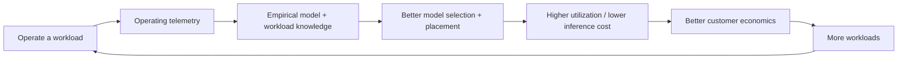
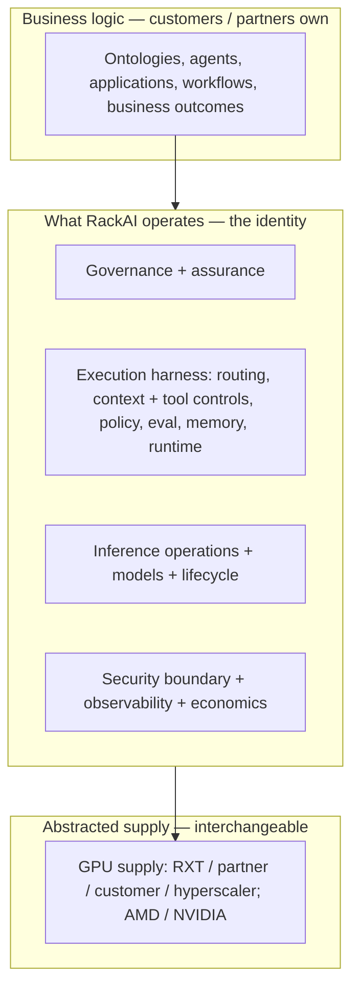

# Private Enterprise AI Operator

The company-identity and theory-of-advantage note for [[RackAI Platform|RackAI]]. It answers three questions in order: **what company are we becoming, who are we choosing to fight, and why should we believe we can win?** The three-battleground market map (below) is retained as an internal lens, but it is not the identity — it is one input to it.

> **Confidence.** The identity thesis is `derived` — reasoned from the corpus and a CEO strategy review (2026-09-21), not yet validated in market. The load-bearing bets and the 27B domain-model bet are `assumed` with explicit exit criteria. Competitor facts are labeled per-note in the linked teardowns. Nothing here upgrades a platform capability from `assumed` to shipped — see the [[Capability Gap Register]] for what exists today.

## Identity

> **RackAI is the Private Enterprise AI Operator.** Rackspace operates production AI for enterprises that cannot hand their data, inference, and operational responsibility to a public AI service.

This is the AI-era expression of Rackspace's historical reason for existing: **take complicated infrastructure someone else created and assume operational responsibility for making it work.** Not merely hosting AI. Not merely selling GPUs. Not merely serving tokens. And explicitly *not* replacing the enterprise-AI software ecosystem above us.

### The strategic choice

> **Rackspace will not try to win the AI market by owning the best model, the largest GPU fleet, or the most popular developer API. We intend to win by becoming the best operator of heterogeneous enterprise AI estates.**

This sentence is the test every future product investment must pass: **does this make us materially better at operating a customer's AI estate?** If yes, it is probably core. If it primarily makes us a better GPU cloud, foundation-model company, SaaS application company, or generic inference API, it is probably outside the identity. It explains why CoreWeave is not the destination, why [[OpenRouter Initiative|OpenRouter]] is a gym, why Palantir can be a partner, why AMD + NVIDIA both make sense, why private cloud matters, why inference optimization matters, and why managed services are an asset rather than legacy baggage.

### What "private" means

**Private** here is an **architectural philosophy, not a hosting topology.**

> Private AI means the enterprise retains control over **where its data, models, inference, and operational context execute.** It does not necessarily mean every component is physically dedicated.

So a "private" estate RackAI operates may span RXT-owned GPUs, dedicated customer infrastructure, partner GPU capacity, hyperscaler capacity, private endpoints to commercial models, and open-weight models — provided the customer keeps control of the data boundary and where execution happens. Defining private as *control* rather than *dedicated hardware* keeps the TAM wide and the architecture honest.

### Customer promise

> Run production AI on your data without surrendering control of your data, models, inference, or operating environment.

Sovereignty, private inference, governance, harnesses, GPUs, and managed operations are **how we deliver that promise** — not competing definitions of the company.

## What We Own, Commoditize, and Refuse

A strategy says no. This is the load-bearing part of the identity.

| Stance | Layer | Position |
|--------|-------|----------|
| **We own** | AI-native infrastructure + inference **operations** + the **execution harness** | Fleet economics, inference, routing, fine-tuning, model lifecycle, orchestration, observability, security boundary, reliability, and the harness runtime (see boundary below) — "the ugly middle between GPUs and enterprise AI outcomes." |
| **We abstract** | GPU **supply** | Supply is interchangeable — RXT-owned, partner, customer-owned, hyperscaler, AMD or NVIDIA. We do **not** commoditize the *economics*: the intelligence deciding **how to consume supply** (placement + cost) belongs to us and feeds the [[Empirical Map]]. We do not need to become [[GPU Neocloud Competitors\|CoreWeave]]. |
| **We partner for** | Data/context, application, consumption, governance-acceleration | The "what customers build" and "how context is assembled" tiers — [[Load-Bearing Bets]] (Palantir, Uniphore, and proposed new bets). |
| **We refuse to compete on** | Frontier GPU cloud; public-inference API share; proprietary foundation models; replacing Palantir/Foundry-class application platforms | Each of these is a different company than the operator. |

### The harness boundary — the sharpest line we draw

The hinge of the whole identity is the split between the **execution harness** (ours) and the **business logic** (the customer's / partner's). Blur it and the collision with Palantir and every application platform becomes inevitable — a CEO can fairly ask "why wouldn't AIP just do your harness?"

> **Rackspace owns the execution harness. Customers and partners own the business logic — the thing the agent is trying to accomplish.**

| RackAI owns (execution harness) | Customer / partner owns (business logic) |
|---|---|
| Model routing + placement, context controls, tool-execution controls, policy enforcement, evaluation, memory infrastructure, observability, the runtime | Ontologies, the agent's goal, applications, workflows, business outcomes |

The harness is horizontal infrastructure that is the same shape across customers; the business logic is what differs. Owning the harness is defensible precisely because it is *not* the customer's differentiated logic — it is the operating machinery every workload needs regardless of what it is trying to do.

## What Compounds — The Theory of Advantage

The moat is **not** the [[Empirical Map]] as a static asset. The moat is a flywheel:

> **Every workload we operate makes us better at operating the next one.**

The [[Empirical Map]] is the *store* of that compounding knowledge; the flywheel is the *mechanism*. Certifications are a gate, not the moat — they get us into deals but do not compound. This is the CEO-level test the strategy must satisfy: **why are we materially harder to compete with at customer #100 than customer #1?** The answer is the loop above, and it only turns inside the operating perimeter.

### What actually compounds across customers (and what does not)

Sovereignty must not break the flywheel, so the moat is built **only from non-customer-specific learning.** Customer A's data or proprietary workload content never improves Customer B. What compounds is the **generalized operating knowledge** produced as a by-product of running many estates:

> Fleet telemetry → model + hardware performance → workload *characteristics* (not content) → placement decisions → optimization techniques → failure patterns → operational runbooks → generalized benchmarks.

| Transferable (feeds the moat) | Customer-isolated (never leaves the perimeter) |
|---|---|
| Model/hardware performance curves, cost-per-token by config, placement heuristics, failure/regression patterns, runbooks, generalized benchmarks | Customer data, prompts/outputs, proprietary context, workload content, fine-tuned weights, ontologies |

This is the answer to "doesn't sovereignty prevent the data flywheel?" — no, because the moat is made of **how we operate**, not **what customers run**.

## The Operator Stack

## Who We Compete With — Organized by the Customer's Alternative

Competitors are not a single set. The executive question is: **when a customer has this problem and does not buy Rackspace, what do they do instead?** There are four genuinely different alternatives.

| Customer alternative | Examples | What they buy instead | Why Rackspace wins | Why we lose (fights to avoid) |
|---|---|---|---|---|
| **Build it themselves** | Hyperscaler + NVIDIA + open source | Maximum control; they own integration + operations | "You don't have to become an AI infrastructure/operator company." | Customer has sophisticated AI/platform engineering and *wants* to own it. |
| **Buy AI infrastructure** | [[GPU Neocloud Competitors\|CoreWeave, Lambda]], hyperscalers | Compute / capacity | We own the operational stack *above* the GPU. | Customer primarily needs cheap / high-performance GPUs and nothing above them. |
| **Buy an AI developer / inference platform** | [[Inference Serving Competitors\|Fireworks, Together, Baseten, Anyscale]], [[Erebine Competitive Analysis\|Erebine]] | Models, inference, developer experience | Private/controlled environment + managed operations + governance. | Developer velocity, model breadth, or raw token economics dominate the decision. |
| **Buy an enterprise-AI platform / outcome system** | [[Sovereign & Governed AI Competitors\|Palantir, Cohere, Mistral, Scale]] | Application/platform layer, increasingly outcomes | Infrastructure + inference operational ownership beneath their app layer. | The platform can absorb enough of the operating layer that a separate operator adds no value — some are **ecosystem partners** ([[Load-Bearing Bets]]), not rivals. |

The "why we lose" column is the more useful one for Sales: it names **which fights not to enter.** The organizing principle: **we do not try to beat CoreWeave at CoreWeave, Fireworks at Fireworks, or Palantir at Palantir.** We assemble capabilities from those layers into an operated whole the individual layers do not provide.

## The Three-Battleground Lens (internal)

Still useful for product investment, now subordinate to the identity:

- **(a) Capacity — abstracted supply, owned economics.** A real but topology-constrained fleet: [[Fleet Competitiveness|NVL-PCIe, ~27B-class ceiling]], ~16× [[NVIDIA H100|H100]] usable. Supply itself is interchangeable (owned / partner / customer / hyperscaler); what we keep is the **placement + cost intelligence** — a defensible [[Unit Economics Model|cost floor]] (the cost model is still *missing*, [[Capability Gap Register]] §1), supplemented by a **supply partner** for what our fabric cannot host.
- **(b) AI-native inference — a competency we must own, not our category.** We ship serving ([[Model Deployment]], [[Serving Runtime]], [[Fine-Tuning Job]] → [[LoRA Adapter]]), not the smart-routing gateway or [[Governed Harness]] runtime yet. We do not need "the world's best inference API"; we need "Rackspace can run my AI estate better than I can." [[OpenRouter Initiative|OpenRouter]] is the **gym and proving ground** for this competency, not the market we must dominate.
- **(c) Regulated / sovereign outcomes — dissolved into the identity.** No longer a single battleground but the *why* behind the operator promise: control, security, proprietary context, and accountability. Its machinery — [[Governed Harness]], [[Empirical Map]], compliance envelope, [[Multi-Cluster Governance Brief (Partner)|multi-cluster governance]] — is how the operator delivers, and most of it is still `assumed`/planned.

## The Central Strategic Bet (explicit and testable)

The 27B-topology argument is a **hypothesis, not established fact**:

> **Our bet:** for a meaningful class of enterprise workloads, domain alignment, private context, governance, and operational control create more customer value than access to the largest frontier model.

Stated this way it can be tested, rather than assumed away as "topology doesn't matter for our buyer."

## Falsification Test (12–18 months) — a scoreboard, not just conditions

The thesis should be measured, not merely asserted. Thresholds (`X`/`Y`) are placeholders to be set with the exec team; the point is that each condition becomes a **metric with a trip-wire**, so we know if we are being proven wrong. We reconsider the anchor if any of these cross its threshold:

| # | Falsification condition | Scoreboard metric (threshold TBD) | Confidence |
|---|---|---|:----------:|
| 1 | Frontier beats domain for our workloads | In `X` representative enterprise workloads, smaller domain-aligned models fail to reach acceptable quality/cost vs. frontier alternatives in more than `Y%` | assumed |
| 2 | No premium for control | Across `X` qualified opportunities, fewer than `Y%` show measurable willingness to pay for private inference / governance / operational control | assumed |
| 3 | **Operating layer captured** (highest risk) | Palantir (or equivalent) absorbs the operating layer in ≥ `Y%` of contested deals, such that a separate operator adds no value — see the Palantir boundary in [[Load-Bearing Bets]] | assumed |
| 4 | Uncompetitive economics | RackAI cannot reach a blended cost-per-1M-tokens within `Y%` of the best partnered/owned supply alternative | assumed |
| 5 | **Customers won't delegate control** (are we an operator at all?) | By **MOE-1**, customers value private inference but **will not delegate operational responsibility or pay** to have it operated → reconsider whether RackAI is an **infrastructure platform**, not an operator (roadmap K1) | assumed |
| 6 | **The moat doesn't compound** | Cross-workload evidence (the [[Empirical Map]]) **does not materially beat workload-local optimization** on cost/reliability/placement/performance → the Map is not a differentiator and should not get disproportionate investment (roadmap K2) | assumed |

You do not need the numbers today, but the strategy should eventually own a scoreboard rather than a list. The [[RackAI Roadmap]] carries these as **kill criteria K1–K3** tied to the concrete proofs (MOE-1 tests delegation; Empirical Map v1 tests the moat).

## CEO Questions the Team Must Answer Before Ratification

1. **ICP.** Sharpen "regulated/sovereign" to: *large enterprises with valuable proprietary data that want production AI but cannot use shared/public inference for a material subset of workloads.* Confirm or refine.
2. **The hire.** Finish: "We use Rackspace instead of ______ because ______" in one sentence.
3. **No-compete list.** Ratify the "we refuse to compete on" row above.
4. **Palantir boundary.** Ratify the architecture + commercial boundary in [[Load-Bearing Bets]].
5. **What compounds.** Confirm the flywheel is the moat, not certifications.
6. **Falsification.** Own the 12–18mo test above.

## Priority Moves

1. **Start the compliance envelope now** (SOC 2 → ISO 42001 / NIST AI RMF) — gates every deal, longest lead time; accelerate via a governance/assurance bet ([[Load-Bearing Bets]]).
2. **Establish the cost floor** — build the missing cost model; pair with a **capacity supply bet** so we can operate workloads our fleet cannot host.
3. **Make fine-tuning → domain-model-from-open-weights the wedge** and the first test of the central bet.
4. **Instrument the flywheel** — telemetry into the [[Empirical Map]] from day one; the moat only compounds if we capture operating data.
5. **Draw the Palantir boundary explicitly** before it becomes a collision.

## Honest Caveats

- **Most of the operator stack is `assumed`, not shipped** — harness, verification, Empirical Map, certifications are roadmap. The identity is directional; the moves above convert it to a defensible position.
- **The evidence base is young.** No [[Benchmark Run]] or production telemetry exists yet; performance and cost claims sit at `assumed`.
- **The identity thesis itself is `derived`, not validated** — the falsification test is what turns it from doctrine into strategy.

## See Also

- [[Load-Bearing Bets]]
- [[Rack AI Knowledge Base]]
- [[Product Hub]]
- [[Enterprise AI Portfolio]]
- [[Empirical Map]]
- [[Fleet Competitiveness]]
- [[Capability Gap Register]]
- [[Inference Serving Competitors]]
- [[GPU Neocloud Competitors]]
- [[Sovereign & Governed AI Competitors]]
- [[Erebine Competitive Analysis]]
