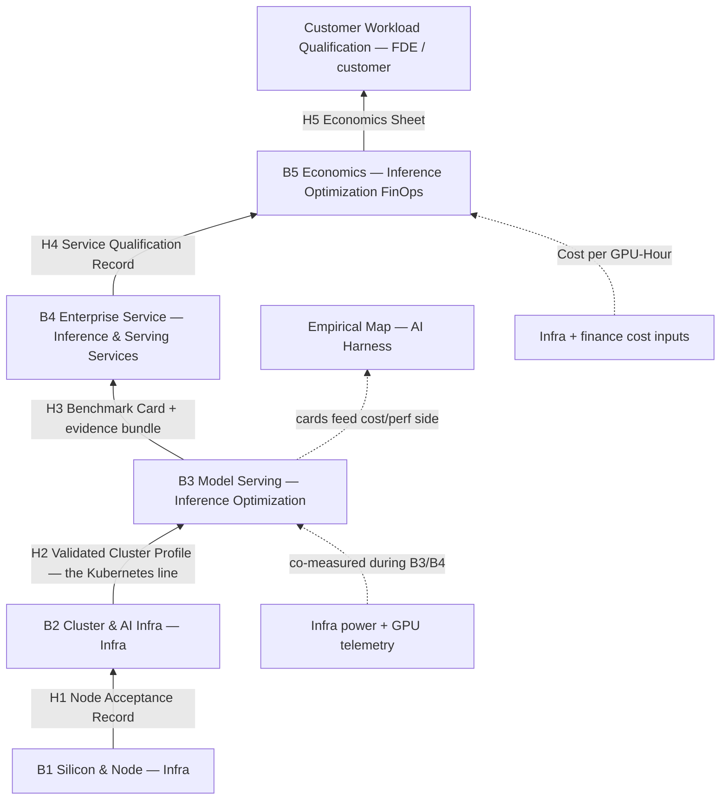
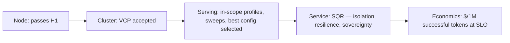

# Benchmark Evidence Chain

> **Status: proposed program standard — `assumed`.** This note defines *how* RackAI and Infra benchmark accelerator capacity, *which decisions* that evidence feeds, and *what each owner may claim*. It contains targets and postures only. No number in this note is a result; results live in [[Benchmark Run]] evidence bundles registered in the [[Benchmark Library]]. The first application is the [[AMD MI350P Qualification Plan]].

**Ownership of this note.** Steward: Inference Optimization (`owner: performance-eng`). Execution owners: per tier (table below). Approval authority: per handoff (acceptor column) and per decision gate.

## Purpose

Benchmarking exists to make decisions, not to fill a matrix. A new GPU fleet is taken seriously when every claim made about it — by Infra, by RackAI, by Sales — traces down an unbroken chain to reproducible evidence, and when that evidence has moved a real decision: accept the hardware, pick the serving configuration, approve a service profile, approve pricing.

This policy:

1. Names the **five benchmark tiers** (B1–B5) and maps them onto canonical structure.
2. Declares **where the dividing lines are**, **who owns each side**, and the **handoff artifact** that crosses each line.
3. Ties each tier to the **existing decision gate** it feeds.
4. States **claim rights** per tier.
5. Sets **reproducibility**, **scope**, and **change-impact** rules so the evidence is credible without being exhaustive.

It is hardware-agnostic: the same chain applies to [[AMD Instinct]], [[NVIDIA H100]], and future capacity. It serves both halves of the identity in [[Three Battlegrounds]]: the *operator* claim (predictable performance, reliability, isolation, cost) and the *private* claim (the workload runs inside a controlled boundary without giving up performance or accountability).

## Rule

1. **No claim without valid upstream evidence.** A claim at tier B*n* must cite a *currently valid* artifact from every tier below it. "Valid" is set by the change-impact rules below. It does **not** mean every tier is re-run for every change.
2. **Infra may not call capacity "AI benchmarked"** (or claim inference performance, user counts, or latency) from B1/B2 evidence alone.
3. **RackAI may not publish a performance claim** without the full Benchmark Card header, including the cluster-profile ID and serving-configuration ID it ran on.
4. **A card summarizes an evidence bundle; it is not the evidence.** Every card links to a retained, reproducible bundle (see Reproducibility). No bundle, no card.
5. **No throughput without latency.** Throughput is never reported without [[TTFT]] and [[TPOT]] at the same operating point (generalizes the [[AgentX Benchmark Standard|AgentX]] reading rule).
6. **Report the whole sweep you ran; never only the best point.** Results cover every standard checkpoint in scope (see Scope matrix). A peak figure may appear only beside the SLO-qualified operating point.
7. **Raw before qualified.** B3 reports raw latency percentiles and throughput. Goodput at B3 is *provisional* and must name the thresholds used. Qualified goodput and [[SLO Attainment]] exist only in a B4 record against ratified thresholds.
8. **Economics at the qualified point.** B5 economics use the B4 SLO-qualified operating point, never the B3 peak.
9. **Confidence propagation.** A tier's claim may not carry higher confidence than its weakest cited input (corpus standard #8). B5 cannot exceed the confidence of [[Cost per GPU-Hour]].
10. **Performance is not quality.** Serving benchmarks measure speed and cost, not correctness. Quantized runs cite [[FP8 Quality Neutral]] until a quality comparison exists for that model and format.
11. **Requests are not users.** Concurrency means concurrent in-flight requests. Any "users supported" figure must state its user model: arrival rate per user, think time, fraction simultaneously active, and token distributions.
12. **Reuse before re-running.** Existing results (vendor, engineering, earlier internal tests) are inventoried first. They may be registered at their tier if they meet the evidence-bundle requirements, or cited as `assumed` context if not. New runs fill gaps that affect the next decision; they don't duplicate work already done.

## Scope

Covers all performance and capacity claims about accelerator capacity RackAI serves on: new-fleet qualification, cross-vendor comparison, engine/accelerator selection (Milestone Release Map T4.S5), pricing inputs, and customer sizing.

Out of scope: model *quality* evaluation ([[Verification]], [[Eval as CI]]), and facility/datacenter acceptance below the node (Infra's own process).

## The Five Tiers — Mapped to Canonical Structure

The tiers are numbered **B1–B5** deliberately. This corpus already uses L1–L5 for knowledge-graph layers and the [[Eight-Layer Stack]] for architecture layers. Benchmark tiers are a third axis that maps onto both.

| Tier | Question it answers | Eight-Layer Stack | Serving chain position | Execution owner |
|------|---------------------|-------------------|------------------------|-----------------|
| **B1 — Silicon & Node** | Does each GPU/node perform to vendor spec, sustained? | Compute | [[GPU Node]] | Infra |
| **B2 — Cluster & AI Infrastructure** | Does the assembled cluster meet our infrastructure requirements, and how does it compare with an agreed vendor reference? | Compute + Infrastructure | [[GPU Cluster]], [[Topology]], exposed as [[Accelerator Class]] / [[Capacity Pool]] | Infra (accepted by [[Inference and Serving Services]]) |
| **B3 — Model Serving** | Which serving configuration is best for a model, and how does it perform per profile? | Inference + Model | [[Model]] → [[Model Deployment]] → [[Serving Runtime]] → [[Accelerator Class]] | [[Inference Optimization]] |
| **B4 — Enterprise Service** | Does it hold SLO under tenancy, interference, failure, time — inside a controlled boundary? | Inference + Operations & Governance planes | [[Capacity Pool]] + multiple deployments + [[Organization]] tenancy | [[Inference and Serving Services]] (+ [[AI Governance and Assurance]] for isolation and sovereignty) |
| **B5 — Economics** | What does a successful token cost at a qualified SLO, and at what utilization is it attractive? | Cost axis | Commercial objects ([[Model]], [[Organization]], [[Capacity Pool]]) | [[Inference Optimization]] (FinOps, Milestone Release Map Track 5) |

*Outer edge (not a RackAI tier):* **Customer Workload Qualification** — a customer's own workload replayed against cards and economics. Under the [[Enterprise AI Cloud Product Model]] boundary, solutions and outcomes belong to the FDE / partner / customer. This is a joint engagement deliverable, not a RackAI claim.

## Decisions the Evidence Feeds

Each tier exists to feed a gate that already exists in the corpus. No new gate is defined here.

| Decision | Product question | Fed by | Existing gate / owner |
|----------|------------------|---------|-----------------------|
| **Hardware acceptance** | Can RackAI safely consume this capacity? | B1 + B2 | VCP acceptance at the Kubernetes line — [[Inference and Serving Services]] accepts from Infra ([[Pillar Working Model]], Infra boundary) |
| **Serving selection** | Which runtime × model config × accelerator becomes the default deployment? | B3 | Engine & accelerator selection — [[Milestone Release Map]] T4.S5; baseline for the [[Performance Regression Gate]] |
| **Product qualification** | Which SLOs and deployment guarantees can we offer, for which traffic classes? | B4 | Model Launch Gate / launch-readiness checklist — [[Pillar Working Model]] seam 1, called by Product Operations |
| **Commercial qualification** | At what utilization, price, and margin is it attractive? | B5 | Proof-1 commercial gate — [[RackAI Roadmap]], Track 5 ([[Unit Economics Model]]) |

A result that doesn't change one of these decisions is optional, and the scope matrix should drop it. A result that does change one must lead to an action. Examples: restrict the supported traffic class, change scheduler or backend, change topology, or place the capacity in a different product tier.

## Dividing Lines and Handoffs

### The one hard ownership seam: the Kubernetes line (H2)

The corpus boundary reads: *Infra owns physical supply and Kubernetes capacity; Inference and Serving Services owns how that supply is exposed, allocated, and consumed* ([[Pillar Working Model]]). That boundary falls **between B2 and B3**. In software, the seam is [[Accelerator Class]] / [[Capacity Pool]] provisioning. Below it the evidence is Infra's; above it, RackAI's.

B3 is therefore **owned by Inference Optimization alone**. It cites Infra's artifact rather than co-owning Infra's tier. The other seams (H3, H4, H5) sit between RackAI pillars, or between RackAI and the solution author.

### Handoff register

| # | Seam | Producer → Acceptor (approval authority) | Artifact | Must contain | Acceptance rule |
|---|------|------------------------------------------|----------|--------------|-----------------|
| **H1** | B1 → B2 | Infra → Infra | **Node Acceptance Record** | Per node: GPU SKU, firmware/driver versions; HBM bandwidth, dense compute per precision, GPU–GPU P2P bandwidth (PCIe / xGMI / NVLink as applicable), sustained power/thermal soak, error counters; each vs. vendor spec | Every node in a cluster profile has a passing record; failing nodes are excluded, not averaged in |
| **H2** | B2 → B3 | Infra → [[Inference and Serving Services]] | **Validated Cluster Profile (VCP)** — versioned, immutable, **infrastructure only** | Node count + H1 refs; [[Topology]] (fabric, GPUs per node, interconnect domain size, per-GPU memory); firmware, driver, kernel and base ROCm/CUDA versions; collective results (RCCL/NCCL all-reduce / all-gather at the GPU counts serving will use); network and storage throughput; model-load time (storage → HBM) for reference sizes; the **vendor-reference comparison**, when run at B2 (named published result, matching conditions, stated tolerance — the reproduction contract); power envelope; the [[Accelerator Class]] and [[Capacity Pool]] exposed; telemetry feed for power and utilization | Two outcomes, recorded separately: **infrastructure accepted** (agreed operational and technical requirements met) and **reference performance validated** (published result reproduced within tolerance under sufficiently comparable conditions). Whether the second gates infrastructure acceptance or only serving qualification is an open decision ([[Open Questions]]). Any reproduction contract is fixed *before* the run |
| **H3** | B3 → B4 / B5 | [[Inference Optimization]] → [[Inference and Serving Services]], FinOps, [[AI Harness]] (Empirical Map) | **Benchmark Card** + **evidence bundle** | Full header (VCP + serving configuration IDs); every in-scope checkpoint; raw latency + throughput + utilization + energy; provisional goodput with named thresholds; test class (see Standards); repeat count and variance | Card registered in [[Benchmark Library]] with bundle link; `current` per change-impact rules |
| **H4** | B4 → B5 | [[Inference and Serving Services]] (+ [[AI Governance and Assurance]]) → FinOps | **Service Qualification Record (SQR)** | SLO-qualified operating point per profile; qualified [[Goodput]] and [[SLO Attainment]] against ratified thresholds; results for each B4 acceptance category (below); [[Availability]] over the soak | Requires ratified thresholds. Isolation and sovereignty categories co-signed by AI Governance and Assurance. Outcome may be *qualified with restrictions* (e.g. specific traffic classes only) |
| **H5** | B5 → customer / pricing | FinOps → [[AI Operations Product\|Product Operations]], pricing, FDE | **Economics Sheet** | Cost per 1M *successful* output tokens, tokens/GPU-hour, usable capacity at SLO, utilization and idle-allocation assumptions, demand-pattern assumption, [[Energy per Token]] as an input — each at the SQR point, each with confidence and cited inputs ([[Cost per GPU-Hour]] version) | Confidence ≤ weakest input. Customer-specific sizing stays in the engagement |

**Side channels** are not tier handoffs, but they are required inputs. Both are already governed by the corpus's Infra boundary rules:

1. Infra's GPU power and utilization telemetry must be *co-measured* during B3/B4 runs. B3 is the measurement source for [[Energy per Token]]; B5 only interprets it economically.
2. Infra and finance cost inputs feed [[Cost per GPU-Hour]].

### B4 acceptance categories

| Category | Must demonstrate | Co-signer |
|----------|------------------|-----------|
| **Performance isolation** | Bounded victim-tenant degradation under aggressor load; quotas and rate limits enforced; fair share across tenants on the same pool; tenant-boundary tests (no cross-tenant cache or prefix leakage) | AI Governance and Assurance |
| **Operational resilience** | Recovery objectives for replica kill and node drain; failed-request behavior (errors vs. silent drops); deployment rollback; model switch / cold start; 24–72 h soak without drift | — |
| **Private / sovereign operation** | No unauthorized egress (external model calls, telemetry, licence checks); model weights and images pulled only from controlled registries; auditable provenance for model and runtime artifacts; management-plane and support-access dependencies enumerated | AI Governance and Assurance |

Running on private hardware does not by itself prove a sovereign operating model. The third category exists so the *private* half of the identity is evidenced, not assumed.

## Change-Impact Rules (what a change invalidates)

Versions are split into two layers, so that a serving change doesn't force hardware re-acceptance:

- **Infrastructure profile (VCP)** — firmware, driver, kernel, base ROCm/CUDA, topology, node set.
- **Serving configuration** (recorded on each card) — runtime image digest, engine version, model revision and tokenizer, quantization format, parallelism, batching, KV-cache and scheduler flags.

| Change | Invalidates | Re-run path |
|--------|-------------|-------------|
| Node added/replaced | That node's H1; the VCP if it changes topology | B1 for the node; B2 only if topology changed |
| Firmware / driver / kernel / base ROCm | VCP version; cards citing it become `stale` | B2 (targeted), then affected B3 configs via [[Performance Regression Gate]] |
| Engine / runtime image / serving flags | Cards for that serving configuration | B3 for affected configs via the regression gate; B4 only if the qualified operating point moves |
| Model revision / quantization format | Cards for that model | B3; quality check per rule 10 |
| SLO threshold change | SQRs | Re-score B4 from retained bundles where possible; re-run only if the bundle lacks needed data |
| Cost input change | Economics sheets | Recompute B5; no re-run |

## Reproducibility — the Evidence Bundle

Two runs with the same model, GPU, and concurrency can differ greatly through batching, caching, and arrival patterns. Every [[Benchmark Run]] therefore retains an evidence bundle:

| Element | Contents |
|---------|----------|
| Software identity | Model revision, tokenizer revision, runtime image digest, engine version, kernel, driver, firmware, ROCm/CUDA |
| Configuration | VCP ID, GPU count and topology, tensor/pipeline/expert parallelism, batching and scheduler settings, KV-cache config, quantization format |
| Workload | Dataset or synthetic generator + seed, input/output token distributions, prefix/cache-hit assumptions, **load mode** (closed-loop concurrency or open-loop arrival rate + distribution), warm-up procedure, duration |
| Raw data | Per-request timings and token counts, error logs, GPU telemetry (power, utilization, memory) |
| Procedure | Harness name and version, scripts, command lines |
| Statistics | ≥ 3 repeats per reported point (count and variance stated); outlier handling stated |

## Qualification Scope Matrix

Not every model supports or targets every workload. For each qualification, the plan declares each profile as:

| Status | Meaning |
|--------|---------|
| **Required** | Must be measured before the decision gate it feeds |
| **Conditional** | Measured only if a stated trigger holds (e.g. "long-context if the model is offered ≥ 32k context") |
| **Not applicable** | Excluded, with a written reason (e.g. the model has no tool calling) |

**Load sweeps.**

- **Closed-loop concurrency:** standard checkpoints 1 / 8 / 32 / 64 / 128 concurrent requests. Extensions above 128 are allowed with justification. **Early stop** is allowed once latency has passed the provisional threshold by a stated margin, or errors exceed a stated rate. Record the stop point; don't omit it.
- **Open-loop arrival rate:** required for any configuration that proceeds to B4. Requests arrive at a stated rate and distribution (e.g. Poisson), stepped up until queueing appears. This exposes queue build-up and tail collapse, which a closed-loop ladder hides.

## Benchmark Card Format

The card is a *summary format* over an evidence bundle, not a new entity. It renders one or more [[Benchmark Run]]s.

**Header (all fields required):**

`<Accelerator> × <count> | VCP <id@version> | serving config <id> (<runtime> <version>, image <digest-short>) | <model> <revision> | <quantization format> | <profile> | <load mode> | harness <name@version> | workload set <dated id> | test class <compliant/inspired/internal>`

**Body — one row per checkpoint actually run:**

| Field | Canonical metric | Statistic | Tier status |
|-------|------------------|-----------|-------------|
| TTFT | [[TTFT]] | p50 / p95 / p99 | raw |
| TPOT / ITL | [[TPOT]] | p50 / p95 / p99 | raw |
| Output throughput | [[Output Throughput]] | aggregate tok/s, req/s | raw |
| Tokens per GPU-second | [[Tokens per GPU-Second]] | per GPU | raw |
| Goodput (provisional) | [[Goodput]] | req/s within *named provisional* thresholds | provisional until B4 |
| GPU utilization / HBM use | [[Productive GPU Utilization]] | mean, from Infra telemetry | raw |
| Energy | [[Energy per Token]] | J/token, co-measured | raw |
| Error rate | — (see [[KPI Telemetry Target List]] §6) | % failed | raw |
| Variance | — | spread across repeats | raw |

SLO attainment is **not** a card field. It belongs to the SQR.

**Footer:** run IDs, bundle link, date, operator, status (`current` / `stale` / `superseded`), confidence, upstream artifacts cited.

## Standard Workload Profiles

Profiles are instances of the canonical [[Traffic Class]] entity (alias: workload profile). Each qualification declares every profile's scope status.

| Profile | Traffic Class basis | What it stresses | Primary card read |
|---------|---------------------|------------------|-------------------|
| **Interactive** | Short chat | Prefill latency, decode smoothness | TTFT + TPOT p95/p99, provisional goodput |
| **Throughput** | High-output / batch | Batching efficiency | tokens/GPU-s, energy per token |
| **Long Context / RAG** | Long-context | Context scaling, KV memory | TTFT vs. context length, HBM use, max context at threshold |
| **Agentic** | Coding / tool calls (multi-turn) | Prefix/KV reuse, inter-turn tool time | Per [[AgentX Benchmark Standard]] via AIPerf |

Profile shapes (input/output distributions, arrival processes, cache assumptions) and SLO thresholds are **not yet ratified**. See [[Open Questions]].

## Standards Alignment

Every test is labelled with one of three **test classes**, and no card may imply a stronger class than it has:

| Class | Meaning | May be described as |
|-------|---------|---------------------|
| **Standard-compliant** | Follows a published benchmark's rules in full (e.g. an MLPerf Inference submission under its rules; AgentX via AIPerf with `submission_valid`) | "<Standard> result" — and only then |
| **Standard-inspired** | Uses a standard's methodology (scenarios, latency constraints, metrics) but RackAI workloads or settings | "MLPerf-style methodology" — never "MLPerf result" |
| **RackAI-internal** | RackAI-defined test (e.g. B4 categories) | "RackAI enterprise qualification" |

| Tier | Anchor | Anchors what |
|------|--------|--------------|
| B1 | Vendor specifications; vendor diagnostic and bandwidth tools; `amd-smi` / DCGM telemetry | Per-device health vs. spec |
| B2 | RCCL / NCCL collective tests | Collective-communication bandwidth and latency |
| B2 | Vendor reference inference container (for AMD: ROCm vLLM benchmark) | The reproduction contract's published baseline |
| B3 | MLPerf Inference (server/offline scenarios, latency-constrained throughput) | Standardized *methodology* — standard-inspired unless submitted under MLPerf rules |
| B3 | vLLM serving benchmark | Serving measurement harness |
| B3 | [[AgentX Benchmark Standard]] (versioned, dated corpus) | Agentic-workload methodology |
| B4 | None external — RackAI enterprise qualification (this policy) | Isolation, resilience, sovereignty |
| B5 | Corpus chain: [[Tokens per GPU-Second Formula]] → [[GPU-Hours per 1M Tokens]] → [[Cost per 1M Tokens]] → [[Revenue per GPU-Hour]] | Economic interpretation |

All anchors are external references and stay `assumed` until reproduced on our fleet.

## Claim Rights

What may be said from each tier. "Customer" = under NDA in a named engagement. "Public" = marketing, website, press, analyst briefings, OpenRouter listings.

| Tier | Internal | Customer | Public | Never claimable from this tier |
|------|----------|----------|--------|--------------------------------|
| **B1** | "Nodes accepted to vendor spec" | — | — (hardware specs are the vendor's to publish) | Anything about AI, inference, models, users |
| **B2** | "Cluster validated"; plus "reproduces <named reference> within <tolerance>" only once reference performance is validated | Same, as an infrastructure fact | "Deployed and validated <accelerator> capacity" (no figures) | Serving latency, throughput per model, users supported, "AI benchmarked" |
| **B3** | Full cards | Cards with full header and test class | Card figures **with full header**, current status, test class | SLO, "production-ready", "enterprise-grade", any $ figure, any user count |
| **B4** | SQRs | "SLO-qualified for <profile(s)> at <operating point> on <config>", including restrictions | Same, once thresholds are ratified and published | Price, cost, margin |
| **B5** | Economics sheets at stated confidence | Sizing and $/1M successful tokens with confidence labels; user counts only with the stated user model | Only via approved pricing; never an `assumed` cost presented as fact | Customer-specific results generalized to others |
| **Customer Workload** | Engagement record | That customer only | Never without consent, never generalized | — |

**Cross-vendor comparisons** (e.g. MI350P vs H100) are claimable only when both cards share model revision, quantization format, profile, load mode, harness version, and dated workload set, and both are `current`. A comparison states its view — **per GPU** (engineering), **per replica/node** (architecture), or **per dollar at SLO** (commercial) — and holds only for the models and workloads tested.

## Progressive Qualification

A configuration may stop at any tier, and may only be *described* at the highest tier it has completed. Qualification is per configuration and per traffic class. "Qualified for Interactive on model X, not yet for Long Context" is a legitimate result, not a failure.

## Governs

| Target | Relationship |
|--------|--------------|
| [[Benchmark Run]] | GOVERNS → (tier, bundle, card format, version citations) |
| [[Benchmark Library]] | GOVERNS → (registration and freshness) |
| [[Traffic Class]] | USES → (standard profiles) |
| [[Performance Regression Gate]] | SUPPORTS → (change-impact re-runs route through the gate) |
| [[Empirical Map]] | SUPPORTS → (cards are producer data, per Pillar Working Model seam 4) |
| [[Cost per 1M Tokens]] | CONSTRAINS → (computed at SQR operating point) |
| [[AMD MI350P Qualification Plan]] | GOVERNS → (first application) |

## Enforcement

- **Registration:** the [[Benchmark Library]] rejects a card without a bundle link, a VCP ID, a serving-configuration ID, or a test class.
- **Review:** Inference Optimization owns card review. Inference and Serving Services owns VCP acceptance and SQR sign-off. AI Governance and Assurance co-signs the isolation and sovereignty categories. Tradeoff disagreements escalate per the [[Pillar Working Model]] (both PMs, then SVP).
- **Claims:** Product Operations checks external and customer material against the claim-rights table before release.
- **Validation tracking:** each qualification keeps a validation control record (e.g. [[Validate MI350P Qualification]]) of per-tier decisions, evidence IDs, acceptors, and revalidation triggers.

## See Also

- [[Benchmark Run]] · [[Benchmark Library]] · [[AgentX Benchmark Standard]]
- [[AMD MI350P Qualification Plan]] · [[Validate MI350P Qualification]]
- [[Inference Optimization]] · [[Inference and Serving Services]] · [[Pillar Working Model]]
- [[Eight-Layer Stack]] · [[Enterprise AI Cloud Product Model]] · [[Three Battlegrounds]]
- [[Governance Hub]]
