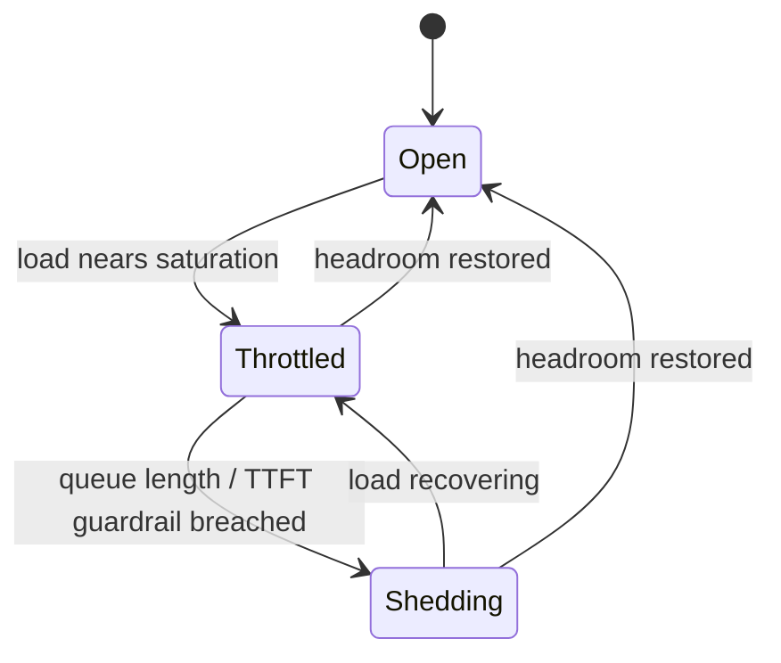

# Admission Control

## Purpose

Protect [[TTFT]] and [[Availability]] instead of letting saturated GPUs collapse endpoint performance. Under overload, the workflow shapes or rejects incoming work rather than admitting everything and degrading every request. (Roadmap Milestone 5.4.)

## Trigger

- Live load on a [[Model Deployment]] approaches a saturation threshold (queue depth, concurrency, or TTFT guardrail).
- Burst detected on a [[Traffic Class]].

## State Machine

## Steps

1. Measure — reliability; track max concurrency, queue length, burst rate, and per-[[Traffic Class]] load.
2. Throttle — reliability; cap maximum concurrency and admit context-heavy and large-output jobs selectively as load rises.
3. Shed — reliability; when the queue-length or [[TTFT]] guardrail is breached, reject or defer excess requests (capacity rejection) to preserve the SLO for admitted traffic.
4. Recover — reliability; relax caps as headroom returns; sustained pressure signals [[Autoscaling]].

Controls: **maximum concurrency, context-heavy requests, queue length, burst traffic, large-output jobs**. The rule is enforced by [[Admission Control Policy]].

## Events Emitted

| Event | When | Consumers |
|-------|------|-----------|
| [[Capacity Reallocation Triggered]] | Sustained shedding indicates capacity shortfall | [[Autoscaling]], [[GPU Reallocation]] |

## Dependencies

| Depends On | Type | Notes |
|------------|------|-------|
| [[Admission Control Policy]] | GOVERNED_BY | Enforceable overload rule |
| [[TTFT]] | CONSTRAINED_BY | Primary protected guardrail |
| [[Availability]] | CONSTRAINED_BY | Secondary protected guardrail |
| [[Traffic Class]] | DEPENDS_ON | Differentiated shaping by class |

## Ownership

SRE / Reliability owns admission control and capacity protection.

## See Also

- [[Operations Hub]]
