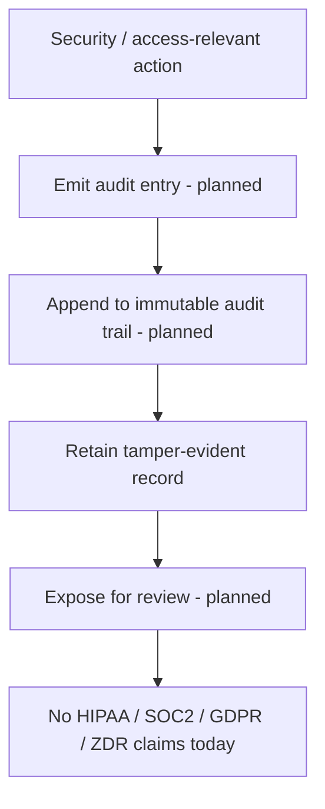

# Audit

## Purpose

Describes the **planned** immutable audit trail for RackAI — a tamper-evident record of security- and access-relevant actions across the platform. No compliance posture is claimed today: there are **no HIPAA, SOC 2, GDPR, or ZDR (zero data retention) claims** at present.

## Trigger

**Planned.** Security- and access-relevant actions (authentication, resource changes, access grants) would emit audit entries. No shipped trigger exists today.

## Steps

All steps are planned (draft PRD); none are shipped.

## Inputs & Outputs

| Direction | Item | Notes |
|-----------|------|-------|
| Input | Auditable actions | Auth, resource, and access events (planned) |
| Output | Immutable audit trail | Tamper-evident record (planned) |
| Not claimed | Compliance certifications | No HIPAA/SOC2/GDPR/ZDR today |

## Relationships

| Relationship | Target | Direction | Notes |
|--------------|--------|-----------|-------|
| MEASURES | [[Organization]] | → | Records org-scoped actions (planned) |
| DEPENDS_ON | [[RackAI Control Plane]] | → | Would capture control-plane actions |
| SUPPORTS | [[Identity & Access Control]] | → | Audits access decisions |

## Evidence

- Source: `monitoring_audit_spec`.
- Confidence rationale: `assumed` — the audit trail is a draft PRD, not shipped. No compliance certifications are claimed today; asserting any would be unsupported. When audit ships and which compliance regimes it targets are open questions.

## See Also

- [[Operations Hub]]
- [[Organization]]
- [[Identity & Access Control]]
- [[Monitoring & Observability]]
