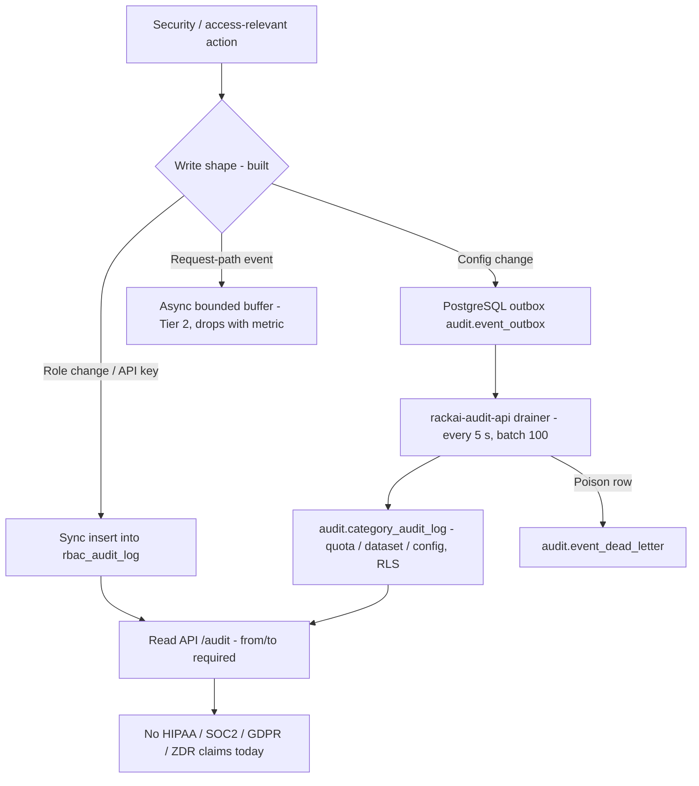

# Audit

## Purpose

Describes RackAI's audit trail — a durable record of security- and access-relevant actions across the platform. Per the as-built annotations in [[Monitoring and Auditability Spec]] (through 2026-09-29), the **core store, write paths and read API are built**; actor capture for raw Kubernetes operations and the workload/billing categories are not. No compliance posture is claimed today: there are **no HIPAA, SOC 2, GDPR, or ZDR (zero data retention) claims** at present.

## Trigger

Security- and access-relevant actions emit audit events. **Built:** role-change and API-key lifecycle events (synchronous), and config events — so far only `customerorg_deleted` and `tenant_deprovisioned`. **Not built:** workload and billing events, and the Audit Webhook that would attribute raw `kubectl` operations (deferred to M4).

## Steps

```mermaid
flowchart TD
    A[Security / access-relevant action] --> B{Write shape - built}
    B -->|Role change / API key| C[Sync insert into rbac_audit_log]
    B -->|Config change| D[PostgreSQL outbox audit.event_outbox]
    B -->|Request-path event| E[Async bounded buffer - Tier 2, drops with metric]
    D --> F[rackai-audit-api drainer - every 5 s, batch 100]
    F --> G[audit.category_audit_log - quota / dataset / config, RLS]
    F -->|Poison row| H[audit.event_dead_letter]
    C --> I[Read API /audit - from/to required]
    G --> I
    I --> J[No HIPAA / SOC2 / GDPR / ZDR claims today]
```

| Step | State (as-built, per [[Monitoring and Auditability Spec]]) |
|------|------|
| Producers write in-process (`pkg/audit`) directly to PostgreSQL | Built — no gRPC audit ingress, no separate audit service |
| Tier 1 durability via PostgreSQL outbox + `SKIP LOCKED` drainer | Built — **no Redis Streams** (decision 2026-09-11) |
| Sync `rbac_audit_log` for role-change / API-key events | Built |
| Category tables quota / dataset / config with forced RLS | Built |
| `rackai-audit-api` read API (`/audit`, `/audit/{category}`, `/audit/requests/{requestId}`) | Built — reader + drainer, not a write endpoint; `from`/`to` required |
| CustomerOrg deletion cascade stamps one `request_id` on all tenant rows | Built — force-removing a stuck finalizer skips the event |
| Audit Webhook / proposed-/last-actor annotations | **Not built** (deferred M4) — raw `kubectl delete` records actor `unknown` |
| `audit.workload_audit_log`, `audit.billing_audit_log` | **Not built** — categories accepted but return empty pages |
| `/audit/jobs/{job_id}` | **Not built** |
| Scraping/alerting on audit metrics | **Not built** — no ServiceMonitor targets `rackai-audit`; Tier 2 drops unobserved |

## Inputs & Outputs

| Direction | Item | Notes |
|-----------|------|-------|
| Input | Auditable actions | Role-change, API-key, config events built; workload/billing not built |
| Output | Audit store (PostgreSQL) | Outbox + dead-letter + RLS category tables (built) |
| Output | Read API | `rackai-audit-api`, time-bounded queries (built) |
| Not claimed | Compliance certifications | No HIPAA/SOC2/GDPR/ZDR today |

## Relationships

| Relationship | Target | Direction | Notes |
|--------------|--------|-----------|-------|
| MEASURES | [[Organization]] | → | Records org-scoped actions; CustomerOrg deletion cascade attributed |
| DEPENDS_ON | [[RackAI Control Plane]] | → | Controllers write audit events; audit-DB outage gates reconcile paths |
| SUPPORTS | [[Identity & Access Control]] | → | Audits role changes and API-key lifecycle |

## Evidence

- Source: `monitoring_audit_spec`; as-built deltas in [[Monitoring and Auditability Spec]] (spec annotations dated 2026-09-14).
- Confidence rationale: `derived` — the built components are known from engineering spec annotations, not from telemetry or a test run, so nothing here is `measured`. The 5,000 events/s throughput NFR is not load-tested. No compliance certifications are claimed today; asserting any would be unsupported. Which compliance regimes audit targets, and when actor attribution (M4) and workload/billing categories ship, are open questions.

## See Also

- [[Operations Hub]]
- [[Organization]]
- [[Identity & Access Control]]
- [[Monitoring & Observability]]
