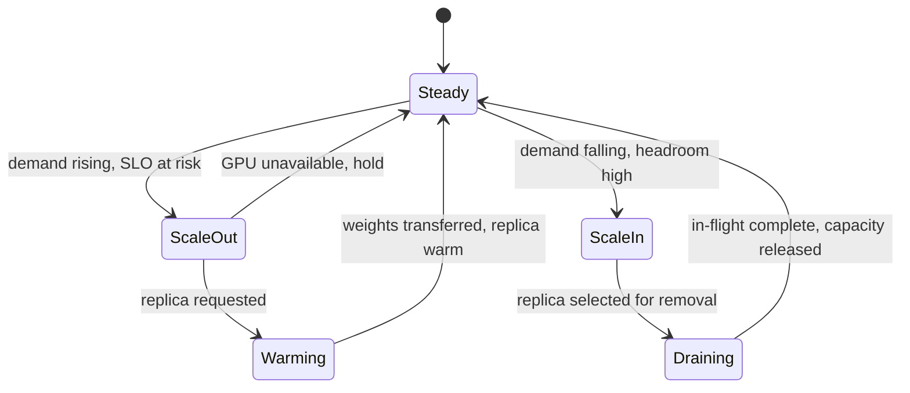

# Autoscaling

## Purpose

Automatically add or remove serving replicas or capacity for a [[Model Deployment]] to track demand, without violating latency SLOs or the minimum warm-capacity floor. (Roadmap Milestone 5.3.)

## Trigger

- Demand forecast or live utilization/queue-depth signal crosses a scale threshold.
- [[Capacity Reallocation Triggered]] delegating replica adjustment.

## State Machine

## Steps

1. Evaluate — capacity/infrastructure; read demand signals against [[Productive GPU Utilization]] and [[TTFT]] SLO.
2. Scale-out decision — respect model load time, weight transfer time, [[Topology]], and GPU availability before requesting a replica from the [[Capacity Pool]].
3. Warming — infrastructure; new replica loads weights and passes health checks before receiving traffic.
4. Scale-in decision — remove replicas only while preserving minimum warm capacity and the latency SLO.
5. Draining — infrastructure; selected replica finishes in-flight requests, then releases [[GPU Node]] capacity.

Constraints respected: **model load time, weight transfer time, topology, GPU availability, minimum warm capacity, latency SLO**. The warm-capacity floor is set by [[Capacity Reservation Policy]].

## Events Emitted

| Event | When | Consumers |
|-------|------|-----------|
| [[Capacity Reallocation Triggered]] | Scaling need exceeds pool headroom | [[GPU Reallocation]], capacity |

## Dependencies

| Depends On | Type | Notes |
|------------|------|-------|
| [[Capacity Reservation Policy]] | CONSTRAINED_BY | Minimum warm capacity floor |
| [[Productive GPU Utilization]] | DEPENDS_ON | Scaling signal |
| [[TTFT]] | CONSTRAINED_BY | Latency SLO guardrail |
| [[Topology]] | CONSTRAINED_BY | Placement of new replicas |

## Ownership

GPU / Infrastructure Engineering owns replica scaling; Capacity/FinOps informs thresholds.

## See Also

- [[Operations Hub]]
