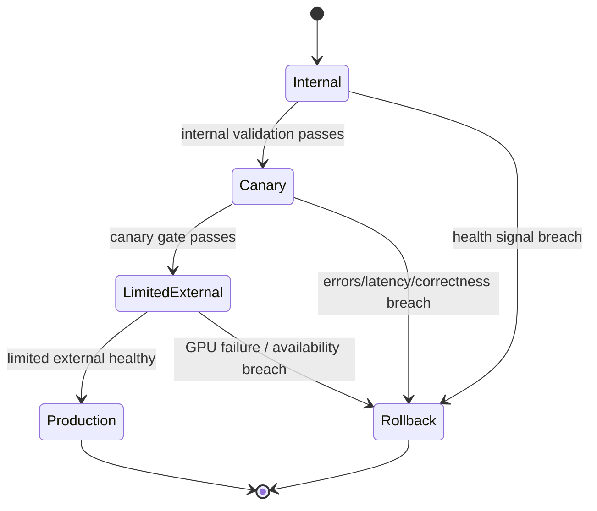

# Canary & Rollback

## Purpose

Promote a [[Model Deployment]] through progressive stages while watching health signals, and automatically roll back before a bad configuration reaches full production traffic. (Roadmap Milestone 4.7.)

## Trigger

- A deployment from [[Standard Model Deployment]] passes provisioning and is ready for promotion.
- A [[Model Launch Factory]] candidate reaches the canary stage.

## State Machine

## Steps

1. Internal — reliability; serve internal/synthetic traffic only; validate against baseline. On pass, emit no external traffic yet.
2. Canary — reliability; serve limited external traffic under watch. Rollback triggers on errors, latency ([[TTFT]]), correctness, GPU failures, or [[Availability]] breach.
3. Limited external — reliability; widen traffic share while continuing to monitor the same rollback signals.
4. Production — reliability; serve full OpenRouter traffic once the canary gate is cleared; emit [[Deployment Canary Passed]].
5. Rollback — reliability; drain and revert to the previous known-good version on any signal breach.

Rollback signals: **errors, latency, correctness, GPU failures, availability**.

## Events Emitted

| Event | When | Consumers |
|-------|------|-----------|
| [[Deployment Canary Passed]] | Canary gate cleared, promotion to production | [[Model Launch Factory]], publication, reliability |

## Dependencies

| Depends On | Type | Notes |
|------------|------|-------|
| [[Standard Model Deployment]] | DEPENDS_ON | Provides the provisioned deployment |
| [[Benchmark Run]] | DEPENDS_ON | Baseline for correctness/performance comparison |
| [[TTFT]] | GATED_BY | Latency rollback signal |
| [[Availability]] | GATED_BY | Availability rollback signal |

## Ownership

SRE / Reliability owns canarying, rollback, and capacity protection.

## See Also

- [[Operations Hub]]
