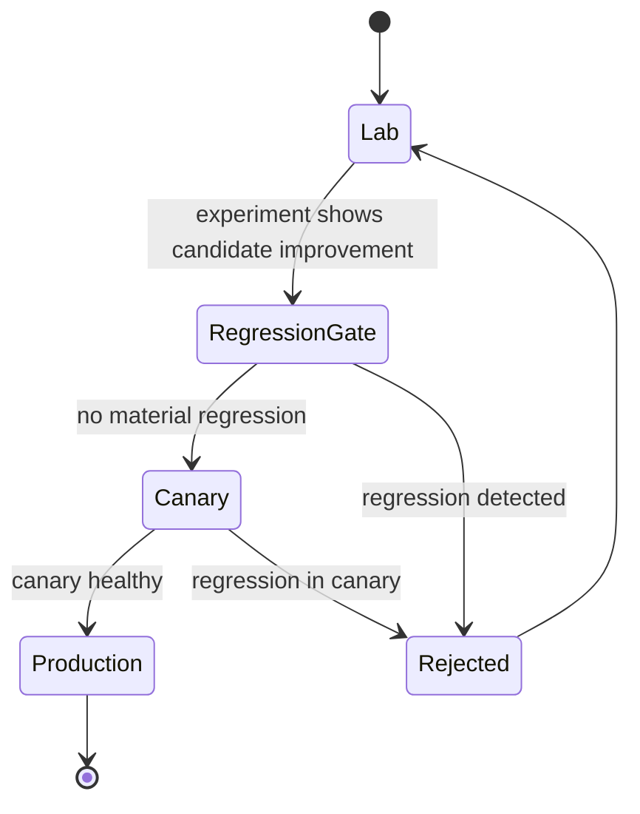

# Closed-Loop Optimization

## Purpose

Create the enduring Rack AI differentiator: a system that learns to operate models better over time by continuously experimenting with configuration, gating on performance regressions, and promoting winners automatically. (Roadmap Phase 6.)

## Trigger

- Continuous experimentation schedule against production-shaped workloads.
- A new runtime release, kernel, quantization, parallelism, or batch/cache setting to evaluate.

## State Machine

## Steps

1. Lab experimentation — performance-eng; test batch sizes, cache settings, runtime releases, quantization, parallelism, and kernel versions against production-shaped workloads. (Milestone 6.1.)
2. Regression gate — performance-eng; block any change that materially worsens [[TTFT]], [[Tokens per GPU-Second]], error rate, quality, or cost/token; emit [[Performance Regression Detected]] on breach. Enforced by [[Performance Regression Gate]]. (Milestone 6.2.)
3. Promotion — performance-eng; on statistically meaningful improvement, promote lab → canary → production without rebuilding the deployment, handing off to [[Canary & Rollback]]. (Milestone 6.3.)
4. Observe — performance-eng; feed [[Output Throughput]] and efficiency telemetry back into the next experiment cycle.

## Events Emitted

| Event | When | Consumers |
|-------|------|-----------|
| [[Performance Regression Detected]] | A candidate config breaches a regression threshold | Gate, performance-eng; blocks promotion |
| [[Deployment Canary Passed]] | Promoted config clears canary | Production promotion, reliability |

## Dependencies

| Depends On | Type | Notes |
|------------|------|-------|
| [[Performance Regression Gate]] | GOVERNED_BY | CI/CD performance gate |
| [[Benchmark Run]] | DEPENDS_ON | Experiment measurement |
| [[Canary & Rollback]] | HANDS_OFF_TO | Safe promotion path |
| [[Tokens per GPU-Second]] | DEPENDS_ON | Primary efficiency signal |

## Ownership

Inference Performance Engineering owns the optimization loop; SRE/Reliability owns the canary promotion.

## See Also

- [[Operations Hub]]
