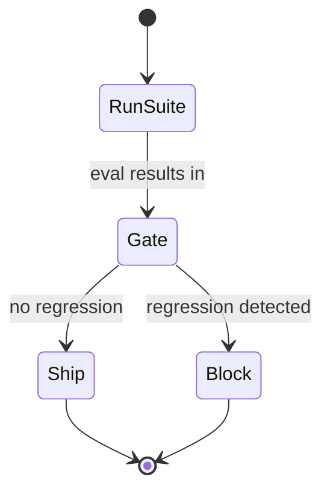

# Eval as CI

## Purpose

**Eval as CI** is the engineering discipline that sits on top of the eval framework ([[Empirical Map]], thread 1.5) and lets model and policy changes ship safely: regression suites, release gating on eval results, and answering "did this model swap break anything." It is the productization item **P3** in the dev plan.

> **Assumed confidence.** Productization/ops item P3, dev track. Net-new as a discipline; it consumes the eval framework and extends the existing [[Performance Regression Gate]] beyond serving-performance into workload correctness.

## Trigger

A model swap, policy change, runtime/config change, or harness change proposed for release.

## State Machine

## Steps

1. Run the regression suite against the change (uses [[Empirical Map]] cells and [[Verification]] checks).
2. Gate the release on eval results (extends [[Performance Regression Gate]]).
3. Ship through staged rollout / [[Canary & Rollback]], or block.

## Dependencies

| Depends On | Type | Notes |
|------------|------|-------|
| [[Empirical Map]] | USES | The eval framework it runs on |
| [[Verification]] | USES | Correctness checks per case |
| [[Performance Regression Gate]] | IMPLEMENTS | The gate this discipline enforces at release |

## Ownership

RackAI Engineering (dev track). Sits alongside P4 release/deployment engineering.

## See Also

- [[Operations Hub]]
- [[Performance Regression Gate]]
- [[Empirical Map]]
