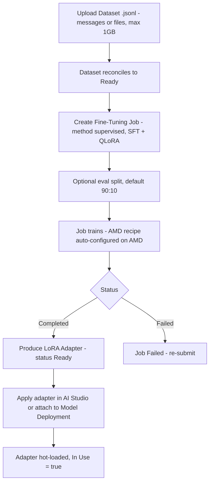

# Fine-Tuning

## Purpose

Describes how a RackAI tenant adapts a base [[Model]] to their own data: upload a [[Dataset]], run a [[Fine-Tuning Job]], obtain a [[LoRA Adapter]], and apply it to serving. The shipped path is supervised fine-tuning (SFT) with QLoRA.

## Trigger

A tenant initiates fine-tuning in AI Studio (or via API) by uploading a dataset and creating a job against a chosen base model.

## Steps

Reinforcement (`reinforcement`) and DPO (`dpo`) methods are surfaced as "Coming Soon" and are not part of the shipped path.

## Inputs & Outputs

| Direction | Item | Notes |
|-----------|------|-------|
| Input | [[Dataset]] | `.jsonl`, `messages` or `files`, max 1GB |
| Input | Base [[Model]] | The model being adapted |
| Input | Hyperparameters | SFT + QLoRA config; optional 90:10 eval split |
| Output | [[LoRA Adapter]] | Targets one base model; hot-loadable |
| Output | Job status | `Running`, `Completed`, `Failed` |

## Relationships

| Relationship | Target | Direction | Notes |
|--------------|--------|-----------|-------|
| CONSUMES | [[Dataset]] | → | Training input |
| PRODUCES | [[LoRA Adapter]] | → | Output artifact |
| USES | [[Fine-Tuning Job]] | → | The training run entity |
| APPLIED_TO | [[Model Deployment]] | → | Adapter attached to serving |

## Evidence

- Source: `rackai_console_docs`, `rackai_ui_architecture`.
- Confidence rationale: `measured` for the SFT/QLoRA path (dataset formats, eval split default, AMD recipe, adapter apply). RL/DPO are `assumed` (planned, "Coming Soon"); the SFT-only-vs-advertised-RL/DPO gap is an open question tracked on [[Fine-Tuning Job]].

## See Also

- [[Operations Hub]]
- [[Dataset]]
- [[Fine-Tuning Job]]
- [[LoRA Adapter]]
