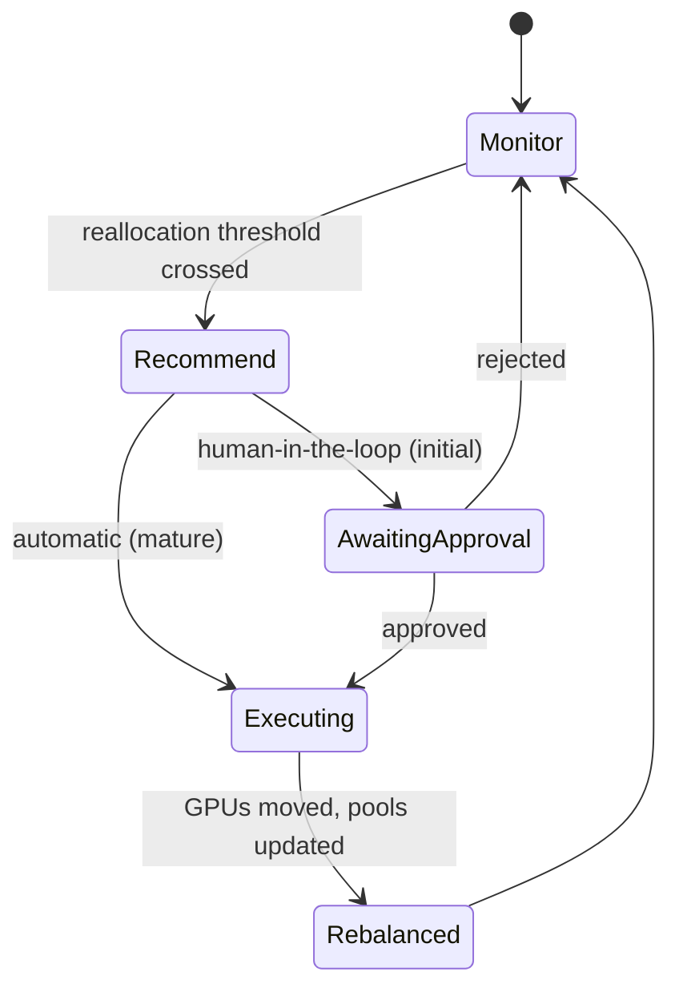

# GPU Reallocation

## Purpose

Move GPUs among model [[Capacity Pool]]s so capacity follows the highest-value inference workloads rather than remaining statically assigned. Recommendations start human-approved and later become automatic. (Roadmap Milestone 5.5.)

## Trigger

- [[Capacity Reallocation Triggered]] when demand or economics cross a reallocation threshold.
- Scheduled fleet-yield review.

## State Machine

## Steps

1. Monitor — capacity/infrastructure; watch demand, [[Productive GPU Utilization]], queue depth, [[Revenue per GPU-Hour]], marginal contribution ([[Gross Margin per Model]]), and strategic priority.
2. Recommend — capacity; propose a reallocation of [[GPU Node]] capacity between pools that improves fleet yield while respecting reservations.
3. Approve — infrastructure / finops; initially a human approves the move; as confidence grows the step becomes automatic.
4. Execute — infrastructure; drain source replicas, transfer GPUs, and warm target pool replicas.
5. Rebalance — capacity; update pool allocations and confirm SLOs hold; preserve strategic reservations per [[Capacity Reservation Policy]].

Decision inputs: **demand, utilization, queue depth, revenue/GPU-hour, marginal contribution, strategic priority**. Sustained pressure may satisfy [[Procurement Trigger]].

## Events Emitted

| Event | When | Consumers |
|-------|------|-----------|
| [[Capacity Reallocation Triggered]] | Consumed as trigger; re-emitted on cascading rebalance | [[Autoscaling]], capacity |

## Dependencies

| Depends On | Type | Notes |
|------------|------|-------|
| [[Capacity Reservation Policy]] | CONSTRAINED_BY | Never commit 100% of fleet |
| [[Procurement Trigger]] | INFORMS | Sustained shortfall escalates to procurement |
| [[Revenue per GPU-Hour]] | CONSUMES | Economic ranking |
| [[Gross Margin per Model]] | CONSUMES | Marginal contribution |
| [[Productive GPU Utilization]] | DEPENDS_ON | Utilization signal |

## Ownership

GPU / Infrastructure Engineering executes moves; Capacity/FinOps owns the ranking function.

## See Also

- [[Operations Hub]]
