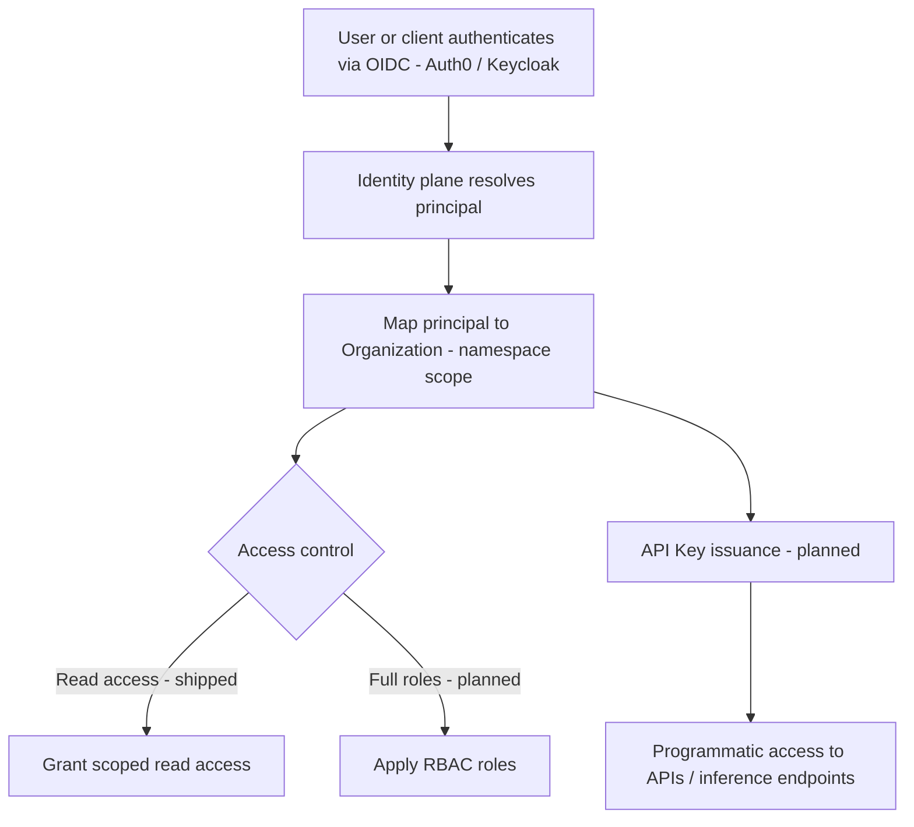

# Identity & Access Control

## Purpose

Describes how RackAI authenticates users and scopes their access. It covers OIDC-based authentication (Auth0, with a Keycloak path), the mapping of an [[Organization]] to a Kubernetes namespace, role-based access control (RBAC), and programmatic [[API Key]] credentials.

## Trigger

A user or client authenticates to the RackAI console or API; the identity plane resolves them to one or more Organizations and applies access rules.

## Steps

## Inputs & Outputs

| Direction | Item | Notes |
|-----------|------|-------|
| Input | OIDC identity | Auth0 (Keycloak path) |
| Input | Org membership | Principal → Organization mapping |
| Output | Namespace-scoped access | Org maps to a k8s namespace |
| Output | RBAC decision | Read-access shipped; full roles planned |
| Output | [[API Key]] | Planned programmatic credential |

## Relationships

| Relationship | Target | Direction | Notes |
|--------------|--------|-----------|-------|
| GOVERNS | [[Organization]] | → | Scopes org access to its namespace |
| IMPLEMENTED_BY | [[RackAI Control Plane]] | ← | Identity plane `/apis/auth.rackai.io/v1` |
| PRODUCES | [[API Key]] | → | Planned credential issuance |

## Evidence

- Source: `identity_access_spec`, `rackai_api_reference`.
- Confidence rationale: `derived` — shipped OIDC auth and org→namespace scoping are `measured`, but full RBAC roles and API keys are `assumed` (planned). The overall workflow mixes shipped and planned pieces, so it resolves to `derived`. Which RBAC roles and API-key behaviors ship is an open question.

## See Also

- [[Operations Hub]]
- [[Organization]]
- [[API Key]]
- [[RackAI Control Plane]]
