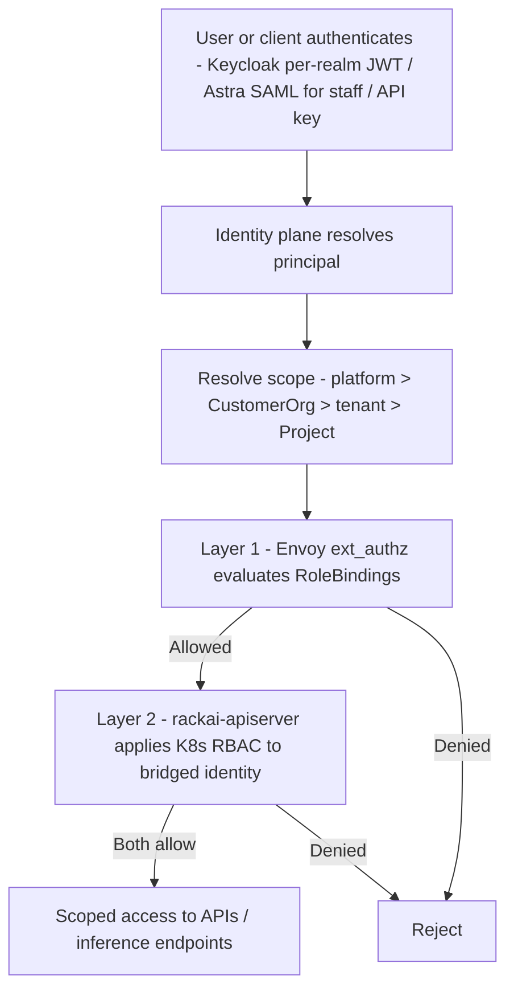

# Identity & Access Control

## Purpose

Describes how RackAI authenticates users and scopes their access, as built per the 2026-09-14 annotations in [[Identity and Access Control Spec]]. It covers OIDC/JWT authentication via **per-realm Keycloak** (SAML federation to Rackspace's Astra for staff; **Auth0 is the legacy provider being cut over and decommissioned**), a **four-tier scope hierarchy** (platform → CustomerOrg → [[Organization]]/tenant → Project) mapped to Kubernetes namespaces, RBAC via `PlatformRole` + `RoleBinding` CRDs, and programmatic [[API Key]] credentials.

## Trigger

A user or client authenticates to the RackAI console or API; the identity plane resolves them to a scope (platform, CustomerOrg, tenant or Project) and applies access rules.

## Steps

```mermaid
flowchart TD
    A[User or client authenticates - Keycloak per-realm JWT / Astra SAML for staff / API key] --> B[Identity plane resolves principal]
    B --> C[Resolve scope - platform > CustomerOrg > tenant > Project]
    C --> D[Layer 1 - Envoy ext_authz evaluates RoleBindings]
    D -->|Allowed| E[Layer 2 - rackai-apiserver applies K8s RBAC to bridged identity]
    E -->|Both allow| F[Scoped access to APIs / inference endpoints]
    D -->|Denied| X[Reject]
    E -->|Denied| X
```

| Step | State (per [[Identity and Access Control Spec]]) |
|------|------|
| Keycloak per-realm JWT; Astra SAML for staff | Built; Auth0 legacy, being decommissioned |
| CustomerOrg / Organization / RoleBinding CRDs + admission webhooks | Built (IAC M1 core) |
| ext_authz evaluator over RoleBindings (layer 1) | Built |
| Kubernetes RBAC on bridged identity in `rackai-apiserver` (layer 2) | Built, load-bearing — `rbac.k8sGrants.enabled` is required when `rbac.enforcement.mode=enforce`, else everyone (incl. platform admins) is denied |
| [[API Key]] issuance and validation | Shipped (IAC M1, RACKAI-204) |
| Scope-constrained realm validation for tenant/project RoleBindings | Built |
| Multiple CustomerOrgs | Built but **gated off** — `rbac.multiOrg.enabled` default off; not enabled on any long-lived deployment |
| CustomerOrg → billing account (`cmsAccountId`/RCN) | Proposed 2026-09-18, not built |

## Inputs & Outputs

| Direction | Item | Notes |
|-----------|------|-------|
| Input | OIDC identity | Keycloak per-realm JWT; Astra SAML (staff); Auth0 legacy |
| Input | Scope membership | Principal → platform / CustomerOrg / tenant / Project |
| Output | Namespace-scoped access | Organization (tenant) maps to a k8s namespace, namespaced under its CustomerOrg |
| Output | RBAC decision | Both ext_authz and K8s RBAC must allow (built) |
| Output | [[API Key]] | Shipped programmatic credential |

## Relationships

| Relationship | Target | Direction | Notes |
|--------------|--------|-----------|-------|
| GOVERNS | [[Organization]] | → | Scopes tenant access to its namespace |
| IMPLEMENTED_BY | [[RackAI Control Plane]] | ← | Identity plane `/apis/auth.rackai.io/v1`; ext_authz + `rackai-apiserver` |
| PRODUCES | [[API Key]] | → | Shipped credential issuance |
| PRODUCES | [[Audit]] | → | Role-change and API-key lifecycle events written synchronously |

## Evidence

- Source: `identity_access_spec`, `rackai_api_reference`; as-built deltas in [[Identity and Access Control Spec]].
- Confidence rationale: `derived` — RBAC CRDs, the two authorization layers and API keys are built per engineering spec annotations (API keys also Complete on the delivery roadmap), but none of this is backed by telemetry here. Multi-org operation ships inert, and the billing-account link is only proposed. Org-level RBAC status conflicts with the roadmap (see [[Open Questions]]).

## See Also

- [[Operations Hub]]
- [[Organization]]
- [[API Key]]
- [[RackAI Control Plane]]
- [[Governed Execution & Delegated Authority PRD]] — authority above permission (draft)

