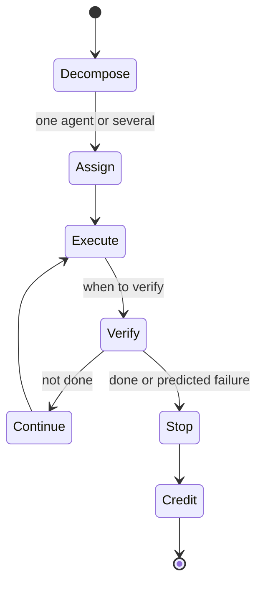

# Loop Planning & Credit Assignment

## Purpose

[[Request Routing]] picks a model for **one step**. Planning the **whole loop** is harder: how to break up the task, one agent or several, when to verify, and when to stop — all for the lowest **cost per outcome**. To plan well you must score the steps and credit the one that earned the result, so planning and credit assignment are the **same problem**. This is the deep version of routing (thread 1.4) and shares its learned-optimizer research.

> **Assumed confidence.** Program 3 thread 3.2, long-term research. Net-new (no product covers whole-loop planning or failure prediction today).

## Trigger

Runs when a multi-step task is planned/executed across one or more [[Governed Harness]] instances.

## State Machine

## Steps

1. **Decompose** the task and decide one agent or several.
2. Decide **when to verify** (uses [[Verification]]) and **when to stop**.
3. **Score** multi-step work and **predict failure early**.
4. **Credit** the right step, even for effects that show up late.
5. Plan the loop **against the [[Empirical Map]]**.

## Dependencies

| Depends On | Type | Notes |
|------------|------|-------|
| [[Empirical Map]] | USES | Plans against measured reliability & cost |
| [[Verification]] | USES | Step scores / reward |
| [[Request Routing]] | DERIVES | The single-step version of the same optimization |

## Feeds

| Target | Relationship |
|--------|--------------|
| [[Self-Improvement Loop]] | SUPPORTS → credit signals inform learning |
| [[Cost per Outcome]] | PRODUCES → cost-per-outcome per plan |

## Ownership

Research track (Researcher / Architect). Shared learned-optimizer research with routing (1.4).

## See Also

- [[Operations Hub]]
- [[Request Routing]]
- [[Verification]]
- [[Self-Improvement Loop]]
