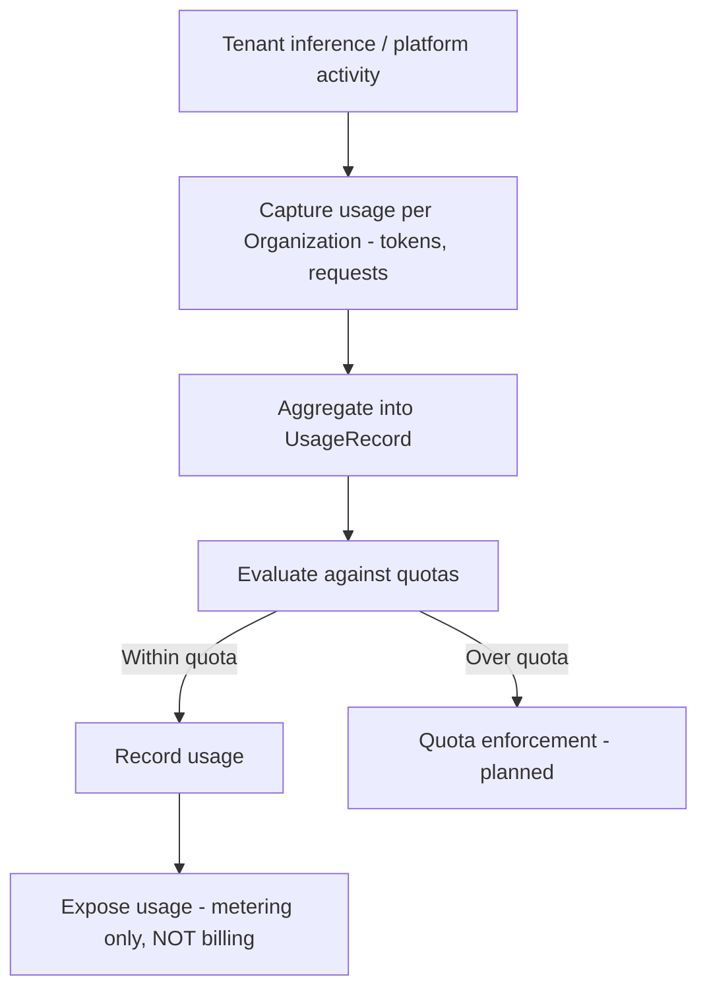

# Metering

## Purpose

Describes the capture of usage per tenant — tokens and requests — along with quotas and a `UsageRecord` object. Metering measures consumption; it is explicitly **not** billing. Billing is called out as a non-goal of the metering PRD, so charge computation and payment are out of scope here (see [[Billing & Payment]]).

**Status: in progress.** Per the [[RackAI Roadmap (Delivery Plan)|delivery roadmap]], Metering M1 (Project CRD + `usage_records` schema + MeteringEvent queue; pipeline with identity context, inference metering, FineTuningJob CRD — RACKAI-352, In Progress) is being built on top of the shipped identity layer (IAC M1). The later stages — UsageRecord/UsageSummary APIs (M2), QuotaPolicy CRD + soft alerts (M3), and Quota Enforcement + admission control 429/402 (M4) — are not started. Confidence `derived` (in flight, not yet shipped or telemetry-confirmed).

## Trigger

Inference and platform activity for an [[Organization]] is observed and aggregated into usage records via the MeteringEvent pipeline (M1, in progress). Quota evaluation/enforcement (M3–M4) not yet built.

## Steps

All steps are planned (draft PRD); none are shipped.

## Inputs & Outputs

| Direction | Item | Notes |
|-----------|------|-------|
| Input | Tenant activity | Tokens/requests per Organization |
| Output | `UsageRecord` | Aggregated usage (planned) |
| Output | Quota state | Within/over quota (planned) |
| Out of scope | Billing/charges | Explicit non-goal — see [[Billing & Payment]] |

## Relationships

| Relationship | Target | Direction | Notes |
|--------------|--------|-----------|-------|
| MEASURES | [[Organization]] | → | Usage captured per tenant |
| DEPENDS_ON | [[Monitoring & Observability]] | → | Relies on telemetry capture |
| CONSTRAINS | [[Billing & Payment]] | → | Metering feeds billing, but billing is a separate non-goal here |
| SUPPORTS | [[AI FinOps]] | → | The "meter" step of the cost loop; the shared token-cost spine ([[RackAI Enterprise AI Development Plan]], thread 1.3/5.1) |
| PRODUCES | [[Cost per Outcome]] | → | Token-spend data attributed by workload/tenant/outcome (`assumed`) |

## Evidence

- Source: `metering_spec`.
- Confidence rationale: `assumed` — metering is a draft PRD, not shipped. Billing is an explicit non-goal of the metering PRD; the two must not be conflated. When metering ships and how quotas are enforced are open questions.

## See Also

- [[Operations Hub]]
- [[Organization]]
- [[Monitoring & Observability]]
- [[Billing & Payment]]
