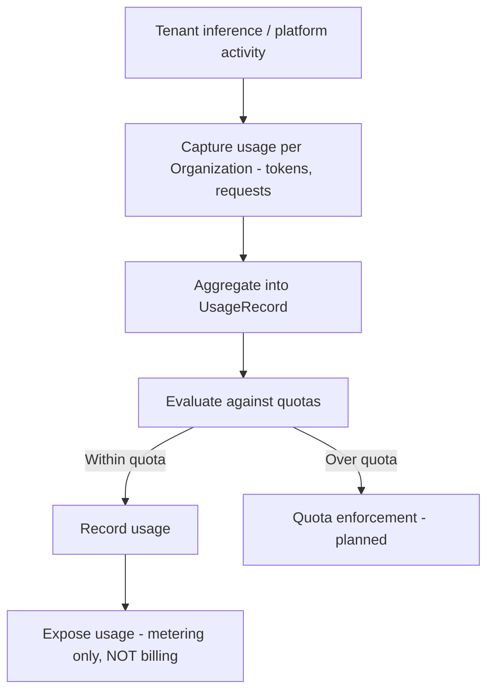

# Metering

## Purpose

Describes the **planned** capture of usage per tenant — tokens and requests — along with quotas and a `UsageRecord` object. Metering measures consumption; it is explicitly **not** billing. Billing is called out as a non-goal of the metering PRD, so charge computation and payment are out of scope here (see [[Billing & Payment]]).

## Trigger

**Planned.** Inference and platform activity for an [[Organization]] would be observed and aggregated into usage records. No shipped trigger exists today.

## Steps

All steps are planned (draft PRD); none are shipped.

## Inputs & Outputs

| Direction | Item | Notes |
|-----------|------|-------|
| Input | Tenant activity | Tokens/requests per Organization |
| Output | `UsageRecord` | Aggregated usage (planned) |
| Output | Quota state | Within/over quota (planned) |
| Out of scope | Billing/charges | Explicit non-goal — see [[Billing & Payment]] |

## Relationships

| Relationship | Target | Direction | Notes |
|--------------|--------|-----------|-------|
| MEASURES | [[Organization]] | → | Usage captured per tenant |
| DEPENDS_ON | [[Monitoring & Observability]] | → | Relies on telemetry capture |
| CONSTRAINS | [[Billing & Payment]] | → | Metering feeds billing, but billing is a separate non-goal here |

## Evidence

- Source: `metering_spec`.
- Confidence rationale: `assumed` — metering is a draft PRD, not shipped. Billing is an explicit non-goal of the metering PRD; the two must not be conflated. When metering ships and how quotas are enforced are open questions.

## See Also

- [[Operations Hub]]
- [[Organization]]
- [[Monitoring & Observability]]
- [[Billing & Payment]]
