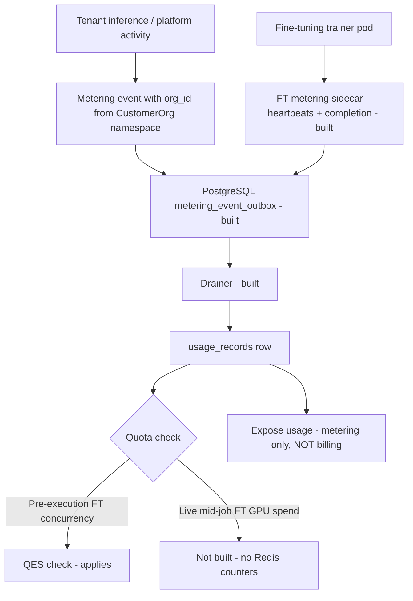

# Metering

## Purpose

Describes the capture of usage per tenant — tokens and requests — along with quotas and a `UsageRecord` object. Metering measures consumption; it is explicitly **not** billing. Billing is called out as a non-goal of the metering PRD, so charge computation and payment are out of scope here (see [[Billing & Payment]]).

**Status: in progress, partly built.** Per the [[RackAI Roadmap (Delivery Plan)|delivery roadmap]], Metering M1 (Project CRD + `usage_records` schema + MeteringEvent queue; pipeline with identity context, inference metering, FineTuningJob CRD — RACKAI-352, In Progress) is being built on top of the shipped identity layer (IAC M1). Per the as-built annotations in [[Multi-Tenancy and Metering Spec]] (through 2026-10-08), the following are **built**: the PostgreSQL metering outbox (`metering_event_outbox`) and drainer; `usage_records.org_id` populated from the Organization's CustomerOrg namespace (a grouping key, not a billing identity); `FineTuningJob.spec.project` as a **bare string** (RACKAI-501; empty = default Project); and **fine-tuning metering via a per-pod sidecar** (RACKAI-515 — 5-min heartbeats of compute seconds and tokens, one `usage_records` row on completion). **Not built:** `Model.spec.project`; FT audit-attribution fields; Redis counters for fine-tuning, so there is **no live mid-job FT GPU-spend quota** (only the pre-execution concurrency check); the billing-account link (proposed 2026-09-18). `QuotaPolicy` is **platform-operator-configurable only** (tenants cannot self-raise; resolved 2026-07-28). The later roadmap stages — UsageRecord/UsageSummary APIs (M2), QuotaPolicy CRD + soft alerts (M3), Quota Enforcement 429/402 (M4) — are not reported shipped. Confidence `derived`.

## Trigger

Inference and platform activity for an [[Organization]] is observed and written as metering events to the PostgreSQL outbox, then drained into `usage_records` (outbox/drainer built). Fine-tuning jobs are metered by a sidecar in each trainer pod (built 2026-10-08); a startup gate holds the trainer until the sidecar can write, so jobs never run unmetered. Live quota enforcement (M3–M4) is not built.

## Steps

```mermaid
flowchart TD
    A[Tenant inference / platform activity] --> B[Metering event with org_id from CustomerOrg namespace]
    A2[Fine-tuning trainer pod] --> S[FT metering sidecar - heartbeats + completion - built]
    B --> O[PostgreSQL metering_event_outbox - built]
    S --> O
    O --> D[Drainer - built]
    D --> C[usage_records row]
    C --> Q{Quota check}
    Q -->|Pre-execution FT concurrency| E[QES check - applies]
    Q -->|Live mid-job FT GPU spend| F[Not built - no Redis counters]
    C --> G[Expose usage - metering only, NOT billing]
```

Built: outbox, drainer, FT sidecar, `FineTuningJob.spec.project`. Not built: live FT quota counters, `Model.spec.project`, UsageSummary/quota enforcement stages, billing link.

## Inputs & Outputs

| Direction | Item | Notes |
|-----------|------|-------|
| Input | Tenant activity | Tokens/requests per Organization; FT compute seconds + tokens via sidecar |
| Output | `usage_records` | Built (outbox + drainer); FT rows carry `tokens_processed`/`tokens_trainable`; retention per-install `retentionDays` (default 365) |
| Output | Quota state | Operator-only `QuotaPolicy`; FT pre-execution concurrency only — no live mid-job FT quota |
| Out of scope | Billing/charges | Explicit non-goal — see [[Billing & Payment]] |

## Relationships

| Relationship | Target | Direction | Notes |
|--------------|--------|-----------|-------|
| MEASURES | [[Organization]] | → | Usage captured per tenant |
| DEPENDS_ON | [[Monitoring & Observability]] | → | Relies on telemetry capture |
| CONSTRAINS | [[Billing & Payment]] | → | Metering feeds billing, but billing is a separate non-goal here |
| SUPPORTS | [[AI FinOps]] | → | The "meter" step of the cost loop; the shared token-cost spine ([[RackAI Enterprise AI Development Plan]], thread 1.3/5.1) |
| PRODUCES | [[Cost per Outcome]] | → | Token-spend data attributed by workload/tenant/outcome (`assumed`) |

## Evidence

- Source: `metering_spec`; as-built deltas in [[Multi-Tenancy and Metering Spec]] (annotations through 2026-10-08, RACKAI-501, RACKAI-515).
- Confidence rationale: `derived` — the outbox/drainer, `FineTuningJob.spec.project` and FT sidecar metering are built per engineering spec annotations, not confirmed by telemetry; quota enforcement and the billing link are not built. FT billing semantics: billed from sidecar start to trainer exit at the GPU limit, failures/OOM billed, lost completions dead-lettered after 48 h and billed zero until promoted; token fields are NULL for AMD jobs. Billing is an explicit non-goal of the metering PRD; the two must not be conflated. Crediting platform-caused FT failures and live FT quota enforcement are open questions.

## See Also

- [[Operations Hub]]
- [[Organization]]
- [[Monitoring & Observability]]
- [[Billing & Payment]]
