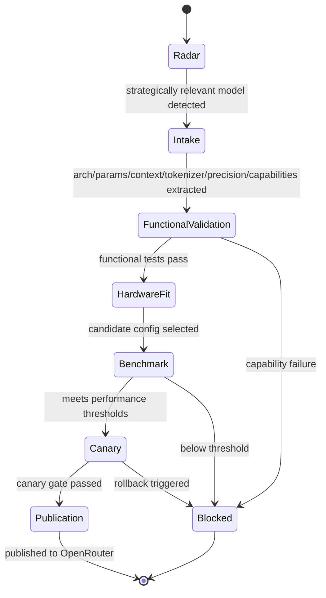

# Model Launch Factory

## Purpose

Turn model launches from bespoke engineering projects into a repeatable pipeline. The factory carries a newly available [[Model]] from radar detection through automated intake, validation, hardware fit, benchmarking, canary, and OpenRouter publication so that a known architecture can reach production without a cross-functional war room. (Roadmap Phase 4.)

## Trigger

- [[New Model Detected]] emitted by Model Radar when a strategically relevant model appears.
- Operator-initiated launch candidate for a pre-announced model (day-zero readiness).

## State Machine

## Steps

1. Model Radar — model-enablement; continuously tracks model labs, Hugging Face, GitHub, NVIDIA, OpenRouter, and research. Emits [[New Model Detected]] for strategically relevant models. (Milestone 4.1.)
2. Automated intake — model-enablement; auto-extracts architecture, parameter count, active parameter count, context length, tokenizer, precision, multimodal/tool capabilities, and memory requirements; produces a preliminary deployment recommendation. (Milestone 4.3.)
3. Functional validation — model-enablement; standardized tests for loading, generation, streaming, tokenization, long context, tools, structured output, reasoning controls, multimodal, and concurrency. Failures identify the blocking capability. (Milestone 4.4.)
4. Hardware fit testing — performance-eng / infrastructure; runs candidate configs against available hardware to determine minimum GPU count, preferred GPU type, memory headroom, [[Topology]] requirement, and initial parallelism profile. (Milestone 4.5.)
5. Benchmark stage — performance-eng; generates baseline [[TTFT]], [[Output Throughput]], [[Tokens per GPU-Second]], memory use, concurrency scaling, and cost/1M tokens via a [[Benchmark Run]], comparing against established thresholds. (Milestone 4.6.)
6. Canary — reliability; hands off to [[Canary & Rollback]] for internal → canary → limited external → production promotion. (Milestone 4.7.)
7. OpenRouter publication — platform-eng; once gates pass, automatically prepares endpoint, metadata, pricing, supported parameters, context, and routing via the [[OpenRouter Provider Integration]]. (Milestone 4.8.)

Target: **<24h median / <72h P90** launch lag, measured as [[Model Launch Lag]]. These targets are roadmap targets (assumed) until measured.

## Events Emitted

| Event | When | Consumers |
|-------|------|-----------|
| [[New Model Detected]] | Radar flags a strategically relevant model | Intake stage, model-enablement |
| [[Deployment Canary Passed]] | Canary gate cleared | Publication stage, reliability |

## Dependencies

| Depends On | Type | Notes |
|------------|------|-------|
| [[Standard Model Deployment]] | DEPENDS_ON | Uses the standard deployment contract for placement |
| [[Canary & Rollback]] | DEPENDS_ON | Promotion and rollback gate |
| [[Benchmark Run]] | DEPENDS_ON | Performance evidence before canary |
| [[OpenRouter Provider Integration]] | DEPENDS_ON | Final publication surface |
| [[Model Launch Lag]] | MEASURED_BY | Headline KPI for the factory |

## Ownership

Model Enablement owns the factory end to end; Performance Engineering owns the hardware-fit and benchmark stages; SRE/Reliability owns the canary gate.

## See Also

- [[Operations Hub]]
