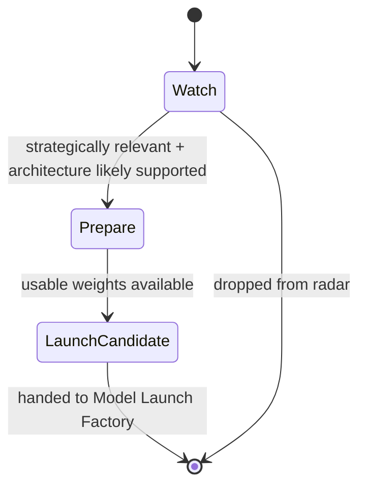

# Model Radar

## Purpose

The Model Radar identifies strategically important [[Model]]s before demand peaks, so Rack AI can prepare and launch them ahead of the curve rather than reacting after demand has already been captured by competitors. Its output is a continuously maintained **Launch Now / Prepare Next / Watch** pipeline (roadmap Milestone 4.1, strategy "How We Win #1"). It is the entry point of the [[Model Launch Factory]].

## Trigger

Runs continuously. Emits a signal when a strategically relevant model appears or advances in readiness.

## State Machine

## Sources Tracked

- Model labs and research announcements
- NVIDIA
- Hugging Face
- GitHub
- OpenRouter demand signals
- Direct ecosystem relationships

## Steps

1. Scan sources — model-enablement, continuously monitors labs, NVIDIA, Hugging Face, GitHub, OpenRouter, and ecosystem partners.
2. Classify — place each candidate into Watch, Prepare Next, or Launch Now.
3. Signal — emit [[New Model Detected]] when a strategically relevant model appears or advances.
4. Hand off — pass Launch Candidates to the [[Model Launch Factory]].

## Events Emitted

| Event | When | Consumers |
|-------|------|-----------|
| [[New Model Detected]] | A strategically relevant model appears or advances | [[Model Launch Factory]] |

## Dependencies

| Depends On | Type | Notes |
|------------|------|-------|
| [[Model]] | PRODUCES | Feeds candidate Models into the pipeline |
| [[Model Launch Factory]] | FEEDS | Launch Candidates flow into the factory |

## Ownership

Model Enablement owns the radar end to end. Its primary KPI is [[Model Launch Lag]] — capturing demand while a new model is still accelerating.

## See Also

- [[Operations Hub]]
- [[Model Launch Factory]]
- [[Model]]
