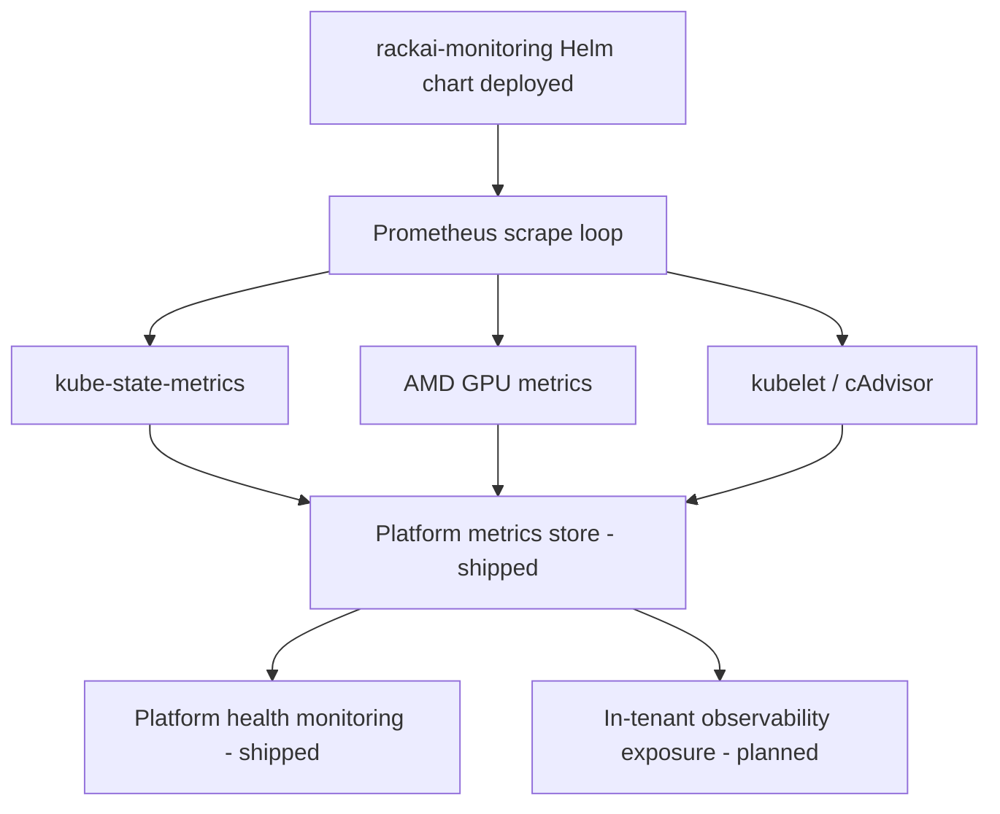

# Monitoring & Observability

## Purpose

Describes how RackAI observes platform health. **Platform monitoring is shipped**: Prometheus scrapes targets including `kube-state-metrics`, AMD GPU metrics, and `kubelet`/`cAdvisor`, deployed via the `rackai-monitoring` Helm chart. **In-tenant observability** (per-tenant dashboards/metrics exposure) is **planned**.

## Trigger

Continuous. Prometheus scrape loops collect metrics from platform targets on an interval; the monitoring stack is deployed with the cluster.

## Steps

## Inputs & Outputs

| Direction | Item | Notes |
|-----------|------|-------|
| Input | Scrape targets | `kube-state-metrics`, AMD GPU, `kubelet`/`cAdvisor` |
| Output | Platform metrics | Shipped via `rackai-monitoring` Helm chart |
| Output | In-tenant observability | Planned — not shipped |

## Relationships

| Relationship | Target | Direction | Notes |
|--------------|--------|-----------|-------|
| MEASURES | [[GPU Node]] | → | Scrapes node/GPU metrics |
| MEASURES | [[RackAI Control Plane]] | → | Platform component health |
| SUPPORTS | [[Metering]] | → | Telemetry feeds planned metering |

## Evidence

- Source: `monitoring_audit_spec`, `rackai_release_1_0_0`.
- Confidence rationale: `derived` — platform monitoring (Prometheus targets, `rackai-monitoring` chart) is `measured` (shipped in 1.0.0), while in-tenant observability is `assumed` (planned). The mix resolves to `derived`. Scope and timing of in-tenant observability is an open question.

## See Also

- [[Operations Hub]]
- [[GPU Node]]
- [[Metering]]
