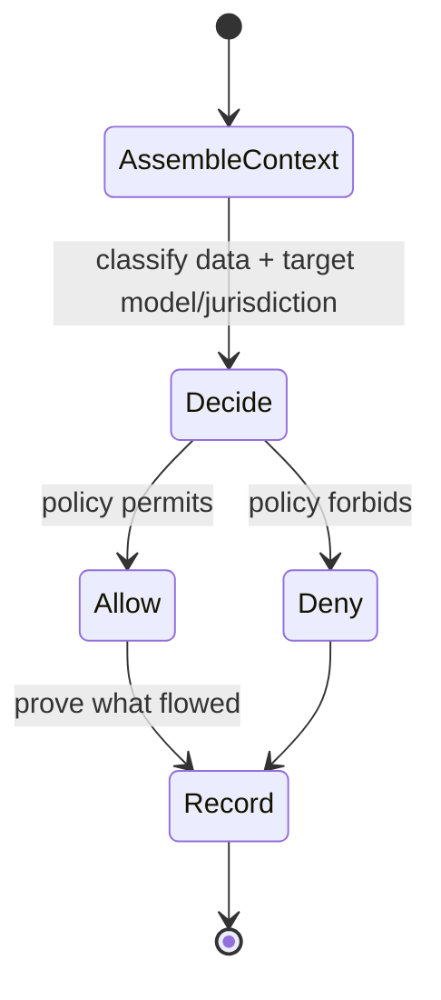

# Perimeter Information-Flow Control

## Purpose

"**Policy not walls**" — frontier models and protected data can work together inside the perimeter, but only if we control **what data reaches which model** and can prove it. This workflow decides, at **context-assembly time**, what data may reach which model or jurisdiction — including whether it may leave the **edge** for the **core** — and proves afterward that it did.

> **Assumed confidence.** Program 2 thread 2.3, long-term research (in-house, `L`). Net-new. Depends on [[Agent Identity]] (you can't control data flow until you know the acting identity).

## Trigger

Runs at context assembly, each time a [[Governed Harness]] pulls data into a model call.

## State Machine

## Steps

1. At context assembly, classify the candidate data and the target model/jurisdiction.
2. Decide what may reach which model, including edge→core movement.
3. Enforce the decision (uses [[Agent Identity]] for the acting identity).
4. Record proof of what actually flowed (evidence, aligns with [[Verification]] provenance).

## Dependencies

| Depends On | Type | Notes |
|------------|------|-------|
| [[Agent Identity]] | DEPENDS_ON | Must know the acting identity first |
| [[Dataset]] | CONSUMES | Data classified at assembly time |
| Residency / classification (data layer) | USES | `✓U/P` today; integrate-not-build |

## Ownership

Governance plane / Research (in-house `L` — a partner wouldn't reach this edge).

## See Also

- [[Operations Hub]]
- [[Governance Hub]]
- [[Agent Identity]]
