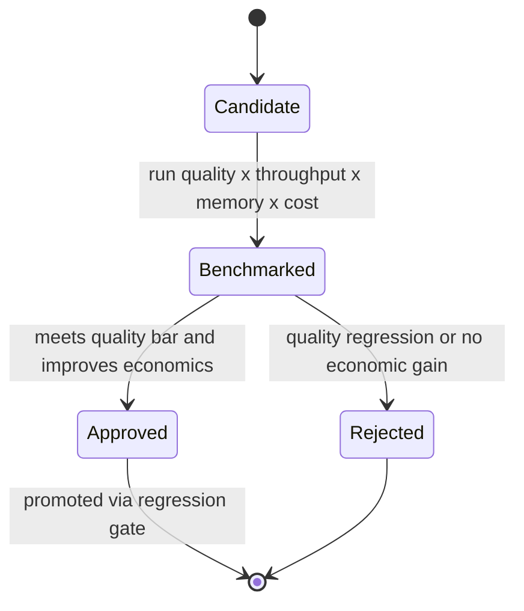

# Quantization Program

## Purpose

The Quantization Program treats precision selection as a controlled engineering decision rather than a deployment switch (roadmap Milestone 3.6). For each priority [[Model]] it evaluates candidate precisions and benchmarks every configuration against the combined objective **quality × throughput × GPU memory × cost/token**.

## Trigger

Runs per priority model in the Performance Lab (Phase 3), and again when a new runtime version, hardware type, or model architecture could shift the precision/quality tradeoff.

## Candidate Precisions

- BF16 — reference quality baseline
- FP8 — reported effectively lossless across model scales (see [[FP8 Quality Neutral]])
- FP4 — evaluated where viable (e.g., NVFP4 / MXFP4 on Blackwell-class hardware)
- INT8 / other supported approaches

## State Machine

## Steps

1. Select candidate precisions per model — performance-eng.
2. Benchmark each — record quality, throughput, GPU memory, and cost/token via the benchmark harness.
3. Score against the combined objective — quality × throughput × GPU memory × cost/token.
4. Promote or reject — approved configurations pass through the [[Performance Regression Gate]] before production.

## Dependencies

| Depends On | Type | Notes |
|------------|------|-------|
| [[FP8 Throughput Factor]] | PRODUCES | Program measures and updates this coefficient |
| [[Performance Regression Gate]] | DEPENDS_ON | Approved configs must clear the gate |
| [[Closed-Loop Optimization]] | FEEDS | Quantization is one experimentation axis in the loop |

## Ownership

Inference Performance Engineering owns the program. Results upgrade the confidence of quantization coefficients from `assumed` to `measured`.

## See Also

- [[Operations Hub]]
- [[FP8 Throughput Factor]]
- [[FP8 Quality Neutral]]
