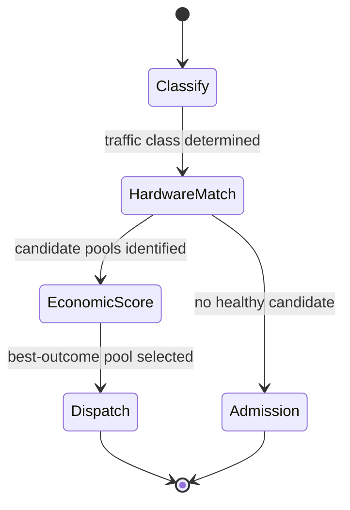

# Request Routing

## Purpose

Route each incoming request to the [[Capacity Pool]] and serving configuration that produces the best outcome, combining hardware-aware placement with real-time economics. The customer still sees one model endpoint. (Roadmap Milestones 6.4 and 6.5.)

## Trigger

- An inference request arrives for a [[Model]] via the [[OpenRouter Provider Integration]].

## State Machine

## Steps

1. Classify — platform-eng; determine the [[Traffic Class]] (e.g. short latency-sensitive, large-context prefill, high-throughput agent workload).
2. Hardware match — platform-eng; select candidate pools/configs whose [[Topology]] and hardware fit the class (short latency-sensitive → Pool A, large-context prefill → Pool B, high-throughput agent → Pool C). (Milestone 6.4.)
3. Economic score — platform-eng / finops; factor incremental power, GPU scarcity, token economics, utilization, OpenRouter pricing, and enterprise commitments, using [[Revenue per GPU-Hour]] and [[Cost per 1M Tokens]] as inputs. (Milestone 6.5.)
4. Dispatch — platform-eng; send the request to the best-outcome [[Model Deployment]]; if no healthy candidate exists, defer to [[Admission Control]].

The endpoint abstraction is preserved: customers address one model, routing selects the config.

## Dev-Plan Extension (Enterprise AI)

The [[RackAI Enterprise AI Development Plan]] (thread 1.4) extends routing beyond request-to-pool placement to routing a task to the right **harness, model, or human**, with **measured cost as a first-class input**. `assumed` confidence. (Delivery status: a first inference-routing implementation — llm-d, ingress→llm-d→model, shared KV cache — is **in progress** per the [[RackAI Roadmap (Delivery Plan)]], RACKAI-311; the evidence/cost-driven version below is the strategy target beyond it.) New edges:

- Routing reads measured token cost and reliability from the [[Empirical Map]] (not just live economics).
- Routing dispatches to a [[Governed Harness]] (or a human), not only a deployment config.
- The whole-loop, learned-optimizer version is [[Loop Planning & Credit Assignment]] (the deep version of this thread).

## Events Emitted

| Event | When | Consumers |
|-------|------|-----------|
| [[Capacity Reallocation Triggered]] | Routing pressure indicates systemic imbalance | [[GPU Reallocation]], capacity |

## Dependencies

| Depends On | Type | Notes |
|------------|------|-------|
| [[Traffic Class]] | DEPENDS_ON | Classification input |
| [[Topology]] | DEPENDS_ON | Hardware-aware matching |
| [[Revenue per GPU-Hour]] | CONSUMES | Economic scoring |
| [[Cost per 1M Tokens]] | CONSUMES | Economic scoring |
| [[OpenRouter Provider Integration]] | DEPENDS_ON | Single external endpoint |

## Ownership

Platform / Control Plane owns routing; FinOps informs economic scoring.

## See Also

- [[Operations Hub]]
