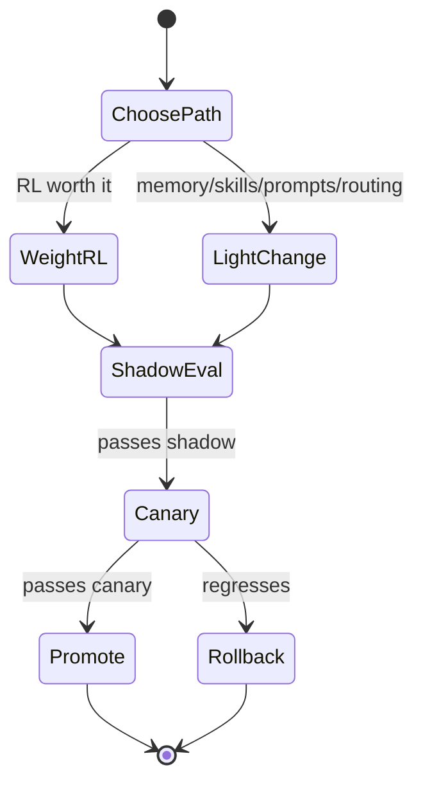

# Self-Improvement Loop

## Purpose

The **Self-Improvement Loop** improves the system with use. A system can improve in a few places:

- **Weights** — reinforcement learning against the reward signal from [[Verification]] (the weight-level path also appears as fine-tuning for evolving data, thread 4.2).
- **Lighter changes** — memory, skills, prompts, routing — which leave the weights untouched and are easier to audit and undo.

The first question is **when weight-level RL is worth it** and when a lighter change will do. Wherever the learning sits, it must stay **stable** and **roll out safely**. Making learning in one workload help the next **without moving data** is the deepest part of the moat.

> **Assumed confidence.** Program 3 thread 3.3, long-term research. Net-new. Shares a governance seam with [[Governable Self-Modification]] (thread 2.4) — same problem from the audit side.

## Trigger

Runs continuously as production traces and verified outcomes accumulate.

## State Machine

## Steps

1. **Choose the path** — weight-level RL vs. a lighter change.
2. Learn **without drift**.
3. Update a **live regulated workload safely** — shadow eval, canaries, rollback (uses [[Canary & Rollback]], gated by [[Performance Regression Gate]]).
4. **Transfer** learning in one workload to the next **without moving data** — the moat.

## Dependencies

| Depends On | Type | Notes |
|------------|------|-------|
| [[Verification]] | USES | Reward signal to train against |
| [[Empirical Map]] | USES | Built on the map |
| [[Loop Planning & Credit Assignment]] | USES | Credit signals |
| [[Governable Self-Modification]] | CONSTRAINS | Must stay certifiable while it rewrites itself |

## Ownership

Research track. The loop (3.3) is one of the two long-pole moat items alongside verification.

## See Also

- [[Operations Hub]]
- [[Verification]]
- [[Governable Self-Modification]]
- [[Canary & Rollback]]
