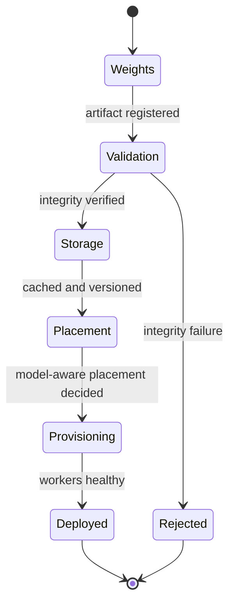

# Standard Model Deployment

## Purpose

Create a standardized production serving path so every [[Model]] moves through the same contract rather than becoming its own bespoke deployment. The workflow takes validated weights through storage and model-aware placement into a running [[Model Deployment]], governed by the Model Deployment Specification. (Roadmap Phase 1.)

## Trigger

- A launch candidate from the [[Model Launch Factory]] reaches the deployment stage.
- Operator-initiated redeploy or version roll-forward for an existing model.

## State Machine

## Steps

1. Weights — platform-eng; ingest weight source into the model artifact registry. (Milestone 1.4.)
2. Validation — platform-eng; weight integrity verification and versioning; failures reject the artifact. (Milestone 1.4.)
3. Storage — infrastructure; caching, distributed weight delivery, and previous-version retention so weights are not repeatedly downloaded externally. (Milestone 1.4.)
4. Specification — platform-eng; the deployment declares the [[Model Deployment Specification]]: identity/version, weight source, [[Serving Runtime]], quantization, supported context, GPU requirement, parallelism, API capabilities, routing policy, scaling policy, health checks, and benchmark profile. (Milestone 1.2.)
5. Model-aware placement — platform-eng / infrastructure; explicit, reproducible placement based on GPU type, memory requirements, [[Topology]], available capacity, and geography, drawing from a [[Capacity Pool]] onto [[GPU Node]] hardware. (Milestone 1.5.)
6. Provisioning — platform-eng; workers start, weights load, and health checks pass, producing a running [[Model Deployment]].

## Events Emitted

| Event | When | Consumers |
|-------|------|-----------|
| [[Deployment Canary Passed]] | Downstream canary clears (via Canary & Rollback) | Publication, reliability |

## Dependencies

| Depends On | Type | Notes |
|------------|------|-------|
| [[Model Deployment Specification]] | DEPENDS_ON | Declared contract for every deployment |
| [[Serving Runtime]] | DEPENDS_ON | Best engine selected per model |
| [[Capacity Pool]] | DEPENDS_ON | Source of GPU capacity |
| [[Topology]] | CONSTRAINED_BY | Placement respects topology requirements |
| [[Canary & Rollback]] | HANDS_OFF_TO | Promotion to production |

## Ownership

Platform / Control Plane owns the deployment contract and placement; Infrastructure owns storage and weight delivery.

## See Also

- [[Operations Hub]]
