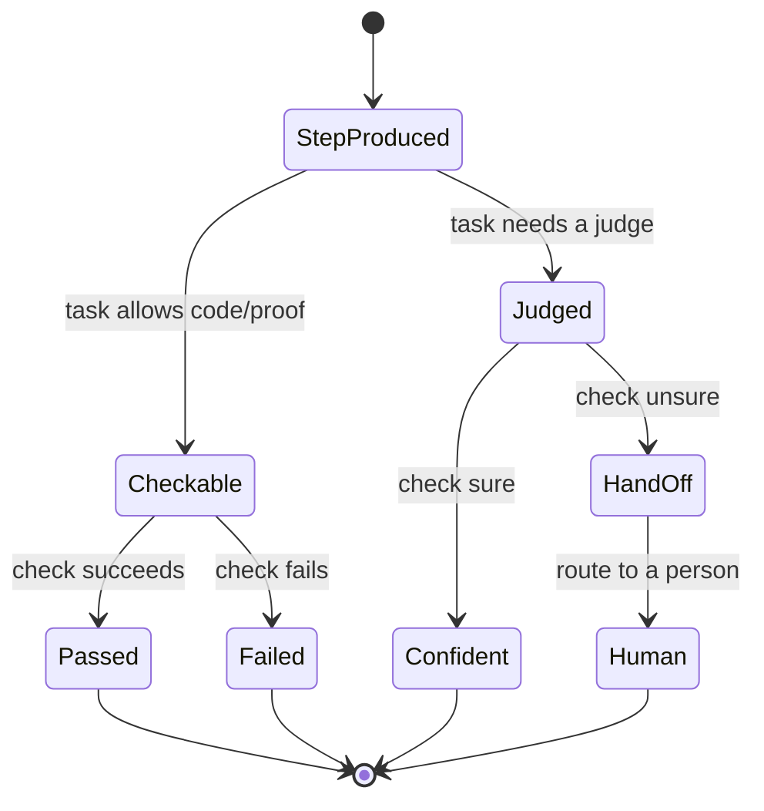

# Verification

## Purpose

**Verification** checks **each step** of a run, not just the final answer. The same check does three jobs at once:

1. it shows **where a model is reliable** (feeds the [[Empirical Map]]),
2. it is the **reward signal** the [[Self-Improvement Loop]] trains against, and
3. it is the **evidence** the assurance plane needs.

The cheap default — one model grading another — is biased and won't satisfy an auditor. This is explicitly the **hardest problem** in the [[RackAI Enterprise AI Development Plan]] and one of the moat concepts.

> **Assumed confidence.** Program 3 thread 3.1. Near-term research (check with code/proof where possible; calibrated confidence + human handoff otherwise); long-term research (reliable, cheap per-step checks; ungameable judgement of open-ended work). Net-new — no product covers trustworthy per-step verification today.

## Trigger

Runs on each step of a [[Governed Harness]] execution (per-step), and in batch during [[Eval as CI]] and [[Empirical Map]] construction.

## State Machine

## Steps

1. Produce a step in a run — owner: [[Governed Harness]].
2. Where the task allows, check with **code or a proof** rather than another model's opinion.
3. Where it doesn't, have the check **state how sure it is**; hand off to a person when it isn't sure.
4. Record the outcome as a reliability signal (→ [[Empirical Map]]) and as reward (→ [[Self-Improvement Loop]]).

## Dependencies

| Depends On | Type | Notes |
|------------|------|-------|
| [[Governed Harness]] | MEASURES | Checks the steps a harness produces |
| Feedback/ground-truth data ops (P7) | DEPENDS_ON | Labeled outcomes to learn from and check against |

## Feeds

| Target | Relationship |
|--------|--------------|
| [[Empirical Map]] | PRODUCES → reliability signal |
| [[Self-Improvement Loop]] | PRODUCES → reward signal |
| [[Performance Regression Gate]] | SUPPORTS → evidence for release gating |

## Ownership

Governance & Assurance / Research. The RL-depth researcher (verification + the map) is the plan's anchor research hire.

## See Also

- [[Operations Hub]]
- [[Governance Hub]]
- [[Empirical Map]]
- [[Self-Improvement Loop]]
