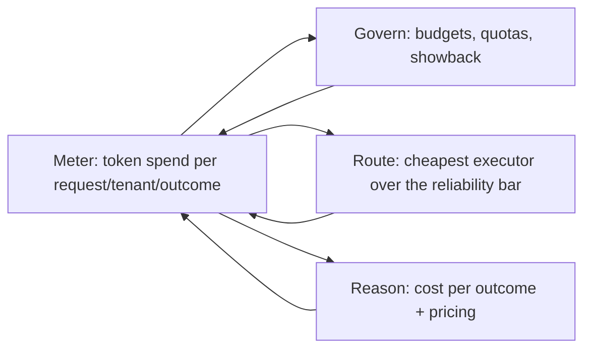

# AI FinOps

## Purpose

**AI FinOps** is the cost platform for the running system: it pulls together metered token spend, attributes it by **workload, tenant, and outcome**, and provides **budgets, showback, and dashboards** — then reasons about **cost per outcome** and pricing on top. It is Program 5 thread 5.1 in the [[RackAI Enterprise AI Development Plan]] (an AI FinOps platform *develop* item, with near/long-term research on cost-per-outcome and pricing a system whose cost per run varies by design).

> **Assumed confidence.** Thread 5.1, dev → research. Partial cost-governance exists today (`~R`); the attributed FinOps platform and cost-per-outcome reasoning are the build.

## The Cost Loop (tokenomics)

The dev plan names a loop that runs across four threads. It is not one note — it is a loop over existing canonical homes, with metering as the shared spine:

| Step | Canonical home | Thread |
|------|----------------|--------|
| **Meter** | [[Metering]] + cost dimension of [[Empirical Map]] | 1.3 / 1.5 |
| **Govern** | this note (budgets, quotas, showback) | 5.1 |
| **Route** | [[Request Routing]] reads measured cost | 1.4 |
| **Reason** | [[Cost per Outcome]] → pricing | 5.1 |

Build the metering once in the serving path; the budget controls, the routing decision, and the economics all read from it.

## Relationships

| Relationship | Target | Direction | Notes |
|--------------|--------|-----------|-------|
| CONSUMES | [[Metering]] | → | Token-cost spine |
| USES | [[Empirical Map]] | → | Cost dimension attributed by workload/tenant/outcome |
| PRODUCES | [[Cost per Outcome]] | → | The reasoning output |
| SUPPORTS | [[Request Routing]] | → | Supplies measured cost for routing |
| DERIVES | [[Unit Economics Model]] | → | Extends the existing token-level economics with outcome-level cost |

## Open Questions

- How to **price and forecast** a system whose cost per run varies by design (one edge case can cost many times a normal run)? Long-term research, thread 5.1.
- Does outcome-level cost reconcile cleanly with the existing token-level [[Unit Economics Model]], or does it need a separate ledger?

## See Also

- [[Commercial & Capacity Hub]]
- [[Cost per Outcome]]
- [[Metering]]
- [[Eight-Layer Stack]]
