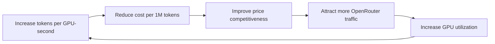

# Unit Economics Model

## Purpose

This index ties together the unit-economics story for Rack AI on OpenRouter and points to the Layer-2 formulas and coefficients that make it computable. It is a navigation and synthesis note — it does not redefine the formulas, it links to their canonical homes.

The strategy frames a self-reinforcing economic loop: as Rack AI produces more tokens per GPU-second, the cost to produce one million tokens falls; a lower cost supports a more competitive OpenRouter price; a more competitive price attracts more OpenRouter traffic; more traffic raises productive GPU utilization; higher utilization further improves the efficiency and economics of every token served.

## The Economic Loop

## How the Pieces Connect

- Efficiency is measured by [[Tokens per GPU-Second]] and converted into capacity draw by [[GPU-Hours per 1M Tokens]].
- Cost is computed by [[Cost per 1M Tokens]], using the [[Cost per GPU-Hour]] coefficient (the roadmap Milestone 0.3 cost model).
- Revenue is computed by [[Revenue per GPU-Hour]], using the [[OpenRouter Price]] coefficient as the revenue side.
- Contribution is computed by [[Gross Margin per Model]], combining price and cost per 1M tokens.
- The loop closes through utilization: higher productive utilization improves the effective economics that feed back into efficiency work.

Commercial reasoning here references [[Model]]s and [[Capacity Pool]]s, never individual GPUs.

## Entries

| Item | ID | Type | Confidence |
|------|----|------|:----------:|
| [[Tokens per GPU-Second]] | fml-tokens-per-gpu-second | formula | assumed |
| [[GPU-Hours per 1M Tokens]] | fml-gpu-hours-per-1m-tokens | formula | assumed |
| [[Cost per 1M Tokens]] | fml-cost-per-1m-tokens | formula | assumed |
| [[Revenue per GPU-Hour]] | fml-revenue-per-gpu-hour | formula | assumed |
| [[Gross Margin per Model]] | fml-gross-margin-per-model | formula | assumed |
| [[Cost per GPU-Hour]] | coeff-cost-per-gpu-hour | coefficient | assumed |
| [[OpenRouter Price]] | coeff-openrouter-price | coefficient | assumed |

## See Also

- [[Commercial & Capacity Hub]]
