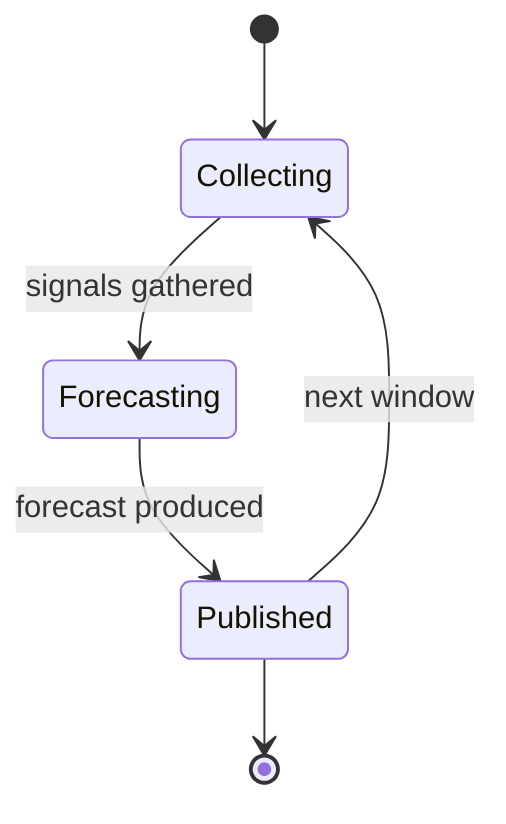
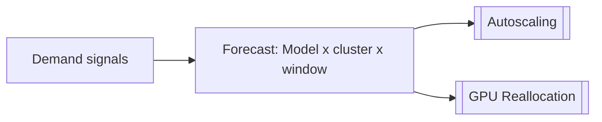

# Demand Forecasting

## Purpose

Forecasts inference demand so capacity decisions run ahead of load rather than reacting to it. It produces forecasts at the granularity of **Model × cluster × time window** and feeds the capacity-management workflows (roadmap Milestone 5.2). Forecasts are expressed against [[Model]]s and [[Capacity Pool]]s, never individual GPUs.

## Trigger

Runs on a schedule (rolling time windows) and on demand-signal changes — for example a sustained shift in OpenRouter request volume, rising queue depth, or a scheduled enterprise commitment entering the window.

## State Machine

## Inputs

The forecast is built from:

- OpenRouter request volume
- Token growth
- Hourly patterns
- Queue depth
- Utilization
- Model popularity
- Scheduled enterprise demand

## Steps

1. Collect demand signals — finops/platform, gathers OpenRouter volume, token growth, hourly patterns, queue depth, utilization, model popularity, and scheduled enterprise demand.
2. Forecast at Model × cluster × time window — produces per-model, per-cluster demand over the horizon.
3. Publish forecast — makes the forecast available to downstream capacity workflows.
4. Feed capacity actions — hands the forecast to [[Autoscaling]] and [[GPU Reallocation]] for scaling and pool-rebalancing decisions.

## Data Flow

## Events Emitted

| Event | When | Consumers |
|-------|------|-----------|
| [[Demand Forecast Published]] | Forecast produced for a window | [[Autoscaling]], [[GPU Reallocation]] |

## Dependencies

| Depends On | Type | Notes |
|------------|------|-------|
| [[Capacity Pool]] | DEPENDS_ON | Forecast targets pools per model/cluster |
| [[Autoscaling]] | FEEDS | Scaling reacts to forecast |
| [[GPU Reallocation]] | FEEDS | Reallocation reacts to forecast |

## Ownership

FinOps owns the forecasting workflow end to end, in partnership with the platform/control-plane team that supplies telemetry.

## See Also

- [[Commercial & Capacity Hub]]
- [[Capacity Pool Model]]
