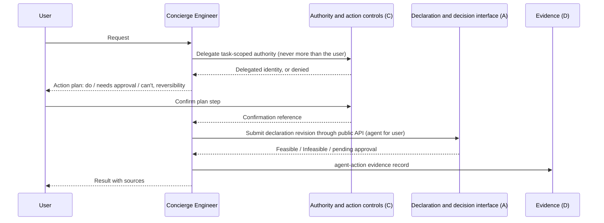

# Concierge Engineer — PRD

| Field | Value |
|:--|:--|
| Version | v0.2 |
| Status | Draft |
| Owner | rackai-product |
| Reviewers | Product owner; Platform engineering (control plane, UI); Governance (C owner); Observability and evidence (D owner) |
| Product review | **Product-owner review disposition, 2026-10-10: conditional acceptance; not formal artifact approval.** PD-1 to PD-12 approved in principle, with the sovereignty gate (PD-8) and C Phase 2 enforced as release gates; DV-3 revised to a non-executable quota-request draft; cost answers corrected to separate usage, estimated charges and actual charges |
| Product approval | not yet approved. Recorded by the product owner only (who, date, version); passing checks is not approval |
| Date | 2026-10-10 |
| Roadmap items | Concierge Engineer v0 (Answer); Concierge Engineer v1 (Act with confirmation); Concierge Engineer v2 (Governed autonomy) |
| Tech spec(s) | [[Concierge Engineer Tech Spec]] (v0.2 draft, not yet approved): designs v0 and v1; v2 is named only |

> **Artifact type: Product Requirements Document.** There is no canonical note for the Concierge Engineer: only this PRD uses the concept, so it is defined here (§6) until a second consumer appears. Its identity and action controls project from [[Agent Identity]], [[Action Controls]] and [[Governed Harness]], and its actions from [[Workload Declaration]]. This PRD must not redefine them. If they disagree, those notes win and this PRD is stale.
>
> **Status banner.** *Draft PRD for a proposed initiative.* Nothing is built: there is no assistant, no agent identity and no gap-signal pipeline today (§2). Requirements are intent, not commitments. Proposal **P-008**; the roadmap rows are unstaffed.
>
> **Scope line (read first).** This PRD owns **the Concierge Engineer as a consumer of the platform**: the conversation, the answers it gives from the customer's own data, the actions it proposes and (after confirmation) submits through public APIs, and the content-free capability-gap signals it emits. It is **never an alternative control plane**. It does **not** own: the declaration contract or placement decision (**A**); who or what may act, delegated authority, the confirmation gate and enforcement (**C**); where execution may run and what may cross the boundary (**E**); the evidence report and the evidence contract (**D**, D-0); recommendations (**G**); quota policy (Metering M3/M4); the inference service it runs on (**I** and the platform).

## 1. Summary / Vision

The Concierge Engineer is an agent every RackAI customer gets: a conversational *AI FDE*. A customer asks it what is happening, what they have used and been charged, and what to do. At first it only **answers**, from the customer's own telemetry, usage and audit, and always says where an answer came from. Later it **acts**: it turns a request into a declaration change, shows what it will do and what needs approval, and submits it through the same public APIs and authority checks as any other client. Anything it can't do becomes a precise answer, and a genuine product gap becomes a content-free signal to product.

Why now: it is the user-facing side of the operating loop. It is also the first real consumer of the control envelope. If RackAI cannot safely run its own agent inside a customer's boundary, it cannot claim MOE-1 ([[RackAI Roadmap]], P-008).

## 2. Problem Statement

**What is missing today** (read-only survey, `RSS-Engineering/rackai@79ca4de`, `rackai-ui@89bddb4`, `rackai-docs@ccb52a3`):

- **No assistant exists.** The only "chat" in the product is a model playground. `rackaictl chat` is a REPL against one deployed model's `/v1/chat/completions` endpoint (`rackai@79ca4de:hack/cli/cmd/chat.go`). The console's AI Studio does the same (`rackai-ui@89bddb4:src/app/pages/ai-studio/ChatWorkspace.tsx`). Neither has tools or platform context.
- **The data to answer from exists, but in pieces, and some of it is empty.** Separate read APIs serve usage (`usage:view`), telemetry (`observability:view`) and audit (`rackai@79ca4de:internal/authz/routemap.go`). The telemetry endpoints return the right shape with **empty series** until Platform Monitoring emits the recording rules (`internal/observabilityservice/metrics.go`). The quota metric read is a TODO (RACKAI-491). The console calls none of these APIs.
- **Audit is admin-only.** The audit read API requires `rolebindings:manage` (`routemap.go`), which only the built-in *admin* role holds (`internal/controller/platformrole_builtin.go`). A developer cannot ask "what changed?".
- **These read APIs are not in the published API reference.** `docs/api/openapi-external.yaml` lists CRD REST, inference, `/me/access` and `/permissions`, but not usage, observability, audit or `permissioncheck`. "Public APIs only" therefore needs a decision on which APIs count as public (D-5).
- **No delegated identity.** Identities are *user* or *service* (`internal/authz/evaluator.go`). Audit actors are *user*, *service* or *controller* (`pkg/audit/event.go`). Nothing records that an agent acted *for* a user. API keys are long-lived service identities that carry their own role (`api/v1alpha1/apikey_types.go`), which is the opposite of "never more than the user".
- **Authority is not enforced by default.** `rbac.enforcement.mode` defaults to `off` (`docs/operations/rbac.md`). An agent's authority can only be as bounded as the platform's enforcement.

**Why it matters.** Customers today get answers by asking an FDE or an operator, who stitches these sources together by hand. That does not scale past a few estates, and it hides product gaps inside human workarounds. **Hypothesis** (no usage evidence yet): operators at MOE-0, and customers at MOE-1, will use a sourced answer surface for cost, performance, incident and quota questions instead of asking a person. A public-API-only agent will also expose real product gaps that are now hidden.

## 3. Product Principles

1. **A consumer, never a control plane.** The Concierge uses the same public APIs, the same front door and the same authority checks as any customer client. If it needs a back door to do something, that is a product gap.
2. **Never more than the user.** Its authority is delegated by C: no more than the user holds, scoped to the task, expiring, and further restrictable by the customer ([[Agent Identity]]).
3. **Cite it or don't say it.** Every figure is traceable to a source call and a time window. No source, or no data, means it says so. It never estimates a value it could not read.
4. **Every "can't" is classified honestly.** A product gap, missing authority, a policy refusal and an infeasible declaration are four different answers. Only the first is a product signal.
5. **No customer content leaves the tenant.** Gap signals use a fixed vocabulary, with no customer text. Conversations stay inside the customer's boundary.
6. **Confirm before acting; draft what carries commercial weight.** Every v1 action is confirmed by the user through C's gate ([[Action Controls]]). Quota changes are drafted for an approver and never applied.
7. **Report, never relax.** When a request conflicts with a hard constraint, it reports A's infeasibility answer. It never changes a constraint to make a request fit.

## 4. Scope: Goals & Non-Goals

**Goals**
- A customer or operator gets a correct, sourced answer to the core usage and charges, performance, incident and quota questions without asking a person.
- In v1, a customer can deploy, retire or scale a model by conversation. Each action goes through A's declaration and decision interface and C's authority, and leaves evidence.
- Product learns, without seeing customer content, what customers ask for that RackAI cannot do yet.

**Non-Goals / Out of Scope**
- Defining or enforcing authority, delegation, confirmation gates or action policy: **C**. The Concierge asks C; it never decides.
- Making placement decisions or bypassing approval: **A**. It submits declarations and proposals; A decides and operators approve.
- Building the evidence report or the evidence contract: **D**. It contributes `agent-action` records in D-0's shape and reads D's evidence.
- Recommending placements: **G**. In v2 it may relay G's recommendations; it never ranks.
- Deciding where execution may run for a sovereign tenant: **E** (D-1).
- Setting quota policy: Metering M3/M4.
- General-purpose chat with the customer's own models: the existing AI Studio and `rackaictl chat` stay as they are.
- Operating RackAI's fleet for operators (operator tooling and runbooks): not this PRD.
- v2 autonomy is named here (§14) but not specified. It is gated on the authority decision (roadmap row *Authority under incomplete intent*).

## 5. Users & Personas

| Persona | Side | Needs from H |
|---|---|---|
| **Customer application owner / ML engineer** | Customer | "What have I used, and what am I being charged? Why is it slow? What happened last night?" answered with sources; in v1, deploy or scale by asking |
| **Customer platform or security admin** | Customer | Turn the Concierge on or off and restrict what it may do (through C); see everything it did, and for whom |
| **Customer finance / billing admin** | Customer | Usage and spend answers; quota requests drafted for approval, not applied |
| **RackAI operator (MOE-0)** | RackAI | The first users. Answer customer questions faster; check what the agent did |
| **RackAI product** | RackAI | Ranked, deduplicated gap signals with no customer content |
| **Governance reviewer** | Both | Evidence that no agent action exceeded the user's authority |

## 6. Core Entities

**Defined here, not canonical** (only H uses them; they move to a canonical note when a second PRD consumes them):

- **Concierge Engineer**: RackAI's conversational agent for customers. It is a [[Governed Harness]] instance: a model, a fixed tool set limited to RackAI's public APIs, and guardrails. It acts under an [[Agent Identity]] delegated by C, and its actions are gated by [[Action Controls]].
- **Session**: one conversation between one user and the Concierge, within one tenant. It carries the user, the tenant, the projects in scope and the delegated authority (v1).
- **Answer**: a reply with its **citations**. Each cited call has an endpoint, a scope, a time window and record IDs where they exist. Each answer also carries a data-freshness note.
- **Outcome class**: every request ends as *answered*, *acted*, or one of four *can't* classes: **product gap** ("RackAI can't do this yet"), **access request** (the user lacks the permission), **policy refusal** (the customer's policy forbids it; the boundary is working), or **infeasible** (conflicting hard constraints, per A).
- **Action plan** (v1): what the Concierge will do, what needs whose approval, what it can't do, the consequences, and whether each step is reversible. The user confirms it step by step.
- **Gap signal**: a content-free record of a product gap. It has an intent class, the missing capability, the alternative offered and a customer-impact category, all from fixed vocabularies. It is routed to product for the [[Capability Gap Register]], applying the transferable-versus-isolated split of the [[Empirical Map]].

**Canonical entities used here (linked, not redefined):**

| Entity | Role here |
|---|---|
| [[Agent Identity]] | The delegated, task-scoped identity the Concierge acts under (C provides it) |
| [[Action Controls]] | The confirmation gate, rate limits and reversibility rules on its actions (C enforces them) |
| [[Governed Harness]] | What the Concierge is, structurally |
| [[Workload Declaration]] | What v1 actions create, amend or withdraw (A) |
| [[Organization]] | Tenant scope of every session |
| [[Authority Context]] | C's structure for each agent action (acting principal, `onBehalfOf`, authority principal, scope, basis, expiry); consumed as given, never reconstructed |
| [[API Key]] | Today's service identity. Not used as the agent's identity, because it carries its own role (§2) |
| [[Capability Gap Register]] | Where gap signals end up, after human triage |
| [[Sovereignty Levels]] | Decides where the agent's own model may run (D-1) |

## 7. User Journeys / Scenarios

**v0 — Answer.** An ML engineer asks: *"Why was my chat endpoint slow yesterday afternoon, and how much did it use this week, and what will I be charged?"*
1. The Concierge reads, as that user, the deployment's status, the inference metrics for the window, and the usage summary for the week.
2. It answers **usage** (tokens, GPU-hours) from the usage API and latency from the metrics API, each cited with endpoint, scope and window. For **charges**, it reports an *estimated charge* only from D's customer charge view (B's `cost` record, `charge` view, `audience: customer`) and an *actual charge* only from a billing source. Until a price source exists (D's D-4), it says "no charge source is available yet" and gives no figure. It never multiplies usage by a price it guessed, and never shows RackAI's internal cost (D PD-4). If the metrics API returns no series, it says "no latency data for that window" and gives no figure.
3. The user asks *"Who changed the deployment?"* The user lacks the audit permission. The Concierge answers that this needs the audit permission held by their admin. This is an **access request**, not a gap; no gap signal is emitted.
4. The user asks for a per-request usage breakdown by prompt. No API offers it. The Concierge says RackAI can't do this yet, offers the per-day usage history instead, and emits a **gap signal** with no customer content.

**v1 — Act with confirmation.** The engineer asks: *"Deploy GLM 5.3 Flash for interactive use, dedicated, NVIDIA only."*
1. The Concierge drafts a declaration (A) and checks the user's authority with C.
2. It shows an **action plan**: *I will submit this declaration. An authorized RackAI operator must approve the placement. This step is reversible: you can withdraw it.*
3. The user confirms through C's gate. The Concierge submits the declaration as an agent acting for that user, under a delegated, task-scoped identity.
4. A answers *Feasible*, or *Infeasible* with reasons and suggestions. The Concierge relays that answer. It never applies a suggestion without the user confirming a new revision.
5. Audit shows agent-for-user. An `agent-action` evidence record joins A's decision record through the correlation ID.

**Lifecycle (v1 action path).**

## 8. Functional Requirements

**v0 — Answer (Phase 1)**

| # | Requirement | Priority | Notes |
|---|-------------|:--------:|-------|
| FR-1 | Answers questions in four classes (usage and charges, performance, incidents and workload state, quota) for the user's own tenant and the projects they can see | MUST | Roadmap row 48 |
| FR-1a | Keeps three things apart and labels each: **usage** (from the usage API), **estimated charges** (only from D's customer charge view) and **actual charges** (only from a billing source). It never derives a charge from usage alone and never shows RackAI internal cost or margin. With no charge source, it says so | MUST | PO review 2026-10-10; D PD-4, D FR-14, D-4 |
| FR-2 | Reads data only through RackAI's public APIs, through the same front door as any client, acting as the user. It has no direct access to databases, metrics stores or the Kubernetes API | MUST | Which APIs count as public: D-5 |
| FR-3 | Every figure in an answer cites its source call (endpoint, scope, time window, record IDs where they exist) and states data freshness. An empty or unavailable source is reported as such; no figure is inferred | MUST | Principle 3 |
| FR-4 | When the user lacks a permission a question needs, the answer names the missing permission and who can grant it. It never reads through another identity | MUST | Access request, not a gap |
| FR-5 | Every request ends in one outcome class: answered, acted (v1), product gap, access request, policy refusal or infeasible. The class is shown to the user and recorded | MUST | PD-3 |
| FR-6 | For a product gap only, emits a gap signal with intent class, missing capability, alternative offered and impact category, from fixed vocabularies and with no customer content. Signals are deduplicated and routed to product intake for the [[Capability Gap Register]]. Deciding what to build stays with people | MUST | PD-4 |
| FR-7 | v0 cannot change anything. This is **enforced outside the model, never by prompting**: no write tool exists, the Concierge's HTTP client refuses any non-read call before it leaves, and egress allows only the front door. No instruction, prompt or model output can lift it | MUST | PD-2 (approved in principle) |
| FR-8 | The user can see which calls the Concierge made for an answer | SHOULD | Transparency |
| FR-9 | Available in the console as an assistant panel, and through an API. A CLI is optional | SHOULD (console, API); MAY (CLI) | |
| FR-10 | A customer admin can switch the Concierge off for their organisation | MUST | PD-11 |
| FR-11 | Content returned by tools (names, descriptions, logs, telemetry, model output) is treated as data, never as instructions. Only the user's own messages can request an action | MUST | Prompt-injection resistance |

**v1 — Act with confirmation (Phase 2)**

| # | Requirement | Priority | Notes |
|---|-------------|:--------:|-------|
| FR-12 | Can deploy, retire and scale a model, and nothing else that changes state. Deploy means submitting a declaration; retire means withdrawing it; scale means amending it. All go through A's public declaration API and decision interface. The Concierge never creates or edits a deployment directly | MUST | PD-5, PD-6; roadmap row 49 |
| FR-13 | Before any action, shows an action plan: what it will do, what needs whose approval, what it can't do, the consequences, and whether each step is reversible | MUST | |
| FR-14 | Each action runs only after the user confirms that plan step through C's confirmation gate. Declining or timing out changes nothing | MUST | PD-7; [[Action Controls]]. C provides it as an `agent.step.confirm` authorisation minted by the user (C Phase 2) |
| FR-15 | Acts under a delegated, task-scoped, expiring identity from C. It never holds more than the user, can be narrowed by customer policy, and is revoked when the task ends. It never holds approval authority (e.g. placement approval) | MUST | [[Agent Identity]]; PD-9. C provides it as an `AuthorityGrant` to an agent delegate (C Phase 2, C FR-25). Each action carries C's [[Authority Context]] as given; H never reconstructs it. **Release blocker for v1** (§14) |
| FR-16 | Every action is audited as *agent for user*: both the agent identity and the user appear in audit and evidence, taken from C's [[Authority Context]] (acting principal, `onBehalfOf`, authority principal) | MUST | |
| FR-17 | A quota change is only ever a **non-executable quota-request draft** for an authorized approver, after a policy check. It is labelled as a request, not a change; it cannot be submitted or applied by the Concierge; and nothing implies the quota will change | MUST | Roadmap row 49; spec DV-3 revised per PO review 2026-10-10 |
| FR-18 | Irreversible steps are labelled as such and confirmed separately. Reversible steps can be rolled back on request through the same path | MUST | |
| FR-19 | An infeasible result is relayed as A gave it, with its suggestions. A suggestion becomes a change only when the user confirms a new revision | MUST | Principle 7 |
| FR-20 | Each action plan, confirmation, submission, result, rollback and draft emits an `agent-action` evidence record in the D-0 shape, joined to A's decision record by correlation ID | MUST | §11 |
| FR-21 | A customer admin can enable or restrict v1 actions for their organisation or project, through C's policy | MUST | PD-11 |

**v2 — Governed autonomy (later phase, named only)**

| # | Requirement | Priority | Notes |
|---|-------------|:--------:|-------|
| FR-22 | Acts without per-action confirmation only on the reversible class within delegated authority; asks, escalates or stops otherwise; reports infeasibility instead of relaxing a constraint. Every escalation and infeasibility report is logged | MAY (later) | Gated on D-8; roadmap row 50 |

## 9. Non-Functional Requirements

- **Authority (invariant).** No action exceeds the user's authority. This must hold under adversarial testing: prompt injection, cross-tenant requests and escalation attempts. v1 is not offered on an estate where the platform does not enforce authority (`rbac.enforcement.mode=enforce`).
- **Tenancy.** No answer, citation, gap signal or log reveals another tenant's data.
- **No customer content in gap signals.** Checked by review of a sample before v0 exit, and continuously by schema.
- **Data stays in the boundary (release gate).** The agent's inference, conversation history, tool results and temporary context stay inside the boundary the tenant's sovereignty level requires (D-1, E). A platform-hosted Level 0 model is not an acceptable default for sovereign tenants: where no suitable execution exists inside a Level 1 customer's boundary, the Concierge is **not offered** to that customer (PD-8).
- **Honesty.** No figure without a source. "No data" and "unavailable" are answers.
- **Isolation of failure.** The Concierge failing never affects the platform or customer workloads.
- **Responsiveness.** Answers arrive in conversational time. The bound is a target posture for the spec to set and measure; there is no baseline.
- **Quality.** Answer correctness is measured against a reviewed question set before each phase exit. The bar is a target posture (D-7); no baseline exists.

## 10. Platform Integration

| System | Needs from it | Provides to it |
|---|---|---|
| Identity & access (IAC) | The user's identity and permissions (`/me/access`, `/permissions`, `permissioncheck`); in v1, a delegated agent identity from C | A permission to use the Concierge and one to manage it |
| Tenancy & isolation | Tenant and project scope from the platform on every call; E's rule for where the agent's model may run | Sessions scoped to one tenant |
| Metering, quotas & billing | Usage and quota reads (usage API, quota metrics) | Its own model's inference usage, attributed (whether it is billed: D-9) |
| Audit | Audit read API (admin-only today; D-4); audit pipeline for its own events | Audit events for sessions, calls, outcomes and actions, as agent for user |
| Monitoring & observability | Telemetry reads (observability API; empty until Monitoring emits series) | Health and quality metrics for the Concierge itself |

## 11. Loop Role & Cross-PRD Interfaces

**Loop role:** *Deliver the how*, as a **consumer** of the platform. It is the user-facing side of the loop: v0 serves steps 1 and 4 (tell us; prove it), and v1 serves steps 2 and 3 (deliver; stay inside your boundaries) by using A and C. It serves the **operator** promise (we run it for you) and is the first test of the **contract** between the two centres: the agent runs inside the customer's envelope.

| Interface | Direction | Other PRD | Defined where |
|---|---|---|---|
| Workload declaration (create, amend, withdraw) | consumes | A | [[Workload Declaration]] (canonical); [[Workload Declaration & Placement PRD]] FR-5 |
| Decision interface and infeasibility answer | consumes | A | [[Workload Declaration & Placement PRD]] FR-8, FR-14 |
| Delegated agent identity; confirmation gate; action policy | consumes | C | [[Governed Execution & Delegated Authority PRD]] |
| Boundary rule for where the agent's model and data may live | consumes | E | [[Sovereign Isolation & Assurance PRD]] |
| Evidence contract (D-0) and evidence read | consumes | D | [[Customer Observability & Evidence Report PRD]] |
| `agent-action` evidence records | provides | D | This PRD (kinds and claims); envelope by D-0 |
| Gap signals | provides | Product (no PRD) | This PRD (FR-6) |
| Placement recommendation (relayed in v2 only) | consumes | G | [[Empirical Map & Evidence-Informed Routing PRD]] |

## 12. Failure Handling

Classes and responses follow the [[Failure Mode Taxonomy]].

| Failure | Class | Response | What continues, stops or degrades | Who is told |
|---|---|---|---|---|
| A source API is down or empty | Evidence (read source) | Degrade | The answer names the unavailable or empty source; no figure is estimated; other sources still answer | User, in the answer |
| Permission check fails or is indeterminate | Authority | Fail closed | Nothing is read from that source; it is treated as no permission | User (access request) |
| C (delegation, confirmation, Authority Context) unavailable | Authority | Fail closed | No new action; v0 answers continue | User; operator alert |
| A rejects or cannot evaluate a submission | Admission | Fail closed | The result is relayed; no retry through another path | User |
| An action partly completes | Execution | Degrade | Exact state reported; completed reversible steps can be rolled back with confirmation | User; evidence record |
| The agent's own model is unavailable | Execution | Stop (the Concierge only) | The Concierge is unavailable and says so; the platform and workloads are unaffected | User; operator alert |
| Its audit or evidence write fails before an action | Evidence | Fail closed (actions wait) | No action until the intent is recorded; answers continue and are back-filled and flagged | Operator alert |
| No suitable in-boundary execution for a Level 1 tenant | Admission | Not offered | The Concierge is not offered to that tenant | Customer admin |

**Guaranteed never to happen:** an action without the user's confirmation (v1); an action beyond the user's authority; a direct write that bypasses A or C; customer content in a gap signal; a figure presented without a source; a charge derived from usage alone; internal cost shown to a customer.

## 13. Data Retention & Compliance

Conversations contain customer content (questions, names, figures). They are held inside the tenant's boundary, visible to the user and their organisation's admins, deletable by the customer, and kept for a default period that is an open decision (D-3). Audit events and evidence records follow the platform's audit retention. Gap signals contain no customer content and are retained by product. This supports MOE-1 assurance: an auditor can see every agent action and on whose behalf it was taken.

## 14. Scope & Phasing

| Phase | Gate | Delivers | Roadmap items |
|---|---|---|---|
| **1 (v0)** | MOE-0 operators first, then MOE-1 customers | Answer (FR-1 to FR-11). Entry: the observability metrics API returns data, the audit API, the gap-signal schema. **Release gate:** for each sovereign (Level 1) customer, `blocked-by: E in-boundary execution rule for the agent (D-1)`; without it, v0 is not offered to that customer. Exit (per [[RackAI Roadmap]] P-008): core questions answered with sources; gap signals with no customer content in a reviewed sample; used by MOE-0 operators | Concierge Engineer v0 (Answer) |
| **2 (v1)** | MOE-2 | Act with confirmation (FR-12 to FR-21). **Release blockers:** `blocked-by: C Phase 2 agent identities and per-step confirmation (C FR-25; AuthorityGrant delegate kind Agent, agent.step.confirm, Authority Context)`; `blocked-by: A declaration API and decision interface`; `blocked-by: E in-boundary execution (Level 1 customers)`. v1 cannot be integration-ready, let alone offered, before C Phase 2 is implementation complete. Entry: v0 exit; A's declaration surface; authority enforced on the estate. Exit: no action exceeds user authority under adversarial testing; reversible actions shown to roll back | Concierge Engineer v1 (Act with confirmation) |
| **Later (v2)** | Beyond MOE-4 | Governed autonomy (FR-22). Not a prerequisite for MOE-1, which is human-operated and uses v0 to v1 at most | Concierge Engineer v2 (Governed autonomy) |

Prototype first: run v0 with MOE-0 operators on one estate before offering it to customers (operate before automate).

## 15. Acceptance Criteria & Success Metrics

**Acceptance criteria** (v0: AC-1 to AC-8, AC-17, AC-18; v1: AC-9 to AC-16; each pass/fail; proposed, not approved; gates per [[Release Readiness States]]):

| # | Criterion (expected result, pass/fail) | Verifies | How tested | Evidence source | Gate |
|---|---|---|---|---|---|
| AC-1 | For each of the four question classes, on a tenant with seeded data, the answer's figures equal the source API's values, and each figure cites endpoint, scope and time window | FR-1, FR-3 | Scripted question set against seeded data | CI test report plus the `agent` audit rows of the run | spec M1 / MOE-0 |
| AC-2 | When a source returns no data or is down, the answer says so and contains no figure for that source | FR-3, §12 | Empty-series and fault-injection cases | CI test report | M1 / MOE-0 |
| AC-3 | A user without the needed permission is told which permission is missing and who grants it. No data from that source appears, the outcome is *access request*, and no gap signal is emitted | FR-4, FR-5 | Per-role test with each built-in role | CI test report; `agent` audit rows; empty gap table | M1 / MOE-0 |
| AC-4 | Across an adversarial suite (other tenants' names, injected instructions in resource names, descriptions and telemetry), no answer contains another tenant's data and no injected instruction triggers a call the user did not ask for | FR-2, FR-11, NFR tenancy | Adversarial test suite | Suite report; `tool_called` audit rows | M1 / MOE-0 |
| AC-5 | In v0, every attempt to issue a non-read call, including attempts induced by injected text or a prompt telling the model it may write, is refused by the Concierge's client before leaving it, and the platform's audit shows no write by the user's identity during the test | FR-7 | Forced-attempt test plus audit query | Test report; platform audit query result | M1 / MOE-0 |
| AC-6 | In a reviewed sample of gap signals, none contains customer content, each carries the four fields from fixed vocabularies, and a test matrix of the four *can't* classes produces a signal only for *product gap* | FR-5, FR-6 | Sample review plus test matrix | Signed product review record; schema test | M2 / v0 exit |
| AC-7 | Every call the Concierge makes goes through the front door; a network test shows it cannot reach databases, the metrics store or the Kubernetes API directly | FR-2 | Network policy test | CI network test report | M1 / MOE-0 |
| AC-8 | With the Concierge switched off for an organisation, no session can start for its users | FR-10 | API and console test | CI test report | M1 / MOE-0 |
| AC-17 | Usage, estimated charges and actual charges are labelled separately. With no charge source, a charge question gets "no charge source" and no figure; no answer contains a charge computed from usage, or any internal-cost or margin value | FR-1a | Seeded tenant with and without a charge view; operator-only cost records seeded | CI test report; negative query on `audience: operator` records | M1 / MOE-0 (usage); MOE-1 (charges, once D-4 lands) |
| AC-18 | For a Level 1 tenant with no approved in-boundary execution, the Concierge cannot be enabled; where it is offered, inference, conversation history, tool results and temporary context are stored and processed only inside the boundary | NFR boundary, PD-8 | Configuration test; boundary check against E's rule | E `boundary` status records for the agent's deployment; config test report | v0 release gate per Level 1 customer |
| AC-9 | Each v1 action is shown as a plan and runs only after confirmation through C's gate; declining or timing out leaves state unchanged | FR-13, FR-14 | API test per action | CI test report; C `authority-decision` records | M3 / MOE-2 |
| AC-10 | Under the adversarial suite (prompt injection, cross-tenant requests, escalation attempts), no action exceeds the user's authority and none runs unconfirmed | FR-14, FR-15, NFR authority | Adversarial suite on an estate with enforcement on | Suite report; platform audit; `agent-action` records | M3 / MOE-2 |
| AC-11 | Deploy, retire and scale through the Concierge produce a declaration submission, withdrawal or amendment through A's API. Audit shows no deployment created or edited directly by the agent identity | FR-12 | Audit query after each action | Platform audit query result | M3 / MOE-2 |
| AC-12 | Every action appears in audit with both the agent identity and the user, taken from C's Authority Context, and has an `agent-action` evidence record that validates against D-0 and joins A's decision record by correlation ID | FR-16, FR-20 | Schema test plus join query | `pkg/evidence` validation result; join query | M3 / MOE-2 |
| AC-13 | A quota-change request produces only a non-executable draft labelled as a request; no API call exists that submits or applies it; the quota is unchanged | FR-17 | API test; tool-registry check | CI test report; quota read before and after | M3 / MOE-2 |
| AC-14 | Each reversible action is rolled back on request, leaving the prior declaration state; irreversible steps are labelled and need a separate confirmation | FR-18 | Rollback test per action | CI test report; declaration revision history | M3 / MOE-2 |
| AC-15 | The delegated identity expires at task end; reusing it after that is rejected | FR-15 | Token reuse test | CI test report; C `authority-grant` records | M3 / MOE-2 |
| AC-16 | With C unavailable, no action runs and v0 answers still work | §12 | Fault-injection test | CI test report | M3 / MOE-2 |

**Success metrics** (ladder; baselines "none today"; targets are postures to instrument, not values):

1. **Use:** share of MOE-0 operator questions in the four classes answered through the Concierge, rather than by hand.
2. **Correctness:** share of reviewed answers judged correct and correctly sourced.
3. **Honest abstention:** share of unanswerable questions correctly classified as gap, access, policy or infeasible.
4. **Gap yield:** deduplicated gap signals per period that product triages into the [[Capability Gap Register]].
5. **(v1) Confirmed actions:** share of action plans confirmed; rollback success rate.
6. **(v1) Authority invariant:** actions exceeding user authority. Must stay at zero.

## 16. Dependencies

- **D:** the observability metrics API with data (Observability M1 and Monitoring series), and the D-0 evidence contract. v0 needs it.
- **Audit API** (IAC M3, built) and a decision on non-admin access (D-4).
- **A:** declaration API and decision interface. v1 needs it.
- **C Phase 2:** agent identity and per-step confirmation (C FR-25), action policy, and authority enforcement switched on. v1 needs it and is sequenced after it ([[Governed Execution & Delegated Authority PRD]] §14).
- **E:** where the agent's model and conversations may live for each sovereignty level (D-1).
- **Metering M3/M4:** a quota object to draft against (FR-17).
- **Roadmap row 11** (per-profile SLO thresholds): performance answers compare against declared service levels once thresholds exist.
- **Depended on by:** none. Product triage consumes gap signals.

## 17. Risks & Mitigations

| Risk | Mitigation |
|---|---|
| Wrong answers erode trust quickly | Cite or abstain (FR-3); measured correctness before each phase exit; MOE-0 operators first |
| Prompt injection through resource names or telemetry triggers actions | Tool output is data (FR-11); v0 has no write path (FR-7); v1 actions need confirmation through C (FR-14); adversarial suite (AC-4, AC-10) |
| The agent becomes a side door around A or C | Public APIs only (FR-2); no direct deployment writes (FR-12); no approval authority (FR-15); network test (AC-7) |
| Customer content leaks into product signals | Fixed vocabularies only (FR-6); sample review (AC-6) |
| Telemetry stays empty, so v0 can only answer usage | v0 entry needs the metrics API with data; until then it answers usage and state, and says plainly that performance data is missing |
| The demo outruns production (the roadmap's own warning) | Phase exits are criteria, not dates; v2 is out of this horizon |
| Liability for agent-taken actions is unclear | Open decision D-2 gates v1 |

## 18. Kill / Falsification Criterion

The bet is that a sourced, public-API-only agent is a better way to get answers and act than asking a person or using the console.

**v0 is falsified if** MOE-0 operators, after a trial on one estate, keep answering the four question classes by hand because the Concierge's answers are wrong or less useful, **or** if gap signals cannot be kept free of customer content under review. **v1 is falsified if** the adversarial suite cannot show that actions stay within the user's authority. In that case v1 stops and the Concierge stays read-only.

**Evidence:** operator usage logs, the reviewed answer set, gap-signal sample reviews, and the adversarial suite results.

**If falsified:** keep the read APIs and gap taxonomy (they still serve D and product), stop agent work, and revisit P-008 with the product owner. The trial length and "keep answering by hand" threshold are proposed in PD-12.

## 19. Open Decisions

| # | Decision | Owner | Blocks |
|---|----------|-------|--------|
| D-1 | Where the agent's own model runs, and where conversations are stored, for sovereign customers (Level 1) | Product owner, with E | v0 for Level 1 tenants; v1 (roadmap row 49) |
| D-2 | Liability for agent-taken actions | Product owner, with legal | v1 |
| D-3 | Default retention for conversations, and whether customers can set it | Product owner, with E | FR-9 storage; §13 |
| D-4 | Audit reads need `rolebindings:manage` (admin only). Should non-admins get a narrower audit view for incident questions? | C owner, with Auditability | FR-1 incident answers for non-admins |
| D-5 | Which APIs are "public": usage, observability, audit and `permissioncheck` are served through the front door but not in the published API reference | Platform engineering, with docs | FR-2 |
| D-6 | Who staffs and owns the Concierge (the rows are unstaffed) | Product owner | Scheduling |
| D-7 | The answer-quality bar for each phase exit | Product owner | Phase exits; §9 quality |
| D-8 | The authority decision for acting without confirmation (roadmap row *Authority under incomplete intent*) | Leadership, with C | v2 |
| D-9 | Whether the Concierge's own inference usage is billed to the customer | Product owner, with B | §10 metering |

## 20. Proposed Product Decisions

None is final until the product owner formally approves it. The most contestable are flagged ★. Statuses record the PO review disposition of 2026-10-10 (conditional acceptance; not formal approval).

| # | Decision | Alternatives considered | Why this one | Status |
|---|---|---|---|---|
| PD-1 | The Concierge uses **only RackAI's public APIs, through the front door, as the user**. A missing API is a gap signal, never a privileged workaround | Give it internal service access for richer answers | Principle 1; keeps every "can't" an honest product signal and the agent inside the same authority checks | proposed — approved in principle 2026-10-10 (PO review) |
| PD-2 ★ | **v0 is read-only by construction in the Concierge itself, enforced outside the model and never by prompting** (no write tools; non-read calls refused by the client before leaving; front-door-only egress). It calls APIs with the user's own session. Platform-enforced delegation arrives with C's agent identity in v1 | Wait for C's delegated identity before v0; rely on prompting alone | v0 needs to ship with D, not wait for C. Prompting alone is not a control. The cost: v0 reads are attributed to the user, with the agent visible only in the Concierge's own audit | proposed — approved in principle 2026-10-10 (PO review); enforced outside the model, never by prompting |
| PD-3 | **Four "can't" classes** (product gap, access request, policy refusal, infeasible); only product gap produces a signal | One "can't" bucket | P-008: not every "can't" is a product gap; mixing them would flood product with access and policy noise | proposed — approved in principle 2026-10-10 (PO review) |
| PD-4 | **Gap signals use fixed vocabularies only, with no free text**; they are deduplicated and routed to product intake; people decide what to build | Free-text summaries with redaction | Redaction fails open; a closed vocabulary can be checked by schema | proposed — approved in principle 2026-10-10 (PO review) |
| PD-5 ★ | **v1 actions go through A's declaration API**: deploy = submit a declaration, retire = withdraw, scale = amend. The agent never creates or edits a deployment directly | Let the agent call the deployment API, as `rackaictl` can today | The rule that H is never an alternative control plane; every action then passes A's hard-constraint checks and approval. The cost: v1 waits for A | proposed — approved in principle 2026-10-10 (PO review) |
| PD-6 | **The v1 action set is deploy, retire and scale only**; everything else that changes state is a *can't* | A broader set (datasets, fine-tuning, keys) | Narrowest real instance first; matches roadmap row 49 | proposed — approved in principle 2026-10-10 (PO review) |
| PD-7 | **Confirmation per plan step**, through C's gate; no blanket session-level confirmation | One confirmation per session | Binds each confirmation to what it authorises, as A binds approvals to a digest | proposed — approved in principle 2026-10-10 (PO review) |
| PD-8 ★ | **The agent's inference, conversation history, tool results and temporary context stay inside the customer's required boundary.** No customer data goes to an external model provider. A platform-hosted Level 0 model is not an acceptable universal default for sovereign tenants; the Concierge may not be offered to some Level 1 customers until suitable in-boundary execution exists. The exact rule is E's (D-1) | Use a hosted frontier model for all tenants | The sovereign promise applies to RackAI's own agent first; otherwise MOE-1 can't be claimed | proposed — approved in principle 2026-10-10 (PO review), with a sovereignty release gate |
| PD-9 | **The agent never holds approval authority** (e.g. placement approval) even if the user does. It can draft for an approver | Inherit everything the user holds | Keeps human approval human; matches A's operator-approval rule | proposed — approved in principle 2026-10-10 (PO review) |
| PD-10 | **MOE-0 operators are the first users**; customers get v0 only after its exit criteria are met | Launch to customers directly | Operate before automate; operators can judge answers | proposed — approved in principle 2026-10-10 (PO review) |
| PD-11 | **v0 is on by default; v1 actions are off until a customer admin enables them.** An admin can switch either off | Both off by default; both on | P-008 says every customer gets the Concierge; acting on their behalf should be the customer's choice | proposed — approved in principle 2026-10-10 (PO review) |
| PD-12 | **Falsification threshold for v0:** after a trial on one MOE-0 estate, if operators still answer most questions in the four classes by hand, v0 is falsified (§18) | A fixed percentage now | No baseline exists to set a number honestly | proposed — approved in principle 2026-10-10 (PO review) |

## See Also

- [[RackAI Roadmap]] — P-008, the source of the Concierge's three outcomes, phasing and entry and exit criteria
- [[Milestone Release Map]] — capability stages CE.S0 to CE.S2
- [[Agent Identity]] · [[Action Controls]] · [[Governed Harness]] — the controls it runs under
- [[Workload Declaration & Placement PRD]] — the declaration and decision interface it acts through
- [[Governed Execution & Delegated Authority PRD]] — the authority it consumes
- [[Customer Observability & Evidence Report PRD]] — the evidence it reads and contributes to
- [[Capability Gap Register]] — where gap signals end up
- [[Concierge Engineer Tech Spec]] — the engineering design
- [[PRD Coverage Plan]] — where H sits among the PRDs
