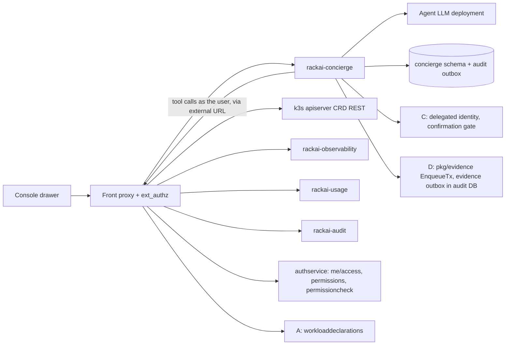
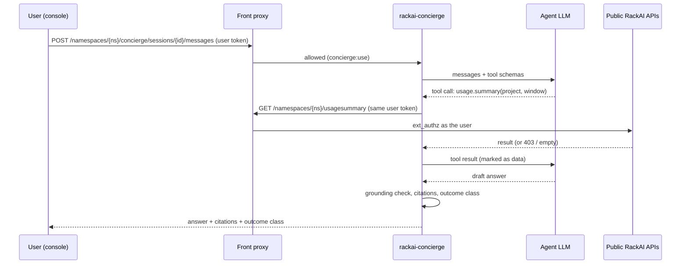

# Concierge Engineer — Technical Specification

| Field | Value |
|:--|:--|
| Version | v0.2 |
| Status | Draft |
| Author | Wiki agent for rackai-product (draft for platform engineering) |
| Reviewers | Platform engineering (control plane, UI); Governance (C owner); Observability and evidence (D owner); Docs; Product owner |
| Engineering approval | not yet approved |
| Product review | **Product-owner review disposition, 2026-10-10: conditional acceptance; not formal artifact approval.** Design direction accepted in principle; DV-3 revised (non-executable quota-request draft); sovereignty (PD-8) and C Phase 2 are explicit release blockers; usage, estimated charges and actual charges kept apart |
| Product approval | not yet approved. Passing checks is not approval |
| Date created | 2026-10-10 |
| Based on PRD(s) | [[Concierge Engineer PRD]] (v0.2 draft, not yet approved; spec drafted alongside per product-owner instruction 2026-10-10) |
| Roadmap items | Concierge Engineer v0 (Answer); Concierge Engineer v1 (Act with confirmation) |
| Jira epic(s) | none yet: one epic per milestone (§13), to be created by platform engineering |

> **Artifact type: Technical Specification.** Its concepts have canonical notes: [[Agent Identity]], [[Action Controls]], [[Governed Harness]], [[Workload Declaration]]. The Concierge Engineer itself is defined in the PRD (§6), not in a canonical note. This spec designs *how* to build it and does not redefine any of them.
>
> **Status banner.** *Proposed design; nothing is built.* Design statements are `assumed`. Statements about today's code are `derived` from the read-only survey in §3, pinned to commits. **Roadmap scope:** this spec designs v0 and v1. It does not name *Concierge Engineer v2 (Governed autonomy)*, because it does not design it: v2 is gated on the authority decision (PRD D-8) and its FR-22 is deferred (§1.3).
>
> **Consumer rule.** Everything here is a client of other capabilities' public interfaces. Where a design needs something another PRD owns (C's delegated identity and confirmation gate, A's declaration API, D's evidence intake), this spec names the interface it consumes and does not design it.

### 0. Status markers (convention)

- **AS BUILT (YYYY-MM-DD, TICKET):** what shipped where it differs from the design above it.
- **PROPOSED, NOT BUILT (YYYY-MM-DD):** designed here, not implemented.
- **RETAINED FOR THE RECORD:** a rejected or replaced design kept for the decision record.

## 1. Overview

A new control-plane service, `rackai-concierge`, runs the agent loop: it takes a user's message, calls an LLM, lets the LLM call a fixed set of **tools**, and returns an answer with citations. Every tool is a typed wrapper over one public RackAI endpoint, called **through the external front proxy with the caller's own credential**, so the platform's ext_authz and RBAC decide what the Concierge may see or do. v0 has read tools only. v1 adds action tools that call A's declaration API, under a delegated identity from C, after a confirmation recorded by C's gate. A console drawer and an API expose it. Everything is additive: no existing contract changes.

### 1.1 Goals

- G-1: answer the four PRD question classes from public read APIs, with citations and honest abstention (PRD FR-1 to FR-5).
- G-2: make "read-only" and "public APIs only" properties of the deployment, not of the prompt: a tool allowlist, a read-only HTTP client in v0, and egress network policy (FR-2, FR-7).
- G-3: emit content-free gap signals and `agent-action` evidence records in the D-0 envelope (FR-6, FR-20).
- G-4: in v1, route every action through A's API with C's delegated identity and confirmation, gated on audit (FR-12 to FR-21).

### 1.2 Non-Goals

- Delegated-token issuance, the confirmation gate and action policy: C's spec ([[Governed Execution & Delegated Authority Tech Spec]]). This spec consumes them (§4.6).
- The declaration API and decision interface: [[Workload Declaration & Placement Tech Spec]] §4, §5.
- The evidence store, report and D-0 schema: [[Customer Observability & Evidence Report Tech Spec]].
- Model serving: the agent's LLM is an ordinary RackAI model deployment (§4.4).
- Producing telemetry: the observability API is empty until Monitoring emits series (§3.2); fixing that is Monitoring M2, not this spec.
- v2 autonomy (FR-22).
- Changes to `rackaictl chat` or AI Studio, which stay model playgrounds.

### 1.3 Requirements Traceability

| PRD · req | Spec section(s) | Milestone | Status |
|---|---|---|---|
| prd H · FR-1 four question classes | §4.2 (read tools), §6.1 | M1 | covered (incident answers for non-admins limited by D-4, DV-2) |
| prd H · FR-1a usage vs estimated vs actual charges | §4.2, §4.3 | M1 (usage), M1+D-4 (charges) | covered (charge tools enabled only when D's charge view exists) |
| prd H · FR-2 public APIs only, as the user | §2, §4.2, §8 | M1 | covered (which APIs are public: Q-5) |
| prd H · FR-3 citations, freshness, no inferred figures | §4.3 | M1 | covered |
| prd H · FR-4 name the missing permission | §4.2 (`permissioncheck`), §4.5 | M1 | covered |
| prd H · FR-5 outcome classes | §4.5 | M1 | covered |
| prd H · FR-6 gap signals | §4.7 | M2 | covered |
| prd H · FR-7 v0 read-only by construction | §4.2, §8 | M1 | covered |
| prd H · FR-8 show calls made | §5, §4.3 | M2 | covered |
| prd H · FR-9 console panel, API; CLI optional | §5, §13 M2 | M2 | covered (CLI deferred to a follow-up) |
| prd H · FR-10 admin switch-off | §4.1 | M1 | covered |
| prd H · FR-11 tool output is data | §4.2, §8 | M1 | covered |
| prd H · FR-12 deploy / retire / scale via A only | §4.6 | M3 | covered |
| prd H · FR-13 action plan | §4.6 | M3 | covered |
| prd H · FR-14 confirmation through C | §4.6 | M3 | covered (C's `ActionAuthorization` `agent.step.confirm`, C Phase 2; C spec Q-13) |
| prd H · FR-15 delegated, task-scoped identity; no approval authority | §4.6, §7 | M3 | covered (C's `AuthorityGrant`, delegate kind `Agent`, C Phase 2; C spec Q-13) |
| prd H · FR-16 agent-for-user audit | §4.8 | M1 (v0 rows), M3 (platform-native) | partial in v0 (DV-1), covered in v1 |
| prd H · FR-17 non-executable quota-request draft | §4.6 | M3 | covered (DV-3 revised v0.2) |
| prd H · FR-18 irreversible labelled; rollback | §4.6 | M3 | covered |
| prd H · FR-19 relay infeasibility as given | §4.6 | M3 | covered |
| prd H · FR-20 `agent-action` evidence | §4.8 | M1 (answers), M3 (actions) | covered (written through `pkg/evidence.EnqueueTx`; Q-8 resolved) |
| prd H · FR-21 admin enables / restricts actions | §4.1, §4.6 | M3 | covered (restriction policy is C's) |
| prd H · FR-22 v2 autonomy | — | — | deferred (not designed; roadmap row not named) |

| PRD · AC | Design | Test (§12) | Milestone |
|---|---|---|---|
| AC-1, AC-2 | §4.2, §4.3 | Seeded question set; empty-series and fault cases | M1 |
| AC-3 | §4.5 | Per-role matrix over the five built-in roles | M1 |
| AC-4, AC-5 | §4.2, §8 | Adversarial suite; forced-write test plus audit query | M1 |
| AC-6 | §4.7 | Schema test; sample review; can't-class matrix | M2 |
| AC-7 | §8 (NetworkPolicy) | Network test from the Concierge pod | M1 |
| AC-8 | §4.1 | API and console test | M1 |
| AC-17 | §4.2, §4.3 | Charge-source matrix; operator-only cost records seeded | M1 |
| AC-18 | §4.4, §8 | Level 1 enablement refused without an approved in-boundary execution | M1 (per-customer release gate) |
| AC-9 to AC-16 | §4.6, §4.8, §9 | Action tests, adversarial suite with enforcement on, rollback, token reuse, C fault injection | M3 |

### 1.4 Deliberate Divergences from the PRD

| # | Divergence | Why | Materiality |
|---|---|---|---|
| DV-1 | In v0, agent-for-user attribution exists only in the Concierge's own `agent` audit rows. The platform's audit records the user, joined by request ID where the proxy returns one (Q-4). Platform-native agent-for-user arrives with C's delegated identity in v1 | C's identity is a v1 dependency (PRD PD-2) | Non-material: PRD FR-16 is a v1 requirement. **Status:** **confirmed by the product owner, 2026-10-10** (non-material) |
| DV-2 | Incident answers for users without `rolebindings:manage` come from workload status and conditions only, not from audit | Audit reads are admin-only today (§3.2); the agent never reads through another identity | Non-material while D-4 is open: it follows FR-4. Becomes material if product expects audit-based answers for all users. **Status:** **confirmed by the product owner, 2026-10-10** (non-material); becomes material if D-4 changes |
| DV-3 | FR-17: no quota object exists (no QuotaPolicy CRD; `Project.spec.quotaPolicy` is an unresolved string). **Revised v0.2:** the Concierge produces a **non-executable quota-request draft**: a read-only document addressed to the named approver, labelled "request, not a change", with no submit or apply path from the Concierge. It never states or implies the quota will change. When Metering M3 adds a quota object, drafting against it stays non-executable | No object to draft against; PO ruling | **Status: revise (PO review 2026-10-10), revised v0.2, pending approval** |

### 1.5 Terminology

| Term | Definition |
|:--|:--|
| `rackai-concierge` | The new service that runs sessions and the agent loop |
| Tool | A typed wrapper over exactly one public endpoint and verb, with a declared scope and result schema |
| Tool registry | The compiled-in list of tools; the only way the LLM can reach the platform |
| Citation | `{toolCallId, method, path, scope, window, recordIds[], requestId?, fetchedAt}` attached to each figure |
| Grounding check | A deterministic post-check that every number and identifier in an answer appears in a cited tool result |
| `ConciergeSettings` | A per-tenant singleton CRD holding the on/off switch and v1 enablement |
| Plan step | One proposed action in an action plan, with a digest |

### 1.6 Relationship to Other Specs and Canonical Notes

- **Consumes** A's declaration API (`workloaddeclarations` create, patch, withdraw; [[Workload Declaration & Placement Tech Spec]] §5) and its infeasibility status. It never calls `placementproposals` or `placementapprovals`, and never writes `modeldeployments`.
- **Consumes** C's delegated identity (`AuthorityGrant` with delegate kind `Agent`), per-step confirmation (`ActionAuthorization` with action `agent.step.confirm`) and action catalogue entries `agent.act` / `agent.step.confirm` ([[Governed Execution & Delegated Authority Tech Spec]] §4.1, §4.3, §4.4, Q-13). These are **C Phase 2** and are designed in a later revision of C's spec, so this spec's M3 waits for them (§13).
- **Contributes** `agent-action` and daily `coverage` records in the D-0 envelope through D's in-process library `pkg/evidence` (`EnqueueTx`), in the same PostgreSQL transaction as its `agent` audit row ([[Customer Observability & Evidence Report Tech Spec]] §2.1, §4.2, §4.7). There is no HTTP intake.
- **Reads** the APIs specified in the [[Identity and Access Control Spec]], [[Multi-Tenancy and Metering Spec]] and [[Monitoring and Auditability Spec]]. No change to their contracts.
- **Adds** one audit category (`agent`) to the closed set, as A adds `placement`.
- **Implements** [[Governed Harness]] (pattern), [[Agent Identity]] and [[Action Controls]] (as a consumer).

## 2. Architecture

### 2.1 System Components

- **`rackai-concierge` service** (`cmd/rackai-concierge`, `internal/conciergeservice`, `charts/rackai-concierge`): sessions, agent loop, tool registry, citation and grounding check, outcome classifier, gap-signal emitter, evidence and audit emitter.
- **Agent LLM**: a RackAI `ModelDeployment` in a platform namespace (Level 0), called through its OpenAI-compatible inference route. Placement for Level 1 tenants is D-1 / Q-1.
- **Concierge store**: a `concierge` schema in the platform PostgreSQL (sessions, messages, plans, gap signals), tenant row-level security.
- **Console drawer** in `rackai-ui`; **docs** pages in `rackai-docs`.

### 2.2 Component Responsibilities

| Component | Responsibility | Owner | New / changed / existing |
|---|---|---|---|
| `rackai-concierge` | Agent loop; tools; citations; classification; emitters | control plane | new |
| `ConciergeSettings` CRD | Per-tenant switch (`off`, `answer`, `act`) | control plane | new |
| Front proxy routes | `/namespaces/{ns}/concierge/...` to the service | control plane | changed (additive route) |
| Route map and roles | `concierge:use`, `concierge:manage` | control plane | changed (additive) |
| Audit category `agent` | Table, migration, constant | control plane | changed (additive) |
| Agent LLM deployment | Inference for the agent | platform ops | existing mechanism |
| C delegated identity, confirmation gate | Authority for v1 | C | consumed |
| A declaration API | Target of v1 actions | A | consumed |
| D `pkg/evidence` library and `evidence` schema | Validates and enqueues `agent-action` and `coverage` records | D | consumed (linked in-process) |
| Console drawer | Assistant panel in the app shell | UI | new |

### 2.3 Dependency Map



### 2.4 Data Flow



## 3. Codebase Grounding (read-only)

Surveyed read-only through local mirrors kept outside the wiki. Nothing was written to any code repo. Mirrors were synced by the orchestrator on 2026-10-10.

### 3.1 Repos & revisions read

| Repo | Commit SHA | Paths read | Why relevant |
|---|---|---|---|
| RSS-Engineering/rackai | `79ca4de` | `hack/cli/cmd/chat.go`, `internal/authservice/{server,introspect,config}.go`, `internal/authz/{routemap,evaluator}.go`, `internal/auditservice/server.go`, `internal/observabilityservice/{server,metrics}.go`, `internal/usageservice/server.go`, `pkg/audit/{event,outbox}.go`, `pkg/audit/migrations/`, `internal/controller/platformrole_builtin.go`, `api/v1alpha1/{apikey,organization}_types.go`, `charts/rackai-frontproxy/templates/configmap-envoy.yaml`, `charts/rackai-authservice/values.yaml`, `docs/operations/rbac.md`, `docs/api/openapi-external.yaml`, `cmd/` | Public APIs to consume, identity model, audit, service layout |
| RSS-Engineering/rackai-ui | `89bddb4` | `src/api-client/RackAI.tsx`, `src/app/AuthenticatedAppContainer.tsx`, `src/app/components/{AssistantMessage.tsx,sidebar/}`, `src/app/pages/ai-studio/`, `src/app/hooks/features.ts`, `src/app/routes/index.ts` | Where an assistant panel lives; reusable chat components |
| RSS-Engineering/rackai-docs | `ccb52a3` | `mkdocs.yml`, `docs/user/guides/`, `docs/user/api-reference/` | Where user docs and the API reference go |

### 3.2 Existing patterns

- **Existing "chat" is a model playground, not an assistant.** `rackaictl chat` resolves one deployment's inference endpoint and posts to `/v1/chat/completions` (`RSS-Engineering/rackai@79ca4de:hack/cli/cmd/chat.go`, `newChatSession`). AI Studio does the same from the console (`rackai-ui@89bddb4:src/app/pages/ai-studio/ChatWorkspace.tsx`; `src/api-client/RackAI.tsx`, `sendMessage`). Neither has tools. The Concierge reuses their *rendering* (below), not their logic.
- **Service layout.** Each read service is `cmd/rackai-<name>/main.go` + `internal/<name>service` (`Run(ctx, cfg, log)`) + `charts/rackai-<name>`, with `/healthz`, `/readyz` and `crmetrics.Registry` (`rackai@79ca4de:cmd/rackai-audit/main.go`, `internal/usageservice/server.go`). The Concierge follows this.
- **Public read APIs, all behind ext_authz** (`rackai@79ca4de:internal/authz/routemap.go`; routed in `charts/rackai-frontproxy/templates/configmap-envoy.yaml`):
  - CRD REST at `/apis/rackai.rackspace.com/v1alpha1/namespaces/{ns}/...` (models, modeldeployments with status and conditions, finetuningjobs, datasets).
  - Usage: `/namespaces/{ns}/usagerecords`, `usagesummary`, `usagehistory` (and project-scoped variants) → `usage:view`. Only present when metering is on.
  - Observability: `/namespaces/{ns}/observability/workloads/{inference,finetuning}` (`model:read` / `job:view`) and `.../metrics/{inference,inference/summary,finetuning,quota}` (`observability:view`).
  - Audit: `/namespaces/{ns}/audit`, `/audit/{category}`, `/audit/requests/{requestId}` → `rolebindings:manage`, held only by the built-in *admin* (`internal/controller/platformrole_builtin.go`).
  - Introspection: `GET /me/access`, `GET /namespaces/{ns}/permissions`, `GET /namespaces/{ns}/permissioncheck?resource=&action=` (`internal/authservice/introspect.go`, `server.go`, `handlePermissionCheck`). A denied check is a 200 with `allowed:false`; indeterminate is 503. Introspection is concurrency-bounded (two at a time), so the Concierge must cache per session and never poll.
- **Telemetry is empty today.** The metrics endpoints return the documented envelope with empty series until Monitoring emits the recording rules; the quota read is TODO (RACKAI-491) (`rackai@79ca4de:internal/observabilityservice/metrics.go`). Abstention (§4.3) is therefore the normal v0 path for performance, not an edge case.
- **Identity model.** Identity types are `user` and `service` (`internal/authz/evaluator.go`). There is no delegation or on-behalf-of concept anywhere in authservice. APIKeys are long-lived service identities that carry their own `roleRef`, optional `projectRef` and `expiresAt` (`api/v1alpha1/apikey_types.go`). An APIKey is therefore **not** a valid agent identity: its authority is independent of the user's.
- **Request IDs.** Envoy generates `x-request-id` at the edge and the authservice adopts it as `x-rackai-request-id`; caller-supplied `X-RackAI-*` headers are stripped (`internal/authservice/server.go`). The Concierge cannot set the request ID; it can only record one if the proxy returns it (Q-4).
- **Audit.** Events carry `ActorType` `user | service | controller` (`pkg/audit/event.go`). Compliance categories are a closed set behind `knownAuditCategory`, written through the PostgreSQL outbox with UUIDv5 idempotency keys (`pkg/audit/outbox.go`); migrations are golang-migrate pairs (`pkg/audit/migrations/000003_audit_event_outbox.up.sql`).
- **Enforcement off by default.** `rbac.enforcement.mode: "off"` (`charts/rackai-authservice/values.yaml`; `docs/operations/rbac.md`). In `off` mode only the coarse guard applies, so "as the user" does not mean "within the user's role". This is why v1 requires `enforce` (§3.5).
- **UI shell.** `AuthenticatedAppContainer.tsx` renders `Sidebar` plus an `AppHeader` with a `HeaderRight` slot: the natural place for a drawer toggle. `AssistantMessage.tsx` already renders markdown and collapsible `<think>` blocks. Feature flags come from `window.RACKAI_FEATURES` (`src/app/hooks/features.ts`; only `rbacGating` today), and permission gating exists only in Manage (`usePermissions`). The API client is hand-written and calls `/me/access` and `/permissions`, but none of the usage, observability or audit APIs.
- **Docs.** The external OpenAPI covers CRD REST, inference, `/me/access`, `/permissions` and `/catalog`, but **not** usage, observability, audit or `permissioncheck` (`rackai@79ca4de:docs/api/openapi-external.yaml`). The docs site vendors that file per release (`rackai-docs@ccb52a3:docs/user/api-reference/`).

### 3.3 Extension points

| Extension | Where | Additive / breaking |
|---|---|---|
| New service `rackai-concierge` | `rackai@79ca4de:cmd/` (new `rackai-concierge/`), `internal/` (new `conciergeservice/`), `charts/` (new `rackai-concierge/`) | additive |
| New CRD `ConciergeSettings` (namespaced singleton) | `rackai@79ca4de:api/v1alpha1/` (new file); bundled via `chart-generator.sh` | additive |
| Front proxy route `^/namespaces/[^/]+/concierge/.*` before the catch-all | `rackai@79ca4de:charts/rackai-frontproxy/templates/configmap-envoy.yaml` | additive |
| Routes and permissions `concierge:use`, `concierge:manage`; `conciergesettings` | `rackai@79ca4de:internal/authz/routemap.go`, `internal/authz/scope.go`, `internal/controller/platformrole_builtin.go` | additive |
| Audit category `agent` (constant, table, migration `000004_agent_audit`) | `rackai@79ca4de:pkg/audit/outbox.go`, `pkg/audit/migrations/` | additive (coordinate the migration number with A's `placement`) |
| External OpenAPI: concierge endpoints; and (if D-5 says so) the usage, observability, audit and `permissioncheck` endpoints | `rackai@79ca4de:docs/api/openapi-external.yaml` | additive |
| Console drawer, header toggle, API client methods, feature flag `concierge` | `rackai-ui@89bddb4:src/app/AuthenticatedAppContainer.tsx`, `src/api-client/RackAI.tsx`, `src/app/hooks/features.ts`; reuse `src/app/components/AssistantMessage.tsx` | additive |
| Docs page and nav entry | `rackai-docs@ccb52a3:mkdocs.yml`, `docs/user/guides/` | additive |

**Not extended:** `rackaictl chat`, AI Studio, any existing read service, and A's or C's APIs.

### 3.4 Standards to enforce

- **Service conventions:** `Run(ctx, cfg, log)`, `/healthz` and `/readyz`, metrics on `crmetrics.Registry` with the `rackai_` prefix, logr logging, config from env in `cmd/`.
- **Authz:** every new route in `routemap.go`, with fail-closed defaults; tests in the existing route-map style.
- **CRD:** kubebuilder markers and CEL first; singleton enforced by CEL (`self.metadata.name == 'default'`); `make manifests generate` leaves no diff.
- **Audit:** outbox only, deterministic UUIDv5 keys, a new category added to `knownAuditCategory` with a migration pair; forced RLS as for the M2 category tables.
- **Tool registry:** each tool declares method, path template, permission, scope and result schema. A unit test checks every tool path against `routemap.go`; v0 builds fail if any tool has a non-GET method.
- **Tests:** Ginkgo/Gomega with `unit` and `integration` labels; adversarial and grounding suites run in CI against a stub LLM with scripted tool calls, so CI is deterministic.
- **UI:** MUI v7, Jest + RTL, hand-written client methods typed against the OpenAPI file.
- **Docs:** new page registered in `mkdocs.yml`; strict build.

### 3.5 Dependencies & fork prevention

- **Single sources of truth:**
  - Permissions and routes: `routemap.go` and `platformrole_builtin.go`. The tool registry never encodes permissions independently; its test reads the route map.
  - Endpoint shapes: `openapi-external.yaml`. Tool result schemas are generated from it where the endpoint is listed; for endpoints not yet listed (D-5), from the service's response types in the same commit.
  - Evidence envelope: D-0 types, `RecordID`, `Validate` and `EnqueueTx` imported from `pkg/evidence` in the same repo and commit; the `agent-action` claim schema is registered in `pkg/evidence/kinds`. No local copy.
  - Declaration API: A's `api/v1alpha1` types, imported from the same commit.
  - Gap-signal vocabularies: one Go enum set in `internal/conciergeservice/gaps`; the UI only displays them.
- **No private paths.** The Concierge calls the platform only through the **external** front-proxy URL (hairpin), never service DNS names. NetworkPolicy allows egress only to the front proxy, the agent LLM's inference route and PostgreSQL (§8). This keeps "public APIs only" true across dev, staging and production.
- **Environments:** one chart flag, `concierge.enabled`, and `concierge.actions.enabled`. The chart refuses to render `concierge.actions.enabled=true` unless `rbac.enforcement.mode=enforce`, `rbac.k8sGrants.enabled=true` and C's delegation endpoint is configured. It also refuses when policy-owned values are unset: `concierge.retention.conversations` (D-3) and `concierge.llm.deployment` (D-1). No number is invented in the chart.

### 3.6 Improvement & modularity opportunities

| # | Opportunity | Scope |
|---|---|---|
| I-1 | *Consumer requirement / requested interface change to platform engineering (IAC, Metering, Monitoring specs):* usage, observability, audit and `permissioncheck` are routed publicly but missing from `openapi-external.yaml`; list them so "public" has one definition | proposed follow-up (Q-5) |
| I-2 | *Consumer requirement / requested interface change to C:* audit has no narrower read permission than `rolebindings:manage`; an `audit:view` scoped to a project would let non-admins ask "what changed?" | proposed follow-up (Q-6, with C) |
| I-3 | *Consumer requirement / requested interface change to platform engineering:* the proxy does not (verifiably) return `x-request-id` on responses; returning it lets any client, not just the Concierge, join its calls to audit | proposed follow-up (Q-4) |
| I-4 | UI permission gating exists only in Manage; the drawer needs `usePermissions` outside it (RACKAI-575 scope) | **in scope** for the drawer only (M2) |
| I-5 | Reuse of `AssistantMessage` across AI Studio and the drawer: move it under a shared `chat/` folder | **in scope** (M2) |
| I-6 | No `PrometheusRule` ships anywhere; add the Concierge's alerts in its chart | **in scope** (M2) |

## 4. Data Model

### 4.1 `ConciergeSettings` (namespaced, singleton `default`)

**Spec:** `mode`: `off | answer | act`, default `answer` (PRD PD-11). `act` is accepted only when the chart has `concierge.actions.enabled=true`; otherwise the status reports `ActionsUnavailable`. `llmDeployment` (optional; platform-admin-set): the agent LLM deployment for this tenant; required and checked against E's in-boundary rule for Level 1 tenants (§4.4). Finer action restrictions are C's action policy, not fields here. **Status:** `effectiveMode`, conditions. **Controller behaviour:** the service reads it per session start (cached, watch-invalidated). No settings object means `answer`. **Permission:** `concierge:manage` (admin).

### 4.2 Tool registry (`internal/conciergeservice/tools`)

Each tool: `{name, method, pathTemplate, permission, scope, paramsSchema, resultSchema, readOnly, citationFields}`.

**v0 read tools:**

| Tool | Endpoint | Permission |
|---|---|---|
| `access.me` | `GET /me/access` | authenticated |
| `access.permissions` | `GET /namespaces/{ns}/permissions` | authenticated |
| `access.check` | `GET /namespaces/{ns}/permissioncheck` | authenticated |
| `deployments.list/get` | CRD REST `modeldeployments` (+`/status`) | `model:read` |
| `models.list/get`, `jobs.list/get` | CRD REST | per route map |
| `workloads.inference/finetuning` | `/observability/workloads/...` | `model:read`, `job:view` |
| `metrics.inference/summary/finetuning/quota` | `/observability/metrics/...` | `observability:view` |
| `usage.records/summary/history` | `/usagerecords`, `/usagesummary`, `/usagehistory` | `usage:view` |
| `charges.estimated` (only when D-4 lands) | D's evidence query for B's `cost` records, `charge` view, `audience: customer` | D's evidence read permission |
| `charges.actual` (only when a billing source exists) | none today | — |
| `audit.query/category/request` | `/audit...` | `rolebindings:manage` |
| `declarations.get/list` (when A ships) | CRD REST `workloaddeclarations` | `workload:read` |

**Usage is not charges.** Usage tools return quantities only. An answer may state an *estimated charge* only from `charges.estimated` and an *actual charge* only from `charges.actual`; each is labelled with its kind. The grounding check rejects any currency figure not present in a charge tool result, so a charge can never be computed from usage. Operator-only records (internal cost, margin) are never requested: the tool filters `audience: customer`, and D's API refuses operator records for customer scopes anyway (D PD-4). Neither charge tool exists in M1, so charge questions are answered "no charge source is available yet".

**Rules:** the HTTP client in v0 is constructed read-only and refuses any non-GET before sending (FR-7). Tool results are passed to the LLM inside a data envelope that is never interpreted as instructions; only user turns can start an action (FR-11). Results are size-capped, and truncation is cited.

### 4.3 Answers, citations and the grounding check

An answer is `{text, citations[], outcome, freshness}`. Every number, identifier and time range in `text` must match a value in a cited tool result; the **grounding check** is deterministic and runs before the answer is returned. On failure the answer is regenerated once with the failure noted, then replaced by an abstention ("I couldn't verify this"). An empty series yields "no data for {window}"; an unavailable source yields "{source} unavailable".

### 4.4 Agent LLM

A `ModelDeployment` called through the inference route with the Concierge's own service credential. Prompts, conversation history, tool results and temporary context contain tenant data, so where they are processed and held is bound by the tenant's sovereignty level (PRD PD-8). Level 0 tenants may use a shared platform deployment. **For Level 1 tenants a platform-hosted Level 0 model is not acceptable:** the session's LLM deployment, session store and any cache must satisfy E's in-boundary rule for that tenant. `ConciergeSettings` cannot be set above `off` for a Level 1 tenant unless `spec.llmDeployment` names a deployment that E reports in-boundary for it (`boundary: held`), otherwise status `NotOffered` (AC-18). Release blocker per customer: `blocked-by: E in-boundary execution rule for the agent` (Q-1). Model choice and the quality bar are Q-9.

### 4.5 Outcome classification

| Signal | Outcome | Emits |
|---|---|---|
| Tool 403, or `permissioncheck` `allowed:false` | access request (names the permission; names admins if `/me/access` allows) | audit only |
| C policy denial (v1) | policy refusal | audit only |
| A infeasible | infeasible (A's reasons and suggestions verbatim) | audit; `agent-action` |
| Intent with no tool, or a tool exists but the needed data does not | product gap | gap signal |
| Answered | answered | audit; `agent-action` (kind `answer`) |

`permissioncheck` 503 (indeterminate) is treated as no permission.

### 4.6 Actions (v1)

**Plan.** The LLM proposes a plan; the service converts it into plan steps `{stepId, action, target, params, reversible, needsApproval[], digest}`. Allowed actions: `declaration.submit`, `declaration.amend`, `declaration.withdraw` (deploy, scale, retire), and `quota.draft`. Anything else becomes a *can't*.

**Consumed C interfaces (C Phase 2; C spec Q-13).** Both are designed in a later revision of C's spec; the shapes below are C's answer, not this spec's design.
- **Delegated identity:** an `AuthorityGrant` with delegate kind `Agent`, task-scoped, expiring (`notAfter`), whose `actions[]` are a subset of the user's. It is carried as a token-exchange `act` claim, and ext_authz intersects it with the user's permissions. It never includes authorising or approval permissions (`placement:approve`, `placement:propose`, quota approval) (PRD PD-9; C PRD FR-25).
- **Per-step confirmation:** an `ActionAuthorization` with action `agent.step.confirm`, bound to the plan step's `digest`, **minted by the user** with their own session from the drawer (so the Concierge cannot confirm for itself), single-use, lifetime `authority.lifetimes.agentConfirm` (C's value). Declined or expired means no authorisation exists.

**Authority Context.** Every action consumes C's [[Authority Context]] as returned by C for the step (acting principal = the Concierge agent, `onBehalfOf` = the user, authority principal, tenant scope, delegation chain, action instance with the step digest, authorisation basis, expiry). The Concierge passes it through to audit and evidence and never reconstructs it from headers, namespaces or session data.

**Execution (per confirmed step).**
1. Write `agent_action_intended` to the outbox, keyed by UUIDv5(session, stepId). If the write fails, stop (gated on audit, as in A §4.11).
2. Call A's endpoint through the front proxy with the delegated (`act`) token and the `ActionAuthorization` reference. Declaration names are deterministic from the step ID, so a retry gets `AlreadyExists` and is treated as done.
3. Read the declaration status; relay *Feasible*, *Infeasible* (verbatim) or *pending approval*.
4. Write `agent_action_executed` or `agent_action_failed`, and the `agent-action` evidence record (`EnqueueTx`, same transaction).

**Rollback.** For a reversible step, the inverse step (withdraw, or amend back to the prior revision) is itself a plan step needing confirmation. **Irreversible** steps (none in the v1 set today; a future delete would be) are labelled and confirmed separately.

**Quota (DV-3, revised v0.2).** `quota.draft` produces a non-executable request document `{requestedChange, rationale, policyCheckResult, approver}`, stored with the plan and shown labelled "quota request — not a change; your approver must act". It has no submit tool, no apply path and no `ActionAuthorization`; the tool registry test asserts that no quota write tool exists. Nothing is applied, and the answer never says the quota will change.

**Revocation.** The delegated token is revoked when the task ends or the session closes; reuse after expiry is rejected by C (AC-15).

### 4.7 Gap signals

Table `concierge.gap_signals` (platform scope, not tenant-readable): `{signalId, intentClass (enum), missingCapability (enum or roadmap milestone ref), alternativeOffered (enum), impactCategory (enum), count, firstSeen, lastSeen, customerOrgHash}`. **No free-text column exists.** The classifier maps to enums; an intent it cannot map becomes `intentClass=unclassified` with no text. Deduplication is on `(intentClass, missingCapability)` per period. `customerOrgHash` is a keyed hash, used only to count distinct customers. Product exports the table to triage for the [[Capability Gap Register]]; the export is a manual review step in Phase 1.

### 4.8 Audit and evidence

**Audit category `agent`:** `audit.agent_audit_log`. Event kinds: `session_started`, `session_ended`, `tool_called` (method, path template, status, request ID if returned; no response body), `answer_returned` (outcome class, citation count), `access_request_classified`, `policy_refusal_classified`, `gap_signal_emitted`, `plan_presented`, `step_confirmed`, `step_declined`, `step_expired`, `agent_action_intended`, `agent_action_executed`, `agent_action_failed`, `rollback_executed`, `quota_drafted`, `delegation_revoked`. Actor: `actor_type=service` (the Concierge) with `metadata.onBehalfOf` = user in v0 (DV-1); in v1, the platform's own audit rows carry agent-for-user from C's `act` claim (C Phase 2).

**Evidence (D-0 envelope, kind `agent-action`, owned by H):**
- `sourceId` = the answer ID (v0) or `{sessionId}:{stepId}:{phase}` with phase `plan | confirm | execute | result | rollback | draft` (v1). Corrections append `#rN` and set `supersedes`.
- `recordId` = `RecordID("prd-concierge-engineer", "agent-action", sourceId)`, i.e. UUIDv5(NS(contributor), kind + "|" + sourceId). The audit outbox key is a separate UUIDv5 over the same sourceId; a raw audit or decision ID is never the recordId.
- `schemaVersion`, `claimVersion: 1`, `contributor: prd-concierge-engineer`, `audience: customer` (the customer's own agent activity).
- `scope {customerOrg, organization, project, authorityPrincipal}`, with `authorityPrincipal` taken from C's [[Authority Context]], never reconstructed. For v0 answers (no agent Authority Context until C Phase 2) it is the user's own Authority Context, taken from the `authorityContext` field of `GET /namespaces/{ns}/permissions` and re-fetched when the token changes (C FR-32; Q-13 resolved); `subjects[]`: `agent` (Concierge identity), `action` (step or answer ID), and `declaration` / `revision` (with `uid`) when acting.
- `actor {type: agent, id: <Concierge identity>, onBehalfOf: <user principal>}` (required for `agent`). `onBehalfOf` is not in the claim.
- `claim` (claimVersion 1): `{actionType: answer | plan | execute | rollback | draft | refuse, outcome, confirmationRef? (ActionAuthorization), authorityRef? (AuthorityGrant), decisionRef? (A's decision ID), reversible, toolCalls[{method, pathTemplate, status}]}`. No message text.
- `basis {source: derived, evidenceRefs[{type: audit-event, ref}, {type: request-id, ref}], confidence: derived}`. The Concierge has no telemetry or probe reference, so nothing is `measured`; a system actor is never `asserted`.
- `correlationId` = A's correlation ID when acting, else the session ID; `at`, `producedAt`.

**Coverage:** a daily `coverage` record per Organization through `Coverage.Emit`, with `counts[]` per phase (answers, plan steps, executed actions), `sourceOfRecord: concierge.messages + concierge.plan_steps`, and `watermark` = the latest `created_at` counted (RFC 3339). D reconciles it independently against `audit.agent_audit_log` rows of the mapped event kinds (D spec §4.7). Coverage records are `audience: operator`.

**Emission path (answers Q-8).** `rackai-concierge` is a Go service in `RSS-Engineering/rackai`, so it links `pkg/evidence` directly; "in-process" holds. It already writes the `agent` audit outbox in the audit database, and D puts the `evidence` schema in the same database, so `EnqueueTx` runs in the same transaction as the audit row. The only new need is a database role with insert on `evidence.record_outbox` (Q-12, with D).

### 4.9 Session store

`concierge.sessions` and `concierge.messages`, with forced RLS on `tenant_id`. Retention is `concierge.retention.conversations` (D-3; no default in the chart). Customers can delete a session through the API; deletion removes messages but keeps audit and evidence rows, which carry no message text.

## 5. API Surface

All new, additive, under the front proxy at `/namespaces/{ns}/concierge/` (prefix-less, matching audit and observability).

| Path | Verbs | Permission | Notes |
|---|---|---|---|
| `/namespaces/{ns}/concierge/sessions` | POST, GET (own) | `concierge:use` | Fails `403 ConciergeOff` if `effectiveMode=off` |
| `/namespaces/{ns}/concierge/sessions/{id}` | GET, DELETE | `concierge:use` (owner) | Delete removes messages |
| `/namespaces/{ns}/concierge/sessions/{id}/messages` | POST (SSE stream), GET | `concierge:use` (owner) | Response: text, citations, outcome, tool calls (FR-8) |
| `/namespaces/{ns}/concierge/sessions/{id}/plans/{planId}` | GET | `concierge:use` (owner) | v1; confirmation goes to C, not here |
| `/apis/rackai.rackspace.com/v1alpha1/namespaces/{ns}/conciergesettings` | CRUD | `concierge:manage`; read `concierge:use` | |

Proposed role mapping: all five built-in roles get `concierge:use` (what they can learn is still bounded by their own permissions); admin gets `concierge:manage`. **Errors:** `ConciergeOff`, `ActionsUnavailable`, `SessionNotOwned`, `LLMUnavailable` (503). A denied tool call is not an API error; it is an *access request* outcome.

## 6. Request Lifecycle

### 6.1 Answer (v0)

1. User posts a message with their session token; ext_authz checks `concierge:use`.
2. The service checks `ConciergeSettings`, loads the session, calls `access.me` and `access.permissions` once per session (cached).
3. Agent loop: LLM → tool calls (read-only client, user's token, through the external proxy) → results in a data envelope → LLM, bounded by a step limit.
4. Grounding check; citations; outcome class (§4.5).
5. Audit rows and the evidence record in one outbox transaction; gap signal if a product gap.
6. Stream the answer.

### 6.2 Act (v1), including the decline and failure paths

```mermaid
sequenceDiagram
  participant U as User
  participant CS as rackai-concierge
  participant C as C (delegation, confirmation)
  participant FP as Front proxy
  participant A as A (workloaddeclarations)
  U->>CS: "Deploy X, dedicated, NVIDIA only"
  CS->>C: request AuthorityGrant (delegate kind Agent, task scope, notAfter)
  alt denied
    C-->>CS: denied
    CS-->>U: policy refusal or access request
  else delegated
    C-->>CS: grant + act-claim token
    CS-->>U: plan (steps, approvals needed, reversibility)
    U->>C: mint ActionAuthorization agent.step.confirm (step digest, user's own session)
    alt declined or expired
      C-->>CS: declined / expired
      CS-->>U: nothing changed
    else confirmed
      C-->>CS: ActionAuthorization ref
      CS->>CS: outbox: agent_action_intended (fails → stop)
      CS->>FP: POST workloaddeclarations (act token, ActionAuthorization ref)
      FP->>A: ext_authz as agent-for-user
      A-->>CS: created; status Feasible / Infeasible / pending approval
      CS->>CS: outbox: executed + agent-action evidence
      CS-->>U: result, verbatim from A
    end
  end
```

## 7. Platform Integration Contract

| Concern | What this spec requires / emits |
|---|---|
| Identity & authorization | New permissions `concierge:use`, `concierge:manage`. v0 calls APIs with the user's own token; v1 with C's `AuthorityGrant` (delegate kind `Agent`) carried as an `act` claim (C Phase 2; never approval permissions). The Concierge's own service credential is used only for the agent LLM and its own store. v1 requires `rbac.enforcement.mode=enforce` (chart guard) |
| Tenancy & isolation | Sessions and messages tenant-scoped with RLS; every tool call scoped by the platform from the caller's token; gap signals platform-scoped and content-free |
| Metering & quotas | The agent LLM's inference is metered by the existing ext-proc under the platform tenant, with a `concierge-tenant` attribution label; billing is D-9 (none in Phase 1). No quota checks enforced by the Concierge; quota is read and, in v1, drafted |
| Audit | New category `agent` (§4.8); request IDs recorded where returned (Q-4); v1 platform rows carry agent-for-user from C |
| Monitoring & alerting | `rackai_concierge_sessions_total`, `rackai_concierge_tool_calls_total{tool,status}`, `rackai_concierge_answers_total{outcome}`, `rackai_concierge_grounding_failures_total`, `rackai_concierge_gap_signals_total{intent_class}`, `rackai_concierge_actions_total{action,result}`, `rackai_concierge_llm_seconds`, `rackai_concierge_audit_write_failures_total`. Alerts (`PrometheusRule`): audit write failures; grounding-failure rate; any write attempt refused in v0 (should be zero outside tests) |
| Tenant-visible observability | Allowlist: the user's own sessions, answers, citations, tool calls, plans and outcomes; admins see their organisation's sessions. Never gap-signal tables, other tenants' data or LLM internals |
| Billing | None produced in Phase 1 (D-9). Usage attribution label available to B |

## 8. Security & Isolation

- **Read-only v0 by construction:** no write tool exists; the v0 HTTP client refuses non-GET; a CI test fails the build if a v0 tool has a non-GET method (AC-5).
- **No side doors:** egress NetworkPolicy allows only the external front proxy, the agent LLM's inference route and PostgreSQL. No route to the k3s apiserver, Mimir, the audit or usage databases, or the AI cluster (AC-7).
- **Prompt injection:** tool results are wrapped as data; actions start only from user turns; v1 actions need C's confirmation, which the Concierge cannot give itself; the grounding check rejects figures absent from tool results. An adversarial suite runs in CI (AC-4, AC-10).
- **Authority:** v0 is bounded by the user's token, which is only as strong as platform enforcement (`off` by default; §3.2). v1 is refused by the chart unless enforcement is on.
- **Tokens:** user and delegated tokens are held in memory for the request or task only, never stored or logged.
- **Sovereignty:** prompts contain tenant data, so the agent LLM's placement follows the tenant's level; Level 1 is blocked until Q-1.

## 9. Failure Handling & Delivery Guarantees

Classes and response terms follow the [[Failure Mode Taxonomy]].

| Failure | Class | Response | Continues / stops / degrades | Notified (how) | Exposure limit |
|---|---|---|---|---|---|
| Source API error or empty | Evidence (read source) | Degrade | Answer names the source as unavailable / no data; no figure; other sources answer | User (answer) | none: no figure is ever produced |
| `permissioncheck` indeterminate (503) | Authority | Fail closed | That source is not read | User (access request) | — |
| Agent LLM unavailable | Execution | Stop (Concierge only) | `LLMUnavailable`; platform and workloads unaffected | User; operator (alert) | — |
| Grounding check fails twice | Admission (of the answer) | Fail closed | Abstention returned | User | — |
| C delegation, confirmation or Authority Context unavailable | Authority | Fail closed | No action; v0 answers continue | User; operator (alert) | — |
| Audit / evidence outbox write fails before an action | Evidence | Fail closed (actions wait) | Action not taken | User; operator (alert) | — |
| Audit / evidence write fails after an answer | Evidence | Fail open for answers | Answer returned; outbox retries; record back-filled and flagged | Operator (`rackai_concierge_audit_write_failures_total` alert) | answers only, never actions; alert after one sweep interval |
| A call times out after send | Execution | Degrade | Status re-read; deterministic name makes a retry idempotent | User | — |
| Partial multi-step plan | Execution | Degrade | Exact state reported; confirmed rollback offered for completed reversible steps | User; evidence record | — |
| No in-boundary LLM for a Level 1 tenant | Admission | Not offered | Concierge cannot be enabled for that tenant | Customer admin (`NotOffered` status) | — |

**Delivery:** audit and evidence rows are at-least-once through the outbox, deduplicated by UUIDv5 keys. **Loss detection:** a periodic sweep compares `concierge.messages` answer IDs and plan step IDs with outbox and audit rows, re-enqueues missing ones and exports `rackai_concierge_audit_gaps`, as A's gap sweep does.

## 10. Data Retention

Conversations: per `concierge.retention.conversations` (D-3), deletable by the customer. Audit and evidence: platform audit retention; they hold no message text. Gap signals: retained by product; no customer content by schema.

## 11. Non-Functional Requirements

| Requirement | Target | Basis |
|:--|:--|:--|
| Authority invariant | Zero actions beyond user authority; zero unconfirmed actions | target (invariant; adversarial suite) |
| Read-only v0 | Zero writes from the Concierge in v0 | target (invariant; AC-5) |
| Answer latency | Conversational; bound set after an M1 measurement | target (unmeasured; no baseline) |
| Answer correctness | Per D-7 quality bar on the reviewed question set | target (unmeasured) |
| Content-free gap signals | Zero customer content in reviewed samples | target (schema-enforced; sample review) |
| Introspection load | At most one `/me/access` and one `/permissions` call per session | target (bounded by authservice concurrency) |
| Isolation of failure | No platform or workload impact from Concierge failure | target (fault-injection test) |

## 12. Testing Strategy

- **Unit:** tool registry against `routemap.go`; read-only client; grounding check; outcome classifier; gap enums; UUIDv5 keys; evidence envelope validation.
- **Integration (envtest + service fakes):** seeded question set for the four classes (AC-1); empty and failing sources (AC-2); per-role matrix over the five built-in roles (AC-3); `ConciergeSettings` off (AC-8).
- **Adversarial (CI, stub LLM with scripted malicious tool calls, plus a real-LLM run before each phase exit):** cross-tenant names, injected instructions in model names, descriptions and telemetry, forced writes (AC-4, AC-5); v1 escalation, unconfirmed action, token reuse (AC-10, AC-15).
- **Network:** from the Concierge pod, only allowed egress succeeds (AC-7).
- **v1 actions:** each action and its rollback against A's API on a test estate with enforcement on (AC-9, AC-11, AC-13, AC-14); audit and evidence join by correlation ID (AC-12); C fault injection (AC-16).
- **Gap review:** a product reviewer samples signals before v0 exit (AC-6).

## 13. Milestones

### M1 — Concierge service, read tools, honest answers

**Jira (Epic):** TBD · **Goal:** an operator can ask the four question classes through the API and get cited answers or honest abstentions, with v0 read-only by construction. · **Satisfies:** FR-1 to FR-5, FR-7, FR-10, FR-11, FR-16 (v0 part), FR-20 (answers) · **Gate:** MOE-0 · **Prerequisite for:** M2, M3

**Readiness** ([[Release Readiness States]]): implementation complete — not started; integration ready — not started; acceptance proven — not started; customer available — not started. **Release blockers:** `blocked-by: D M1 pkg/evidence (EnqueueTx, Coverage.Emit, kinds registry)`; `blocked-by: C M2 (FR-32)` (the `authorityContext` on `/permissions`, needed for `scope.authorityPrincipal`); `blocked-by: Monitoring M2 inference recording rules` (performance answers only; usage answers may ship without it); for each Level 1 customer `blocked-by: E in-boundary execution rule for the agent (Q-1)`.

| Item | For requirement | Jira | Estimate | Priority |
|---|---|---|---|---|
| Service skeleton, chart, front-proxy route, NetworkPolicy | FR-2 | TBD | TBD | Must have |
| `ConciergeSettings` CRD; routes; `concierge:*` permissions | FR-10 | TBD | TBD | Must have |
| Tool registry and read-only client; route-map test | FR-2, FR-7 | TBD | TBD | Must have |
| Agent loop with data envelope; step limit | FR-11 | TBD | TBD | Must have |
| Citations, grounding check, abstention | FR-3 | TBD | TBD | Must have |
| Outcome classifier with `permissioncheck` | FR-4, FR-5 | TBD | TBD | Must have |
| Audit category `agent` (migration) and evidence records | FR-16, FR-20 | TBD | TBD | Must have |
| Agent LLM deployment (Level 0) | FR-1 | TBD | TBD | Must have |
| Adversarial and network suites in CI | FR-7, FR-11 | TBD | TBD | Must have |

**Engineering checklist:** route-map test green; no non-GET tool in the v0 build; NetworkPolicy test green; audit migration rehearsed with A's `placement` migration ordering; grounding check covers numbers, IDs and time ranges.
**Release checklist (MOE-0):** an operator gets cited answers for the four classes on seeded data (AC-1); empty telemetry yields "no data" (AC-2); a viewer asking about audit is told which permission is missing (AC-3); forced writes are refused (AC-5); switching the Concierge off blocks sessions (AC-8).

### M2 — Console drawer, gap signals, docs

**Jira (Epic):** TBD · **Goal:** users reach the Concierge from the console, see its calls, and product receives content-free gap signals. · **Satisfies:** FR-6, FR-8, FR-9 · **Gate:** v0 exit (MOE-0 → MOE-1)

**Readiness:** all four states not started. **Release blockers:** `blocked-by: Concierge M1`; for charge answers only, `blocked-by: D D-4 price source and B charge view of cost`.

| Item | For requirement | Jira | Estimate | Priority |
|---|---|---|---|---|
| Drawer in `AppHeader`, feature flag, `usePermissions` outside Manage | FR-9 | TBD | TBD | Must have |
| Shared `AssistantMessage`; citations and tool-call view | FR-8 | TBD | TBD | Must have |
| Gap-signal table, enums, dedup, export for review | FR-6 | TBD | TBD | Must have |
| `PrometheusRule` alerts; gap sweep | §7, §9 | TBD | TBD | Must have |
| Docs page and nav; OpenAPI entries for concierge endpoints | FR-9 | TBD | TBD | Must have |
| `rackaictl concierge ask` | FR-9 | TBD | TBD | Nice to have |

**Engineering checklist:** alerts confirmed firing in staging; gap table has no text columns (schema test); UI tests for drawer, citations and outcome classes.
**Release checklist (v0 exit):** used by MOE-0 operators for the four classes; reviewed gap sample has no customer content (AC-6); each answer shows its sources and calls.

### M3 — Act with confirmation (v1)

**Jira (Epic):** TBD · **Goal:** deploy, retire and scale by conversation through A's API, with C's delegated identity and confirmation, gated on audit. · **Satisfies:** FR-12 to FR-21 · **Gate:** MOE-2

**Readiness:** all four states not started. **Release blockers** (M3 may not be marked integration ready while any is open):
- `blocked-by: C Phase 2 agent identities and per-step confirmation` (C PRD FR-25; `AuthorityGrant` delegate kind `Agent` carried as an `act` claim intersected by ext_authz; `ActionAuthorization` `agent.step.confirm`; Authority Context for agent actions; C spec Q-13). C designs Phase 2 in a later spec revision and gates it MOE-1 → MOE-2, so M3 build waits for that design and M3 integration waits for C Phase 2 implementation complete.
- `blocked-by: A M1–M3 declaration API and decision interface`.
- `blocked-by: platform rbac.enforcement.mode=enforce on the estate`.
- `blocked-by: E in-boundary execution rule` (Level 1 customers).
- `blocked-by: product decision D-2 (liability)`.
- Prerequisite: Concierge M2.

| Item | For requirement | Jira | Estimate | Priority |
|---|---|---|---|---|
| Plan steps with digests; action tools for declarations | FR-12, FR-13 | TBD | TBD | Must have |
| C client: delegate, confirmation, revocation | FR-14, FR-15 | TBD | TBD | Must have |
| Confirmation UI calling C with the user's session | FR-14 | TBD | TBD | Must have |
| Audit-gated execution; deterministic names; rollback steps | FR-16, FR-18 | TBD | TBD | Must have |
| Relay of A's infeasibility; quota draft (DV-3) | FR-17, FR-19 | TBD | TBD | Must have |
| `act` mode and chart guard | FR-21 | TBD | TBD | Must have |
| v1 adversarial suite with enforcement on | FR-15, NFR authority | TBD | TBD | Must have |

**Engineering checklist:** chart refuses `actions.enabled` without enforcement; no `modeldeployments` write by the agent identity in any test (audit query); token reuse rejected; C fault injection leaves state unchanged.
**Release checklist (v1 exit):** no action exceeds the user's authority under the adversarial suite (AC-10); each reversible action rolls back (AC-14); every action is agent-for-user in audit with a joined evidence record (AC-12); quota requests are non-executable drafts only (AC-13).

## 14. Open Questions

| # | Question | Owner | Blocks | Status |
|---|---|---|---|---|
| Q-1 | Where the agent LLM and conversations live for Level 1 tenants (PRD D-1) | Product owner, with E | Level 1 sessions; M3 | open |
| Q-2 | C's delegated-token interface | C owner | M3 | resolved (2026-10-10): `AuthorityGrant` with delegate kind `Agent`, carried as an `act` claim that ext_authz intersects with the user's permissions; C Phase 2, detailed design pending in C spec Q-13 |
| Q-3 | C's confirmation-gate interface | C owner | M3 | resolved (2026-10-10): `ActionAuthorization` `agent.step.confirm`, bound to the step digest, minted by the user, single-use; lifetime is C's `authority.lifetimes.agentConfirm`; C Phase 2, pending C spec Q-13 |
| Q-4 | Does the front proxy return `x-request-id` on responses, so tool calls join platform audit? | Platform engineering | DV-1 join quality | open |
| Q-5 | Which endpoints are public (PRD D-5); add them to `openapi-external.yaml` | Platform engineering, docs | Tool schema source | open |
| Q-6 | Narrower audit read for non-admins (PRD D-4) | C owner, with Auditability | DV-2 | open |
| Q-7 | Default conversation retention (PRD D-3) | Product owner, with E | M1 chart value | open |
| Q-8 | D's evidence intake | D owner | M1 evidence delivery | resolved (2026-10-10): in-process `pkg/evidence.EnqueueTx`, no HTTP intake; the Concierge links it (§4.8) |
| Q-9 | Agent model choice and quality bar (PRD D-7) | Product owner, platform engineering | M1 exit | open |
| Q-10 | Owner of the gap-signal vocabularies and the triage step | Product owner | M2 | open |
| Q-11 | Hairpin through the external proxy URL versus an in-cluster listener on the same Envoy with identical filters | Platform engineering | M1 | open |
| Q-12 | *Consumer requirement / requested interface change to D:* database role for `rackai-concierge` to insert into `evidence.record_outbox` (and register the `agent-action` claim schema in `pkg/evidence/kinds`) | D owner, with platform engineering | M1 evidence delivery | open |
| Q-13 | Caller's own Authority Context for v0 read sessions | C owner | M1 evidence for customer audience | resolved (2026-10-10): C PRD FR-32, C spec §4.5, built in C M2. `GET /namespaces/{ns}/permissions[?project=]` returns an `authorityContext` (authority principal, empty delegation chain, direct basis, token expiry), derived by authservice from the token. The Concierge reads it with `access.permissions`, re-fetches it when the token changes, and never constructs it |

## 15. References

- [[Concierge Engineer PRD]] · [[RackAI Roadmap]] (P-008)
- [[Workload Declaration & Placement Tech Spec]] (§4.11 consistency model; §5 API)
- [[Governed Execution & Delegated Authority Tech Spec]] · [[Customer Observability & Evidence Report Tech Spec]]
- [[Identity and Access Control Spec]] · [[Monitoring and Auditability Spec]] · [[Multi-Tenancy and Metering Spec]]
- [[Agent Identity]] · [[Action Controls]] · [[Governed Harness]] · [[Capability Gap Register]]

## Appendix B. Where Things Live

| Component | Repo and path (proposed) |
|---|---|
| Service | `RSS-Engineering/rackai`: `cmd/rackai-concierge/`, `internal/conciergeservice/{tools,loop,grounding,classify,gaps,evidence,store}` |
| CRD | `RSS-Engineering/rackai`: `api/v1alpha1/conciergesettings_types.go` |
| Chart | `RSS-Engineering/rackai`: `charts/rackai-concierge/`; route in `charts/rackai-frontproxy/templates/configmap-envoy.yaml` |
| Authz | `RSS-Engineering/rackai`: `internal/authz/routemap.go`, `scope.go`; `internal/controller/platformrole_builtin.go` |
| Audit | `RSS-Engineering/rackai`: `pkg/audit/outbox.go`, `pkg/audit/migrations/000004_agent_audit.*` |
| UI | `RSS-Engineering/rackai-ui`: `src/app/components/concierge/`, `src/app/AuthenticatedAppContainer.tsx`, `src/api-client/RackAI.tsx` |
| Docs | `RSS-Engineering/rackai-docs`: `docs/user/guides/concierge.md`, `mkdocs.yml` |

## See Also

- [[Concierge Engineer PRD]] — the requirements this spec implements
- [[Agent Identity]] · [[Action Controls]] · [[Governed Harness]] — the canonical concepts it consumes
- [[Workload Declaration & Placement Tech Spec]] — the API v1 acts through
