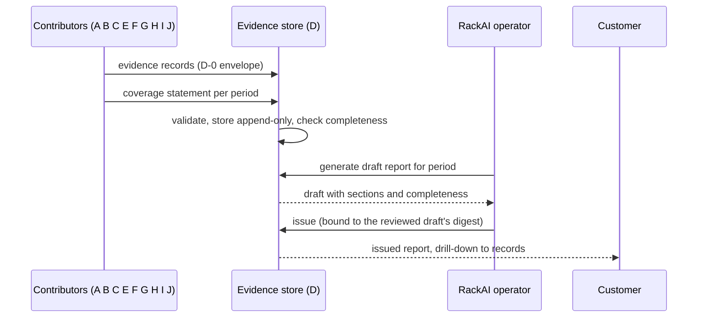

# Customer Observability & Evidence Report — PRD

| Field | Value |
|:--|:--|
| Version | v0.2 |
| Status | Draft |
| Owner | rackai-product |
| Reviewers | Product owner; Platform engineering (observability, audit, metering); UI; contributor PRD owners (A, B, C, E, F, G, H, I, J) |
| Product review | **Product-owner review disposition, 2026-10-10: conditional acceptance; not formal artifact approval.** PD-1 to PD-12 were approved in principle, on condition that canonical joint SLO attainment is kept and completeness is strengthened. PD-8 and PD-9 were revised (X-1 authority principal; S-3 independent reconciliation). The D-0 envelope becomes a versioned platform contract. Applied in v0.2 |
| Product approval | not yet approved. Passing checks is not approval |
| Date | 2026-10-10 |
| Roadmap items | Customer observability (product surface); MOE-1 evidence report |
| Tech spec(s) | [[Customer Observability & Evidence Report Tech Spec]] (v0.1 draft, drafted alongside this PRD per product-owner instruction 2026-10-10) |

> **Artifact type: Product Requirements Document.** The canonical concepts are [[Customer Observability]] and [[Evidence Report]], both written with this PRD because other PRDs consume them. This PRD projects from them and from the acceptance evidence in [[Minimum Operable Estate]]. If they disagree, the canonical notes win and this PRD is stale.
>
> **Status banner.** *Draft PRD for a proposed initiative.* Requirements are intent, not commitments. Parts of the substrate are built: a tenant metrics API (which returns empty series), a usage API and an audit read API (§2). There is no customer observability page, no evidence store and no report. Everything this PRD proposes is `assumed`.
>
> **Scope line (read first).** This PRD owns **three things**: the evidence contract every PRD writes to (D-0, §1.2), the customer's observability surface (how is my workload performing and what am I consuming?), and the recurring evidence report that proves what we did each period. It does **not** own: operator intelligence (GPU, queue depth, cache, power, placement signals: row *Observability M1 (operator intelligence)*, [[Monitoring and Auditability Spec]]); the telemetry pipeline itself (Platform Monitoring); any decision a contributor evidences (placement **A**, cost **B**, authority and policy **C**, boundaries **E**, model lifecycle **F**, performance verification **G**, agent actions **H**, access channels **I**, fine-tuning **J**); prices and invoices (Metering M3/M4 and billing); the SLO thresholds themselves (row 11).

## 1. Summary / Vision and the Evidence Contract (D-0)

### 1.1 Vision

A RackAI customer can see, at any time, how each workload is performing against what they declared and what it is consuming. Each period, RackAI hands them a report that proves the realisation outcome: service levels met or missed, what it cost them, which decisions were made and by whom, and that their declared envelope held. Every statement in it traces back to a record, and no gap in the evidence is ever shown as success.

Why now: the report is MOE-1 acceptance artifact 4 ([[Minimum Operable Estate]]), and its contract must be fixed before A, B, C and J start emitting evidence, or each will invent its own shape. The customer surface is the answer surface for step 4 of the operating loop (*prove it*), and the [[Concierge Engineer PRD]] answers from it.

### 1.2 The evidence contract (D-0)

**One envelope, many contributors.** Every PRD that makes or observes a decision the customer may need proven writes **evidence records** in one envelope. D defines the envelope and the rules. Each contributor defines only its own `kind`s and their `claim` payloads, at the level in §1.2.3, and registers them with D. D never re-derives a contributor's decision from logs. The formal schema, storage and API are in the spec (§4).

#### 1.2.1 The envelope

| Field | Meaning | Rule |
|---|---|---|
| `recordId` | Stable identity | Deterministic UUIDv5 over the contributor, the kind and the contributor's own decision or event ID. Re-emitting is idempotent |
| `schemaVersion` | Envelope version | Additive changes keep the version; a breaking change is a new version that readers support alongside the old |
| `contributor` | The producing PRD's ID (e.g. `prd-workload-declaration-placement`) | Must own the `kind` |
| `kind` | What sort of evidence (§1.2.3) | Registered, with exactly one owning contributor |
| `scope` | `{ customerOrg, organization, project }`, plus `authorityPrincipal` (added, v0.2) | `customerOrg` always, as a locator only, never an isolation key. `organization` (E's isolation principal) on every customer-scoped record. `authorityPrincipal`: the represented customer, from C's [[Authority Context]]. System-produced records with no request context get it from C's `authority.PrincipalFor` (C spec §4.13), which errors rather than guesses. The CustomerOrg is the principal only when attested through `CustomerOrg.spec.authorityPrincipal`. `project` when the subject belongs to one |
| `subjects[]` | `{ type, ref }`: what the record is about (declaration, revision, deployment, model, job, policy, agent, action, ...) | At least one |
| `at` or `period { from, to }` | When | Exactly one. A period is half-open: from ≤ t < to |
| `claim` | The kind-specific payload | Schema-versioned per kind |
| `basis` | `{ source: measured / derived / asserted, evidenceRefs[], confidence: measured / derived / assumed }` | `evidenceRefs` are audit event IDs, benchmark run IDs or a telemetry query plus window. Confidence never exceeds the source. *Measured* needs at least one telemetry or benchmark reference |
| `verification` | `{ type, status, reason }` (`type` added, v0.2) | Only on kinds bound to a status type in the [[Verification Status Vocabulary]] (§1.2.3). `type` must equal the kind's binding, and `status` uses that type's values. A status of one type is never evidence for another |
| `actor` | `{ type: customer / operator / system / agent, id }` | Who or what made the decision |
| `correlationId` | Ties one chain of decisions together (e.g. declaration revision → proposal → approval → commit) | Carried from the first decision in the chain |
| `producedAt` | When the contributor produced the record | Producer clock |

**Fields D adds** (additive; the fields above are unchanged):

| Field | Why |
|---|---|
| `claimVersion` | Makes "schema-versioned per kind" explicit: the version of this kind's claim schema |
| `sourceId` | The contributor's decision or event ID that `recordId` is derived from, so anyone can recompute and check it |
| `audience` | `customer` or `operator`. Operator-only records (e.g. internal cost, suspected violations) never reach a customer surface |
| `supersedes` | The `recordId` this record corrects. Records are never edited |
| `actor.onBehalfOf` | Required when `actor.type` is `agent`: the human the agent acted for ([[Agent Identity]]) |
| `scope.authorityPrincipal` (v0.2) | Keys customer access together with `organization`, so a shared CustomerOrg never lets one customer read another's records (X-1) |
| `verification.type` (v0.2) | Binds the status to its claim type |

#### 1.2.2 Rules

1. **Append-only.** A record is never changed or deleted inside its retention window. A correction is a new record with `supersedes`; reports use the latest and show that a correction exists.
2. **Idempotent.** The same decision always yields the same `recordId`, so retries and replays never duplicate evidence.
3. **Kubernetes holds decisions; PostgreSQL holds history.** A contributor's system of record for a decision stays where it is (for A, the decision record in Kubernetes status). The evidence record is written with, or after, the contributor's audit event, keyed by the same decision ID. They are two stores with no shared transaction (A spec §4.11); the deterministic ID makes recovery safe.
4. **Join keys:** `scope` + subject refs + `correlationId` + period overlap. Records about the same workload in the same period join on these alone, with no contributor-specific logic in D.
5. **Completeness is evidenced, not assumed, and has two levels** (revised v0.2, S-3). A count of emitted records alone does not prove that every expected event occurred.
   - **Collection:** were all the records the contributor produced received? Each contributor states per period how many it produced of each kind (a `coverage` record), and D compares that with what it received.
   - **Observation:** did the contributor's records cover everything that happened? Wherever possible, coverage reconciles against an **independent source of truth**:
     - *Decisions:* the authoritative decision journal or state transitions (e.g. A's decision records, or a contributor's audit category rows), up to a stated watermark.
     - *Periodic metrics and checks:* the expected population of windows (e.g. every day a workload was realised) and the source's own coverage (e.g. scrape coverage).
   - Each coverage status is `complete`, `incomplete` or `unknown` ([[Verification Status Vocabulary]], type `coverage`), stated separately for collection and observation. Observation is `unknown` when no independent source exists. Reports never present *complete collection of available records* as *complete observation of the system*.
6. **Absence of evidence is never evidence of compliance.** "Boundary held", "SLO met" and "no violations" are shown only when positive records say so for the whole period. Otherwise the report says *not evidenced*.
7. **Honest basis.** An operator-asserted record (e.g. an incident note) is labelled as asserted. A derived record names what it was derived from.
8. **Tenancy** (revised v0.2, X-1). Customer access to a record is keyed on its `organization` and its `authorityPrincipal`, never on `customerOrg` alone. The hierarchy is Installation → CustomerOrg → Organization → Project → Workload. No customer can read, or receive in a report, another customer's records through a shared parent. Nothing in a record may name another customer's workloads, capacity or usage.

#### 1.2.3 Kinds by contributor (contract level)

Each kind has one owner. Claim payloads are defined by the owner's spec in D-0's shape; the summaries below are what D relies on. Kinds marked *periodic* cover a period rather than an instant. Every kind is counted in its contributor's `coverage` statements (§1.2.2 rule 5).

| Contributor | Kind | What it evidences | Default audience |
|---|---|---|---|
| **A** [[Workload Declaration & Placement PRD]] | `placement-decision` | A declaration decision: submitted, evaluated (feasible, or infeasible with category and failing constraints), proposal rejected, approved, committed, commit revalidation failed, adopted, realised, policy-induced containment. Carries the declaration revision, origin, envelope, policy digest and performance status | customer |
| A | `constraint-violation` | A hard-constraint violation at runtime: suspected, cleared, confirmed, contained, containment failed | customer, except *suspected* and *cleared* (operator; A DV-6) |
| **B** [[Operator Economics & KPI Instrumentation PRD]] | `cost` (periodic) | Cost per workload per period. Two views: `internal` (RackAI cost, margin; operator only) and `charge` (what the customer is charged, once a price source exists; customer) | by view (PD-4) |
| **C** [[Governed Execution & Delegated Authority PRD]] | `policy-decision` | An execution-policy outcome: admitted, rejected, escalated, with the rule and reason | customer |
| C | `authority-decision` | An authorisation: who authorised what, under which delegated authority, approver vs proposer, emergency path, expiry | customer |
| C | `authority-grant` | A change to delegated authority: a grant created, changed or revoked, and its review | customer |
| **E** [[Sovereign Isolation & Assurance PRD]] | `boundary-held` (periodic) | For a period, which boundary controls were checked for a scope and that they held, with the checks run | customer |
| E | `boundary-exception` | Something crossed, or a control failed: what, when, and the C `authority-decision` that authorised it, if any | customer |
| **F** [[Model Lifecycle PRD]] | `lifecycle` | Model onboarded, qualified, upgraded (canary steps), retired | customer |
| **G** [[Empirical Map & Evidence-Informed Routing PRD]] | `performance` | A performance claim for a model × configuration × hardware × load, with provenance and freshness. Always carries `verification` | customer |
| G | `placement-recommendation` | A ranked recommendation G passed to A's decision interface | operator |
| G | `decision-outcome` | For a decision G informed: what was chosen, whether the recommendation was followed, predicted vs actual | operator |
| G | `characterization` | The measured profile of a declared workload's real traffic, and any divergence from what was declared | customer |
| **H** [[Concierge Engineer PRD]] | `agent-action` | An agent's plan, confirmation, submission, result or rollback, with `actor.onBehalfOf` | customer |
| **I** [[Inference Access & Distribution PRD]] | `distribution-listing`, `conformance` | Listing changes and conformance runs (I's own definition) | operator unless I says otherwise |
| **J** [[Fine-Tuning Operations PRD]] | `fine-tuning-job` | A job's lifecycle and its metered GPU time; which side of the RackAI/partner boundary did the work | customer |
| J | `adapter-intake` | A LoRA adapter's intake (accepted or rejected, with origin, producer and integrity result), attach and detach. Kept separate from F's model `lifecycle`, because each kind has one owner and adapters are J's | customer |
| **D** (this PRD) | `slo-attainment` (periodic) | Measured attainment of a workload against its declared service level and the ratified thresholds (row 11), with the telemetry window | customer |
| D | `usage` (periodic) | Metered consumption per workload: tokens, requests, GPU time, from the usage records | customer |
| D | `incident` | An operator-asserted incident: start, end, impact, affected workloads | customer |
| Every contributor | `coverage` (periodic) | How many records of each kind it emitted for a scope and period | operator |

| A | `containment-qualification` (v0.2) | A runtime path's containment qualification result (A spec §4.9.1) | operator |

**Status-type bindings** (v0.2; [[Verification Status Vocabulary]]). Each kind carries at most one status type:
- `performance`: `placement-decision`, `performance`, `placement-recommendation`. Ranking evidence never yields `verified`.
- `containment`: `containment-qualification`.
- `boundary`: `boundary-held`, `boundary-exception`.
- `qualification`: `lifecycle`.
- `coverage`: `coverage`.
- All other kinds carry no status.

Feasibility (`feasible`, `infeasible`, `not-offered`) is a claim field on `placement-decision`, never a verification status.

A new kind, or a new claim version, is registered before any record of it is accepted. An unregistered or invalid record is rejected back to its producer, counted and alerted on; it is never silently dropped.

#### 1.2.4 PRD A's interim record (answers A spec Q-5)

A's interim evidence record (A spec §4.11) maps onto the envelope without loss: `decisionId` → `sourceId` (and `recordId` is derived from it); `declarationRef` and `revision` → `subjects[]` (`declaration`, `revision`), with the derived deployment as a `deployment` subject; `origin`, `decision`, `constraints[]`, `option` and `policyDigest` → `claim`; `approver | system` → `actor`; `performance { status, evidenceRef, evidenceAsOf }` → `claim.performance` plus `verification`, with G's `performance` record or the curated evidence ID in `basis.evidenceRefs`; `timestamp` → `at`; `correlationId` → `correlationId`. The namespace gives `scope`. Violations go to `constraint-violation`. The field-by-field table is in the spec (§4.4).

#### 1.2.5 The envelope is a versioned platform contract (v0.2)

D-0 is a platform contract that every PRD builds against, not a reporting detail. Its rules:
- **Versions.** `schemaVersion` versions the envelope, and `claimVersion` versions each kind's claim. Both are integers, recorded on every record, and never reused.
- **Compatible changes** keep the version. These are new optional fields, new kinds and new enum values that readers are required to tolerate.
- **Breaking changes** need a new version. These are removing or retyping a field, changing a rule's meaning, or changing an existing enum value's meaning.
- **Support window.** The store accepts producers on the current and the previous envelope version. It serves every version still in retention, as written, and never migrates records in place.
- **Change control.** A version change needs D's owner, product owner approval and a change record. A kind's name is never reused or renamed (an alias is allowed). A new claim version is added alongside the old one.
- **Conformance.** A published conformance suite (fixtures and validator) is the test every contributor runs in CI. The envelope version each contributor targets is listed in the registry.

## 2. Problem Statement

**What is broken today** (read-only code survey, `RSS-Engineering/rackai@79ca4de`, `rackai-ui@89bddb4`, `rackai-docs@ccb52a3`):

- **The tenant metrics API has no data.** The observability service serves latency p99, request rate, error rate, fine-tuning job counts and quota utilisation per tenant (`rackai@79ca4de:internal/observabilityservice/metrics.go`). Every query depends on series nothing produces. A tenant recording-rule template now ships, but it is off by default and is computed from `rackai_gateway_*` series that no code emits, and it aggregates by tenant only, so the API's project and model filters can never match (`charts/rackai-monitoring/templates/prometheusrule-tenant-recording-rules.yaml`, `values.yaml`). An empty series looks the same as no traffic.
- **The metrics a customer asks for first don't exist in the API.** TTFT, inter-token latency and output tokens per second are designed but not built ([[Monitoring and Auditability Spec]]). The runtime does emit the histograms, and the operator's cluster-level rules already read them (`charts/rackai-monitoring/templates/prometheusrule-cluster-recording-rules.yaml`).
- **Usage is real, but partial.** The usage API returns tokens, requests and GPU time per project and model (`internal/usageservice/types.go`). Inference latency and compute time are zero by omission, quota consumption is absent because no quota policy exists, and there is no price, so no spend.
- **Nothing is shown to the customer.** The console has no usage, metrics or audit page; the only usage view is a fleet GPU bar on the home page (`rackai-ui@89bddb4:src/app/pages/home/gpu-overview/GpuOverviewCard.tsx`). The service endpoints are not in the published API reference (`rackai@79ca4de:docs/api/openapi-external.yaml`), and the user docs don't mention them.
- **There is no evidence, only audit.** Audit records what happened, in a closed set of categories (`pkg/audit/outbox.go`). It cannot show that an outcome was met. Deployments emit no audit events. Audit reads need `rolebindings:manage` (`internal/authz/routemap.go`). Telemetry is kept for days, not for the report's retention (Prometheus local retention defaults to `7d`, `charts/rackai-monitoring/values.yaml`).

**Why it matters.** MOE-1 is not accepted until there is a recurring report showing the outcome was met **and** the declared envelope held, and the contract and mechanism behind it must be validated first ([[Minimum Operable Estate]], acceptance logic 2026-10-09). The roadmap also says it needs an accountable owner, which it doesn't yet have. Without one evidence shape, each PRD will log in its own way and the report will be assembled by hand. **Hypothesis** (no customer evidence yet): customers delegate operation more readily when they can verify what we did, and they will use the report and surface to do so.

## 3. Product Principles

1. **Absence of evidence is not evidence.** We never show *held* or *met* without positive records for the whole period.
2. **Every statement traces to a record, and every record to its source.** A reader can drill from a sentence in the report to the audit event, benchmark run or telemetry query behind it.
3. **Contributors own their facts; D owns the shape and the joining.** D does not re-decide or re-derive anything a contributor decided.
4. **The customer sees their realisation outcome, not our economics.** Charges, never internal cost or margin.
5. **Customer observability and operator intelligence are two products on one pipeline.** Same telemetry, separate surfaces and an explicit tenant allowlist.
6. **Say what kind of nothing it is.** "No data source", "no traffic" and "backend unavailable" are different answers, never an empty chart.
7. **Prove the realisation outcome, not the customer's business result** (outcome boundary in [[Three Battlegrounds]]).

## 4. Scope: Goals & Non-Goals

**Goals**
- Every PRD contributes evidence in one shape, and a report can be produced from those records alone, with no manual reconstruction.
- A customer can see how each workload performs against its declaration and what it consumes, in the API and the console.
- Each period, each customer receives a reviewed report that proves the outcome, the decisions and the envelope, and shows its own gaps.
- MOE-1 acceptance has a validated evidence contract and mechanism before it starts.

**Non-Goals / Out of Scope**
- Operator intelligence and the Empirical Map's inputs: row 8 and **G**. D consumes the same pipeline; it does not define operator dashboards or alerts.
- Building the telemetry pipeline, scrape targets and runtime instrumentation: Platform Monitoring. D states which series it needs (the spec designs the recording rules it depends on).
- Deciding anything a contributor evidences (see the scope line).
- Prices, rate cards, invoices: Metering M3/M4 and billing (D-4).
- Defining SLO thresholds: row 11 (D-1).
- A compliance attestation or auditor report: **E** and the compliance workstream. The report is evidence they can use.
- Multi-region and per-jurisdiction evidence: **K** (MOE-3).

## 5. Users & Personas

| Persona | Side | Needs from D |
|---|---|---|
| **Customer application owner / ML engineer** | Customer | Latency, TTFT, throughput, errors and usage for their workloads; attainment against what they declared |
| **Customer platform, security or compliance lead** | Customer | The periodic report: envelope held, decisions, who acted; drill-down to the records |
| **Customer finance / billing admin** | Customer | Usage and charges per project and period |
| **RackAI operator / FDE** | RackAI | Generate, review and issue reports; see completeness gaps and operator-only evidence; record incidents |
| **Contributor PRD teams (A, B, C, E, F, G, H, I, J)** | Platform | One contract to write to, a registry for their kinds, a test that their records validate |
| **Concierge Engineer (H)** | Platform | Read the same surface and evidence through public APIs |

## 6. Core Entities

| Entity | Role here |
|---|---|
| [[Customer Observability]] | The customer surface this PRD delivers (canonical; written with this PRD) |
| [[Evidence Report]] | The periodic report this PRD delivers (canonical; written with this PRD) |
| [[Workload Declaration]] | What attainment and "envelope held" are measured against |
| [[SLO Attainment]] | The measure of performance against the declared service level |
| [[Model Deployment]] | The running workload most telemetry is about |
| [[Organization]] | Tenant scope; the CustomerOrg is the report's scope |
| [[Benchmark Evidence Chain]] | Where evidence for a `performance: verified` status comes from (via G's rules) |
| [[Audit]] | The event history evidence records reference; not replaced |
| [[Metering]] | Source of usage |
| [[Agent Identity]] | How an agent's action is attributed to the human it acted for |

**Defined here, not canonical** (only D uses them directly; contributors use them only through the envelope):
- **Evidence record**: one record in the D-0 envelope (§1.2). Its canonical home is this PRD's §1.2 and the spec's §4; [[Evidence Report]] links here.
- **Coverage statement**: a contributor's per-period count of the records it emitted, used to detect loss.
- **Coverage status** (type `coverage` in the [[Verification Status Vocabulary]]): per report section, stated separately for **collection** and **observation**: `complete`, `incomplete` (records or events known to be missing), `unknown` (no coverage statement, or no independent source). It is distinct from the section's **outcome** (e.g. held, *not evidenced*).

## 7. User Journeys / Scenarios

**Worked example: the customer surface.** A customer's ML engineer opens *Observability* for the declared workload *support-chat* (GLM 5.3 Flash, profile interactive). They see p50/p95/p99 latency, TTFT and inter-token latency, output tokens per second, request and error rates for the last day, and usage (tokens, requests) for the billing period. Attainment shows *thresholds not ratified* until row 11 is decided, and then the share of requests meeting the declared targets. A second, undeclared deployment on an AIM runtime shows *no data source* for TTFT instead of an empty chart. A project-confined developer sees only their project.

**Worked example: the report.** At the end of the period:
1. The evidence service closes the period: it waits for each enabled contributor's `coverage` statement and compares counts.
2. An operator generates a draft report for the CustomerOrg. It has sections for performance vs SLO, usage and charges, policy decisions, actions, envelope held, incidents and completeness. E's `boundary-held` record is missing for one organisation, so that section reads *not evidenced*, not *held*. A's coverage count is one higher than the records received, so the placement section reads *incomplete: 1 record missing*.
3. The operator investigates. A's gap sweep re-emits the missing record (idempotent), and E's check runs late and records. The operator regenerates the draft, reviews it and issues it. The issued report is immutable and has a digest.
4. The customer's compliance lead reads it in the console, drills into one infeasible declaration to the placement decision, and from there to its audit event.
5. A late correction to a cost record next week produces version 2, which supersedes version 1; both stay retrievable.

## 8. Functional Requirements

**Evidence contract (D-0)**

| # | Requirement | Priority | Notes |
|---|-------------|:--------:|-------|
| FR-1 | Every contributor writes evidence in the D-0 envelope (§1.2.1), including the fields D adds | MUST | One shape for all PRDs |
| FR-2 | `recordId` is deterministic from contributor, kind and `sourceId`; re-emitting the same decision never creates a second record | MUST | |
| FR-3 | Records are append-only within retention; corrections are new records that `supersedes` the old | MUST | §1.2.2 rule 1 |
| FR-4 | Each kind has exactly one owning contributor and a registered, versioned claim schema. Unregistered or invalid records are rejected to the producer with a reason, counted and alerted | MUST | §1.2.3 |
| FR-5 | `basis` is honest: confidence never exceeds source; *measured* needs a telemetry or benchmark reference; performance claims carry `verification` and a reason | MUST | |
| FR-6 | Every record has an `audience`; customer-facing surfaces and reports never show operator-only records | MUST | PD-4, PD-7 |
| FR-7 | Records can be retrieved and joined by scope, subject, `correlationId` and period, with no contributor-specific logic in D | MUST | §1.2.2 rule 4 |
| FR-8 | Each contributor emits a `coverage` statement per scope and period. It counts every kind it owns from its own system of record and states the source-of-truth watermark it reconciled to. D checks collection (received vs stated) and, wherever an independent source exists, observation (stated vs the decision journal, state transitions or expected windows). D detects gaps and alerts | MUST | Loss detection; revised v0.2 (S-3) |
| FR-9 | Operators can query evidence records for any scope; customers can query their own customer-visible records | MUST (operator, Phase 1); SHOULD (customer, Phase 2) | |
| FR-10 | PRD A's interim evidence record maps onto the envelope without data loss (§1.2.4) | MUST | Answers A Q-5 |

**Customer observability** (row *Customer observability (product surface)*)

| # | Requirement | Priority | Notes |
|---|-------------|:--------:|-------|
| FR-11 | Per workload: latency percentiles (p50, p95, p99), TTFT, inter-token latency, output tokens per second, request rate and error rate, filterable by project, model and deployment or declaration, over a chosen window. Latency figures are labelled **server-side** and never presented as end-to-end. A runtime whose series are not parity-checked shows these metrics as **visibly unavailable**, never silently omitted | MUST | Extends the existing metrics API; spec DV-1 and DV-2 (approved 2026-10-10) |
| FR-12 | Usage per project, model and period: input, output and cached tokens, requests, GPU time for deployments and fine-tuning jobs. A value that is zero by omission is not shown as a measurement | MUST | Usage API exists |
| FR-13 | Quota utilisation, once quota policy exists; until then the surface says no quota policy applies | SHOULD | Metering M3 |
| FR-14 | Spend (charges) once a price source exists; never RackAI internal cost | SHOULD | D-4, PD-4 |
| FR-15 | Each declared workload shows its declaration state and reasons (from A), and its attainment against the declared service level as the canonical [[SLO Attainment]]: the fraction of requests meeting all applicable thresholds together. Where joint attainment is not measured, the surface shows `jointAttainment: not_measured`. It may also show a separately labelled lower bound with its method, assumptions and coverage, and per-threshold figures labelled as estimates. None of these is ever shown as an achieved SLA or used to declare an SLO met. Before row 11, it shows *thresholds not ratified* | MUST | PD-5; row 11; revised v0.2 (DV-3 ruling) |
| FR-16 | Every metric distinguishes *available*, *no traffic*, *no data source* and *backend unavailable*, and shows the time its value is as of | MUST | PD-11; fixes today's silent empty series |
| FR-17 | Available through the API, the CLI and the console | MUST (API); SHOULD (CLI, console) | |
| FR-18 | A caller sees only their own tenant; a project-confined caller sees only their projects; no surface reveals nodes, supply internals or other tenants | MUST | Existing project filter kept |
| FR-19 | Telemetry-derived values the report needs (`slo-attainment`, `usage`) are recorded as evidence before telemetry retention expires | MUST | Telemetry is kept for days |

**Evidence report** (row *MOE-1 evidence report*)

| # | Requirement | Priority | Notes |
|---|-------------|:--------:|-------|
| FR-20 | A report per authority principal per period (PD-8), with per-organisation and per-project sections, joining: performance vs SLO; usage and charges; policy decisions (admitted, rejected, escalated, infeasible); actions (who, or which agent on whose behalf); outcomes vs the declaration (hard constraints held at commit and at runtime, violations and containment, boundary held and exceptions); and incidents | MUST | The four evidence groups of MOE artifact 4, plus incidents |
| FR-21 | Every section states its collection and observation coverage (`complete`, `incomplete`, `unknown`) separately from its outcome. It never asserts held or met without positive records for the whole period (*not evidenced* otherwise), and never declares an SLO met without measured joint attainment | MUST | PD-3; revised v0.2 |
| FR-22 | Every statement links to the record IDs behind it, and each record to its `evidenceRefs` | MUST | Principle 2 |
| FR-23 | Lifecycle: an operator generates a draft, reviews it and issues it; an issued report is immutable with a digest; a correction issues a new version that supersedes the old, and both stay retrievable | MUST | PD-6 |
| FR-24 | The mechanism runs on any estate, including MOE-0 rehearsal data, and labels rehearsal reports as such | MUST | MOE acceptance logic: dry run before MOE-1 |
| FR-25 | Reports are generated on the cadence agreed for each customer | SHOULD | D-5 |
| FR-26 | Customers retrieve issued reports through the API and console; drafts are not visible to them | MUST (API); SHOULD (console) | Export format: D-8 |
| FR-27 | Operators have a separate internal view with operator-only evidence (internal cost, suspected violations, completeness detail); nothing from it enters the customer version | MUST | |
| FR-29 | D-0 is versioned and changed only under §1.2.5: compatible changes keep the version; breaking changes add one; the current and previous envelope versions are accepted; records are never migrated in place; a conformance suite is published for contributors | MUST | v0.2 (platform contract) |
| FR-28 | Operators can record an incident (start, end, impact, affected workloads) as an asserted `incident` record | MUST | MOE artifact 4 names incidents |

## 9. Non-Functional Requirements

- **Integrity.** Evidence records cannot be altered or deleted inside retention by any role. Issued reports cannot be altered. Both are testable invariants (AC-3, AC-17).
- **No silent loss.** Loss between a contributor and the store is detected by coverage comparison and the contributor's own gap sweep, and alerts. Loss-detection latency is a target posture for the spec; no baseline exists.
- **Tenancy.** No record, metric or report reveals another tenant's data. Isolation is enforced server-side, never by the caller's parameters.
- **Freshness.** Customer metrics show their as-of time. The freshness bound is a target posture for the spec; no baseline exists.
- **Retention.** Evidence records and issued reports are kept for the platform's compliance retention window (§13).
- **Availability posture.** The customer surface degrades to *backend unavailable*; evidence writes never block a contributor's safety actions (A's containment), and contributors decide whether their other decisions are gated on evidence (A gates placement on audit).
- **Compatibility.** The existing metrics, usage and audit APIs keep their contracts; changes are additive.

## 10. Platform Integration

| System | Needs from it | Provides to it |
|---|---|---|
| Identity & access (IAC) | Permissions to view metrics (existing `observability:view`), usage (`usage:view`), evidence and reports; to generate, issue and record incidents (platform) | New permissions for evidence and reports (mapping decided with C, D-6) |
| Tenancy & isolation | Organisation and project scope; CustomerOrg namespace for org-level reports | Records and reports scoped per CustomerOrg |
| Metering, quotas & billing | Usage records; quota policy (M3); a price source (D-4) | `usage` evidence; no billing records |
| Audit | Audit event IDs as evidence references | Audit events for report generation, issuance and incidents |
| Monitoring & observability | Tenant-attributed series for latency, TTFT, ITL, throughput, errors from the runtimes | Its own health metrics: records accepted/rejected, coverage mismatches, report generation |

## 11. Loop Role & Cross-PRD Interfaces

**Loop role:** *Prove it.* D owns the evidence report and the evidence contract. It serves both promises: the operator side proves it delivered the service, and the sovereign side proves the envelope held. Customer observability is the always-on half; the report is the periodic proof.

| Interface | Direction | Other PRD | Defined where |
|---|---|---|---|
| Evidence contract (D-0 envelope, rules, registry) | provides | A, B, C, E, F, G, H, I, J | This PRD §1.2; spec §4 |
| Evidence records of their kinds | consumes | A, B, C, E, F, G, H, I, J | Each contributor's PRD (claims), in D-0's shape |
| Authority Context (authority principal, tenant scope) | consumes | C | [[Authority Context]] |
| Typed status vocabulary; failure classes; readiness states | consumes | all | [[Verification Status Vocabulary]], [[Failure Mode Taxonomy]], [[Release Readiness States]] |
| Workload declaration (service level, hard constraints) | consumes | A | [[Workload Declaration]] |
| Declaration state and reasons | consumes | A | [[Workload Declaration & Placement PRD]] FR-20 |
| Customer observability surface and evidence read | provides | H | This PRD; [[Customer Observability]] |
| Per-profile SLO thresholds | consumes | row 11 (decision) | Policy note to be written with row 11 |
| MOE-1 acceptance definition | consumes | row 47 | [[Minimum Operable Estate]] |
| Operator intelligence (row 8) | sibling, same pipeline | Auditability & Observability PRD (engineering) | [[Monitoring and Auditability Spec]] |

## 12. Failure Handling

Classes and terms follow the [[Failure Mode Taxonomy]] (revised v0.2).

| Failure | Class | Response | Continues / stops / degrades | Who is told |
|---|---|---|---|---|
| Evidence store unavailable | Evidence | Producers' placement actions **wait** (fail closed, per each producer). Safety actions **proceed**, with evidence back-filled and flagged | Running workloads continue; new evidence queues in outboxes; nothing is lost | Operator (alert) |
| Invalid record | Evidence | **Fail closed** for that record: rejected to the producer with a reason | The producer's gated decision waits; nothing is stored partly | Operator and producer team (alert, counter) |
| Coverage missing, mismatched, or not reconciled to an independent source | Evidence | **Degrade**: the affected sections show `incomplete` or `unknown`, for collection and observation separately | Report generation continues; issuance is allowed only with the gap shown | Operator (alert); customer (shown in the report) |
| Telemetry backend down | Evidence | **Degrade**: the surface shows *backend unavailable*. Attainment for the window is partial, with its covered fraction | Serving continues; nothing is shown as met | Customer (data state); operator (alert) |
| Runtime without parity-checked series | Evidence | **Not offered** for those metrics: shown visibly unavailable | Other metrics continue | Customer (data state) |
| Report generation fails part-way | Evidence | **Fail closed**: no draft | Earlier issued reports are unaffected | Operator (audited attempt) |
| Authority Context unavailable (C) | Authority | **Fail closed** for customer reads and report issuance (no scope can be established) | Evidence collection continues | Customer (error); operator (alert) |
| Correction after issuance | Evidence | A new version supersedes the old | The old version stays retrievable and marked | Customer (new version) |

**Guaranteed never to happen:** an operator-only record in a customer view; a section shown as held or met without positive evidence; an SLO declared met without measured joint attainment; an issued report changed in place; one customer's data in another's view through a shared parent.

## 13. Data Retention & Compliance

D holds evidence records (decisions, measurements and assertions about workloads; no prompts or completions), coverage statements and issued reports. Records and reports are kept for the platform's compliance retention window (the audit setting, up to 2557 days), then purged by the same mechanism as audit. Customers can read but not delete them; a CustomerOrg's records follow its deprovisioning policy, as audit does. The report is MOE-1 acceptance evidence and an input to E's attestation work; it makes no compliance claim of its own.

## 14. Scope & Phasing

| Phase | Gate | Delivers | Roadmap items |
|---|---|---|---|
| **1a: contract** | MOE-0 (wave 1) | D-0 envelope, registry, store, operator query, coverage and loss detection, versioned contract and conformance suite (FR-1 to FR-10, FR-29, operator part of FR-9) | — (prerequisite for both rows) |
| **1b: customer surface** | MOE-0 → MOE-1 | Metrics with data and data states, usage, workload status and attainment (FR-11 to FR-19); console and CLI | Customer observability (product surface) |
| **2: evidence report** | MOE-1 | Report generation, completeness, review and issuance, customer retrieval, incidents (FR-20 to FR-28); customer evidence query (FR-9); dry run on MOE-0 data before MOE-1 acceptance; the first completed report is produced by the acceptance exercise | MOE-1 evidence report |
| **Later** | MOE-3 | Per-jurisdiction evidence | K: Residency & Multi-Region |

Sequencing: publish D-0 first so wave-1 PRDs emit the right shape from their first build. Prototype the report on one MOE-0 estate with a hand-checked answer before generalising.

## 15. Acceptance Criteria & Success Metrics

**Acceptance criteria** (proposed, not approved; revised v0.2). Each names its expected result, how it is tested, and its gate ([[Release Readiness States]]). The evidence source for each is the CI or acceptance run record of the named test. AC-15's evidence is the reviewed dry-run record.

| # | Criterion (observable, pass/fail) | Verifies | How tested (evidence source) | Gate |
|---|---|---|---|---|
| AC-1 | A record missing a required envelope field, or of an unregistered kind or claim version, or carrying a status type its kind is not bound to, is rejected with a reason and counted; a valid record of every registered kind is accepted | FR-1, FR-4 | Schema test per kind (CI) | M1 / MOE-0 |
| AC-2 | Emitting the same decision twice produces one stored record, and an independent recomputation from contributor, kind and `sourceId` gives the same `recordId` | FR-2 | Replay test (CI) | M1 / MOE-0 |
| AC-3 | No API path or database role can update or delete a record inside retention; a correction with `supersedes` is stored, the report uses it, and the original stays retrievable | FR-3, §9 | Negative tests per role, plus correction test (CI) | M1 / MOE-0 |
| AC-4 | A record with `basis.source: measured` and no telemetry or benchmark reference, or with confidence above its source, or a status-bound kind without `verification` of its bound type, is rejected | FR-5 | Schema test (CI) | M1 / MOE-0 |
| AC-5 | Operator-only records (internal cost, suspected violations, recommendations, decision outcomes, coverage) never appear in any customer-scoped query, metric or report | FR-6, FR-27, PD-4 | Negative test with seeded operator-only records (CI) | M1 / MOE-0 (query); M4 / MOE-1 (report) |
| AC-6 | For a test declaration, a query by `correlationId` returns its placement decisions and the authority decision behind its approval; a query by subject and period returns every kind recorded about it | FR-7 | Join test with fake contributors (CI) | M1 / MOE-0 |
| AC-7 | (a) Withholding one record that a contributor counted yields collection `incomplete`, naming the contributor and kind. (b) A decision present in the contributor's authoritative journal but **absent from both its records and its coverage count** yields observation `incomplete`. (c) A kind with no independent source shows observation `unknown`. In each case an alert fires, and the report shows the status separately from the outcome | FR-8, FR-21 | Loss-injection tests at both levels (CI) | M1 / MOE-0 (detection); M4 / MOE-1 (report) |
| AC-8 | Every field of A's interim evidence record maps to the envelope, and the records A's AC-12 produces validate against D-0 v1 | FR-10 | Mapping test using A's fixtures (CI) | M1 / MOE-0 |
| AC-9 | With traffic on a test deployment, the metrics API returns non-empty p50, p95 and p99 latency, TTFT, inter-token latency, output tokens per second, request rate and error rate, correctly filtered by project and by model; latency is labelled server-side; a workload on a runtime without parity-checked series shows those metrics as unavailable, not absent | FR-11 | Integration test with a load generator, plus a non-parity runtime (CI) | M2 / MOE-1 |
| AC-10 | Each data state is distinguishable: no source configured → *no data source*; source with no traffic → *no traffic*; backend down → *backend unavailable*; never an unlabelled empty series | FR-16 | Test per state (CI) | M2 / MOE-1 |
| AC-11 | No parameter lets a caller read another customer's metrics, usage, records or reports, **including two customers under one shared CustomerOrg**; a project-confined caller sees only their projects | FR-18, §1.2.2 rule 8 | Extended isolation suite with a shared-CustomerOrg fixture (CI) | M2 / MOE-1 (metrics); M1 / MOE-0 (records); M4 / MOE-1 (reports) |
| AC-12 | Usage shown in the API and console for a period equals the usage records for that period; fields that are zero by omission are marked as not measured | FR-12 | Comparison test (CI) | M3 / MOE-1 |
| AC-13 | A declared workload shows its declaration state and reasons. Its attainment shows the canonical joint figure when measured; otherwise `jointAttainment: not_measured`, with any lower bound and per-threshold estimates labelled as such and never as met; before row 11, *thresholds not ratified* | FR-15, PD-5 | API and console test, with and without thresholds and joint measurement (CI) | M3 / MOE-1 |
| AC-14 | The console has usage and observability pages, gated by the existing permissions, and the CLI returns the same data | FR-17 | UI component tests, CLI test (CI) | M3 / MOE-1 |
| AC-15 | A dry run on MOE-0 data produces a draft report with every FR-20 section; every statement links to record IDs, and every section has collection and observation coverage | FR-20, FR-22, FR-24 | Dry run, checked by hand against the source systems (reviewed dry-run record) | M4 / before MOE-1 acceptance |
| AC-16 | With no `boundary-held` record for an organisation in the period, the report says *not evidenced*, not *held*; with joint attainment not measured, no SLO is shown as met; with no violation coverage, *no violations* is not shown | FR-21, PD-3 | Negative test (CI) | M4 / MOE-1 |
| AC-17 | Issuing requires an authorised operator and the reviewed draft's digest; an issued report cannot be changed; a later correction issues version 2 superseding version 1, and both are retrievable | FR-23, PD-6 | API test (CI) | M4 / MOE-1 |
| AC-18 | A customer admin of the report's authority principal can retrieve its issued reports, and cannot see drafts or another principal's reports | FR-26, PD-8 | API test (CI) | M4 / MOE-1 |
| AC-19 | `slo-attainment` and `usage` records for a period exist after the period closes, even when the raw telemetry has expired | FR-19 | Test with a short telemetry retention (CI) | M3 / MOE-1 |
| AC-20 | Records and reports are kept for the compliance window and purged only outside it, by the purge role | §13 | Retention test (CI) | M1 / MOE-0 |
| AC-21 | A producer on the previous envelope version is accepted; a record using a compatible addition is read by an older reader; a breaking change without a new version fails the conformance suite; stored records keep the version they were written with | FR-29 | Conformance suite (CI) | M1 / MOE-0 |

**Success metrics** (ladder; baselines are "none today"; targets are postures):

1. **Contract adoption:** share of contributor decisions that arrive as valid D-0 records. Baseline: none (no evidence store).
2. **Completeness:** share of report sections *complete* at first generation, and time to close gaps.
3. **No manual reconstruction:** report statements that needed data from outside the evidence store. Posture: none.
4. **Surface with data:** share of customer workloads whose core metrics are *available*. Baseline: 0% (empty series today).
5. **Attainment measured:** share of declared workloads with attainment recorded each period (after row 11).
6. **Use:** customers who open the surface or the report each period, and questions answered from it (with H).
7. **Outcome:** MOE-1 acceptance artifact 4 accepted by the customer.

## 16. Dependencies

- **Decision row 11:** per-profile SLO thresholds (D-1). Attainment verdicts and the report's performance section wait on it.
- **Row 47:** the MOE acceptance definition, which fixes what the MOE-1 report must contain (D-2).
- **Platform Monitoring:** tenant-attributed series from the runtimes, with project and model labels; long-window storage (D-9).
- **Metering:** usage records (built); quota policy (M3); price source (D-4).
- **Contributors:** A, B, C, E, F, G, H, I, J emit their kinds; C decides permissions (D-6).
- **Row 8 (operator intelligence):** shares the pipeline; scope boundary to confirm (D-7).
- **Depended on by:** every contributor (the contract), H (the surface), MOE-1 acceptance (the report).

## 17. Risks & Mitigations

| Risk | Mitigation |
|---|---|
| Contributors ship before D-0 and invent their own shape | D-0 is Phase 1a and wave 1; A already writes an interim record mapped here (§1.2.4) |
| The report reads as compliance when evidence is missing | Principle 1, FR-21, AC-16; completeness on every section |
| Internal cost or margin leaks to a customer | `audience` on every record; separate internal view; AC-5 |
| The surface stays empty because the pipeline isn't fixed | The spec designs the runtime-sourced rules D depends on, and data states make an empty result visible (FR-16) |
| Telemetry expires before a report is built | Materialise `slo-attainment` and `usage` as evidence within the retention window (FR-19) |
| Report becomes a manual monthly chore | Coverage and drill-down make gaps visible and fixable at source; success metric 3 |
| Two "observability" products drift into one | PD-7 and D-7 keep row 8 separate |

## 18. Kill / Falsification Criterion

The bet has two parts, and each can fail on its own.

**The mechanism.** The bet is that one envelope can carry everything the report needs. **Falsified if** the MOE-0 dry run can't produce a complete draft from evidence records alone: any of the four MOE evidence groups needs data reconstructed from logs or another system. **Then:** revise D-0 before MOE-1 acceptance; don't add a side channel.

**The value.** The bet is that customers use the report and surface to verify and keep delegating. **Falsified if** most MOE-1 customers who receive issued reports don't use them in acceptance or review, or reject them as insufficient, **and** that persists after the gaps they named are addressed within scope. **Then:** keep the contract (it still serves audit and E's attestation), stop investing in the integrated report beyond the acceptance artifact, and revisit with the product owner. The threshold ("most") is proposed for approval (PD-10).

**Evidence:** dry-run results, completeness per section, customer review notes and acceptance records, and use of the surface and report.

## 19. Open Decisions

| # | Decision | Owner | Blocks |
|---|----------|-------|--------|
| D-1 | Per-profile SLO thresholds and attainment target (row 11). Gates A, D and G | Product owner | FR-15 verdicts; report performance section; AC-13 |
| D-2 | Ratify the MOE acceptance definition (row 47), including which evidence the MOE-1 report must contain | Product owner | FR-20 final section list; MOE-1 |
| D-3 | Name the accountable owner for the integrated report (the roadmap says none is assigned) | Product owner | Phase 2 |
| D-4 | Price source for customer charges: rate card, contract terms, or none at MOE-1 | Product owner, with Metering (Rohit) and B | FR-14; charge view of `cost` |
| D-5 | Default report cadence and period alignment, and whether it is set per customer agreement | Product owner | FR-25 |
| D-6 | Who may view evidence and reports, and who may generate and issue them (permission mapping) | C owner, with product owner | FR-9, FR-23, FR-26 |
| D-7 | Confirm the boundary with row 8 (operator intelligence): which metrics belong to each surface | Product owner, with row 8 owner (Abhimanyu) | FR-11 scope |
| D-8 | Report format and export (console view and JSON; PDF; signed digest for customer auditors) | Product owner, with E | FR-26 |
| D-10 | Exact joint attainment needs per-request latency capture. *Consumer requirement / requested interface change to* Platform Monitoring ([[Monitoring and Auditability Spec]]) and to [[Inference Access & Distribution PRD]] (front-proxy ext_proc). Until it exists, no SLO is declared met | Product owner, with Platform Monitoring and I | FR-15 verdicts; AC-13 |
| D-9 | Long-window metrics: the API allows 90 days but local telemetry is kept for days; enable long-term storage, or cap the window | Platform engineering, with product owner | FR-11 windows |

## 20. Proposed Product Decisions

None is approved. Each is listed for the product owner to accept, change or reject.

| # | Decision | Alternatives considered | Why this one | Status |
|---|---|---|---|---|
| PD-1 | **One evidence envelope (D-0) for every PRD**; contributors emit records, D stores and joins them and never re-derives a contributor's decision. Answers A's Q-5 | D infers evidence from audit logs; each PRD reports its own section | One shape is the only way a report can be built without manual work; contributors know their decisions best | proposed — approved in principle 2026-10-10 (PO review) |
| PD-2 | **Append-only, idempotent records**; corrections supersede, never edit | Mutable records with history | Proof that can be edited isn't proof | proposed — approved in principle 2026-10-10 (PO review) |
| PD-3 | **Absence is never compliance**: held or met only with positive records for the whole period; otherwise *not evidenced*, with completeness on every section | Show held unless a violation was recorded | The sovereign promise; a missing check must not read as a passed one | proposed — approved in principle 2026-10-10 (PO review) |
| PD-4 | **Customers see charges, never internal cost or margin.** B's internal view is operator-only | Show RackAI cost for transparency | Margin is commercial; the customer's question is what they pay | proposed — approved in principle 2026-10-10 (PO review) |
| PD-5 | **Attainment is measured against the workload's declared service level, using the ratified thresholds (row 11)**; until then the surface shows percentiles and *thresholds not ratified*, never a verdict. *Applied v0.2 per the PO's condition:* attainment is the canonical joint figure; where it isn't measured, the status is `not_measured` and no SLO is declared met | Interim thresholds chosen by D | No invented thresholds; one source of truth for service levels | proposed — approved in principle 2026-10-10 (PO review) |
| PD-6 | **A human operator reviews and issues each report at MOE-1**; issued reports are immutable with a digest; corrections issue a new version. *v0.2:* the issue step is one interface, so policy-governed automated issuance can replace the human step later without changing the report contract | Automatic issuance | Operate before automate; the first reports will find contract gaps | proposed — approved in principle 2026-10-10 (PO review) |
| PD-7 | **Customer observability and operator intelligence are separate surfaces on one pipeline**, with a tenant allowlist; D never exposes nodes, supply internals or other tenants | One shared dashboard with role filtering | Ratified two-products decision ([[Milestone Release Map]]); an allowlist fails safe | proposed — approved in principle 2026-10-10 (PO review) |
| PD-8 | **The report's scope is the authority principal** (C's [[Authority Context]]), with per-organisation and per-project sections. It is the CustomerOrg only where the CustomerOrg is validated as controlled by one customer; otherwise the Organization | The CustomerOrg always (v0.1); per Organization only | No customer may receive another's evidence through a shared parent (X-1), while one customer with several organisations still gets one report | proposed — revise (PO review 2026-10-10): use the authority principal (X-1). Revised v0.2, pending approval |
| PD-9 | **Every contributor states coverage per period, reconciled to an independent source-of-truth watermark or expected-event population wherever one exists** (decision journal or state transitions for decisions; expected windows and source coverage for periodic kinds). D reports collection and observation completeness separately | Trust the outbox; emitted counts only (v0.1) | Outboxes guarantee delivery of what was enqueued, not that everything was enqueued | proposed — revise (PO review 2026-10-10): reconcile against an independent source of truth (S-3). Revised v0.2, pending approval |
| PD-10 | Value falsification: **most** MOE-1 customers don't use or reject the issued reports after named gaps are addressed (§18) | A fixed percentage now | No baseline exists to set a number honestly | proposed — approved in principle 2026-10-10 (PO review) |
| PD-11 | **The surface names the kind of nothing**: no source, no traffic, backend unavailable | Empty series (today) | An empty chart that means "not built" erodes trust in every other chart | proposed — approved in principle 2026-10-10 (PO review) |
| PD-12 | **Incidents are operator-asserted records**, labelled as asserted, until an incident system feeds them | Wait for an incident system | MOE artifact 4 names incidents; an honest asserted record beats none | proposed — approved in principle 2026-10-10 (PO review) |

## See Also

- [[Customer Observability]] and [[Evidence Report]]: the canonical concepts this PRD builds on
- [[Customer Observability & Evidence Report Tech Spec]]: the engineering design (draft)
- [[Minimum Operable Estate]]: MOE-1 acceptance artifact 4 and the minimum evidence contract
- [[Milestone Release Map]]: "observability is two products"
- [[Workload Declaration & Placement PRD]]: the first contributor, and what attainment is measured against
- [[Monitoring and Auditability Spec]]: the engineering substrate and its as-built gaps
- [[PRD Coverage Plan]]: where D sits among the ten PRDs
