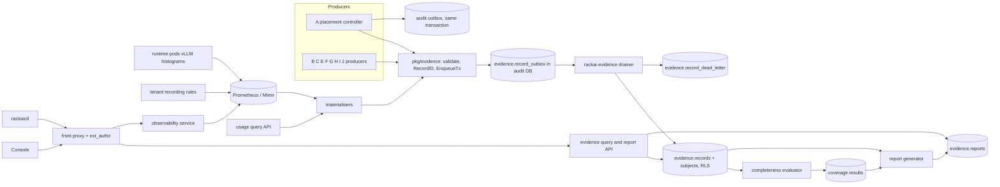
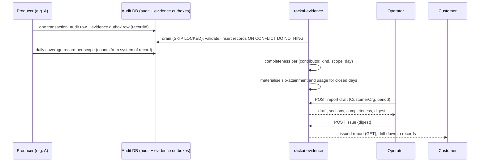

# Customer Observability & Evidence Report — Technical Specification

| Field | Value |
|:--|:--|
| Version | v0.2 |
| Status | Draft |
| Author | Wiki agent for rackai-product (draft for platform engineering) |
| Reviewers | Platform engineering (observability, audit, metering, monitoring chart); UI; Docs; contributor spec owners (A, B, C, E, F, G, H, I, J) |
| Engineering approval | not yet approved |
| Product review | **Product-owner review disposition, 2026-10-10: conditional acceptance; not formal artifact approval.** DV-1 and DV-2 approved. DV-3 revised: canonical joint attainment is kept, with `not_measured` where it isn't. Completeness now reconciles to independent sources (S-3). Storage and RLS are keyed on Organization plus authority principal (X-1). D-0 is a versioned platform contract. Typed statuses, the failure taxonomy and readiness states are adopted. Applied in v0.2 |
| Product approval | not yet approved. Passing checks is not approval |
| Date created | 2026-10-10 |
| Based on PRD(s) | [[Customer Observability & Evidence Report PRD]] (v0.2 draft, not yet approved; spec drafted alongside per product-owner instruction 2026-10-10) |
| Roadmap items | Customer observability (product surface); MOE-1 evidence report |
| Jira epic(s) | none yet: one epic per milestone (§13), to be created by platform engineering |

> **Artifact type: Technical Specification.** Its concepts have canonical notes: [[Customer Observability]], [[Evidence Report]], [[Workload Declaration]], [[SLO Attainment]], [[Audit]]. This spec designs *how* to build them and does not redefine them. The evidence contract's product rules are in the PRD §1.2; this spec formalises them as the data model (§4).
>
> **Status banner.** *Proposed design; nothing in it is built.* Every design statement is `assumed`. Statements about today's code are `derived` from the read-only survey in §3, pinned to commits. Where the design meets built code (observability service, usage service, audit outbox, monitoring chart), the text says what exists and marks the change.

### 0. Status markers (convention)

- **AS BUILT (YYYY-MM-DD, TICKET):** what shipped where it differs from the design above it.
- **PROPOSED, NOT BUILT (YYYY-MM-DD):** designed here, not implemented.
- **RETAINED FOR THE RECORD:** a rejected or replaced design kept for the decision record.

**PROPOSED, NOT BUILT (2026-10-10):** everything in §4–§13.

## 1. Overview

This spec builds three things in `RSS-Engineering/rackai`, plus console and docs work:

1. **The evidence contract (D-0) as code.** A library, `pkg/evidence`, holds the envelope types, the kind registry with embedded claim schemas, deterministic record IDs, validation and a PostgreSQL outbox writer. Producers use it in the same database transaction as their audit write. A new service, `rackai-evidence`, drains the outbox into an append-only, row-level-secured store and serves a query API. It also checks completeness against per-day coverage statements, materialises telemetry-derived evidence, and generates and issues reports. Its structure mirrors the built audit service.
2. **Customer metrics with data.** The existing tenant recording-rule template is re-sourced from the runtime histograms the operator rules already read. It gains project and model labels and adds TTFT, inter-token latency and output throughput. The observability service's metrics envelope gains a data state, which distinguishes no source, no traffic and backend unavailable.
3. **The evidence report.** Reports are generated per CustomerOrg per period from evidence records only. An operator reviews and issues them, bound to a digest, and customers retrieve them through the API and the console.

The change is **additive**. The metrics, usage and audit API contracts keep working; the metrics envelope gains optional fields. The audit category set is not changed: evidence is a separate schema with its own outbox.

### 1.1 Goals

- G-1: One envelope, registry and writer for every contributor, so a record that validates in a producer's unit test validates in the store (FR-1 to FR-8, FR-10).
- G-2: Append-only, idempotent storage with RLS and the audit retention window; corrections by supersession (FR-2, FR-3).
- G-3: Loss detection that doesn't trust the outbox alone: per-day coverage statements from each contributor's system of record (FR-8).
- G-4: Tenant metrics that return data, filter correctly by project and model, and say which kind of empty they are (FR-11, FR-16, FR-18).
- G-5: Telemetry-derived evidence (`slo-attainment`, `usage`) materialised before raw telemetry expires (FR-15, FR-19).
- G-6: Reports with sections, completeness, drill-down, digest-bound issuance and supersession (FR-20 to FR-28).
- G-7: Console and CLI surfaces for usage, metrics, status and reports (FR-17, FR-26).

### 1.2 Non-Goals

- Operator dashboards, alerts and the Empirical Map's inputs: row 8, [[Monitoring and Auditability Spec]] (Platform Monitoring and In-Tenant Observability), and G.
- Each contributor's claim schema content: owned by that contributor's spec, registered here (§4.3).
- Prices and invoices: Metering M3/M4 and billing. The `cost` kind's `charge` view is rendered only when B emits it (D-4).
- Changing the audit pipeline, its categories or its read API.
- Per-request latency capture in the front proxy (needed for exact joint attainment; Q-8, DV-3).
- Multi-region evidence (K).

### 1.3 Requirements Traceability

All 28 functional requirements of `prd-customer-observability-evidence`:

| PRD · req | Spec section(s) | Milestone | Status |
|---|---|---|---|
| prd D · FR-1 envelope | §4.1 | M1 | covered |
| prd D · FR-2 deterministic `recordId` | §4.2 | M1 | covered |
| prd D · FR-3 append-only, supersession | §4.5, §4.8 | M1 | covered |
| prd D · FR-4 one owner per kind, registered schemas, reject invalid | §4.3, §9 | M1 | covered |
| prd D · FR-5 honest basis, verification | §4.1 (rules B-1 to B-4) | M1 | covered |
| prd D · FR-6 audience | §4.1, §5.1, §7 | M1 | covered |
| prd D · FR-7 join | §4.6, §5.1 | M1 | covered |
| prd D · FR-8 coverage and loss detection | §4.7, §9 | M1 | covered |
| prd D · FR-9 query (operator Phase 1, customer Phase 2) | §5.1 | M1 (operator), M4 (customer) | covered |
| prd D · FR-10 A's interim record maps | §4.4 | M1 | covered |
| prd D · FR-11 performance metrics | §4.9, §5.2 | M2 | partial: runtime coverage per DV-1; latency is server-side per DV-2 |
| prd D · FR-12 usage | §5.2 (existing usage API), §13 M3 (console) | M3 | covered |
| prd D · FR-13 quota | §5.2 | M3 | covered as *no quota policy* state; utilisation waits on Metering M3 |
| prd D · FR-14 spend | §4.3 (`cost` charge view), §4.11 | M4 | deferred until D-4 (rendered when B emits `charge`) |
| prd D · FR-15 status and attainment | §4.10, §5.2 | M3 | covered (verdicts wait on D-1; joint attainment `not_measured` until Q-8, DV-3) |
| prd D · FR-16 data states | §4.9.3, §5.2 | M2 | covered |
| prd D · FR-17 API, CLI, console | §5, §13 M3 | M2 (API), M3 (CLI, console) | covered |
| prd D · FR-18 tenant and project isolation | §4.9.2, §8 | M2 | covered |
| prd D · FR-19 materialise before telemetry expires | §4.10 | M3 | covered |
| prd D · FR-20 report sections | §4.11.2 | M4 | covered (final section list waits on D-2) |
| prd D · FR-21 completeness, never held without evidence | §4.7, §4.11.3 | M4 | covered |
| prd D · FR-22 drill-down | §4.11.2, §5.1 | M4 | covered |
| prd D · FR-23 draft, issue, supersede | §4.11.4 | M4 | covered |
| prd D · FR-24 runs on rehearsal data | §4.11.1 (`rehearsal`), §13.0 | M4 | covered |
| prd D · FR-25 cadence | §4.11.5 | M4 | covered (default cadence waits on D-5) |
| prd D · FR-26 customer retrieval | §5.1, §13 M4 | M4 | covered (export format waits on D-8) |
| prd D · FR-27 separate operator view | §4.11.2, §5.1 | M4 | covered |
| prd D · FR-28 incidents | §4.3 (`incident`), §5.1 | M4 | covered |
| prd D · FR-29 versioned contract | §4.8 | M1 | covered |

**Acceptance criteria → design and test:**

| AC | Designed in | Proven by (§12) | Milestone | Gate (§13.0) |
|---|---|---|---|---|
| AC-1 | §4.1, §4.3 | Schema table test per registered kind | M1 | MOE-0 |
| AC-2 | §4.2 | Replay test; independent recomputation | M1 | MOE-0 |
| AC-3 | §4.5 | Negative tests per database role and API; supersession test | M1 | MOE-0 |
| AC-4 | §4.1 rules B-1 to B-4 | Schema test | M1 | MOE-0 |
| AC-5 | §4.1 `audience`, §5.1, §4.11.2 | Seeded operator-only records; customer-scoped queries, metrics and report | M1, M4 | MOE-0 (query), MOE-1 (report) |
| AC-6 | §4.6 | Join test with fake contributors | M1 | MOE-0 |
| AC-7 | §4.7 | Loss injection: withheld record; withheld coverage | M1, M4 | MOE-0 (detection), MOE-1 (report) |
| AC-8 | §4.4 | Mapping test with A's fixtures | M1 | MOE-0 |
| AC-9 | §4.9 | Integration test with load generator on a vLLM path | M2 | MOE-1 |
| AC-10 | §4.9.3 | Test per data state | M2 | MOE-1 |
| AC-11 | §4.9.2, §8 | Extended isolation suite (metrics, evidence, reports) | M2, M4 | MOE-1 |
| AC-12 | §5.2, §13 M3 | Comparison test against `usage_records` | M3 | MOE-1 |
| AC-13 | §4.10, §5.2 | API and console test, with and without ratified thresholds | M3 | MOE-1 |
| AC-14 | §13 M3 | Jest/RTL; CLI test | M3 | MOE-1 |
| AC-15 | §4.11, §13.0 | Dry run on MOE-0 data, hand-checked | M4 | before MOE-1 acceptance |
| AC-16 | §4.11.3 | Negative test (no `boundary-held`, no attainment, no violation records) | M4 | MOE-1 |
| AC-17 | §4.11.4 | API test: digest mismatch, unauthorised issue, update rejected, v2 supersedes | M4 | MOE-1 |
| AC-18 | §5.1 | API test | M4 | MOE-1 |
| AC-19 | §4.10 | Test with shortened telemetry retention | M3 | MOE-1 |
| AC-20 | §4.5, §10 | Retention test (purge role, window) | M1 | MOE-0 |
| AC-21 | §4.8 | Conformance suite: previous-version producer, compatible addition, breaking change rejected | M1 | MOE-0 |

### 1.4 Deliberate Divergences from the PRD

Each is classified against the materiality rule. Material items need product approval before this spec is approved. None has been reviewed.

| # | Divergence | Touches | Classification | Status |
|---|---|---|---|---|
| DV-1 | **Phase-1 metrics only for runtime paths with parity-checked series.** Series come from the runtime's own histograms (§4.9). The vanilla vLLM path is the reference. Each other path (optimized NIM/vLLM, AIM, llmisvc) is enabled only after a parity check shows it emits the same series and labels. Until then its workloads show those metrics as **visibly unavailable** (*no data source*, naming the runtime), never silently omitted (FR-16) | FR-11, AC-9; customer-visible | material (narrows FR-11 per runtime) | **approved (PO review 2026-10-10)**: unverified runtime coverage must be visibly unavailable |
| DV-2 | **Latency, TTFT and inter-token latency are server-side**, measured at the serving runtime. They exclude front-proxy, gateway and network time, and every surface, API field and report labels them *server-side*. They are never presented as end-to-end | FR-11; customer-visible meaning of "latency" | material (defines a customer-visible metric) | **approved (PO review 2026-10-10)**: explicit server-side label, never end-to-end |
| DV-3 | **Phase-1 attainment.** The canonical [[SLO Attainment]] is kept: the fraction of requests meeting **all** applicable thresholds together. Independent histograms can't measure that, so until per-request capture exists (Q-8, PRD D-10) every attainment record carries `jointAttainment.status: not_measured`. It may also carry a separate `jointAttainmentLowerBound` (1 − the sum of per-threshold miss rates), with its method (`histogram-v1`), assumptions and coverage. Per-threshold figures are labelled `estimate`. Neither the bound nor the estimates is ever shown as an achieved SLA or used to declare an SLO met, so no Phase-1 verdict is `met`. Thresholds must fall on bucket boundaries for the estimates (Q-4). RETAINED FOR THE RECORD (v0.1): a lower bound presented as the attainment figure | FR-15, AC-13; [[SLO Attainment]]; customer-visible | material | **revise (PO review 2026-10-10)**: canonical joint attainment kept; revised v0.2, pending approval |
| DV-4 | **Coverage and report periods are built from whole UTC days.** Contributors state coverage per scope per UTC day. A report period must be a whole number of UTC days, so a customer agreement can't use a non-UTC day boundary | FR-8, FR-25; customer-visible period edges | non-material (mechanism; D-5 still sets cadence) | **confirmed by the product owner, 2026-10-10** (non-material) |
| DV-5 | **Reports wait for a settle interval after the period closes** (`evidence.report.settle`, a policy value), so late records and coverage can arrive. Generating early is allowed, and the sections whose coverage is missing show *unknown* | FR-20, FR-21 | non-material | **confirmed by the product owner, 2026-10-10** (non-material) |

### 1.5 Terminology

| Term | Definition |
|:--|:--|
| `EvidenceRecord` | One record in the D-0 envelope (§4.1) |
| Kind registry | `pkg/evidence/kinds`: the one place kinds, owners, claim schemas and rules are declared (§4.3) |
| Claim schema | JSON Schema for one kind and claim version, embedded in the registry |
| Evidence day | One UTC calendar day; the unit of coverage and of report periods |
| Coverage statement | A `coverage` record: a contributor's count per kind for one scope and evidence day, from its system of record |
| Received count | Records stored for (contributor, kind, scope, evidence day) |
| Section coverage | Typed `coverage` status (`complete` / `incomplete` / `unknown`) at two levels, collection and observation (§4.7), kept separate from the section's outcome (e.g. *not evidenced*, §4.11.3) |
| Materialiser | Evidence-service job that turns telemetry or usage into `slo-attainment` or `usage` records |
| Report draft / issue | §4.11.4 |
| Data state | `available` / `no_traffic` / `no_source` / `backend_unavailable` (§4.9.3) |

### 1.6 Relationship to Other Specs and Canonical Notes

- **[[Workload Declaration & Placement Tech Spec]] §4.11:** answers its Q-5. A's interim evidence record maps field by field (§4.4). A keeps its consistency model. Its stage-2 outbox transaction gains a `pkg/evidence` enqueue in the same PostgreSQL transaction, which works because the evidence schema lives in the audit database (§4.5). A's AC-12 schema test is re-pointed at D-0 v1. **No change to A's contract.**
- **[[Monitoring and Auditability Spec]]**, two **exceptions**:
  - Platform Monitoring: this spec re-sources the tenant recording rules (`rackai:inference_*:tenant`) from runtime histograms and adds project and model labels. It also adds streaming-quality rules. That spec marks these *proposed, not built*; this spec designs them for the customer surface. Operator rules are untouched.
  - In-Tenant Observability: the Metrics API gains `dataState` and `asOf` (additive) and the TTFT, ITL and throughput identifiers already named there.
  - The audit categories, outbox and read API are unchanged.
- **[[Multi-Tenancy and Metering Spec]]:** read-only consumer of the usage query API. Declaration attribution labels on usage (A spec §7) are used when present.
- **[[Identity and Access Control Spec]]:** new routes and permissions (§5.3). The mapping is C's decision (D-6).
- **Contributor specs (A, B, C, E, F, G, H, I, J):** each registers its kinds and claim schemas in `pkg/evidence/kinds` (§4.3) and emits coverage (§4.7).
- **Canonical notes implemented:** [[Customer Observability]], [[Evidence Report]]; measured against [[Workload Declaration]] and [[SLO Attainment]].

## 2. Architecture

### 2.1 System Components

One new library (`pkg/evidence`), one new service and chart (`rackai-evidence`, structured like `rackai-audit`; justified below), changes to the observability service and the monitoring chart, a label addition in the runtime adapters, console pages and docs. PostgreSQL gains a schema `evidence` in the audit database. No new datastore.

**Why a new service, when A, C, E, F, I and J add none (Q-2).** The other specs add controllers or routes. D needs a long-running PostgreSQL drainer, a tenant-facing HTTP read API behind the front proxy, scheduled jobs that query Prometheus and the usage API, and report generation. The alternatives considered:
- **The manager binary** (A's posture). Rejected: it serves no HTTP API to tenants, and report generation and Prometheus queries don't belong in a reconcile loop.
- **`rackai-audit`.** Viable: it already drains a PostgreSQL outbox and holds audit-DB credentials. But its read API is gated to `rolebindings:manage`, and it is the audit reader of record; evidence has a different audience and permission model.
- **`rackai-observability`.** Customer-facing, but it holds no database credentials today.

The contract does not depend on the choice. `pkg/evidence`, the `evidence` schema and the API paths are the same either way. If engineering prefers no new service, the fallback is: drainer, query, completeness and reports in `rackai-audit` under new routes and permissions; materialisers and the attainment read in `rackai-observability`. That fallback is the answer to Q-2 if it is chosen.

### 2.2 Component Responsibilities

| Component | Responsibility | Owner | New / changed / existing |
|---|---|---|---|
| `pkg/evidence` | Envelope types, `RecordID`, `Validate`, `EnqueueTx`/`Enqueue`, coverage helper, kind registry with embedded claim schemas | control plane | new |
| `pkg/evidence/migrations` | `evidence` schema: outbox, dead letter, records, subjects, coverage, reports, RLS and purge policy | control plane | new |
| `internal/evidenceservice` (`rackai-evidence`) | Drainer (outbox → records); query API; completeness; materialisers; report generation, issuance and supersession; incident recording | control plane | new |
| `charts/rackai-evidence` | Deployment, Service, ServiceMonitor, PrometheusRule for the service's own alerts; database credentials | charts | new |
| Producers (A, B, C, E, F, G, H, I, J) | Emit records and daily coverage through `pkg/evidence` | each contributor | changed (per contributor spec) |
| `internal/observabilityservice` | Metrics envelope gains `dataState`, `asOf`; new metric identifiers; source-presence check | control plane | changed (additive) |
| `charts/rackai-monitoring` tenant recording rules | Re-sourced from runtime histograms; project and model labels; streaming-quality rules | charts | changed |
| `internal/runtime` adapters | Stamp the project label on the InferenceService so scrapes carry it | control plane | changed (additive label) |
| Runtime ServiceMonitors | `targetLabels` gain the project label | charts | changed (additive) |
| Authz route map + built-in roles | Evidence and report routes; `evidence:view`, `evidence:manage` | control plane (policy by C) | changed (additive) |
| Front proxy routes | Route `/namespaces/{ns}/evidence/...` to `rackai-evidence` | charts | changed (additive) |
| `rackaictl` | `usage`, `metrics`, `evidence`, `report` command groups | CLI | new |
| Console | Observability and usage pages; workload attainment; reports list and viewer; operator report review | rackai-ui | new |
| Docs | User guide for observability and reports; contributor guide for D-0; API reference for the service endpoints | rackai-docs | new |

### 2.3 Dependency Map



### 2.4 Data Flow



## 3. Codebase Grounding (read-only)

Surveyed read-only through local mirrors kept outside the wiki, at `RSS-Engineering/rackai@79ca4de`, `RSS-Engineering/rackai-ui@89bddb4` and `RSS-Engineering/rackai-docs@ccb52a3`. Nothing was written to any code repo. HEADs were unchanged from PRD A's survey. Short citations below (`rackai@79ca4de:path`) refer to these.

### 3.1 Repos & revisions read

| Repo | Commit SHA | Paths read | Why relevant |
|---|---|---|---|
| RSS-Engineering/rackai | `79ca4de` | `internal/observabilityservice/{server,metrics,workloads,config}.go`, `internal/usageservice/{server,types}.go`, `internal/auditservice/server.go`, `pkg/audit/{event,outbox}.go`, `pkg/audit/migrations/`, `pkg/metering/{event,outbox}.go`, `pkg/metering/migrations/000001_usage_records.up.sql`, `internal/controller/config_audit.go`, `internal/audit/recorder.go`, `internal/authservice/server.go`, `internal/authz/{routemap,scope}.go`, `internal/controller/platformrole_builtin.go`, `internal/runtime/adapter.go`, `internal/naming/llmisvc.go`, `api/v1alpha1/{customerorg,organization,projectscoped}_types.go`, `charts/rackai-monitoring/templates/`, `charts/rackai-monitoring/values.yaml`, `docs/operations/{metering,monitoring}.md`, `docs/api/openapi-external.yaml` | Substrate this spec extends |
| RSS-Engineering/rackai-ui | `89bddb4` | `src/app/pages/` (all), `src/app/pages/home/gpu-overview/`, `src/api-client/`, `src/app/hooks/features.ts` | Where the console pages go; confirms none exist |
| RSS-Engineering/rackai-docs | `ccb52a3` | `mkdocs.yml`, `docs/` (search for observability, usage, audit) | Confirms no user docs for these APIs |

### 3.2 Existing patterns

- **Service shape.** The audit, usage and observability services are each a small `net/http` server on a `ServeMux` with method-scoped patterns and no catch-all route. Each has a separate metrics listener on `crmetrics.Registry`, a `/readyz` that probes its dependency with a bounded timeout, and its own chart (`rackai@79ca4de:internal/auditservice/server.go`, `internal/observabilityservice/server.go`). Authorisation happens upstream in ext_authz. The service trusts the gate-kept namespace from the path and applies the project filter from the injected `x-rackai-project-id` header (`internal/observabilityservice/workloads.go`, `confinedProjects`). `rackai-evidence` follows this shape exactly.
- **Outbox + drainer + dead letter.** Both `pkg/audit` and `pkg/metering` enqueue into a PostgreSQL outbox, drain with `SKIP LOCKED` and a per-row savepoint, and move poison rows to a dead-letter table rather than dropping them (`pkg/audit/migrations/000003_audit_event_outbox.up.sql`; `pkg/metering/event.go` comments). `pkg/evidence` mirrors this. The audit category set is closed (`pkg/audit/outbox.go`, `knownAuditCategory`), so evidence gets its own schema instead of an audit category.
- **Deterministic UUIDv5 keys** with per-producer namespaces: `rackai.rackspace.com/audit/config` over (UID, kind) (`internal/controller/config_audit.go`), and similar for API keys and logins (`internal/audit/recorder.go`, `internal/authservice/server.go`). `RecordID` uses the same construction (§4.2).
- **RLS and retention.** Audit category tables force row-level security, with a writer-insert, reader-select and `purge_outside_window` policy keyed on the `audit.compliance_retention_days` GUC and a NOLOGIN `audit_purger` role (`pkg/audit/migrations/000002_audit_categories.up.sql`). Evidence tables reuse this model and GUC. Usage records have no retention or RLS yet; that is deferred to Metering M2 (`pkg/metering/migrations/000001_usage_records.up.sql`).
- **Read API conventions.** Audit requires `from`/`to` on every endpoint and paginates with `next_page_token`. The usage list follows audit's envelope "rather than inventing a third one" (`internal/usageservice/types.go`). The evidence query API uses the same envelope.
- **Honest zeros.** The usage service leaves out `quotaConsumption` instead of emitting zeros, and documents `computeSeconds` as zero by omission (`internal/usageservice/types.go`; `docs/operations/metering.md`, Known gaps). The data-state design (§4.9.3) generalises this.
- **Metrics API contract.** The observability service issues fixed PromQL against named recording rules, always pins `tenant_id` server-side, and adds `project_id`/`model_id` selectors. It returns the §4.4 envelope `{metric, unit, series[]}`, with a 90-day window cap and steps `1m|5m|1h|1d` (`internal/observabilityservice/metrics.go`). The code comment says the metrics routes "land later", but they are wired (`server.go`). That comment is stale.
- **Monitoring chart.** Seven `PrometheusRule` templates and runtime ServiceMonitors exist (`charts/rackai-monitoring/templates/`). The cluster-level recording rules already read `vllm:e2e_request_latency_seconds_bucket` and `vllm:request_success_total` (`prometheusrule-cluster-recording-rules.yaml`). Local Prometheus retention defaults to `7d` (`values.yaml`).
- **Tests and CI:** Ginkgo/Gomega and table tests, fake clients, envtest; CI `.github/workflows/{test,lint,test-e2e,charts}.yml`; golangci-lint.
- **UI:** React 18, Redux Toolkit, hand-written axios client, MUI v7, Jest + RTL; feature flags via `window.RACKAI_FEATURES` (`rackai-ui@89bddb4:src/app/hooks/features.ts`). No page calls the observability, usage or audit services today.

### 3.3 Extension points

| Extension | Where | Additive / breaking |
|---|---|---|
| New package `pkg/evidence` (+ `kinds`, `migrations`) | `rackai@79ca4de:pkg/` (new) | additive |
| New service `internal/evidenceservice`, chart `charts/rackai-evidence` | new | additive |
| Tenant recording rules re-sourced (same record names `rackai:inference_latency_p99:tenant`, `rackai:inference_request_rate:tenant`; new streaming-quality records) | `rackai@79ca4de:charts/rackai-monitoring/templates/prometheusrule-tenant-recording-rules.yaml` | **AS BUILT (2026-09-25, RACKAI-475):** the template exists, is off by default (`rackai.recordingRules.tenant.enabled=false`), reads `rackai_gateway_*` series that no code emits, and aggregates `by (tenant_id)` only. Re-sourcing is a behaviour change to a disabled template: additive in effect |
| Project label on the InferenceService (`rackai.rackspace.com/project`, `api/v1alpha1/projectscoped.go`, `LabelProject`) | `rackai@79ca4de:internal/runtime/adapter.go`, `inferenceServiceMeta` (today: owner labels, monitored, runtime variant) | additive (label) |
| `targetLabels` on runtime ServiceMonitors gain the project label | `charts/rackai-monitoring/values.yaml` (`serviceMonitors.kserveVllm.targetLabels`, and the other runtime monitors) | additive |
| Metrics envelope `dataState`, `asOf`; new `metric=` values | `rackai@79ca4de:internal/observabilityservice/metrics.go` | additive (optional fields; existing values unchanged) |
| Authz routes and permissions | `internal/authz/routemap.go`, `internal/authz/scope.go`, `internal/controller/platformrole_builtin.go` | additive |
| Front-proxy route for `/namespaces/{ns}/evidence/` | `charts/rackai-frontproxy` | additive |
| A's stage-2 transaction adds `evidence.EnqueueTx` | A spec §4.11 (design, not built) | additive |
| External OpenAPI: evidence, observability, usage endpoints | `rackai@79ca4de:docs/api/openapi-external.yaml` (today lists none of the service endpoints) | additive |
| Console pages, nav, API client | `rackai-ui@89bddb4:src/app/plugins/RackAI.tsx`, `src/api-client/`, new `src/app/pages/observability/`, `src/app/pages/reports/` | additive |
| Docs nav and pages | `rackai-docs@ccb52a3:mkdocs.yml`, `docs/user/guides/` | additive |

**Not extended:** the audit categories, audit outbox and audit read API; the usage store (read through its API only); operator recording rules and alerts.

### 3.4 Standards to enforce

- **One registry.** Every kind, owner, claim version and rule is declared in `pkg/evidence/kinds`. The drainer, the query API's filters, the docs tables and the contributor tests all read it. A kind declared anywhere else is a bug.
- **Schemas are code-reviewed data.** Claim schemas are JSON Schema files embedded with `go:embed`. A new claim version is a new file, never an edit to an existing one. CI fails if a released schema file changes (hash check).
- **Migrations:** golang-migrate up/down pairs in `pkg/evidence/migrations`, run before the service starts writing, with the same RLS and purge model as audit.
- **Service conventions:** method-scoped mux patterns, no catch-all, `/healthz` and a bounded `/readyz`, a separate metrics listener, `from`/`to` required on range reads, and audit's pagination envelope.
- **Tenancy in the service:** the namespace comes from the gate-kept path, never from the body or query. Project confinement comes from `x-rackai-project-id`. Operator-only records are filtered by the service, not by the caller.
- **Deterministic logic:** record IDs, completeness, materialisation and report digests are pure functions of their inputs. Report content is canonical JSON (sorted keys, normalised timestamps), so the digest is stable.
- **No invented numbers in charts:** policy values (`evidence.report.settle`, `evidence.coverage.alertAfter`, materialiser lag alarms) have no silent defaults. The chart refuses to render without them, as A's chart guard does.
- **Tests:** Ginkgo `unit` and `integration` labels; the AC suite (§12); contributor fixtures validated in CI against the registry.
- **Docs:** every new page in `mkdocs.yml`; the API reference vendored with the release.

### 3.5 Dependencies & fork prevention

- **Single sources of truth:**
  - Envelope, kinds, claim schemas: `pkg/evidence` and `pkg/evidence/kinds`.
  - Record ID derivation: `evidence.RecordID` (used by producers, drainer and tests).
  - Metric identifiers and PromQL: `internal/observabilityservice/metrics.go`, the contract with the recording rules.
  - Recording rules: `charts/rackai-monitoring` (one template for tenant rules).
  - Usage: the usage query API; the materialiser never reads `usage_records` directly.
  - Permissions: `routemap.go` + `platformrole_builtin.go`.
  - External API: `openapi-external.yaml`.
- **Fork risks and how each is closed:**
  - Contributors copying the envelope into their own types: `pkg/evidence` is the only constructor; the drainer rejects anything that doesn't validate against the registry.
  - The UI's hand-mirrored types: diffed against `openapi-external.yaml` at M3/M4 (codegen is A's Q-10 follow-up).
  - Docs tables of kinds: generated from the registry at release.
  - CLI: imports `pkg/evidence` from the same commit.
- **Environments:** one flag, `evidence.enabled`. With it on, the chart refuses to render unless the audit database credentials, the RLS migration and the policy values are present. Recording rules are tied to `rackai.recordingRules.tenant.enabled`. The observability service reports `no_source` when the rules are off, so dev, staging and production differ visibly rather than silently.

### 3.6 Improvement & modularity opportunities

| # | Opportunity | Scope |
|---|---|---|
| I-1 | The outbox/drainer/dead-letter machinery is duplicated between `pkg/audit` and `pkg/metering`. Extract a generic `pkg/outbox` used by all three | proposed follow-up (Q-11); `pkg/evidence` is written against an interface so it can adopt it |
| I-2 | Tenant recording rules read series nothing emits and aggregate away `project_id`, which the API filters on. Re-source and relabel | **in scope** (M2) |
| I-3 | The observability service's handler comment says the metrics routes "land later"; they are wired. Fix the comment when touching the file | **in scope** (M2, trivial) |
| I-4 | No published API reference for the usage, observability or audit services | **in scope** for the endpoints this spec touches (M2–M4); audit's own entries are a follow-up (Q-12) |
| I-5 | The home-page GPU bar reads cluster-wide `AcceleratorClass` status for any tenant user. Check against the tenant allowlist (§7) | proposed follow-up (Q-13) |
| I-6 | Usage records have no retention or RLS (M2 deferred). The `usage` evidence records are retained under the evidence window either way | proposed follow-up with Metering (Q-7) |

## 4. Data Model

### 4.1 `EvidenceRecord` (envelope, `schemaVersion` 1)

Wire form is JSON (camelCase). The brief's fields are unchanged; rows marked **added** are D's additive fields.

| Field | Type | Required | Validation |
|---|---|:-:|---|
| `recordId` | UUID string | yes | Equals `RecordID(contributor, kind, sourceId)` (§4.2) |
| `schemaVersion` | integer | yes | A supported envelope version (1) |
| `contributor` | string | yes | A registered contributor ID (`prd-…`) that owns `kind` |
| `kind` | string | yes | Registered (§4.3) |
| `claimVersion` **(added)** | integer | yes | Registered for `kind` |
| `sourceId` **(added)** | string, ≤ 256 | yes | The contributor's decision or event ID |
| `scope.customerOrg` | string | yes | DNS-1123 name. A locator only, **never an isolation key** (X-1) |
| `scope.authorityPrincipal` **(added v0.2)** | string | yes for customer-audience records | The represented customer from C's [[Authority Context]], taken from the producer's Authority Context, never reconstructed. A system-produced record with no request context gets it from C's `authority.PrincipalFor(ctx, organization)` (C spec §4.13, C M2). That call returns an error rather than a guess, and the producer treats the error as an evidence-class failure (the record waits; nothing is guessed). The CustomerOrg only where it is validated as single-customer; otherwise the Organization |
| `scope.organization` | string | yes for customer-audience records | E's isolation principal. Platform-level records (e.g. I's shared endpoints) use the platform's own CustomerOrg and Organization, with `audience: operator` |
| `scope.project` | string | no | Required when every subject belongs to one project |
| `subjects[]` | array of `{ type, ref, uid? }` | yes, ≥ 1 | `type` from the registered subject types; `ref` is `namespace/name` for Kubernetes objects, `namespace/name#N` for a revision, else the owning system's ID; `uid` **(added, optional)** is the Kubernetes UID, so reused names don't join wrongly |
| `at` | RFC 3339 UTC | one of | Exactly one of `at` or `period` |
| `period.from`, `period.to` | RFC 3339 UTC | one of | `from < to`; half-open |
| `claim` | object | yes | Validates against the kind's claim schema at `claimVersion` |
| `basis.source` | `measured` / `derived` / `asserted` | yes | |
| `basis.evidenceRefs[]` | array of `{ type, ref, query?, window? }` | per rule B-2 | `type`: `audit-event`, `benchmark-run`, `telemetry`, `metering`, `evidence-record`, `decision-record`, `external` |
| `basis.confidence` | `measured` / `derived` / `assumed` | yes | Rule B-1 |
| `verification.type` **(added v0.2)** | `qualification` / `performance` / `containment` / `boundary` / `coverage` | per rule B-3 | Equals the kind's binding ([[Verification Status Vocabulary]]) |
| `verification.status` | the values of `type` | per rule B-3 | e.g. `performance`: `verified`, `unverified`, `known-fails`; `boundary`: `held`, `not-held`, `unverified`; `coverage`: `complete`, `incomplete`, `unknown` |
| `verification.reason` | string enum | with status | e.g. `Verified`, `NoEvidence`, `ConfigMismatch`, `LoadNotCovered`, `MetricNotMeasured`, `StaleEvidence`, `EvidenceUnavailable` (A spec Appendix A) |
| `actor.type` | `customer` / `operator` / `system` / `agent` | yes | |
| `actor.id` | string | yes | Canonical principal string (as in audit) or a service-account ID |
| `actor.onBehalfOf` **(added)** | string | if `agent` | The human principal ([[Agent Identity]]) |
| `correlationId` | string | yes | Carried from the first decision in the chain |
| `audience` **(added)** | `customer` / `operator` | yes | Defaults from the registry; a producer may narrow (customer → operator), never widen |
| `supersedes` **(added)** | UUID | no | An existing record with the same contributor and kind |
| `producedAt` | RFC 3339 UTC | yes | Producer clock |

The store adds `receivedAt` (drain time). It is a column, not part of the envelope.

**Basis rules.**
- **B-1:** confidence ≤ source. `measured` allows `measured` or `derived`; `derived` allows `derived` or `assumed`; `asserted` allows only `assumed`.
- **B-2:** `measured` needs at least one `telemetry` or `benchmark-run` ref. `derived` needs at least one ref of any type. `asserted` needs none, and the actor must be an `operator` or a `customer`.
- **B-3 (revised v0.2):** each kind is bound to at most one status type (§4.3.1). A record of a bound kind must carry `verification` with that `type`, and any other kind must not carry it. A status of one type is never accepted as evidence for another, and `performance: verified` is accepted only from G's rules as applied by A or G (ranking evidence never yields it).
- **B-4:** a `telemetry` ref carries `query` and `window`. Re-running the query over the window must be possible while the telemetry is retained.

### 4.2 Identity and idempotency

`recordId = UUIDv5(NS(contributor), kind + "|" + sourceId)`, with `NS(c) = UUIDv5(NameSpaceURL, "rackai.rackspace.com/evidence/" + c)`. This follows the per-producer namespace pattern of `internal/controller/config_audit.go`.
- For A, `sourceId` is A's decision ID. A record and its audit row therefore share a source and dedup independently, each in its own store (A spec §4.11).
- For periodic kinds, `sourceId` is `"<scope>|<subject>|<day>"` (and the `view` for `cost`). A re-materialisation of the same day yields the same ID. A changed value can't overwrite the record; it is a new record with `supersedes`, with `sourceId` suffixed `#rN`.
- The outbox primary key is `recordId` (`ON CONFLICT DO NOTHING`), and so is the record table's. A replay at either step is a no-op.

### 4.3 Kind registry (`pkg/evidence/kinds`)

Each entry declares: owner contributor; subject types; time form (`at` or `period`); default audience; `carriesPerformance`; `periodic` (the record covers a period); `orgWide`; and claim schemas by version. Every kind, periodic or not, is counted in its contributor's coverage statements (§4.7). Claim v1 summaries below are the contract-level content D relies on. Each contributor's spec owns the full schema, and changes it only by adding a version.

| Kind | Owner | Subjects | Time | Audience | Perf. | Periodic | Claim v1 (summary) |
|---|---|---|---|---|:-:|:-:|---|
| `placement-decision` | A | declaration, revision, deployment?, proposal? | at | customer | yes (when `performance` present) | no | `decision` (A's event kinds), `origin`, `constraints[]` (name, hardness, source, result), `category?`, `option?` (envelope summary), `policyDigest`, `performance? {status, evidenceAsOf}` |
| `constraint-violation` | A | declaration, deployment | at | customer; `suspected` and `cleared` force operator | no | no | `state` (suspected, cleared, confirmed, contained, containment-failed), `constraint`, `violationId`, `containment?` |
| `cost` | B | deployment or declaration, job? | period | by `view`: `internal` → operator, `charge` → customer | no | yes | `view`, `currency`, `amount`, `unit basis`, `rateRef?` |
| `policy-decision` | C | action, policy, agent? | at | customer | no | no | `outcome` (admitted, rejected, escalated), `rule`, `reason` |
| `authority-decision` | C | policy, declaration?, action? | at | customer | no | no | `authorised` (yes, no), `authority` (delegation ref), `authoriser`, `proposer?`, `emergency`, `boundRef` (e.g. impact digest), `expiresAt?` |
| `authority-grant` | C | policy, agent? | at | customer | no | no | `change` (created, changed, revoked, reviewed), `grant` (holder, scope, actions), `by` |
| `boundary-held` | E | deployment, nodeset or namespace (+ revision) | period | customer | no | yes | per E's spec: `ruleSetVersion`, `rule`, `level`, `outcome` (held, unverified, violated), `checks`, `gaps[]`, `violations[]`, `exceptions[]` |
| `boundary-exception` | E | organization, deployment, action? | at | customer | no | no | `control`, `what crossed or failed`, `authorityRecord?` (C `recordId`) |
| `lifecycle` | F | model, deployment? | at | customer | no | no | `event` (onboarded, qualified, upgrade step, retired), `version` |
| `performance` | G | model, configuration, accelerator class | at | customer | yes | no | `metric`, `value or bound`, `load`, `configDigest`, `asOf`, `maxAge` |
| `placement-recommendation` | G | declaration, revision | at | operator | yes | no | `options[]` with ranks, statuses, predictions, baseline |
| `decision-outcome` | G | declaration, revision, deployment | at | operator | no | no | `chosen`, `followed`, `predicted`, `actual`, `delta` |
| `characterization` | G | declaration | period | customer | no | yes | `profile`, `distributions`, `divergence[]` |
| `agent-action` | H | agent, action, declaration? | at | customer | no | no | `step` (plan, confirm, submit, result, rollback, draft), `target`, `outcome` |
| `distribution-listing`, `conformance` | I | model, channel | at | operator (unless I's spec says otherwise) | no | no | per I's spec |
| `fine-tuning-job` | J | job, model, adapter? | period (creation → completion) | customer | no | yes | `event`, `gpuSeconds?`, `performedBy` (rackai, partner) |
| `adapter-intake` | J | adapter, model, deployment? | at | customer | no | no | `event` (intake-accepted, intake-rejected, attached, detached), `origin`, `producer`, `integrity {result, filesChecked}`, `deployment?`. **Reconciliation 2026-10-10:** J's adapter facts use this J-owned kind, not F's `lifecycle` |
| `slo-attainment` | D | declaration (or deployment if undeclared), model | period | customer | no | yes | §4.10 |
| `usage` | D | deployment or job, model | period | customer | no | yes | `inputTokens`, `outputTokens`, `cachedTokens`, `requests`, `gpuSeconds`, `notMeasured[]` |
| `incident` | D | deployment or organization | period (open incidents: `at` start, then superseded with period) | customer | no | no | `severity`, `summary`, `impact`, `affected[]` |
| `coverage` | each contributor | organization | period (one evidence day) | operator | no | — | `counts[]` (kind, count), `sourceOfRecord`, `watermark` |
| `containment-qualification` **(v0.2)** | A | runtime path | at | operator | no (status type `containment`, §4.3.1) | no | `runtimePath`, `adapterVersion`, `imageDigest`, `checks {stops, stoppedConfirmed, evidenceProduced}` |

#### 4.3.1 Status-type binding (v0.2, [[Verification Status Vocabulary]])

| Status type | Kinds | Note |
|---|---|---|
| `performance` | `placement-decision` (when it carries an option's performance), `performance`, `placement-recommendation` | Only G's rules produce `verified`; feasibility is a separate claim field (`feasible`, `infeasible`, `not-offered`) |
| `containment` | `containment-qualification` | A's runtime qualification (A spec §4.9.1) |
| `boundary` | `boundary-held`, `boundary-exception` | E's `violated` maps to `not-held`. A `held` status is control operation, not proof that no forbidden flow occurred, unless E's rule states an observed-flow basis |
| `qualification` | `lifecycle` | F; configuration identity by G's `scid` |
| `coverage` | `coverage` | Collection or observation complete; never proof of outcome |
| none | every other kind | |

Registration is a code change reviewed by D's owner and the contributor's owner. **Q-10:** each contributor confirms its kinds.

### 4.4 Mapping of PRD A's interim evidence record (answers A spec Q-5)

| A interim field (A spec §4.11) | D-0 field |
|---|---|
| `decisionId` | `sourceId`; `recordId = RecordID(prd-workload-declaration-placement, kind, decisionId)` |
| (event kind) | `kind`: `placement-decision`, or `constraint-violation` for `violation_*` and `containment_failed`; `claim.decision` or `claim.state` holds A's event kind |
| `declarationRef` | `subjects[] {type: declaration, ref: ns/name, uid}` |
| `revision` | `subjects[] {type: revision, ref: ns/name#N}` |
| (derived deployment, proposal) | `subjects[] {type: deployment}`, `{type: proposal}` when present |
| `origin` | `claim.origin` |
| `decision` | `claim.decision` |
| `constraints[]` | `claim.constraints[]` |
| `option` | `claim.option` |
| `approver` / `system` | `actor {type: operator, id}` or `{type: system, id: <placement service account>}`; adoption → `system` |
| `policyDigest` | `claim.policyDigest` |
| `performance.status` | `claim.performance.status` and `verification {type: performance, status: verified / unverified / known-fails, reason}` with A's reason |
| `performance.evidenceRef` | `basis.evidenceRefs[] {type: benchmark-run or evidence-record}` (G's `performance` record once G exists) |
| `performance.evidenceAsOf` | `claim.performance.evidenceAsOf` |
| `timestamp` | `at` |
| `correlationId` | `correlationId` |
| (namespace) | `scope.customerOrg`, `scope.organization`; `scope.project` from the declaration's project |
| — | `basis {source: derived, evidenceRefs: [{type: decision-record, ref: <decisionId>}, {type: audit-event, ref: <audit idempotency key>}], confidence: derived}` |
| — | `audience`: `customer`, except `violation_suspected` and `violation_cleared` → `operator` (A DV-6) |
| — | `producedAt`: write time; `claimVersion: 1`; `schemaVersion: 1` |

A also emits one `coverage` record per organisation per evidence day. Its counts come from its `placement` audit category rows by kind, its system of record for decision history. Nothing in A's interim shape is lost. A's `performance` block becomes both a claim and a verification, which satisfies rule B-3.

### 4.5 Storage (`evidence` schema in the audit database)

| Table | Key | Purpose |
|---|---|---|
| `evidence.record_outbox` | `record_id` | Producer enqueue (payload JSONB, enqueued_at, attempts); drained `SKIP LOCKED`, per-row savepoint |
| `evidence.record_dead_letter` | `record_id` | Rows that fail validation at drain, with the reason. A non-empty table alerts |
| `evidence.records` | `record_id` | One row per accepted record. Columns for every envelope field used in filters (contributor, kind, claim_version, customer_org, authority_principal, organization, project, at, period_from, period_to, correlation_id, audience, supersedes, actor_type, produced_at, received_at), plus the full envelope as JSONB |
| `evidence.record_subjects` | (`record_id`, `type`, `ref`) | Subject index for joins; `uid` column |
| `evidence.coverage_results` | (`contributor`, `kind`, `organization`, `day`) | Stated count (from `coverage`), received count, independent expected count and its source, watermark, `collection` and `observation` status, evaluated_at (derived; recomputable) |
| `evidence.reports` | (`report_id`, `version`) | `authority_principal`, the Organizations covered, report metadata, canonical content JSONB, completeness, digest, state, generated_by/at, issued_by/at; `rehearsal` flag |
| `evidence.report_supersessions` | `report_id`, `version` | Marks a version superseded without updating the issued row |
| `evidence.report_schedules` | `authority_principal` | Cadence and period alignment per authority principal (D-5) |

**Indexes:** `records (authority_principal, organization, kind, at)`, `records (organization, kind, at)`, `records (organization, period_from, period_to)`, `records (correlation_id)`, `records (supersedes)`, `record_subjects (type, ref)`.

**Append-only enforcement:**
- Roles: `evidence_writer` (INSERT on outbox only); `evidence_drainer` (outbox SELECT/DELETE; INSERT on records, subjects, dead letter); `evidence_reader` (SELECT); `evidence_reporter` (INSERT on reports and supersessions; UPDATE on draft rows only); and `audit_purger` gets DELETE outside the window. **No role has UPDATE or DELETE on `records`** except the purge policy.
- Forced RLS on `records`, `record_subjects`, `reports` and `coverage_results`, with writer-insert, reader-select and `purge_outside_window` policies. The purge policy is keyed on the existing `audit.compliance_retention_days` GUC (one retention value for audit and evidence).
- **Customer read isolation (revised v0.2, X-1).** The service sets two session settings per request: `evidence.authority_principal`, from the caller's [[Authority Context]] as resolved by C, and `evidence.organizations`, the Organizations that principal controls and the caller may see. The reader policy admits a row only when **both** match: `authority_principal = current_setting('evidence.authority_principal') AND organization = ANY(...)`. **`customer_org` is never used in a policy.** Two customers under one CustomerOrg therefore can't read each other's rows. Operator access uses a separate role, which is not tenant-scoped and is audited.
- A trigger rejects any UPDATE to a `reports` row whose `state = issued`.

**Migrations:** `evidence-000001_schema` (tables, roles, RLS), `evidence-000002_report_tables`. They run before `rackai-evidence` starts writing. Upgrade order: migrations, then the service, then producers enable `evidence.enabled`.

### 4.6 Join semantics

A **workload key** is the declaration (`type: declaration`, by UID) when one exists, or else the deployment (or job for fine-tuning). The report resolves every record to workload keys through its subjects:
- `revision` → its declaration;
- `deployment` → the declaration in its `rackai.rackspace.com/declaration` label (A spec Appendix A), or itself if undeclared;
- `proposal` → its declaration;
- `job` → itself.

Two records **join** when all of these hold:
1. `scope.customerOrg` and `scope.organization` are equal (records with no `organization` join at org level).
2. They share a workload key, or one names the other's `recordId` in `basis.evidenceRefs` or `supersedes`, or they share a `correlationId`.
3. Their times overlap the report period: `at ∈ [from, to)`, or `period` intersects `[from, to)`.

D never interprets a claim to decide a join. Superseded records are excluded from section content, but are listed in drill-down with their successor.

### 4.7 Completeness and loss detection (revised v0.2, S-3)

Completeness has two levels, each with a `coverage` status (`complete`, `incomplete`, `unknown`):
- **Collection:** D received every record the contributor produced.
- **Observation:** the records cover every event the system had, reconciled against a source **independent of the evidence path**.

Reports show both levels. They never present complete collection as complete observation.

**Contributor obligation.** Each contributor emits a `coverage` record per organisation per UTC evidence day, after the day closes (DV-4):
- `claim.counts[]`: per kind, the records whose `at` (or period start) falls in that day, counted from the contributor's **system of record**, not from what it enqueued.
- `claim.watermark`: the position in that system of record the count is complete up to, e.g. a decision-journal sequence or audit `recorded_at`, or the latest state-transition `resourceVersion` read.
- `claim.sourceOfRecord`: which journal or table.

`pkg/evidence` provides `Coverage.Emit(ctx, tx, scope, day, counts, watermark, source)`.

**Independent expected populations** (D computes these itself wherever possible):

| Kind family | Independent source | Expected population |
|---|---|---|
| Decision kinds (A, C, E exceptions, F, G decisions, H, I, J) | The contributor's audit category rows in the audit database (e.g. `audit.placement_audit_log`), read by D's evaluator with a read-only role | Audit events of the mapped event kinds for the organisation and day, up to the watermark |
| `placement-decision` realised / retired | A's decision records and declaration state transitions (Kubernetes status, read-only) | One record per state transition |
| Periodic per-workload kinds (`slo-attainment`, `usage`, `cost`, `boundary-held`) | The realised-workload intervals from A's records, with E's applicable rules, and B's ledger periods | One record per workload (and per rule for `boundary-held`) per realised day |
| Telemetry-derived kinds | Prometheus `up` and scrape coverage for the workload's targets | `coveredFraction` per day |

**Evaluation**, for each (contributor, kind, organisation, day):

| Condition | Collection | Observation |
|---|---|---|
| received = stated | `complete` | — |
| received < stated, or received > stated (a counting bug) | `incomplete` | — |
| No coverage record, and the contributor is enabled | `unknown` | `unknown` |
| An independent source exists and stated = expected up to a watermark at or after day end | — | `complete` |
| An independent source exists and stated < expected, or the watermark is before day end | — | `incomplete` |
| No independent source for the kind | — | `unknown` (shown as *collection complete; observation not independently reconciled*) |

The contributors enabled per organisation come from the chart's `evidence.contributors` list, with optional per-organisation overrides.

**Loss signals:**
- `rackai_evidence_coverage_status{contributor,kind,level,status}`;
- an alert when any status other than `complete` lasts longer than `evidence.coverage.alertAfter` (policy value, no default);
- `rackai_evidence_dead_letter_rows` > 0;
- `rackai_evidence_outbox_lag_seconds`;
- `rackai_evidence_rejected_total{contributor,kind,reason}`.

Contributors keep their own gap sweeps (A's `rackai_placement_audit_gaps`).

### 4.8 Versioning: D-0 is a versioned platform contract (revised v0.2)

| Rule | Detail |
|---|---|
| Version numbers | `schemaVersion` (envelope) and `claimVersion` (per kind): integers, never reused; recorded on every record |
| Compatible change (same version) | New optional field; new kind; new subject type; new enum value that readers must tolerate. Readers ignore unknown optional fields |
| Breaking change (new version) | Removing or retyping a field; changing a rule's or an existing enum value's meaning; tightening validation so that existing valid records would fail |
| Producer support window | The store accepts the current and the previous envelope version, and, per kind, the latest and the previous claim version. Anything older is dead-lettered (`unsupported-version`) |
| Reader guarantee | Every version still in retention is served as written. Records are never migrated in place. Report sections declare the claim versions they read; an unreadable version marks the section `incomplete` (`unreadable-version`) |
| Names | A kind or field name is never reused or renamed; an alias may be added |
| Change control | A version change needs D's owner, the product owner and a change record, and lands with release notes listing the affected contributors |
| Conformance | `pkg/evidence/conformance`: shared fixtures and the validator. Every contributor runs it in CI against the version it targets. The registry lists each contributor's target version |
| Deprecation | The previous version stays accepted for at least one release after a new version ships; the release that drops it is announced in the change record |

### 4.9 Customer metric sources

#### 4.9.1 Recording rules (re-sourced)

The tenant template keeps its record names, so the observability service's PromQL is unchanged. It is re-sourced from runtime histograms, following the cluster rules' pattern:
- `rackai:inference_latency_p99:tenant` and new `…_p50`, `…_p95` (from `vllm:e2e_request_latency_seconds_bucket`);
- `rackai:inference_request_rate:tenant` (from `vllm:request_success_total` plus failures);
- new `rackai:inference_ttft_p{50,95,99}:tenant` (from `vllm:time_to_first_token_seconds_bucket`);
- new `rackai:inference_itl_p{50,95,99}:tenant` (from the runtime's per-output-token latency histogram);
- new `rackai:inference_output_tokens_rate:tenant` (from `vllm:generation_tokens_total`);
- new attainment helpers `rackai:inference_ttft_bucket_rate:tenant` and `rackai:inference_itl_bucket_rate:tenant`, which keep `le` for §4.10.

Every rule is aggregated `by (tenant_id, project_id, model_id[, le])`:
- `tenant_id` comes from `label_replace(namespace → tenant_id)`. The vLLM series carry the namespace ([[Monitoring and Auditability Spec]], correction 2026-09-16).
- `project_id` comes from the InferenceService's new project label, propagated through `targetLabels`.
- `model_id` is the deployment name (the existing owner label `serving_kserve_io_inferenceservice`), named `model_id` to match the API.

The queue-depth rule is dropped from the tenant template until a tenant-labelled source exists. It is operator intelligence (row 8) in any case.

Exact series names per runtime are checked by the parity test (DV-1, Q-3). A runtime is marked supported in `rackai.recordingRules.tenant.runtimes` only after it passes.

#### 4.9.2 Isolation

The service keeps pinning `tenant_id` from the gate-kept path and applying project confinement (`internal/observabilityservice/metrics.go`). Because the rules now keep `project_id`, a confined caller's selector matches its own series. Today it would match nothing. Series never carry node or pool labels: the rules aggregate those away.

#### 4.9.3 Data states

The §4.4 envelope gains `dataState` and `asOf`:

| `dataState` | When |
|---|---|
| `no_source` | Recording rules disabled, the metric is not produced for the workload's runtime (parity list), or the metrics querier is nil |
| `backend_unavailable` | Querier error. The HTTP status stays 502 as today; the body gains `dataState` so clients can render it |
| `no_traffic` | Source present, query OK, zero samples or zero request rate in the window |
| `available` | Samples present; `asOf` = latest sample time |

To decide `no_source` per workload, the service reads the deployment's runtime from its `ModelClass` (it already reads ModelDeployments for §6) and checks the parity list from config.

### 4.10 Materialisers (D as contributor)

**`slo-attainment`.** It runs per closed evidence day, for each realised declaration (and each serving deployment without one). It runs in time to finish well inside telemetry retention; the lag alarm is `evidence.materialise.maxLag`, a policy value set below the configured Prometheus retention.

`claim` v1:
- `profile`, `declaredTargets` (from the declaration revision in force), and `thresholdsRef` (the ratified row-11 policy version, or `null`);
- `percentiles` {latency, ttft, itl: p50, p95, p99};
- `jointAttainment { status: measured | not_measured, value? }`. This is the canonical [[SLO Attainment]], the fraction of requests meeting all applicable thresholds together. It is `not_measured` until per-request capture exists (Q-8, DV-3);
- `jointAttainmentLowerBound?` { `value` = max(0, 1 − Σ(1 − perThreshold.estimate)), `method: histogram-v1`, `assumptions` (independent histograms; thresholds on bucket boundaries), `coveredFraction` }. It is optional and is never a verdict input;
- `perThreshold[] {metric, threshold, estimate}`, labelled estimates: requests at or below the threshold ÷ total requests, read from the `le` bucket equal to the threshold;
- `requests`, and `coveredFraction` (the share of the day with scrape data);
- `verdict`: `met` or `missed` only when `jointAttainment.status = measured`; otherwise `not-measured`, `not-ratified` or `partial`.

`basis: measured`, with `telemetry` refs (query + window).

Rules:
- If a threshold is not a bucket boundary, no estimate is computed for it (Q-4).
- If `coveredFraction` < 1, the verdict is at most `partial`. A lower bound or estimate is never shown as an achieved SLA.
- A declaration amended mid-day produces one record per revision interval.

**`usage`.** It runs per closed evidence day, per workload, from the usage query API (`/usagerecords` filtered by workload and day). `basis: derived`, with a `metering` ref (the query). `notMeasured` lists fields that are zero by omission (`latencySecs`, `computeSecs` for inference; `docs/operations/metering.md`).

**Corrections.** A re-run that yields a different value (e.g. late scrape data inside retention) emits a superseding record (§4.2).

### 4.11 Evidence report

#### 4.11.1 Model

`EvidenceReport { reportId, version, authorityPrincipal, organizations[], period {from, to} (whole UTC days), rehearsal (bool), state (draft / issued), sections[], completeness, digest, generatedBy, generatedAt, issuedBy?, issuedAt?, supersedes? }`. It is stored in `evidence.reports`. Its scope is one **authority principal** (PRD PD-8, X-1). Its API home is the namespace of that principal: the CustomerOrg namespace when the CustomerOrg is validated as single-customer, otherwise the Organization namespace. Authz scope follows the namespace type (`internal/authz/scope.go`). Organisation-level views are filters over the same report and never cross principals.

#### 4.11.2 Sections (from the PRD FR-20; final list per D-2)

| Section | Built from (kinds) | Per |
|---|---|---|
| Scope and declarations in force | `placement-decision` (realised, amended) | organisation, project, workload |
| Performance vs SLO | `slo-attainment`; `placement-decision` performance status; `performance` (refs) | workload |
| Usage and charges | `usage`; `cost` with `view: charge` only | workload, project |
| Policy decisions | `policy-decision`; `placement-decision` (infeasible, rejected) | organisation |
| Actions | `authority-decision`, `authority-grant`, `agent-action`, `placement-decision` (approved, committed), `lifecycle` | organisation |
| Envelope held | `placement-decision` (commit integrity), `constraint-violation` (confirmed, contained, failed), `boundary-held`, `boundary-exception` | organisation, workload |
| Fine-tuning | `fine-tuning-job`, `adapter-intake` | organisation |
| Incidents | `incident` | organisation |
| Coverage | `coverage_results` for the period: collection and observation | contributor × kind |
| Not claimed | Fixed text: realisation outcome only, not the customer's business result | — |

Each statement in a section carries `recordIds[]`. The **customer version** includes only `audience: customer` records. The **operator view** is computed on request from the same inputs, adds operator-only records and completeness detail, and is never stored as part of the issued report (FR-27).

#### 4.11.3 Section completeness and positive evidence

A section's coverage, at each level, is the worst status over the (contributor, kind, organisation, day) cells it reads (`complete` < `incomplete` / `unknown`). Positive-evidence rules (PD-3):
- **Boundary held** for an organisation requires, for every rule that applies to it, `boundary-held` records with `outcome: held` covering every day of the period (E emits one record per subject, rule and period), and no unresolved `boundary-exception`. `unverified` reads *not evidenced*; `not-held` reads *not held*; an open exception reads *exception*.
- **SLO met** for a workload requires `slo-attainment` records covering every day it was realised, each with `jointAttainment.status: measured` and verdict `met`. With joint attainment not measured, the section shows *joint attainment not measured*, with the labelled lower bound and estimates, and never *met*.
- **No violations** requires A's `constraint-violation` coverage to be `complete` at both levels for every day, with zero `confirmed`.
- A section with `complete` coverage and zero records of a kind says *none recorded* (e.g. no incidents). It never says *held* or *met* unless the rule above is satisfied.

#### 4.11.4 Lifecycle

1. **Generate** (`evidence:manage`): reads records, coverage and section rules for the period. It writes a `draft` version with canonical JSON content and `digest = SHA-256(canonical content)`. Regenerating a draft replaces the draft (a new draft version number; drafts are not customer-visible).
2. **Issue** (`evidence:manage`, an operator principal; this is one interface, `Issue(report, digest, issuer)`, so a policy-governed automated issuer can replace the human later, PRD PD-6): the request carries the digest the operator reviewed. If it doesn't match the current draft, the request is rejected `409 DigestMismatch`, the same binding pattern as A's approvals. On success the row becomes `issued`, `issuedBy` is stamped from the authenticated principal (never the body), and an audit event is written.
3. **Supersede:** issuing a new version for the same authority principal and period inserts a `report_supersessions` row for the old version. The old row is never updated.
4. **Rehearsal:** a report generated on a MOE-0 estate, or with `rehearsal: true`, carries the flag in its content and in every rendering. It can't be issued to a customer namespace that isn't flagged as rehearsal.

#### 4.11.5 Cadence

`evidence.report_schedules` holds cadence and alignment per CustomerOrg (D-5). A scheduler creates drafts after `period end + evidence.report.settle` (DV-5) and notifies operators. Issuance stays manual at MOE-1 (PD-6).

## 5. API Surface

All through the existing front proxy with ext_authz. Every endpoint is new or additively changed; none is breaking.

### 5.1 Evidence service (`rackai-evidence`)

| Method and path | Permission (proposed; C decides, D-6) | Notes |
|---|---|---|
| `GET /namespaces/{ns}/evidence/records` | `evidence:view` (customer-visible only); `evidence:manage` (all) | Required `from`, `to`; filters `kind`, `contributor`, `subjectType`, `subjectRef`, `correlationId`, `includeSuperseded`; `pageToken`, `limit`; audit's envelope. Customer access is Phase 2 (FR-9) behind `evidence.customerQuery.enabled` |
| `GET /namespaces/{ns}/evidence/records/{recordId}` | as above | 404 for operator-only records to a customer caller |
| `GET /namespaces/{ns}/evidence/completeness` | `evidence:manage` | Required `from`, `to`; coverage results |
| `POST /namespaces/{ns}/evidence/incidents` | `evidence:manage` | Creates an `incident` record (contributor D, `basis.asserted`, actor from the principal) |
| `POST /namespaces/{ns}/evidence/reports` | `evidence:manage` | Body `{period, rehearsal?}`; `{ns}` is a CustomerOrg namespace; returns the draft |
| `GET /namespaces/{ns}/evidence/reports` | `evidence:view` (issued only); `evidence:manage` (all) | List by period |
| `GET /namespaces/{ns}/evidence/reports/{id}` | as above | `?view=operator` requires `evidence:manage`; `?organization=` filters |
| `POST /namespaces/{ns}/evidence/reports/{id}/issue` | `evidence:manage` | Body `{digest}`; 409 on mismatch |
| `GET /namespaces/{ns}/evidence/reports/{id}/statements/{n}/records` | as for the report | Drill-down: the records behind one statement, audience-filtered |

**Errors:** `400` for missing or invalid range; `403` from ext_authz; `404` hides operator-only items from customers; `409 DigestMismatch`, `409 AlreadyIssued`; `503` with `Retry-After` when the database is unavailable.

**Producer API:** none over HTTP. Producers write through `pkg/evidence` into the outbox (§4.5). This keeps evidence in the producer's own transaction and avoids a network hop that could lose a record between audit and evidence.

### 5.2 Observability and usage (existing services)

| Change | Where |
|---|---|
| `GET …/observability/metrics/inference?metric=` accepts `latency_p50`, `latency_p95`, `latency_p99` (existing), `ttft_p50/p95/p99`, `itl_p50/p95/p99`, `output_tps`, `request_rate`, `error_rate`. Identifiers follow the In-Tenant spec: `inference.ttft.p50_ms`, `inference.itl.p99_ms`, `inference.output_tokens_per_second` | `internal/observabilityservice/metrics.go` |
| Envelope adds `dataState`, `asOf` (§4.9.3); the 502 error body gains `dataState: backend_unavailable` (status unchanged) | same |
| New `GET …/observability/attainment?from&to&declaration=` (`observability:view`): reads `slo-attainment` records from `rackai-evidence` for closed days, plus a live estimate for the current day labelled `estimate` | observability service (reads the evidence API) |
| Quota: `GET …/observability/metrics/quota` returns `dataState: no_source` with reason `no-quota-policy` until Metering M3 | same |
| Usage: no change; the console and CLI consume `usagesummary`, `usagehistory`, `usagerecords` as built | `internal/usageservice` |

### 5.3 Permissions (proposed; mapping decided by C, D-6)

- `evidence:view`. Scope: org for the CustomerOrg namespace, tenant for an Organization namespace (namespace-typed, as audit reads are). Proposed for the built-in admin and billing-admin roles.
- `evidence:manage`. Platform scope; RackAI operators.
- `observability:view` and `usage:view` are unchanged.

### 5.4 CLI

- `rackaictl metrics inference --metric ttft_p95 --from … [--project] [--model]`
- `rackaictl usage summary|history|records`
- `rackaictl evidence records|completeness`
- `rackaictl report generate|show|issue --digest`
- `rackaictl incident record`

## 6. Request Lifecycle

### 6.1 Evidence write (A's commit path as the example)

1. A's proposal controller reaches stage 2 (A spec §4.11). In one PostgreSQL transaction it enqueues the audit row and calls `evidence.EnqueueTx(tx, rec)`. `EnqueueTx` validates against the registry first, and an invalid record aborts the transaction, so A's decision stays at stage 1 and the bug is visible.
2. The transaction commits, and A marks stage 2 in status.
3. The `rackai-evidence` drainer claims outbox rows (`SKIP LOCKED`). For each row it re-validates and inserts into `records` and `record_subjects` (`ON CONFLICT DO NOTHING`), then deletes the outbox row. A failure moves the row to dead letter with the reason.
4. After the evidence day closes, A emits `coverage` with counts from its `placement` audit rows. The completeness evaluator updates `coverage_results`.

### 6.2 Report generation and issuance

```mermaid
sequenceDiagram
  participant Op as Operator
  participant E as rackai-evidence
  participant DB as evidence schema
  Op->>E: POST reports {period}
  E->>DB: read records (customer and operator), coverage_results
  E->>E: resolve workload keys, build sections, apply positive-evidence rules
  E->>DB: insert draft (canonical JSON, digest)
  E-->>Op: draft + digest + completeness
  Op->>Op: review; fix gaps at source (contributors re-emit or emit coverage)
  Op->>E: POST reports {period} (regenerate)
  Op->>E: POST reports/{id}/issue {digest}
  alt digest matches current draft
    E->>DB: state issued, issuedBy from principal; supersession row if a prior version exists
    E-->>Op: issued
  else mismatch
    E-->>Op: 409 DigestMismatch
  end
```

**Main failure path:** the database is unavailable during generation. Nothing is written, the API returns 503, and the attempt is retried by the operator or the scheduler. No partial draft exists.

## 7. Platform Integration Contract

| Concern | What this spec requires / emits |
|---|---|
| Identity & authorization | New permissions `evidence:view` (org/tenant by namespace type) and `evidence:manage` (platform), with routes for every §5.1 endpoint. Proposed mapping: admin and billing-admin get `evidence:view`; RackAI operators get `evidence:manage`; to be confirmed by C (D-6). `issuedBy` and incident actors are stamped from the authenticated principal. Service identities: `rackai-evidence` uses the database roles of §4.5; producers use `evidence_writer` |
| Tenancy & isolation | Records carry `customerOrg` (locator), `authorityPrincipal`, `organization` and `project`. RLS keyed on authority principal plus Organization, never CustomerOrg alone (X-1), plus a service-side namespace pin from the gate-kept path; project confinement from `x-rackai-project-id`. Reports live in the authority principal's namespace. Metrics keep `tenant_id` pinned and gain `project_id` so confinement works |
| Metering & quotas | No metering events emitted. Reads the usage query API. Quota utilisation shows `no_source` until Metering M3 |
| Audit | Audit events for report generated, issued and superseded, incident recorded, and operator-view access, in the existing `config` category via the outbox, under its UUIDv5 pattern. Evidence records reference audit event IDs; audit is not replaced |
| Monitoring & alerting | Metrics: `rackai_evidence_records_total{contributor,kind,result}`, `rackai_evidence_rejected_total{contributor,kind,reason}`, `rackai_evidence_outbox_lag_seconds`, `rackai_evidence_dead_letter_rows`, `rackai_evidence_coverage_status{contributor,kind,status}`, `rackai_evidence_materialise_lag_seconds{kind}`, `rackai_evidence_reports_total{state}`. Alerts (`PrometheusRule` in `charts/rackai-evidence`): dead letter non-empty; coverage not complete beyond `alertAfter`; materialiser lag beyond `maxLag` (before telemetry expires); outbox lag; DB unavailable. Plus ServiceMonitors for `rackai-evidence` and the existing `rackai-observability` |
| Tenant-visible observability | Allowlist: metric series per tenant, project and model for the §5.2 identifiers, with `dataState` and `asOf`; usage totals; declaration state and reasons (A's allowlist); attainment records; issued reports and the customer-audience records behind them. Never: node, pool or supply labels, other tenants' series, internal cost, operator-only kinds, coverage detail, drafts |
| Billing | None produced. `cost` charge records (from B) are displayed, not computed |

## 8. Security & Isolation

- **Tamper resistance:** no role can update or delete records inside retention; issued reports are immutable by trigger and role; supersession is additive. Digests make silent changes detectable.
- **Forgery:** the producer can't set `receivedAt`, `issuedBy` or the incident actor. `recordId` must match its derivation, so a producer can't claim another contributor's ID space. The contributor field must own the kind (registry check at enqueue and at drain).
- **Audience leaks:** operator-only filtering happens in the service with RLS as a second layer. The customer report content is built only from customer-audience records, so an operator-only record can't enter it by template error. AC-5 is a negative test over every customer path.
- **Cross-tenant:** RLS on organisation, and the namespace pin. Metrics keep the server-side `tenant_id` and add `project_id`; series carry no node or pool labels.
- **Evidence content:** records hold decisions and measurements, never prompts, completions or secrets. Claim schemas reject free-text fields over a bounded length, and incident summaries are operator text, reviewed before issue.
- **Sovereign estates:** the evidence schema lives in the estate's own audit database. Nothing leaves the estate.

## 9. Failure Handling & Delivery Guarantees

Classes and response terms follow the [[Failure Mode Taxonomy]] (revised v0.2).

| Failure | Class | Response | Continues / stops / degrades | Notified (how) | Exposure limit |
|---|---|---|---|---|---|
| Producer enqueue: record invalid | Evidence | **Fail closed** for that record; the producer's transaction aborts | The producer's gated decision waits (for A, at stage 1); running work continues | Producer team and operator (error, `rejected_total` alert) | None: nothing is stored |
| Producer enqueue: database down | Evidence | Placement-type actions **wait**; safety actions **proceed**, with evidence back-filled and flagged | Per producer spec | Operator (alert) | Back-fill flagged until written |
| Drain: record fails re-validation | Evidence | **Quarantine** (dead letter) | Other rows drain | Operator (dead-letter alert) | Until resolved; the report shows the cell `incomplete` |
| Drain: duplicate | Evidence | Idempotent no-op | — | — | — |
| `rackai-evidence` down | Evidence | **Degrade**: outboxes accumulate; customer reads unavailable | Serving and producers continue | Operator (lag alert); customer (API 503) | Bounded by outbox retention; lag alarm |
| Coverage missing, mismatched, or not reconciled to an independent source | Evidence | **Degrade**: sections `incomplete` / `unknown` per level | Generation continues; issue is allowed with the gap shown | Operator (alert after `alertAfter`); customer (in the report) | — |
| Telemetry backend down | Evidence | **Degrade**: metrics `backend_unavailable`; the materialiser retries until `maxLag` | Serving continues; the day becomes `partial` | Customer (data state); operator (alert) | `maxLag` < telemetry retention |
| Telemetry expired before materialisation | Evidence | Unrecoverable for that day; observation `incomplete` | Report reads *not evidenced* | Operator (alert) | One day per missed run |
| Usage API down | Metering (read path) | **Degrade**: usage section `incomplete` until retried | Serving continues | Operator | — |
| Runtime not parity-checked, or rules disabled | Evidence | **Not offered** for those metrics: visibly *no data source* (DV-1) | Other metrics continue | Customer (data state) | — |
| Authority Context unavailable (C) | Authority | **Fail closed** for customer reads and issuance | Collection and drain continue | Customer (403/503); operator (alert) | — |
| Report generation DB error | Evidence | **Fail closed**: no draft | Issued reports unaffected | Operator (API error, audit) | — |
| Issue with a stale digest | Admission | **Fail closed** (409) | Draft unchanged | Operator | — |
| Unreadable claim version | Evidence | **Degrade**: section `incomplete` (`unreadable-version`) | Report continues | Operator | — |

**Delivery:** producer → outbox is transactional with the producer's own write. Outbox → records is at-least-once with idempotent insert, so the effect is exactly once. **Loss is detected** by: collection coverage (stated vs received) and observation coverage (stated vs independent sources) (§4.7); the dead-letter table; outbox lag; contributors' own gap sweeps; and the materialiser lag alarm for telemetry-derived evidence.

## 10. Data Retention

- `evidence.records`, `record_subjects` and `reports` are kept for `audit.compliance_retention_days` (the audit setting, up to 2557 days), then purged by `audit_purger` under the RLS purge policy. One window governs audit and evidence, so a report never outlives the audit events it cites, or the reverse.
- Outbox rows are deleted on drain. Dead-letter rows are kept until resolved and are never purged automatically.
- `coverage_results` is derived and recomputable; it follows the records' window.
- On CustomerOrg deprovisioning, records and reports follow the audit policy for that tenant: kept to the end of the window, with the terminal audit event readable, as audit does today ([[Monitoring and Auditability Spec]]).
- Raw telemetry keeps its own retention (`7d` local Prometheus default; long-term storage is D-9). Evidence never depends on raw telemetry after materialisation.

## 11. Non-Functional Requirements

| Requirement | Target | Basis |
|:--|:--|:--|
| Evidence integrity | zero updates or deletes of records inside retention | invariant; AC-3 |
| Outbox drain lag | follows the audit drainer posture (drain interval and batch as configured there) | target (unmeasured for evidence); audit's own posture is from the [[Monitoring and Auditability Spec]], not load-tested |
| Coverage alert latency | ≤ `evidence.coverage.alertAfter` after the evidence day closes | policy value (no default; product with platform engineering, Q-6) |
| Materialisation | completes for each closed day before `evidence.materialise.maxLag`, set below telemetry retention | target (unmeasured) |
| Metrics freshness | `asOf` within the recording-rule evaluation interval plus the scrape interval | target (unmeasured; follows chart settings) |
| Metrics query latency | interactive; bound set after the M2 measurement | target (unmeasured; no baseline) |
| Report generation | completes for one CustomerOrg-month on MOE-0 data in operator-interactive time; bound set after the M4 dry run | target (unmeasured) |
| Isolation | zero cross-tenant reads | invariant; AC-11 |
| Compatibility | existing metrics, usage and audit clients unaffected | additive fields only; contract tests |

## 12. Testing Strategy

- **Unit (`unit` label):**
  - Envelope validation table: every required field; rules B-1 to B-4; audience narrowing allowed and widening rejected; `at` xor `period`; `onBehalfOf` for agents.
  - `RecordID` determinism and cross-implementation vectors (fixtures shared with contributor tests).
  - Registry: one owner per kind; released schema hashes unchanged.
  - Mapping test with A's interim fixtures (AC-8).
  - Completeness table (complete, incomplete, mismatch, unknown).
  - Positive-evidence rules (AC-16).
  - Canonical JSON and digest stability.
  - Attainment arithmetic: per-threshold from buckets, joint lower bound, `partial` when the threshold is off-bucket or coverage < 1.
- **Integration (envtest + PostgreSQL):**
  - Outbox → records with replay (AC-2).
  - Role-by-role update and delete denial (AC-3).
  - Dead letter on invalid records (AC-1).
  - Join by correlation and subject with fake contributors (AC-6).
  - Loss injection: drop one outbox row, or withhold coverage (AC-7).
  - Audience negative suite over records, metrics and reports (AC-5).
  - Supersession (AC-3, AC-17); digest mismatch, unauthorised issue and v2 supersedes (AC-17); customer cannot see drafts (AC-18).
  - Retention purge outside the window only (AC-20).
- **Metrics (kind + Prometheus):**
  - Load generator against a vLLM deployment in two projects: non-empty series for every §5.2 identifier, correct project and model filtering (AC-9).
  - Each data state (AC-10).
  - A project-confined caller sees only its project (AC-11).
  - Runtime parity test per path (DV-1).
- **Materialisation:** shortened Prometheus retention; records exist after the raw data expires (AC-19); usage equals `usage_records` (AC-12).
- **UI:** Jest/RTL for the observability, usage, attainment and report pages, permission gating and data-state rendering (AC-13, AC-14).
- **Dry run:** the full report on MOE-0 data, checked by hand against the source systems (AC-15).
- **CI:** all in `make test` and `test-e2e.yml`; the chart render guard in `charts.yml`; docs `make check`.

## 13. Milestones

Jira epics are not yet created ("TBD").

### 13.0 Delivery boundaries: MOE-0 versus MOE-1

| | **MOE-0: operator rehearsal** | **MOE-1: first operated estate** |
|---|---|---|
| Milestones complete | M1 (so wave-1 contributors emit D-0 from their first build) | M2, M3, M4 |
| Who uses it | Contributors and operators (operator query, completeness) | Customers (surface, issued reports) and operators |
| Acceptance criteria | AC-1–AC-8, AC-20, AC-21 | All AC-1–AC-21; AC-15 (dry run on MOE-0 data) **before** MOE-1 acceptance starts; the first issued report is produced by the acceptance exercise |
| Decisions needed | Q-2 (service placement), Q-10 (kinds confirmed by A, B, C, J at least) | D-1 (row 11), D-2 (row 47), D-3 (owner), D-6 (permissions), D-5 (cadence); DV-1 to DV-3 reviewed; Q-3 parity for every offered runtime; Q-4 buckets |

### 13.1 Release readiness (v0.2, [[Release Readiness States]])

Each milestone moves through *implementation complete → integration ready → acceptance proven → customer available*. It cannot be *integration ready* while a named blocker is open.

| Milestone | Release blockers | Acceptance proven by | Customer available at |
|---|---|---|---|
| M1 | `blocked-by: C Authority Context (ent-authority-context) authority-principal resolution` (for RLS keys); `blocked-by: A M3 stage-2 evidence enqueue` (for the first live contributor) | AC-1–AC-8, AC-11 (records), AC-20, AC-21 | MOE-0 (operators only) |
| M2 | `blocked-by: Monitoring and Auditability Spec runtime series parity` (per runtime, DV-1); `blocked-by: Platform Monitoring project label propagation` | AC-9, AC-10, AC-11 (metrics) | MOE-1 |
| M3 | `blocked-by: A M1 declarations and state reasons`; `blocked-by: decision row 11 thresholds` (verdicts only); `blocked-by: D-10 per-request capture` (joint attainment only; until then `not_measured`) | AC-12, AC-13, AC-14, AC-19 | MOE-1 |
| M4 | Coverage and records from every contributor the report reads: `blocked-by: A M4 evidence, coverage`; `blocked-by: B M3 cost records (separate internal/charge)`; `blocked-by: C M4 evidence`; `blocked-by: E M4 evidence`; `blocked-by: F M4 lifecycle evidence`; `blocked-by: G M3 D-0 records`; `blocked-by: H M3 agent-action records`; `blocked-by: I M2 evidence`; `blocked-by: J M3 audit and evidence`; `blocked-by: decision row 47 report contents` | AC-5, AC-7, AC-11 (reports), AC-15–AC-18 | MOE-1 (after the dry run, AC-15) |

A contributor missing at M4 doesn't block the report mechanically. Its sections show `unknown`. But M4 can't be *acceptance proven* for MOE-1 while a contributor the MOE-1 definition requires is blocked.

### M1 — Evidence contract and store

**Jira (Epic):** TBD · **Goal:** contributors can emit validated D-0 records that are stored append-only, joinable and checked for completeness. · **Satisfies:** FR-1–FR-10 (FR-9 operator part) · **Gate:** MOE-0 · **Prerequisite for:** M3, M4, and every contributor's evidence work

| Item | For requirement | Jira | Estimate | Priority |
|---|---|---|---|---|
| `pkg/evidence` envelope, `RecordID`, `Validate`, `EnqueueTx` | FR-1, FR-2, FR-5 | TBD | TBD | Must have |
| `pkg/evidence/kinds` registry with the §4.3 entries (A's claims at v1 from §4.4; others as stubs until each contributor registers) | FR-4, FR-10 | TBD | TBD | Must have |
| Migrations: schema, roles, RLS, purge policy | FR-3, §10 | TBD | TBD | Must have |
| `rackai-evidence` drainer, dead letter, metrics | FR-3, FR-4 | TBD | TBD | Must have |
| Operator query API and completeness API | FR-7, FR-9 | TBD | TBD | Must have |
| Coverage helper and evaluator; alerts | FR-8 | TBD | TBD | Must have |
| Contributor guide (docs) and shared fixtures | FR-1 | TBD | TBD | Must have |

**Engineering checklist:** role-by-role denial test green. Replay test green. A's fixtures validate. Dead-letter alert confirmed firing. Chart refuses to render without policy values.
**Release checklist (MOE-0):** A contributor emitting a record twice sees one record. An invalid record is rejected with a reason. A withheld record shows as *incomplete* in the completeness API.

### M2 — Customer metric sources and data states

**Jira (Epic):** TBD · **Goal:** the tenant metrics API returns data for every Phase-1 metric on supported runtimes, filters by project and model, and names every kind of empty. · **Satisfies:** FR-11, FR-16, FR-18 · **Gate:** MOE-1

| Item | For requirement | Jira | Estimate | Priority |
|---|---|---|---|---|
| Project label on InferenceService; `targetLabels` on runtime monitors | FR-18 | TBD | TBD | Must have |
| Re-sourced tenant recording rules, plus TTFT, ITL, throughput and bucket-rate rules | FR-11 | TBD | TBD | Must have |
| Runtime parity test and supported-runtime list (DV-1) | FR-11 | TBD | TBD | Must have |
| Metrics envelope `dataState`/`asOf`; new identifiers; quota `no_source` | FR-13, FR-16 | TBD | TBD | Must have |
| OpenAPI entries for observability and usage endpoints | FR-17 | TBD | TBD | Must have |
| Fix stale handler comment (I-3) | — | TBD | TBD | Nice to have |

**Engineering checklist:** load test produces non-empty series per identifier. A confined caller sees only its project. Each data state is reproduced. Operator rules are unchanged (diff).
**Release checklist:** a customer with traffic sees latency percentiles, TTFT, ITL and throughput for their workload. A workload on an unsupported runtime shows *no data source*, not an empty chart.

### M3 — Customer observability surface and materialisation

**Jira (Epic):** TBD · **Goal:** customers see usage, performance, status and attainment in the console and CLI; telemetry-derived evidence is recorded before it expires. · **Satisfies:** FR-12, FR-13, FR-15, FR-17, FR-19 · **Gate:** MOE-1

| Item | For requirement | Jira | Estimate | Priority |
|---|---|---|---|---|
| `slo-attainment` and `usage` materialisers; lag alarms | FR-15, FR-19 | TBD | TBD | Must have |
| `observability/attainment` endpoint | FR-15 | TBD | TBD | Must have |
| Console: observability and usage pages, workload attainment, data-state rendering, permission gating | FR-12, FR-15, FR-16, FR-17 | TBD | TBD | Must have |
| CLI `metrics`, `usage` | FR-17 | TBD | TBD | Nice to have |
| User guide (docs) | FR-17 | TBD | TBD | Must have |

**Engineering checklist:** records exist after telemetry expiry. Usage totals match `usage_records`. *Thresholds not ratified* renders before row 11.
**Release checklist:** a customer opens Observability and sees their workloads with values and as-of times. Attainment shows a verdict once thresholds are ratified, or *thresholds not ratified* before that.

### M4 — Evidence report

**Jira (Epic):** TBD · **Goal:** operators generate, review and issue a complete-or-honest report per CustomerOrg per period; customers retrieve it. · **Satisfies:** FR-9 (customer), FR-14, FR-20–FR-28 · **Gate:** MOE-1 (dry run before acceptance)

| Item | For requirement | Jira | Estimate | Priority |
|---|---|---|---|---|
| Report generator: sections, workload keys, positive-evidence rules, completeness | FR-20, FR-21, FR-22 | TBD | TBD | Must have |
| Issue, digest binding, supersession, audit events | FR-23 | TBD | TBD | Must have |
| Incident recording | FR-28 | TBD | TBD | Must have |
| Schedules and drafts after settle (DV-5) | FR-25 | TBD | TBD | Nice to have |
| Customer report and record API; operator view | FR-9, FR-26, FR-27 | TBD | TBD | Must have |
| Console: reports list and viewer with drill-down; operator review and issue page | FR-22, FR-26 | TBD | TBD | Must have |
| Charges rendering when B emits `charge` | FR-14 | TBD | TBD | Nice to have (D-4) |
| Dry run on MOE-0 data, hand-checked | FR-24 | TBD | TBD | Must have |

**Engineering checklist:** AC-5 negative suite green over reports. Digest stable across regeneration with unchanged inputs. The dry-run discrepancies list is empty or each item is explained.
**Release checklist:** the customer compliance lead can open an issued report, see each section's completeness, and drill from a statement to its records. A missing boundary check reads *not evidenced*.

## 14. Open Questions

| # | Question | Owner | Blocks | Status |
|---|---|---|---|---|
| Q-1 | Per-profile SLO thresholds (PRD D-1, row 11) | Product owner | M3 verdicts, M4 performance section | open |
| Q-2 | Run the evidence drainer and API as a new `rackai-evidence` service (this spec), or use the no-new-service fallback in §2.1 (`rackai-audit` plus `rackai-observability`)? | Platform engineering | M1 | open |
| Q-3 | Series parity for optimized NIM/vLLM, AIM and llmisvc (names, labels, per-token latency histogram) (DV-1) | Platform engineering | M2 per runtime | open |
| Q-4 | Histogram bucket boundaries must include the ratified thresholds; who sets runtime bucket configuration | Platform engineering, after Q-1 | exact per-threshold attainment (DV-3) | open |
| Q-5 | Long-window metrics: enable long-term storage, or cap the API window to local retention (PRD D-9) | Platform engineering with product | windows beyond local retention | open |
| Q-6 | Values for `evidence.coverage.alertAfter`, `evidence.materialise.maxLag`, `evidence.report.settle` | Platform engineering with product | M1, M3, M4 | open |
| Q-7 | Usage-record retention and RLS (Metering M2) relative to the evidence window | Metering (Rohit) | none for evidence (usage evidence is retained regardless) | open |
| Q-8 | Per-request TTFT/ITL capture for canonical joint attainment. *Consumer requirement / requested interface change to* Platform Monitoring and to [[Inference Access & Distribution Tech Spec]] (front-proxy ext_proc); PRD D-10 | Platform engineering with product | DV-3 closure | open |
| Q-9 | Signed report digests for customer auditors (key custody; with E) (PRD D-8) | Product owner with E | export format | open |
| Q-10 | Each contributor confirms its kinds, subjects, audience and claim v1 in §4.3: A, B, C, E, F, G, H, I, J | Each contributor spec owner | M1 registry entries | open |
| Q-11 | Extract a shared `pkg/outbox` from audit and metering (I-1) | Platform engineering | none (follow-up) | open |
| Q-12 | Publish the audit read API in the API reference (I-4) | Platform engineering with docs | none (follow-up) | open |
| Q-13 | Is the home-page fleet GPU bar within the tenant allowlist (I-5)? | Product owner with UI | none (follow-up) | open |
| Q-14 | Evidence permission mapping and scopes (PRD D-6) | C owner | M4 customer access | open |
| Q-15 | Validated single-customer CustomerOrg attribute and the Organizations an authority principal controls | C owner | M1 RLS keys; report scope | resolved (2026-10-10): C spec §4.13, `CustomerOrg.spec.authorityPrincipal` with two-party attestation; system records use `authority.PrincipalFor` |

## 15. References

- [[Customer Observability & Evidence Report PRD]] (v0.1 draft), the requirements implemented here
- [[Customer Observability]], [[Evidence Report]], [[Workload Declaration]], [[SLO Attainment]], [[Audit]], [[Metering]], [[Monitoring & Observability]]
- [[Workload Declaration & Placement Tech Spec]] §4.11 (consistency model, interim record), Appendix A (reasons, labels)
- [[Monitoring and Auditability Spec]], [[Multi-Tenancy and Metering Spec]], [[Identity and Access Control Spec]]
- [[Minimum Operable Estate]] (acceptance artifact 4)
- Code read at `RSS-Engineering/rackai@79ca4de`, `RSS-Engineering/rackai-ui@89bddb4`, `RSS-Engineering/rackai-docs@ccb52a3`

## Appendix A. Engineering Details

**Coverage claim v1.** `{ day: "YYYY-MM-DD", counts: [{ kind, count }], sourceOfRecord: "<table or CRD>", watermark: <RFC 3339> }`. `sourceId = "<organization>|<day>"`. A re-statement for the same day is a superseding record.

**Rejection reasons** (`rackai_evidence_rejected_total{reason}`): `missing-field`, `unregistered-kind`, `unregistered-claim-version`, `owner-mismatch`, `record-id-mismatch`, `claim-invalid`, `basis-rule`, `verification-rule`, `audience-widened`, `supersedes-unknown`, `scope-invalid`.

**Section completeness reasons:** `coverage-missing`, `records-missing`, `count-mismatch`, `unreadable-version`, `telemetry-partial`, `not-materialised`.

**Chart values (no defaults for policy values).** `evidence.enabled`, `evidence.contributors[]`, `evidence.coverage.alertAfter`, `evidence.materialise.maxLag`, `evidence.report.settle`, `evidence.customerQuery.enabled`, `rackai.recordingRules.tenant.runtimes[]`.

## Appendix B. Where Things Live

| Concern | Location (proposed) |
|---|---|
| Library | `rackai/pkg/evidence/{envelope,id,validate,outbox,coverage}.go`, `pkg/evidence/kinds/` (registry + `schemas/<kind>/v<N>.json`), `pkg/evidence/migrations/` |
| Service | `rackai/internal/evidenceservice/{server,query,drain,completeness,materialise,report,run,config}.go`; `cmd/` entry as for the audit service |
| Chart | `rackai/charts/rackai-evidence/` |
| Recording rules | `rackai/charts/rackai-monitoring/templates/prometheusrule-tenant-recording-rules.yaml`, `values.yaml` |
| Runtime label | `rackai/internal/runtime/adapter.go` (`inferenceServiceMeta`) |
| Observability changes | `rackai/internal/observabilityservice/metrics.go`, new `attainment.go` |
| Authz | `rackai/internal/authz/{routemap,scope}.go`, `internal/controller/platformrole_builtin.go` |
| CLI | `rackai/hack/cli/cmd/{metrics,usage,evidence,report,incident}.go` |
| OpenAPI | `rackai/docs/api/openapi-external.yaml` |
| UI | `rackai-ui/src/app/pages/observability/`, `src/app/pages/reports/`, `src/app/data/{observability,usage,evidence}/`, `src/api-client/` |
| Docs | `rackai-docs/docs/user/guides/observability.md`, `docs/user/guides/evidence-reports.md`, `docs/guides/evidence-contract.md`, `mkdocs.yml` |

## See Also

- [[Customer Observability & Evidence Report PRD]]: the requirements this spec implements
- [[Customer Observability]] and [[Evidence Report]]: the canonical concepts this spec builds
- [[Workload Declaration & Placement Tech Spec]]: the first contributor and the consistency model this spec adopts
